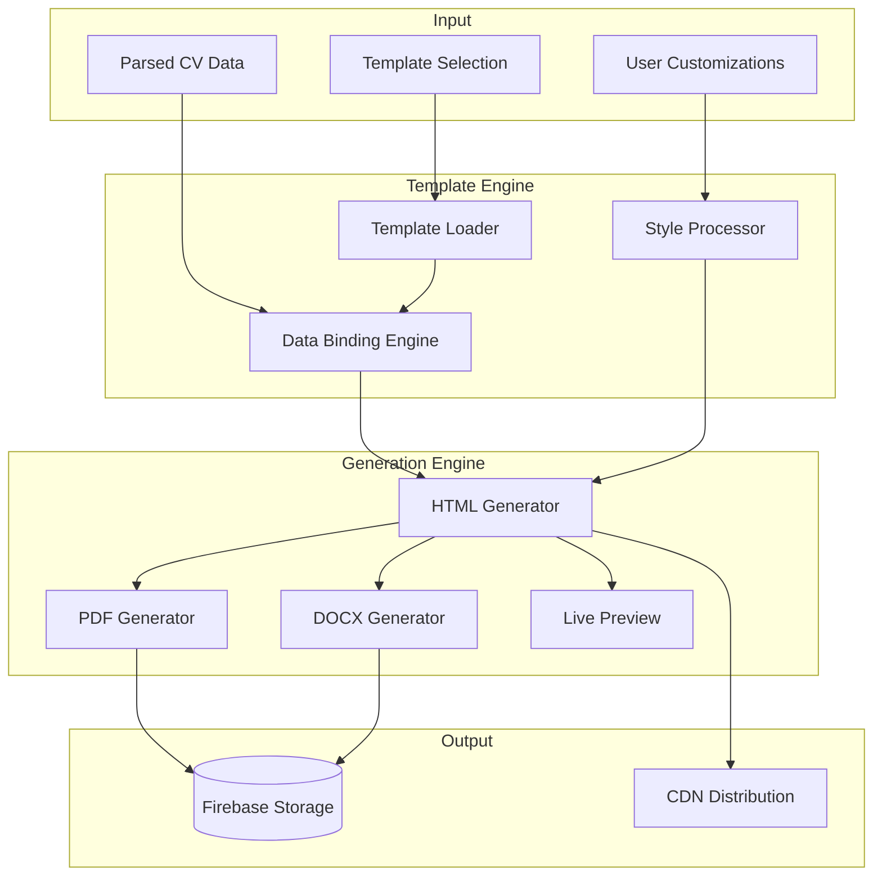

# CV Generation and Template System Design

## Overview
The CV Generation and Template System transforms parsed CV data into professionally designed, multi-format documents. It includes a template engine, PDF/DOCX generation, and real-time preview capabilities.

## Architecture



## Template System

### 1. Template Structure

```typescript
// functions/src/templates/types.ts
export interface CVTemplate {
  id: string;
  name: string;
  category: 'modern' | 'classic' | 'creative' | 'executive' | 'minimal';
  thumbnail: string;
  features: string[];
  industries: string[];
  config: TemplateConfig;
}

export interface TemplateConfig {
  layout: {
    columns: 1 | 2;
    sections: SectionConfig[];
  };
  colors: {
    primary: string;
    secondary: string;
    accent: string;
    text: string;
    background: string;
  };
  fonts: {
    heading: string;
    body: string;
    size: {
      h1: string;
      h2: string;
      h3: string;
      body: string;
      small: string;
    };
  };
  spacing: {
    section: string;
    element: string;
    line: string;
  };
}

export interface SectionConfig {
  type: 'header' | 'summary' | 'experience' | 'education' | 'skills' | 'certifications' | 'custom';
  title?: string;
  layout?: 'vertical' | 'horizontal' | 'grid';
  visible: boolean;
  order: number;
}
```

### 2. Template Collection

```typescript
// functions/src/templates/collection.ts
export const templates: CVTemplate[] = [
  {
    id: 'modern-tech',
    name: 'Modern Tech',
    category: 'modern',
    thumbnail: 'https://storage.googleapis.com/onecv/templates/modern-tech.png',
    features: ['ATS-friendly', 'Clean design', 'Tech-focused'],
    industries: ['Technology', 'Software', 'IT'],
    config: {
      layout: {
        columns: 2,
        sections: [
          { type: 'header', visible: true, order: 1 },
          { type: 'summary', visible: true, order: 2 },
          { type: 'experience', visible: true, order: 3 },
          { type: 'skills', visible: true, order: 4, layout: 'grid' },
          { type: 'education', visible: true, order: 5 },
          { type: 'certifications', visible: true, order: 6 }
        ]
      },
      colors: {
        primary: '#1e40af',
        secondary: '#3730a3',
        accent: '#10b981',
        text: '#1f2937',
        background: '#ffffff'
      },
      fonts: {
        heading: 'Inter',
        body: 'Inter',
        size: {
          h1: '2.5rem',
          h2: '1.875rem',
          h3: '1.25rem',
          body: '1rem',
          small: '0.875rem'
        }
      },
      spacing: {
        section: '2rem',
        element: '1rem',
        line: '1.5'
      }
    }
  },
  {
    id: 'executive-classic',
    name: 'Executive Classic',
    category: 'executive',
    thumbnail: 'https://storage.googleapis.com/onecv/templates/executive-classic.png',
    features: ['Professional', 'Traditional', 'C-level appropriate'],
    industries: ['Finance', 'Consulting', 'Corporate'],
    config: {
      layout: {
        columns: 1,
        sections: [
          { type: 'header', visible: true, order: 1 },
          { type: 'summary', visible: true, order: 2 },
          { type: 'experience', visible: true, order: 3 },
          { type: 'education', visible: true, order: 4 },
          { type: 'skills', visible: true, order: 5, layout: 'horizontal' },
          { type: 'certifications', visible: true, order: 6 }
        ]
      },
      colors: {
        primary: '#1f2937',
        secondary: '#374151',
        accent: '#059669',
        text: '#111827',
        background: '#ffffff'
      },
      fonts: {
        heading: 'Georgia',
        body: 'Times New Roman',
        size: {
          h1: '2rem',
          h2: '1.5rem',
          h3: '1.125rem',
          body: '0.938rem',
          small: '0.813rem'
        }
      },
      spacing: {
        section: '1.5rem',
        element: '0.75rem',
        line: '1.6'
      }
    }
  },
  {
    id: 'creative-designer',
    name: 'Creative Designer',
    category: 'creative',
    thumbnail: 'https://storage.googleapis.com/onecv/templates/creative-designer.png',
    features: ['Visual impact', 'Portfolio-ready', 'Unique layout'],
    industries: ['Design', 'Marketing', 'Creative'],
    config: {
      layout: {
        columns: 2,
        sections: [
          { type: 'header', visible: true, order: 1 },
          { type: 'summary', visible: true, order: 2 },
          { type: 'skills', visible: true, order: 3, layout: 'grid' },
          { type: 'experience', visible: true, order: 4 },
          { type: 'education', visible: true, order: 5 },
          { type: 'custom', title: 'Portfolio', visible: true, order: 6 }
        ]
      },
      colors: {
        primary: '#dc2626',
        secondary: '#f59e0b',
        accent: '#8b5cf6',
        text: '#1f2937',
        background: '#fef3c7'
      },
      fonts: {
        heading: 'Montserrat',
        body: 'Open Sans',
        size: {
          h1: '3rem',
          h2: '2rem',
          h3: '1.5rem',
          body: '1rem',
          small: '0.875rem'
        }
      },
      spacing: {
        section: '2.5rem',
        element: '1.25rem',
        line: '1.7'
      }
    }
  }
];
```

### 3. Template Engine

```typescript
// functions/src/services/templateEngine.ts
import * as Handlebars from 'handlebars';
import { CVTemplate, TemplateConfig } from '../templates/types';
import { ParsedCV } from '../types';

export class TemplateEngine {
  private handlebars: typeof Handlebars;

  constructor() {
    this.handlebars = Handlebars.create();
    this.registerHelpers();
    this.registerPartials();
  }

  private registerHelpers() {
    // Date formatting helper
    this.handlebars.registerHelper('formatDate', (date: string) => {
      if (!date) return '';
      const options: Intl.DateTimeFormatOptions = { 
        year: 'numeric', 
        month: 'short' 
      };
      return new Date(date).toLocaleDateString('en-US', options);
    });

    // List helper
    this.handlebars.registerHelper('list', (items: string[], separator = ', ') => {
      return items ? items.join(separator) : '';
    });

    // Conditional helper
    this.handlebars.registerHelper('when', (condition: any, options: any) => {
      if (condition) {
        return options.fn(this);
      }
      return options.inverse(this);
    });

    // Achievement bullets helper
    this.handlebars.registerHelper('bullets', (items: string[]) => {
      if (!items || items.length === 0) return '';
      return new Handlebars.SafeString(
        '<ul class="achievements">' +
        items.map(item => `<li>${Handlebars.escapeExpression(item)}</li>`).join('') +
        '</ul>'
      );
    });
  }

  private registerPartials() {
    // Header partial
    this.handlebars.registerPartial('header', `
      <header class="cv-header">
        <h1 class="name">{{personalInfo.name}}</h1>
        <div class="contact-info">
          {{#if personalInfo.email}}<span class="email">{{personalInfo.email}}</span>{{/if}}
          {{#if personalInfo.phone}}<span class="phone">{{personalInfo.phone}}</span>{{/if}}
          {{#if personalInfo.location}}<span class="location">{{personalInfo.location}}</span>{{/if}}
        </div>
        <div class="links">
          {{#if personalInfo.linkedin}}<a href="{{personalInfo.linkedin}}" class="linkedin">LinkedIn</a>{{/if}}
          {{#if personalInfo.website}}<a href="{{personalInfo.website}}" class="website">Portfolio</a>{{/if}}
        </div>
      </header>
    `);

    // Experience partial
    this.handlebars.registerPartial('experience', `
      <section class="experience">
        <h2>Professional Experience</h2>
        {{#each experience}}
        <div class="job">
          <div class="job-header">
            <h3 class="position">{{position}}</h3>
            <span class="duration">{{duration}}</span>
          </div>
          <div class="company">{{company}}</div>
          <p class="description">{{description}}</p>
          {{bullets achievements}}
        </div>
        {{/each}}
      </section>
    `);

    // Skills partial
    this.handlebars.registerPartial('skills', `
      <section class="skills">
        <h2>Skills</h2>
        {{#if skills.technical}}
        <div class="skill-group">
          <h3>Technical Skills</h3>
          <div class="skill-list">{{list skills.technical}}</div>
        </div>
        {{/if}}
        {{#if skills.soft}}
        <div class="skill-group">
          <h3>Soft Skills</h3>
          <div class="skill-list">{{list skills.soft}}</div>
        </div>
        {{/if}}
        {{#if skills.languages}}
        <div class="skill-group">
          <h3>Languages</h3>
          <div class="skill-list">{{list skills.languages}}</div>
        </div>
        {{/if}}
      </section>
    `);
  }

  generateHTML(template: CVTemplate, data: ParsedCV): string {
    const { config } = template;
    
    // Generate CSS from template config
    const css = this.generateCSS(config);
    
    // Generate HTML structure
    const html = `
<!DOCTYPE html>
<html lang="en">
<head>
  <meta charset="UTF-8">
  <meta name="viewport" content="width=device-width, initial-scale=1.0">
  <title>${data.personalInfo.name} - CV</title>
  <style>${css}</style>
</head>
<body>
  <div class="cv-container columns-${config.layout.columns}">
    ${this.renderSections(config.layout.sections, data)}
  </div>
</body>
</html>
    `;

    return html;
  }

  private renderSections(sections: any[], data: ParsedCV): string {
    return sections
      .filter(s => s.visible)
      .sort((a, b) => a.order - b.order)
      .map(section => {
        switch (section.type) {
          case 'header':
            return this.handlebars.partials['header'](data);
          case 'summary':
            return `<section class="summary"><h2>Professional Summary</h2><p>${data.summary}</p></section>`;
          case 'experience':
            return this.handlebars.partials['experience'](data);
          case 'skills':
            return this.handlebars.partials['skills'](data);
          case 'education':
            return this.renderEducation(data.education);
          case 'certifications':
            return this.renderCertifications(data.certifications);
          default:
            return '';
        }
      })
      .join('\n');
  }

  private renderEducation(education: any[]): string {
    if (!education || education.length === 0) return '';
    
    return `
      <section class="education">
        <h2>Education</h2>
        ${education.map(edu => `
          <div class="education-item">
            <h3>${edu.degree} in ${edu.field}</h3>
            <div class="institution">${edu.institution}</div>
            <div class="graduation-date">${this.handlebars.helpers.formatDate(edu.graduationDate)}</div>
            ${edu.gpa ? `<div class="gpa">GPA: ${edu.gpa}</div>` : ''}
          </div>
        `).join('')}
      </section>
    `;
  }

  private renderCertifications(certifications: any[]): string {
    if (!certifications || certifications.length === 0) return '';
    
    return `
      <section class="certifications">
        <h2>Certifications</h2>
        ${certifications.map(cert => `
          <div class="certification-item">
            <h3>${cert.name}</h3>
            <div class="issuer">${cert.issuer}</div>
            <div class="date">${this.handlebars.helpers.formatDate(cert.date)}</div>
          </div>
        `).join('')}
      </section>
    `;
  }

  private generateCSS(config: TemplateConfig): string {
    return `
      @import url('https://fonts.googleapis.com/css2?family=${config.fonts.heading.replace(' ', '+')}:wght@400;600;700&family=${config.fonts.body.replace(' ', '+')}:wght@400;500&display=swap');
      
      * {
        margin: 0;
        padding: 0;
        box-sizing: border-box;
      }
      
      body {
        font-family: '${config.fonts.body}', sans-serif;
        font-size: ${config.fonts.size.body};
        line-height: ${config.spacing.line};
        color: ${config.colors.text};
        background: ${config.colors.background};
      }
      
      .cv-container {
        max-width: 21cm;
        margin: 0 auto;
        padding: 2cm;
        background: white;
        min-height: 29.7cm;
      }
      
      .cv-container.columns-2 {
        display: grid;
        grid-template-columns: 1fr 0.6fr;
        gap: 2rem;
      }
      
      h1, h2, h3 {
        font-family: '${config.fonts.heading}', serif;
        font-weight: 600;
        margin-bottom: 0.5rem;
      }
      
      h1 {
        font-size: ${config.fonts.size.h1};
        color: ${config.colors.primary};
      }
      
      h2 {
        font-size: ${config.fonts.size.h2};
        color: ${config.colors.secondary};
        border-bottom: 2px solid ${config.colors.accent};
        padding-bottom: 0.25rem;
        margin-bottom: ${config.spacing.element};
      }
      
      h3 {
        font-size: ${config.fonts.size.h3};
        color: ${config.colors.primary};
      }
      
      section {
        margin-bottom: ${config.spacing.section};
      }
      
      .cv-header {
        text-align: center;
        margin-bottom: ${config.spacing.section};
        grid-column: 1 / -1;
      }
      
      .contact-info {
        display: flex;
        justify-content: center;
        gap: 1rem;
        margin: 0.5rem 0;
        font-size: ${config.fonts.size.small};
      }
      
      .contact-info span::before {
        content: '';
        margin-right: 0.25rem;
      }
      
      .email::before { content: '✉'; }
      .phone::before { content: '📱'; }
      .location::before { content: '📍'; }
      
      .links {
        display: flex;
        justify-content: center;
        gap: 1rem;
        margin-top: 0.5rem;
      }
      
      .links a {
        color: ${config.colors.accent};
        text-decoration: none;
        font-size: ${config.fonts.size.small};
      }
      
      .job {
        margin-bottom: ${config.spacing.element};
      }
      
      .job-header {
        display: flex;
        justify-content: space-between;
        align-items: baseline;
      }
      
      .duration {
        font-size: ${config.fonts.size.small};
        color: ${config.colors.secondary};
      }
      
      .company {
        font-weight: 500;
        color: ${config.colors.secondary};
        margin-bottom: 0.5rem;
      }
      
      .achievements {
        margin-top: 0.5rem;
        padding-left: 1.5rem;
      }
      
      .achievements li {
        margin-bottom: 0.25rem;
      }
      
      .skill-list {
        display: flex;
        flex-wrap: wrap;
        gap: 0.5rem;
        margin-top: 0.5rem;
      }
      
      .skill-group {
        margin-bottom: ${config.spacing.element};
      }
      
      .skill-group h3 {
        font-size: 1rem;
        font-weight: 500;
      }
      
      @media print {
        body {
          margin: 0;
        }
        
        .cv-container {
          padding: 1.5cm;
          max-width: none;
        }
      }
    `;
  }
}
```

### 4. PDF Generation Service

```typescript
// functions/src/services/pdfGenerator.ts
import * as puppeteer from 'puppeteer';
import { Storage } from '@google-cloud/storage';
import * as admin from 'firebase-admin';

export class PDFGenerator {
  private storage: Storage;

  constructor() {
    this.storage = new Storage();
  }

  async generatePDF(html: string, jobId: string): Promise<string> {
    let browser;
    
    try {
      // Launch headless Chrome
      browser = await puppeteer.launch({
        headless: true,
        args: ['--no-sandbox', '--disable-setuid-sandbox']
      });

      const page = await browser.newPage();
      
      // Set content
      await page.setContent(html, {
        waitUntil: 'networkidle0'
      });

      // Generate PDF
      const pdfBuffer = await page.pdf({
        format: 'A4',
        printBackground: true,
        margin: {
          top: '1cm',
          right: '1cm',
          bottom: '1cm',
          left: '1cm'
        }
      });

      // Upload to Firebase Storage
      const bucket = admin.storage().bucket();
      const fileName = `generated-cvs/${jobId}/cv.pdf`;
      const file = bucket.file(fileName);

      await file.save(pdfBuffer, {
        metadata: {
          contentType: 'application/pdf',
          metadata: {
            jobId,
            generatedAt: new Date().toISOString()
          }
        }
      });

      // Get signed URL
      const [url] = await file.getSignedUrl({
        action: 'read',
        expires: Date.now() + 7 * 24 * 60 * 60 * 1000 // 7 days
      });

      return url;

    } finally {
      if (browser) {
        await browser.close();
      }
    }
  }

  async generatePDFWithOptions(
    html: string, 
    jobId: string, 
    options: {
      format?: 'A4' | 'Letter';
      landscape?: boolean;
      scale?: number;
    } = {}
  ): Promise<string> {
    let browser;
    
    try {
      browser = await puppeteer.launch({
        headless: true,
        args: ['--no-sandbox', '--disable-setuid-sandbox']
      });

      const page = await browser.newPage();
      await page.setContent(html, { waitUntil: 'networkidle0' });

      const pdfBuffer = await page.pdf({
        format: options.format || 'A4',
        landscape: options.landscape || false,
        scale: options.scale || 1,
        printBackground: true,
        margin: {
          top: '1cm',
          right: '1cm',
          bottom: '1cm',
          left: '1cm'
        }
      });

      // Upload with custom filename
      const bucket = admin.storage().bucket();
      const fileName = `generated-cvs/${jobId}/cv-${options.format?.toLowerCase() || 'a4'}.pdf`;
      const file = bucket.file(fileName);

      await file.save(pdfBuffer, {
        metadata: {
          contentType: 'application/pdf',
          metadata: {
            jobId,
            format: options.format,
            generatedAt: new Date().toISOString()
          }
        }
      });

      const [url] = await file.getSignedUrl({
        action: 'read',
        expires: Date.now() + 7 * 24 * 60 * 60 * 1000
      });

      return url;

    } finally {
      if (browser) {
        await browser.close();
      }
    }
  }
}
```

### 5. DOCX Generation Service

```typescript
// functions/src/services/docxGenerator.ts
import { Document, Paragraph, TextRun, HeadingLevel, AlignmentType, PageBreak } from 'docx';
import * as admin from 'firebase-admin';
import { ParsedCV } from '../types';

export class DOCXGenerator {
  async generateDOCX(data: ParsedCV, jobId: string): Promise<string> {
    const doc = new Document({
      sections: [{
        properties: {},
        children: [
          ...this.createHeader(data.personalInfo),
          ...this.createSummary(data.summary),
          ...this.createExperience(data.experience),
          ...this.createEducation(data.education),
          ...this.createSkills(data.skills),
          ...this.createCertifications(data.certifications)
        ]
      }]
    });

    // Convert to buffer
    const buffer = await Packer.toBuffer(doc);

    // Upload to Firebase Storage
    const bucket = admin.storage().bucket();
    const fileName = `generated-cvs/${jobId}/cv.docx`;
    const file = bucket.file(fileName);

    await file.save(buffer, {
      metadata: {
        contentType: 'application/vnd.openxmlformats-officedocument.wordprocessingml.document',
        metadata: {
          jobId,
          generatedAt: new Date().toISOString()
        }
      }
    });

    // Get signed URL
    const [url] = await file.getSignedUrl({
      action: 'read',
      expires: Date.now() + 7 * 24 * 60 * 60 * 1000 // 7 days
    });

    return url;
  }

  private createHeader(personalInfo: any): Paragraph[] {
    return [
      new Paragraph({
        text: personalInfo.name,
        heading: HeadingLevel.HEADING_1,
        alignment: AlignmentType.CENTER,
        spacing: { after: 200 }
      }),
      new Paragraph({
        alignment: AlignmentType.CENTER,
        children: [
          new TextRun({ text: personalInfo.email, size: 22 }),
          new TextRun({ text: ' | ', size: 22 }),
          new TextRun({ text: personalInfo.phone, size: 22 }),
          new TextRun({ text: ' | ', size: 22 }),
          new TextRun({ text: personalInfo.location, size: 22 })
        ],
        spacing: { after: 400 }
      })
    ];
  }

  private createSummary(summary: string): Paragraph[] {
    if (!summary) return [];
    
    return [
      new Paragraph({
        text: 'Professional Summary',
        heading: HeadingLevel.HEADING_2,
        spacing: { before: 400, after: 200 }
      }),
      new Paragraph({
        text: summary,
        spacing: { after: 400 }
      })
    ];
  }

  private createExperience(experience: any[]): Paragraph[] {
    const paragraphs: Paragraph[] = [
      new Paragraph({
        text: 'Professional Experience',
        heading: HeadingLevel.HEADING_2,
        spacing: { before: 400, after: 200 }
      })
    ];

    experience.forEach(job => {
      paragraphs.push(
        new Paragraph({
          children: [
            new TextRun({ text: job.position, bold: true, size: 24 }),
            new TextRun({ text: ' - ', size: 24 }),
            new TextRun({ text: job.duration, italics: true, size: 24 })
          ],
          spacing: { before: 200 }
        }),
        new Paragraph({
          text: job.company,
          italics: true,
          spacing: { after: 100 }
        }),
        new Paragraph({
          text: job.description,
          spacing: { after: 100 }
        })
      );

      // Add achievements as bullet points
      job.achievements.forEach(achievement => {
        paragraphs.push(
          new Paragraph({
            text: achievement,
            bullet: { level: 0 },
            spacing: { before: 50 }
          })
        );
      });

      paragraphs.push(new Paragraph({ text: '', spacing: { after: 200 } }));
    });

    return paragraphs;
  }

  private createEducation(education: any[]): Paragraph[] {
    const paragraphs: Paragraph[] = [
      new Paragraph({
        text: 'Education',
        heading: HeadingLevel.HEADING_2,
        spacing: { before: 400, after: 200 }
      })
    ];

    education.forEach(edu => {
      paragraphs.push(
        new Paragraph({
          children: [
            new TextRun({ text: `${edu.degree} in ${edu.field}`, bold: true, size: 24 })
          ],
          spacing: { before: 200 }
        }),
        new Paragraph({
          text: edu.institution,
          italics: true
        }),
        new Paragraph({
          text: `Graduated: ${edu.graduationDate}${edu.gpa ? ` | GPA: ${edu.gpa}` : ''}`,
          spacing: { after: 200 }
        })
      );
    });

    return paragraphs;
  }

  private createSkills(skills: any): Paragraph[] {
    const paragraphs: Paragraph[] = [
      new Paragraph({
        text: 'Skills',
        heading: HeadingLevel.HEADING_2,
        spacing: { before: 400, after: 200 }
      })
    ];

    if (skills.technical && skills.technical.length > 0) {
      paragraphs.push(
        new Paragraph({
          children: [
            new TextRun({ text: 'Technical Skills: ', bold: true }),
            new TextRun({ text: skills.technical.join(', ') })
          ],
          spacing: { after: 100 }
        })
      );
    }

    if (skills.soft && skills.soft.length > 0) {
      paragraphs.push(
        new Paragraph({
          children: [
            new TextRun({ text: 'Soft Skills: ', bold: true }),
            new TextRun({ text: skills.soft.join(', ') })
          ],
          spacing: { after: 100 }
        })
      );
    }

    if (skills.languages && skills.languages.length > 0) {
      paragraphs.push(
        new Paragraph({
          children: [
            new TextRun({ text: 'Languages: ', bold: true }),
            new TextRun({ text: skills.languages.join(', ') })
          ],
          spacing: { after: 100 }
        })
      );
    }

    return paragraphs;
  }

  private createCertifications(certifications: any[]): Paragraph[] {
    if (!certifications || certifications.length === 0) return [];

    const paragraphs: Paragraph[] = [
      new Paragraph({
        text: 'Certifications',
        heading: HeadingLevel.HEADING_2,
        spacing: { before: 400, after: 200 }
      })
    ];

    certifications.forEach(cert => {
      paragraphs.push(
        new Paragraph({
          children: [
            new TextRun({ text: cert.name, bold: true }),
            new TextRun({ text: ` - ${cert.issuer}` }),
            new TextRun({ text: ` (${cert.date})`, italics: true })
          ],
          spacing: { after: 100 }
        })
      );
    });

    return paragraphs;
  }
}
```

### 6. Firebase Function for CV Generation

```typescript
// functions/src/functions/cvGenerator.ts
import * as functions from 'firebase-functions';
import * as admin from 'firebase-admin';
import { TemplateEngine } from '../services/templateEngine';
import { PDFGenerator } from '../services/pdfGenerator';
import { DOCXGenerator } from '../services/docxGenerator';
import { templates } from '../templates/collection';

export const generateCV = functions
  .runWith({
    timeoutSeconds: 300,
    memory: '2GB'
  })
  .https.onRequest(async (req, res) => {
    res.set('Access-Control-Allow-Origin', '*');
    
    if (req.method !== 'POST') {
      res.status(405).send('Method Not Allowed');
      return;
    }

    const { jobId, templateId } = req.body;

    if (!jobId || !templateId) {
      res.status(400).json({ error: 'jobId and templateId are required' });
      return;
    }

    try {
      // Get parsed CV data
      const parsedCVDoc = await admin.firestore()
        .collection('parsedCVs')
        .doc(jobId)
        .get();

      if (!parsedCVDoc.exists) {
        res.status(404).json({ error: 'Parsed CV not found' });
        return;
      }

      const parsedData = parsedCVDoc.data();

      // Get template
      const template = templates.find(t => t.id === templateId);
      if (!template) {
        res.status(404).json({ error: 'Template not found' });
        return;
      }

      // Update job progress
      const jobRef = admin.firestore().collection('jobs').doc(jobId);
      await jobRef.update({
        status: 'generating',
        progress: 85
      });

      // Generate HTML
      const templateEngine = new TemplateEngine();
      const html = templateEngine.generateHTML(template, parsedData as any);

      // Generate PDF
      const pdfGenerator = new PDFGenerator();
      const pdfUrl = await pdfGenerator.generatePDF(html, jobId);

      // Generate DOCX
      const docxGenerator = new DOCXGenerator();
      const docxUrl = await docxGenerator.generateDOCX(parsedData as any, jobId);

      // Save HTML to storage
      const bucket = admin.storage().bucket();
      const htmlFile = bucket.file(`generated-cvs/${jobId}/cv.html`);
      await htmlFile.save(html, {
        metadata: {
          contentType: 'text/html',
          metadata: {
            jobId,
            templateId,
            generatedAt: new Date().toISOString()
          }
        }
      });

      const [htmlUrl] = await htmlFile.getSignedUrl({
        action: 'read',
        expires: Date.now() + 7 * 24 * 60 * 60 * 1000
      });

      // Save generated CV info
      await admin.firestore()
        .collection('generatedCVs')
        .doc(jobId)
        .set({
          jobId,
          templateId,
          formats: {
            pdf: pdfUrl,
            docx: docxUrl,
            html: htmlUrl
          },
          generatedAt: admin.firestore.FieldValue.serverTimestamp()
        });

      // Update job status
      await jobRef.update({
        status: 'completed',
        progress: 100,
        updatedAt: admin.firestore.FieldValue.serverTimestamp()
      });

      res.json({
        success: true,
        jobId,
        formats: {
          pdf: pdfUrl,
          docx: docxUrl,
          html: htmlUrl
        }
      });

    } catch (error) {
      console.error('Error generating CV:', error);
      
      // Update job status
      await admin.firestore()
        .collection('jobs')
        .doc(jobId)
        .update({
          status: 'failed',
          error: error.message,
          updatedAt: admin.firestore.FieldValue.serverTimestamp()
        });

      res.status(500).json({ error: 'Failed to generate CV' });
    }
  });

// Live preview function
export const previewCV = functions.https.onRequest(async (req, res) => {
  res.set('Access-Control-Allow-Origin', '*');
  
  const { jobId, templateId } = req.query;

  if (!jobId || !templateId) {
    res.status(400).send('Missing jobId or templateId');
    return;
  }

  try {
    // Get parsed CV data
    const parsedCVDoc = await admin.firestore()
      .collection('parsedCVs')
      .doc(jobId as string)
      .get();

    if (!parsedCVDoc.exists) {
      res.status(404).send('CV not found');
      return;
    }

    const parsedData = parsedCVDoc.data();

    // Get template
    const template = templates.find(t => t.id === templateId);
    if (!template) {
      res.status(404).send('Template not found');
      return;
    }

    // Generate HTML
    const templateEngine = new TemplateEngine();
    const html = templateEngine.generateHTML(template, parsedData as any);

    // Return HTML for preview
    res.setHeader('Content-Type', 'text/html');
    res.send(html);

  } catch (error) {
    console.error('Error generating preview:', error);
    res.status(500).send('Error generating preview');
  }
});
```

## Performance Optimization

1. **Template Caching**: Cache compiled Handlebars templates
2. **Parallel Generation**: Generate PDF and DOCX in parallel
3. **CDN Distribution**: Serve generated files through Firebase CDN
4. **Lazy Loading**: Load templates on demand
5. **Image Optimization**: Compress template thumbnails

## Testing

```typescript
// functions/src/__tests__/templateEngine.test.ts
import { TemplateEngine } from '../services/templateEngine';
import { templates } from '../templates/collection';

describe('TemplateEngine', () => {
  let engine: TemplateEngine;

  beforeAll(() => {
    engine = new TemplateEngine();
  });

  it('should generate valid HTML', () => {
    const mockData = {
      personalInfo: {
        name: 'John Doe',
        email: 'john@example.com',
        phone: '+1234567890',
        location: 'San Francisco, CA'
      },
      summary: 'Experienced software engineer...',
      experience: [{
        company: 'Tech Corp',
        position: 'Senior Developer',
        duration: '2020-2023',
        description: 'Led development team',
        achievements: ['Increased performance by 50%']
      }],
      education: [],
      skills: {
        technical: ['JavaScript', 'Python'],
        soft: ['Leadership'],
        languages: ['English', 'Spanish']
      },
      certifications: []
    };

    const html = engine.generateHTML(templates[0], mockData);
    
    expect(html).toContain('<!DOCTYPE html>');
    expect(html).toContain('John Doe');
    expect(html).toContain('Tech Corp');
    expect(html).toContain('JavaScript');
  });
});
```