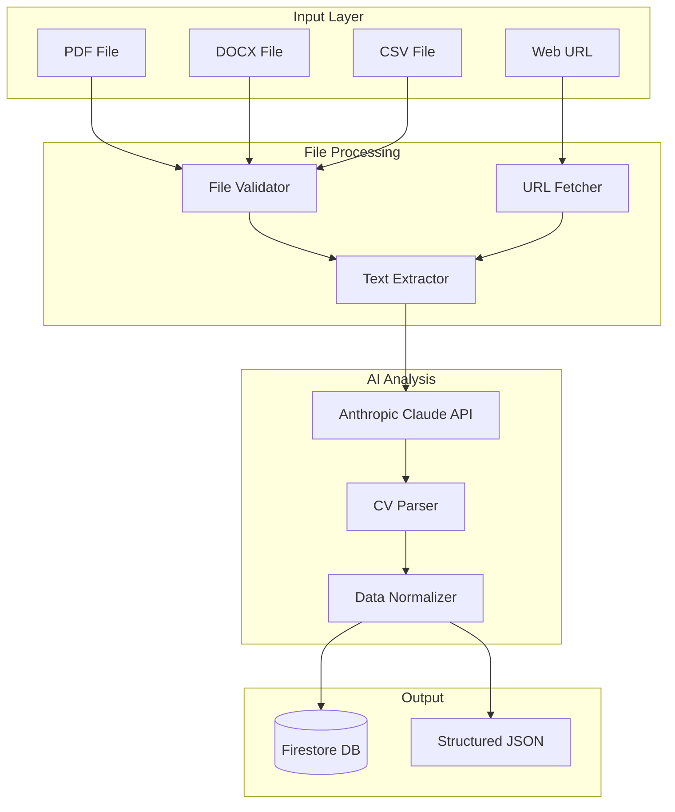

# CV Parsing and Analysis Module Design

## Overview
The CV Parsing and Analysis Module is responsible for extracting structured data from various CV formats (PDF, DOCX, CSV, URL) using Anthropic's Claude API. This module converts unstructured CV data into a normalized format for further processing.

## Architecture



## Implementation Details

### 1. File Validation Module

```typescript
// functions/src/validators/fileValidator.ts
interface ValidationResult {
  isValid: boolean;
  error?: string;
  fileType?: string;
  size?: number;
}

export class FileValidator {
  private static readonly MAX_FILE_SIZE = 10 * 1024 * 1024; // 10MB
  private static readonly ALLOWED_TYPES = {
    'application/pdf': 'pdf',
    'application/vnd.openxmlformats-officedocument.wordprocessingml.document': 'docx',
    'application/msword': 'doc',
    'text/csv': 'csv',
    'text/plain': 'txt'
  };

  static validate(file: Express.Multer.File): ValidationResult {
    // Check file size
    if (file.size > this.MAX_FILE_SIZE) {
      return {
        isValid: false,
        error: 'File size exceeds 10MB limit'
      };
    }

    // Check file type
    const fileType = this.ALLOWED_TYPES[file.mimetype];
    if (!fileType) {
      return {
        isValid: false,
        error: 'Invalid file type. Allowed: PDF, DOCX, DOC, CSV, TXT'
      };
    }

    return {
      isValid: true,
      fileType,
      size: file.size
    };
  }
}
```

### 2. Text Extraction Module

```typescript
// functions/src/extractors/textExtractor.ts
import * as pdfParse from 'pdf-parse';
import * as mammoth from 'mammoth';
import * as csv from 'csv-parser';
import axios from 'axios';

export class TextExtractor {
  static async extractFromPDF(buffer: Buffer): Promise<string> {
    const data = await pdfParse(buffer);
    return data.text;
  }

  static async extractFromDOCX(buffer: Buffer): Promise<string> {
    const result = await mammoth.extractRawText({ buffer });
    return result.value;
  }

  static async extractFromCSV(buffer: Buffer): Promise<string> {
    const rows: any[] = [];
    return new Promise((resolve, reject) => {
      const stream = require('stream');
      const bufferStream = new stream.PassThrough();
      bufferStream.end(buffer);
      
      bufferStream
        .pipe(csv())
        .on('data', (data) => rows.push(data))
        .on('end', () => {
          const text = rows.map(row => Object.values(row).join(' ')).join('\n');
          resolve(text);
        })
        .on('error', reject);
    });
  }

  static async extractFromURL(url: string): Promise<string> {
    try {
      // Fetch the URL content
      const response = await axios.get(url, {
        headers: {
          'User-Agent': 'Mozilla/5.0 (compatible; GetMyCVBot/1.0)'
        }
      });

      // Extract text based on content type
      const contentType = response.headers['content-type'];
      
      if (contentType.includes('application/pdf')) {
        return this.extractFromPDF(Buffer.from(response.data));
      } else if (contentType.includes('text/html')) {
        // Simple HTML text extraction
        const htmlText = response.data
          .replace(/<script\b[^<]*(?:(?!<\/script>)<[^<]*)*<\/script>/gi, '')
          .replace(/<style\b[^<]*(?:(?!<\/style>)<[^<]*)*<\/style>/gi, '')
          .replace(/<[^>]+>/g, ' ')
          .replace(/\s+/g, ' ')
          .trim();
        return htmlText;
      } else {
        return response.data.toString();
      }
    } catch (error) {
      throw new Error(`Failed to fetch URL: ${error.message}`);
    }
  }
}
```

### 3. Anthropic AI Analysis

```typescript
// functions/src/services/anthropicService.ts
import Anthropic from '@anthropic-ai/sdk';

interface ParsedCV {
  personalInfo: {
    name: string;
    email: string;
    phone: string;
    location: string;
    linkedin?: string;
    website?: string;
  };
  summary: string;
  experience: Array<{
    company: string;
    position: string;
    duration: string;
    description: string;
    achievements: string[];
  }>;
  education: Array<{
    institution: string;
    degree: string;
    field: string;
    graduationDate: string;
    gpa?: string;
  }>;
  skills: {
    technical: string[];
    soft: string[];
    languages: string[];
  };
  certifications: Array<{
    name: string;
    issuer: string;
    date: string;
  }>;
}

// Recommendation Types
interface CVRecommendations {
  formatRecommendations: FormatRecommendation[];
  industryVersions: IndustryVersion[];
  purposeVersions: PurposeVersion[];
  lengthOptions: LengthOption[];
  contentPrioritization: ContentPriority;
  visualEnhancements: VisualEnhancement;
  keywordOptimization: KeywordOptimization;
  interactiveFeatures: InteractiveFeatureRanking;
  overallStrategy: string;
  topRecommendations: string[];
}

interface FormatRecommendation {
  format: 'traditional' | 'functional' | 'combination' | 'creative' | 'ats' | 'executive' | 'academic' | 'international';
  suitability: number; // 0-100
  reasoning: string;
  pros: string[];
  cons: string[];
  bestFor: string[];
  avoid: string[];
  customizations: string[];
}

interface IndustryVersion {
  industry: string;
  template: string;
  emphasis: string[];
  mustInclude: string[];
  canOmit: string[];
  keywords: string[];
  tone: 'formal' | 'conversational' | 'technical' | 'creative';
  visualStyle: 'minimal' | 'moderate' | 'rich';
}

interface PurposeVersion {
  purpose: string;
  format: string;
  length: number; // pages
  sections: string[];
  criticalElements: string[];
  optionalElements: string[];
  tone: string;
  callToAction: string;
}

interface LengthOption {
  pages: number;
  useCase: string;
  includeSections: string[];
  excludeSections: string[];
  condensationStrategy: string;
}

interface ContentPriority {
  primary: string[];
  secondary: string[];
  tertiary: string[];
  contextual: Map<string, string[]>; // purpose -> priorities
}

interface VisualEnhancement {
  recommendedCharts: ChartRecommendation[];
  colorSchemes: ColorScheme[];
  fontPairings: FontPairing[];
  layoutStyle: 'classic' | 'modern' | 'creative' | 'minimalist';
  infographics: InfographicSuggestion[];
}

interface ChartRecommendation {
  type: 'radar' | 'bar' | 'timeline' | 'bubble' | 'wordcloud';
  data: string; // what to visualize
  reasoning: string;
}

interface ColorScheme {
  name: string;
  primary: string;
  secondary: string;
  accent: string;
  suitable: string[]; // industries/purposes
}

interface FontPairing {
  heading: string;
  body: string;
  style: string;
  suitable: string[];
}

interface InfographicSuggestion {
  type: string;
  content: string;
  placement: string;
}

interface KeywordOptimization {
  primaryKeywords: string[];
  secondaryKeywords: string[];
  industryTerms: string[];
  atsKeywords: string[];
  linkedinKeywords: string[];
  avoidTerms: string[];
}

interface InteractiveFeatureRanking {
  essential: string[];
  recommended: string[];
  optional: string[];
  notRecommended: string[];
  featureCombos: FeatureCombo[];
}

interface FeatureCombo {
  features: string[];
  synergy: string;
  useCase: string;
}

export class AnthropicService {
  private client: Anthropic;

  constructor() {
    this.client = new Anthropic({
      apiKey: process.env.ANTHROPIC_API_KEY!,
    });
  }

  async parseCV(cvText: string): Promise<ParsedCV> {
    const prompt = `
You are an expert CV/Resume parser. Extract structured information from the following CV text and return it in JSON format.

CV Text:
${cvText}

Please extract and structure the following information:
1. Personal Information (name, email, phone, location, linkedin, website)
2. Professional Summary
3. Work Experience (company, position, duration, description, key achievements)
4. Education (institution, degree, field, graduation date, GPA if mentioned)
5. Skills (categorize into technical, soft skills, and languages)
6. Certifications (name, issuer, date)

Return ONLY a valid JSON object with the structure matching the ParsedCV interface.
`;

    try {
      const response = await this.client.messages.create({
        model: "claude-3-opus-20240229",
        max_tokens: 4000,
        temperature: 0,
        messages: [{
          role: "user",
          content: prompt
        }]
      });

      // Extract JSON from response
      const content = response.content[0].text;
      const jsonMatch = content.match(/\{[\s\S]*\}/);
      
      if (!jsonMatch) {
        throw new Error('No valid JSON found in response');
      }

      return JSON.parse(jsonMatch[0]) as ParsedCV;
    } catch (error) {
      console.error('Error parsing CV with Anthropic:', error);
      throw new Error('Failed to parse CV');
    }
  }

  async enhanceCV(parsedCV: ParsedCV): Promise<any> {
    const prompt = `
You are a professional CV writer. Enhance the following parsed CV data to make it more impactful and professional.

Current CV Data:
${JSON.stringify(parsedCV, null, 2)}

Please enhance:
1. Improve the professional summary to be more compelling
2. Rewrite experience descriptions using action verbs and quantifiable achievements
3. Suggest additional relevant skills based on the experience
4. Identify key achievement highlights
5. Suggest an optimal CV structure for this profile

Return the enhanced data maintaining the same JSON structure plus an "enhancements" object with your suggestions.
`;

    const response = await this.client.messages.create({
      model: "claude-3-opus-20240229",
      max_tokens: 4000,
      temperature: 0.3,
      messages: [{
        role: "user",
        content: prompt
      }]
    });

    const content = response.content[0].text;
    const jsonMatch = content.match(/\{[\s\S]*\}/);
    
    if (!jsonMatch) {
      throw new Error('No valid JSON found in enhancement response');
    }

    return JSON.parse(jsonMatch[0]);
  }

  async generateCVRecommendations(parsedCV: ParsedCV): Promise<CVRecommendations> {
    const prompt = `
You are an expert career advisor and CV specialist. Analyze the following CV data and provide comprehensive recommendations for different CV formats and use cases.

CV Data:
${JSON.stringify(parsedCV, null, 2)}

Please provide detailed recommendations for:

1. **Format Recommendations** - Which CV formats would work best and why:
   - Traditional (Chronological)
   - Functional (Skills-based)
   - Combination/Hybrid
   - Creative/Visual
   - ATS-Optimized
   - Executive/Board-level
   - Academic CV
   - International formats (EU/US/UK/Asia)

2. **Industry-Specific Versions** - Tailored recommendations for different industries:
   - Technology/Software
   - Finance/Banking
   - Healthcare
   - Creative/Design
   - Education/Academia
   - Consulting
   - Sales/Marketing
   - Government/Public Sector

3. **Purpose-Specific Versions** - Recommendations for different use cases:
   - Job Applications (by seniority level)
   - Freelance/Contract Work
   - Board Positions
   - Speaking Engagements
   - Investor Pitches
   - Academic Applications
   - Visa Applications
   - LinkedIn Profile

4. **Length Recommendations**:
   - 1-page version (key highlights)
   - 2-page standard
   - 3-4 page detailed
   - Full academic CV

5. **Content Prioritization** - What to emphasize for each format:
   - Which experiences to highlight
   - Which skills to feature
   - Which achievements to lead with
   - What to omit for brevity

6. **Visual Enhancements**:
   - Infographic elements to include
   - Chart/graph recommendations
   - Color scheme suggestions
   - Font pairing recommendations

7. **Keywords and SEO**:
   - Industry-specific keywords to include
   - ATS optimization tips
   - LinkedIn SEO recommendations

8. **Interactive Features** - Which features would add most value:
   - Priority ranking of available features
   - Feature combinations that work well together
   - Features to avoid for certain industries

Return a comprehensive JSON object with all recommendations structured by category.
`;

    try {
      const response = await this.client.messages.create({
        model: "claude-3-opus-20240229",
        max_tokens: 4000,
        temperature: 0.2,
        messages: [{
          role: "user",
          content: prompt
        }]
      });

      const content = response.content[0].text;
      const jsonMatch = content.match(/\{[\s\S]*\}/);
      
      if (!jsonMatch) {
        throw new Error('No valid JSON found in recommendations response');
      }

      return JSON.parse(jsonMatch[0]) as CVRecommendations;
    } catch (error) {
      console.error('Error generating recommendations:', error);
      throw new Error('Failed to generate CV recommendations');
    }
  }
}
```

### 4. Firebase Function Implementation

```typescript
// functions/src/functions/cvParser.ts
import * as functions from 'firebase-functions';
import * as admin from 'firebase-admin';
import * as busboy from 'busboy';
import { FileValidator } from '../validators/fileValidator';
import { TextExtractor } from '../extractors/textExtractor';
import { AnthropicService } from '../services/anthropicService';

export const parseCV = functions
  .runWith({
    timeoutSeconds: 300,
    memory: '1GB'
  })
  .https.onRequest(async (req, res) => {
    // Enable CORS
    res.set('Access-Control-Allow-Origin', '*');
    
    if (req.method !== 'POST') {
      res.status(405).send('Method Not Allowed');
      return;
    }

    try {
      // Create job document
      const jobRef = admin.firestore().collection('jobs').doc();
      const jobId = jobRef.id;

      await jobRef.set({
        id: jobId,
        status: 'pending',
        progress: 0,
        createdAt: admin.firestore.FieldValue.serverTimestamp(),
        updatedAt: admin.firestore.FieldValue.serverTimestamp()
      });

      // Process file upload
      const bb = busboy({ headers: req.headers });
      let fileBuffer: Buffer;
      let fileType: string;

      bb.on('file', async (name, file, info) => {
        const chunks: any[] = [];
        
        file.on('data', (data) => {
          chunks.push(data);
        });

        file.on('end', async () => {
          fileBuffer = Buffer.concat(chunks);
          
          // Validate file
          const validation = FileValidator.validate({
            size: fileBuffer.length,
            mimetype: info.mimeType
          } as any);

          if (!validation.isValid) {
            await jobRef.update({
              status: 'failed',
              error: validation.error,
              updatedAt: admin.firestore.FieldValue.serverTimestamp()
            });
            res.status(400).json({ error: validation.error });
            return;
          }

          fileType = validation.fileType!;
        });
      });

      bb.on('finish', async () => {
        try {
          // Update progress
          await jobRef.update({
            status: 'processing',
            progress: 20
          });

          // Extract text
          let extractedText = '';
          switch (fileType) {
            case 'pdf':
              extractedText = await TextExtractor.extractFromPDF(fileBuffer);
              break;
            case 'docx':
            case 'doc':
              extractedText = await TextExtractor.extractFromDOCX(fileBuffer);
              break;
            case 'csv':
              extractedText = await TextExtractor.extractFromCSV(fileBuffer);
              break;
            case 'txt':
              extractedText = fileBuffer.toString('utf-8');
              break;
          }

          // Update progress
          await jobRef.update({ progress: 40 });

          // Parse with Anthropic
          const anthropicService = new AnthropicService();
          const parsedCV = await anthropicService.parseCV(extractedText);

          // Update progress
          await jobRef.update({ progress: 60 });

          // Enhance CV
          const enhancedCV = await anthropicService.enhanceCV(parsedCV);

          // Update progress
          await jobRef.update({ progress: 70 });

          // Generate recommendations
          const recommendations = await anthropicService.generateCVRecommendations(parsedCV);

          // Update progress
          await jobRef.update({ progress: 85 });

          // Save parsed CV with recommendations
          await admin.firestore()
            .collection('parsedCVs')
            .doc(jobId)
            .set({
              jobId,
              ...parsedCV,
              enhanced: enhancedCV,
              recommendations,
              createdAt: admin.firestore.FieldValue.serverTimestamp()
            });

          // Update job status
          await jobRef.update({
            status: 'completed',
            progress: 100,
            updatedAt: admin.firestore.FieldValue.serverTimestamp()
          });

          res.json({
            jobId,
            status: 'completed',
            message: 'CV parsed successfully'
          });

        } catch (error) {
          console.error('Processing error:', error);
          await jobRef.update({
            status: 'failed',
            error: error.message,
            updatedAt: admin.firestore.FieldValue.serverTimestamp()
          });
          res.status(500).json({ error: 'Failed to process CV' });
        }
      });

      req.pipe(bb);

    } catch (error) {
      console.error('Error:', error);
      res.status(500).json({ error: 'Internal server error' });
    }
  });

// URL parsing function
export const parseURL = functions
  .runWith({
    timeoutSeconds: 300,
    memory: '1GB'
  })
  .https.onRequest(async (req, res) => {
    res.set('Access-Control-Allow-Origin', '*');
    
    if (req.method !== 'POST') {
      res.status(405).send('Method Not Allowed');
      return;
    }

    const { url } = req.body;

    if (!url) {
      res.status(400).json({ error: 'URL is required' });
      return;
    }

    try {
      // Create job document
      const jobRef = admin.firestore().collection('jobs').doc();
      const jobId = jobRef.id;

      await jobRef.set({
        id: jobId,
        status: 'processing',
        progress: 10,
        sourceUrl: url,
        createdAt: admin.firestore.FieldValue.serverTimestamp(),
        updatedAt: admin.firestore.FieldValue.serverTimestamp()
      });

      // Extract text from URL
      const extractedText = await TextExtractor.extractFromURL(url);
      
      await jobRef.update({ progress: 40 });

      // Parse with Anthropic
      const anthropicService = new AnthropicService();
      const parsedCV = await anthropicService.parseCV(extractedText);

      await jobRef.update({ progress: 60 });

      // Enhance CV
      const enhancedCV = await anthropicService.enhanceCV(parsedCV);

      await jobRef.update({ progress: 80 });

      // Save parsed CV
      await admin.firestore()
        .collection('parsedCVs')
        .doc(jobId)
        .set({
          jobId,
          ...parsedCV,
          enhanced: enhancedCV,
          sourceUrl: url,
          createdAt: admin.firestore.FieldValue.serverTimestamp()
        });

      // Update job status
      await jobRef.update({
        status: 'completed',
        progress: 100,
        updatedAt: admin.firestore.FieldValue.serverTimestamp()
      });

      res.json({
        jobId,
        status: 'completed',
        message: 'URL CV parsed successfully'
      });

    } catch (error) {
      console.error('Error parsing URL:', error);
      res.status(500).json({ error: 'Failed to parse URL' });
    }
  });
```

## Error Handling

```typescript
// functions/src/utils/errorHandler.ts
export enum CVParsingError {
  INVALID_FILE_TYPE = 'INVALID_FILE_TYPE',
  FILE_TOO_LARGE = 'FILE_TOO_LARGE',
  EXTRACTION_FAILED = 'EXTRACTION_FAILED',
  AI_PARSING_FAILED = 'AI_PARSING_FAILED',
  INVALID_CV_FORMAT = 'INVALID_CV_FORMAT',
  NETWORK_ERROR = 'NETWORK_ERROR'
}

export class CVParsingException extends Error {
  constructor(
    public code: CVParsingError,
    public message: string,
    public details?: any
  ) {
    super(message);
    this.name = 'CVParsingException';
  }
}
```

## Testing Strategy

### Unit Tests

```typescript
// functions/src/__tests__/fileValidator.test.ts
import { FileValidator } from '../validators/fileValidator';

describe('FileValidator', () => {
  it('should accept valid PDF files', () => {
    const file = {
      mimetype: 'application/pdf',
      size: 1024 * 1024 // 1MB
    };
    
    const result = FileValidator.validate(file as any);
    expect(result.isValid).toBe(true);
    expect(result.fileType).toBe('pdf');
  });

  it('should reject files over 10MB', () => {
    const file = {
      mimetype: 'application/pdf',
      size: 11 * 1024 * 1024 // 11MB
    };
    
    const result = FileValidator.validate(file as any);
    expect(result.isValid).toBe(false);
    expect(result.error).toContain('size exceeds');
  });

  it('should reject invalid file types', () => {
    const file = {
      mimetype: 'image/jpeg',
      size: 1024 * 1024
    };
    
    const result = FileValidator.validate(file as any);
    expect(result.isValid).toBe(false);
    expect(result.error).toContain('Invalid file type');
  });
});
```

### Integration Tests

```typescript
// functions/src/__tests__/anthropicService.test.ts
import { AnthropicService } from '../services/anthropicService';

describe('AnthropicService Integration', () => {
  let service: AnthropicService;

  beforeAll(() => {
    service = new AnthropicService();
  });

  it('should parse a simple CV text', async () => {
    const cvText = `
      John Doe
      john.doe@email.com
      +1 234 567 8900
      
      Experience:
      Software Engineer at Google (2020-2023)
      - Developed scalable web applications
      - Led team of 5 engineers
      
      Education:
      MIT - Computer Science (2016-2020)
      
      Skills:
      JavaScript, Python, React, Node.js
    `;

    const result = await service.parseCV(cvText);
    
    expect(result.personalInfo.name).toBe('John Doe');
    expect(result.personalInfo.email).toBe('john.doe@email.com');
    expect(result.experience).toHaveLength(1);
    expect(result.experience[0].company).toBe('Google');
    expect(result.skills.technical).toContain('JavaScript');
  }, 30000); // 30 second timeout for API call
});
```

## Monitoring and Logging

```typescript
// functions/src/utils/logger.ts
import { logger } from 'firebase-functions';

export class CVParsingLogger {
  static logStart(jobId: string, source: string) {
    logger.info('CV parsing started', { jobId, source });
  }

  static logProgress(jobId: string, stage: string, progress: number) {
    logger.info('CV parsing progress', { jobId, stage, progress });
  }

  static logSuccess(jobId: string, duration: number) {
    logger.info('CV parsing completed', { jobId, duration });
  }

  static logError(jobId: string, error: any) {
    logger.error('CV parsing failed', { jobId, error: error.message, stack: error.stack });
  }

  static logMetrics(jobId: string, metrics: any) {
    logger.info('CV parsing metrics', { jobId, ...metrics });
  }
}
```

## Performance Optimization

1. **Parallel Processing**: When possible, run text extraction and initial validation in parallel
2. **Caching**: Cache Anthropic API responses for similar CVs (with user permission)
3. **Streaming**: Use streaming for large file uploads
4. **Chunking**: Break large CVs into chunks for processing
5. **Rate Limiting**: Implement rate limiting to prevent API abuse

## Security Considerations

1. **Input Sanitization**: Clean all extracted text before sending to Anthropic
2. **File Scanning**: Implement virus scanning for uploaded files
3. **Rate Limiting**: Limit requests per user/IP
4. **Authentication**: Require Firebase Auth for premium features
5. **Data Retention**: Auto-delete parsed data after 30 days