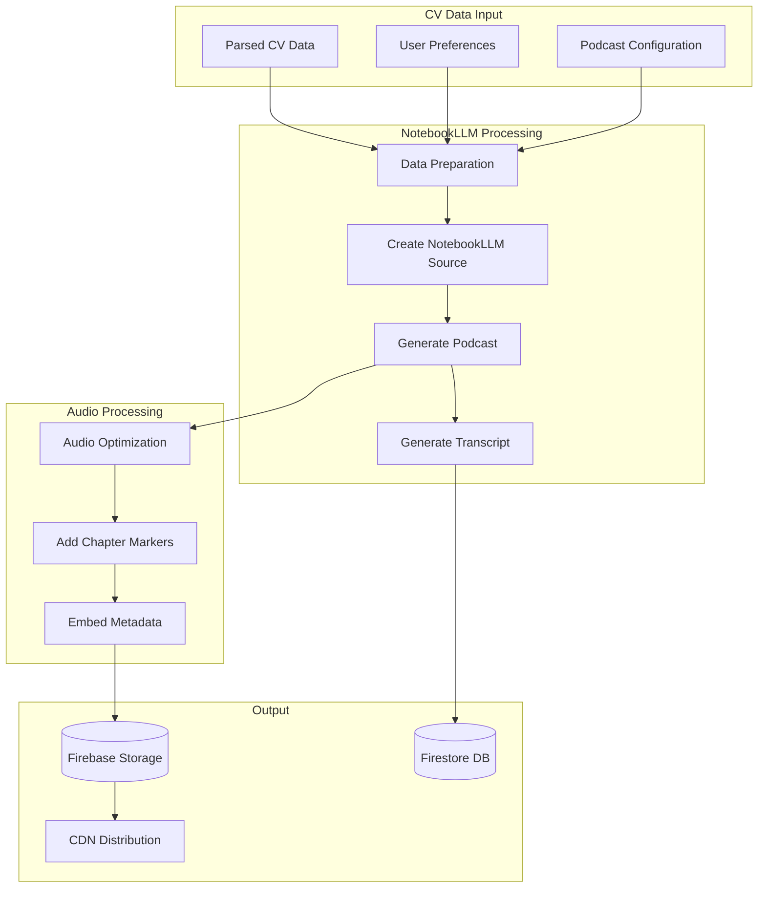

# NotebookLLM Integration Design

## Overview
The NotebookLLM integration enables the generation of AI-powered podcast summaries from CV data. This feature creates engaging audio content that presents career achievements in a conversational format, making CVs more accessible and memorable.

## Architecture



## Implementation Details

### 1. NotebookLLM Service Integration

```typescript
// functions/src/services/notebookLLMService.ts
import { GoogleAuth } from 'google-auth-library';
import axios from 'axios';

interface NotebookLLMConfig {
  apiEndpoint: string;
  projectId: string;
  apiKey: string;
}

interface PodcastRequest {
  script: string;
  voice: 'professional' | 'conversational' | 'energetic';
  duration: string;
  jobId: string;
  language?: string;
  speakerCount?: 1 | 2;
}

export class NotebookLLMService {
  private config: NotebookLLMConfig;
  private auth: GoogleAuth;

  constructor() {
    this.config = {
      apiEndpoint: process.env.NOTEBOOKLM_API_ENDPOINT!,
      projectId: process.env.GOOGLE_CLOUD_PROJECT!,
      apiKey: process.env.NOTEBOOKLM_API_KEY!
    };
    
    this.auth = new GoogleAuth({
      scopes: ['https://www.googleapis.com/auth/cloud-platform']
    });
  }

  async createNotebook(cvData: any, jobId: string): Promise<string> {
    const notebookName = `cv-podcast-${jobId}`;
    
    const response = await this.makeRequest('/notebooks', 'POST', {
      name: notebookName,
      description: `CV Podcast for ${cvData.personalInfo.name}`,
      sources: [{
        type: 'text',
        content: this.formatCVForNotebook(cvData),
        metadata: {
          title: 'Professional CV',
          author: cvData.personalInfo.name,
          date: new Date().toISOString()
        }
      }]
    });

    return response.data.notebookId;
  }

  async generatePodcast(request: PodcastRequest): Promise<string> {
    try {
      // Step 1: Create a notebook with CV data
      const notebookId = await this.createNotebook(
        JSON.parse(request.script), // Assuming script contains CV data
        request.jobId
      );

      // Step 2: Configure podcast generation
      const podcastConfig = {
        notebookId,
        outputFormat: 'audio/mp3',
        voiceProfile: this.getVoiceProfile(request.voice),
        duration: this.parseDuration(request.duration),
        language: request.language || 'en-US',
        speakerCount: request.speakerCount || 2,
        style: {
          tone: request.voice,
          pacing: 'moderate',
          emphasis: 'achievements'
        },
        sections: this.definePodcastSections(request.duration)
      };

      // Step 3: Generate the podcast
      const generateResponse = await this.makeRequest(
        `/notebooks/${notebookId}/generate-podcast`,
        'POST',
        podcastConfig
      );

      const taskId = generateResponse.data.taskId;

      // Step 4: Poll for completion
      const audioUrl = await this.pollForCompletion(taskId);

      // Step 5: Post-process audio
      const processedUrl = await this.postProcessAudio(audioUrl, request.jobId);

      return processedUrl;

    } catch (error) {
      console.error('Error generating podcast:', error);
      throw new Error('Failed to generate podcast');
    }
  }

  async generateTranscript(audioUrl: string): Promise<string> {
    const response = await this.makeRequest('/transcribe', 'POST', {
      audioUrl,
      format: 'text',
      includeTimestamps: true,
      speakerLabels: true
    });

    return this.formatTranscript(response.data.transcript);
  }

  private formatCVForNotebook(cvData: any): string {
    return `
# ${cvData.personalInfo.name} - Professional Profile

## Contact Information
- Email: ${cvData.personalInfo.email}
- Phone: ${cvData.personalInfo.phone}
- Location: ${cvData.personalInfo.location}
${cvData.personalInfo.linkedin ? `- LinkedIn: ${cvData.personalInfo.linkedin}` : ''}
${cvData.personalInfo.website ? `- Portfolio: ${cvData.personalInfo.website}` : ''}

## Professional Summary
${cvData.summary}

## Professional Experience
${cvData.experience.map(job => `
### ${job.position} at ${job.company}
Duration: ${job.duration}

${job.description}

Key Achievements:
${job.achievements.map(a => `- ${a}`).join('\n')}
`).join('\n')}

## Skills
### Technical Skills
${cvData.skills.technical.join(', ')}

### Soft Skills
${cvData.skills.soft.join(', ')}

### Languages
${cvData.skills.languages.join(', ')}

## Education
${cvData.education.map(edu => `
### ${edu.degree} in ${edu.field}
${edu.institution} - Graduated ${edu.graduationDate}
${edu.gpa ? `GPA: ${edu.gpa}` : ''}
`).join('\n')}

## Certifications
${cvData.certifications.map(cert => `
- ${cert.name} by ${cert.issuer} (${cert.date})
`).join('\n')}
    `;
  }

  private getVoiceProfile(voice: string): any {
    const profiles = {
      professional: {
        voiceId: 'notebooklm-professional-v1',
        pitch: 0,
        speed: 1.0,
        volumeGain: 0
      },
      conversational: {
        voiceId: 'notebooklm-conversational-v1',
        pitch: 0.1,
        speed: 1.1,
        volumeGain: 0.1
      },
      energetic: {
        voiceId: 'notebooklm-energetic-v1',
        pitch: 0.2,
        speed: 1.2,
        volumeGain: 0.2
      }
    };

    return profiles[voice] || profiles.professional;
  }

  private parseDuration(duration: string): number {
    const durationMap = {
      '2-5min': 180,
      '5-10min': 450,
      '10-15min': 750
    };
    
    return durationMap[duration] || 300;
  }

  private definePodcastSections(duration: string): any[] {
    const baseStructure = [
      { type: 'intro', duration: 30 },
      { type: 'overview', duration: 60 },
      { type: 'experience', duration: 120 },
      { type: 'skills', duration: 60 },
      { type: 'achievements', duration: 90 },
      { type: 'conclusion', duration: 30 }
    ];

    // Adjust based on requested duration
    if (duration === '2-5min') {
      return baseStructure.map(s => ({ ...s, duration: s.duration * 0.5 }));
    } else if (duration === '10-15min') {
      return [
        ...baseStructure,
        { type: 'education_deep_dive', duration: 60 },
        { type: 'future_goals', duration: 60 },
        { type: 'qa_simulation', duration: 120 }
      ];
    }

    return baseStructure;
  }

  private async pollForCompletion(taskId: string, maxAttempts = 60): Promise<string> {
    for (let i = 0; i < maxAttempts; i++) {
      const response = await this.makeRequest(`/tasks/${taskId}`, 'GET');
      
      if (response.data.status === 'completed') {
        return response.data.result.audioUrl;
      } else if (response.data.status === 'failed') {
        throw new Error(`Podcast generation failed: ${response.data.error}`);
      }

      // Wait 5 seconds before next poll
      await new Promise(resolve => setTimeout(resolve, 5000));
    }

    throw new Error('Podcast generation timed out');
  }

  private async postProcessAudio(audioUrl: string, jobId: string): Promise<string> {
    // Download audio
    const audioResponse = await axios.get(audioUrl, { responseType: 'arraybuffer' });
    const audioBuffer = Buffer.from(audioResponse.data);

    // Apply post-processing
    const processedBuffer = await this.applyAudioEnhancements(audioBuffer);

    // Upload to Firebase Storage
    const bucket = admin.storage().bucket();
    const fileName = `podcasts/${jobId}/cv-podcast.mp3`;
    const file = bucket.file(fileName);

    await file.save(processedBuffer, {
      metadata: {
        contentType: 'audio/mp3',
        metadata: {
          jobId,
          generatedAt: new Date().toISOString(),
          generator: 'notebooklm'
        }
      }
    });

    // Get signed URL
    const [signedUrl] = await file.getSignedUrl({
      action: 'read',
      expires: Date.now() + 30 * 24 * 60 * 60 * 1000 // 30 days
    });

    return signedUrl;
  }

  private async applyAudioEnhancements(audioBuffer: Buffer): Promise<Buffer> {
    // This would integrate with an audio processing library
    // For now, return the original buffer
    // In production, you might use ffmpeg or similar
    
    // Example enhancement pipeline:
    // 1. Normalize audio levels
    // 2. Add intro/outro music
    // 3. Apply EQ for voice clarity
    // 4. Add chapter markers
    // 5. Compress to optimal bitrate
    
    return audioBuffer;
  }

  private formatTranscript(rawTranscript: any): string {
    // Format transcript with speaker labels and timestamps
    return rawTranscript.segments
      .map(segment => {
        const timestamp = this.formatTimestamp(segment.start);
        const speaker = segment.speaker === 'A' ? 'Host' : 'Co-Host';
        return `[${timestamp}] ${speaker}: ${segment.text}`;
      })
      .join('\n\n');
  }

  private formatTimestamp(seconds: number): string {
    const minutes = Math.floor(seconds / 60);
    const remainingSeconds = Math.floor(seconds % 60);
    return `${minutes}:${remainingSeconds.toString().padStart(2, '0')}`;
  }

  private async makeRequest(
    endpoint: string, 
    method: string, 
    data?: any
  ): Promise<any> {
    const token = await this.auth.getAccessToken();
    
    const response = await axios({
      method,
      url: `${this.config.apiEndpoint}${endpoint}`,
      headers: {
        'Authorization': `Bearer ${token}`,
        'X-API-Key': this.config.apiKey,
        'Content-Type': 'application/json'
      },
      data
    });

    return response;
  }
}
```

### 2. Podcast Content Strategy

```typescript
// functions/src/services/podcastContentStrategy.ts
export class PodcastContentStrategy {
  generatePodcastScript(cvData: ParsedCV, config: PodcastConfig): PodcastScript {
    const strategy = this.selectStrategy(cvData, config);
    
    return {
      opening: this.createOpening(cvData, strategy),
      segments: this.createSegments(cvData, config, strategy),
      closing: this.createClosing(cvData, strategy),
      metadata: {
        totalDuration: this.calculateDuration(config.duration),
        speakerRoles: this.defineSpeakerRoles(strategy),
        musicCues: this.defineMusicCues(strategy)
      }
    };
  }

  private selectStrategy(cvData: ParsedCV, config: PodcastConfig): ContentStrategy {
    // Analyze CV to determine best narrative approach
    const careerStage = this.analyzeCareerStage(cvData);
    const industry = this.identifyIndustry(cvData);
    const achievements = this.scoreAchievements(cvData);

    if (careerStage === 'executive' && achievements.score > 8) {
      return 'thought-leadership';
    } else if (industry === 'creative') {
      return 'storytelling';
    } else if (careerStage === 'early-career') {
      return 'potential-focused';
    } else {
      return 'achievement-highlights';
    }
  }

  private createOpening(cvData: ParsedCV, strategy: string): DialogueSegment[] {
    const templates = {
      'thought-leadership': [
        {
          speaker: 'A',
          text: `Welcome to today's career spotlight, where we explore the remarkable journey of ${cvData.personalInfo.name}, a visionary leader in ${this.getIndustryName(cvData)}.`
        },
        {
          speaker: 'B',
          text: `What makes this story particularly compelling is how ${this.getFirstName(cvData)} has transformed challenges into opportunities, leading to ${this.getTopAchievement(cvData)}.`
        }
      ],
      'storytelling': [
        {
          speaker: 'A',
          text: `Every creative journey has a unique beginning. Today, we're diving into the artistic evolution of ${cvData.personalInfo.name}.`
        },
        {
          speaker: 'B',
          text: `From ${this.getEarliestRole(cvData)} to ${this.getCurrentRole(cvData)}, this is a story of continuous innovation and creative exploration.`
        }
      ],
      'potential-focused': [
        {
          speaker: 'A',
          text: `Meet ${cvData.personalInfo.name}, an emerging talent who's already making waves in ${this.getIndustryName(cvData)}.`
        },
        {
          speaker: 'B',
          text: `What's impressive is not just what ${this.getFirstName(cvData)} has achieved so far, but the potential we see in their unique combination of ${this.getTopSkills(cvData, 3)}.`
        }
      ],
      'achievement-highlights': [
        {
          speaker: 'A',
          text: `Today we're highlighting the professional achievements of ${cvData.personalInfo.name}, currently ${cvData.experience[0].position} at ${cvData.experience[0].company}.`
        },
        {
          speaker: 'B',
          text: `Let's explore how ${this.getFirstName(cvData)} has built a career marked by consistent growth and measurable impact.`
        }
      ]
    };

    return templates[strategy] || templates['achievement-highlights'];
  }

  private createSegments(
    cvData: ParsedCV, 
    config: PodcastConfig, 
    strategy: string
  ): PodcastSegment[] {
    const segments: PodcastSegment[] = [];

    // Experience Deep Dive
    if (config.topics.includes('experience')) {
      segments.push(this.createExperienceSegment(cvData, strategy));
    }

    // Skills Analysis
    if (config.topics.includes('skills')) {
      segments.push(this.createSkillsSegment(cvData, strategy));
    }

    // Achievement Highlights
    if (config.topics.includes('achievements')) {
      segments.push(this.createAchievementsSegment(cvData, strategy));
    }

    // Education & Growth
    if (config.topics.includes('education')) {
      segments.push(this.createEducationSegment(cvData, strategy));
    }

    // Future Outlook (for longer podcasts)
    if (config.duration !== '2-5min') {
      segments.push(this.createFutureOutlookSegment(cvData, strategy));
    }

    return segments;
  }

  private createExperienceSegment(cvData: ParsedCV, strategy: string): PodcastSegment {
    const recentJobs = cvData.experience.slice(0, 3);
    
    return {
      title: 'Professional Journey',
      duration: 120,
      dialogue: [
        {
          speaker: 'A',
          text: `Let's dive into the professional journey. ${this.getFirstName(cvData)} has held ${cvData.experience.length} key positions over their career.`
        },
        ...recentJobs.flatMap(job => [
          {
            speaker: 'B',
            text: `At ${job.company}, as ${job.position}, what stands out?`
          },
          {
            speaker: 'A',
            text: `${job.description} The impact was significant - ${job.achievements[0]}`
          }
        ])
      ]
    };
  }

  private createSkillsSegment(cvData: ParsedCV, strategy: string): PodcastSegment {
    return {
      title: 'Core Competencies',
      duration: 60,
      dialogue: [
        {
          speaker: 'B',
          text: `The skill set here is quite comprehensive. We're looking at expertise in ${cvData.skills.technical.slice(0, 5).join(', ')}.`
        },
        {
          speaker: 'A',
          text: `But it's not just technical skills. The soft skills - ${cvData.skills.soft.join(', ')} - these are what enable ${this.getFirstName(cvData)} to lead and collaborate effectively.`
        },
        {
          speaker: 'B',
          text: `${cvData.skills.languages.length > 1 ? `And being fluent in ${cvData.skills.languages.join(' and ')} opens up global opportunities.` : ''}`
        }
      ]
    };
  }

  private createAchievementsSegment(cvData: ParsedCV, strategy: string): PodcastSegment {
    const topAchievements = this.extractTopAchievements(cvData, 5);
    
    return {
      title: 'Key Achievements',
      duration: 90,
      dialogue: [
        {
          speaker: 'A',
          text: `Now, let's talk about concrete achievements. What really demonstrates ${this.getFirstName(cvData)}'s impact?`
        },
        ...topAchievements.map((achievement, index) => ({
          speaker: index % 2 === 0 ? 'B' : 'A',
          text: achievement
        }))
      ]
    };
  }

  private createClosing(cvData: ParsedCV, strategy: string): DialogueSegment[] {
    return [
      {
        speaker: 'A',
        text: `As we wrap up, it's clear that ${cvData.personalInfo.name} brings a unique combination of ${this.summarizeStrengths(cvData)}.`
      },
      {
        speaker: 'B',
        text: `For those interested in connecting with ${this.getFirstName(cvData)}, you can find contact information in the interactive CV. Thanks for joining us on this career journey.`
      }
    ];
  }

  // Helper methods
  private getFirstName(cvData: ParsedCV): string {
    return cvData.personalInfo.name.split(' ')[0];
  }

  private getIndustryName(cvData: ParsedCV): string {
    // Analyze experience and skills to determine industry
    const industries = {
      'technology': ['software', 'developer', 'engineer', 'data', 'cloud'],
      'finance': ['financial', 'banking', 'investment', 'analyst'],
      'healthcare': ['medical', 'health', 'clinical', 'patient'],
      'creative': ['design', 'creative', 'art', 'media'],
      'education': ['teacher', 'professor', 'education', 'training']
    };

    const cvText = JSON.stringify(cvData).toLowerCase();
    
    for (const [industry, keywords] of Object.entries(industries)) {
      if (keywords.some(keyword => cvText.includes(keyword))) {
        return industry;
      }
    }

    return 'the professional sector';
  }

  private analyzeCareerStage(cvData: ParsedCV): string {
    const totalYears = this.calculateTotalExperience(cvData);
    const seniorTitles = ['director', 'vp', 'chief', 'head', 'senior', 'lead'];
    const hasSeniorTitle = cvData.experience.some(job => 
      seniorTitles.some(title => job.position.toLowerCase().includes(title))
    );

    if (totalYears > 15 && hasSeniorTitle) return 'executive';
    if (totalYears > 10) return 'senior';
    if (totalYears > 5) return 'mid-career';
    return 'early-career';
  }

  private calculateTotalExperience(cvData: ParsedCV): number {
    // Simple calculation based on number of positions
    // In production, parse actual dates
    return cvData.experience.length * 3; // Assume 3 years average per position
  }
}
```

### 3. Audio Player Component

```typescript
// components/PodcastPlayer.tsx
import React, { useState, useRef, useEffect } from 'react';
import { formatTime } from '../utils/time';

interface PodcastPlayerProps {
  audioUrl: string;
  transcript: string;
  duration: string;
  jobId: string;
  onPlay?: () => void;
  onComplete?: () => void;
}

export const PodcastPlayer: React.FC<PodcastPlayerProps> = ({
  audioUrl,
  transcript,
  duration,
  jobId,
  onPlay,
  onComplete
}) => {
  const [isPlaying, setIsPlaying] = useState(false);
  const [currentTime, setCurrentTime] = useState(0);
  const [totalDuration, setTotalDuration] = useState(0);
  const [showTranscript, setShowTranscript] = useState(false);
  const [playbackRate, setPlaybackRate] = useState(1);
  const audioRef = useRef<HTMLAudioElement>(null);

  useEffect(() => {
    const audio = audioRef.current;
    if (!audio) return;

    const updateTime = () => setCurrentTime(audio.currentTime);
    const updateDuration = () => setTotalDuration(audio.duration);
    const handleEnded = () => {
      setIsPlaying(false);
      onComplete?.();
    };

    audio.addEventListener('timeupdate', updateTime);
    audio.addEventListener('loadedmetadata', updateDuration);
    audio.addEventListener('ended', handleEnded);

    return () => {
      audio.removeEventListener('timeupdate', updateTime);
      audio.removeEventListener('loadedmetadata', updateDuration);
      audio.removeEventListener('ended', handleEnded);
    };
  }, [onComplete]);

  const togglePlay = () => {
    const audio = audioRef.current;
    if (!audio) return;

    if (isPlaying) {
      audio.pause();
    } else {
      audio.play();
      onPlay?.();
    }
    setIsPlaying(!isPlaying);
  };

  const handleSeek = (e: React.ChangeEvent<HTMLInputElement>) => {
    const audio = audioRef.current;
    if (!audio) return;

    const newTime = parseFloat(e.target.value);
    audio.currentTime = newTime;
    setCurrentTime(newTime);
  };

  const changePlaybackRate = () => {
    const audio = audioRef.current;
    if (!audio) return;

    const rates = [0.5, 0.75, 1, 1.25, 1.5, 2];
    const currentIndex = rates.indexOf(playbackRate);
    const nextRate = rates[(currentIndex + 1) % rates.length];
    
    audio.playbackRate = nextRate;
    setPlaybackRate(nextRate);
  };

  const downloadPodcast = async () => {
    try {
      const response = await fetch(audioUrl);
      const blob = await response.blob();
      const url = window.URL.createObjectURL(blob);
      const a = document.createElement('a');
      a.href = url;
      a.download = `cv-podcast-${jobId}.mp3`;
      document.body.appendChild(a);
      a.click();
      window.URL.revokeObjectURL(url);
      document.body.removeChild(a);
    } catch (error) {
      console.error('Failed to download podcast:', error);
    }
  };

  return (
    <div className="podcast-player">
      <div className="player-header">
        <div className="podcast-info">
          <span className="podcast-icon">🎙️</span>
          <div>
            <h3>AI Career Summary</h3>
            <p className="duration">{duration}</p>
          </div>
        </div>
      </div>

      <audio ref={audioRef} src={audioUrl} preload="metadata" />

      <div className="player-controls">
        <button 
          className="play-button"
          onClick={togglePlay}
          aria-label={isPlaying ? 'Pause' : 'Play'}
        >
          {isPlaying ? '⏸️' : '▶️'}
        </button>

        <div className="progress-container">
          <span className="time">{formatTime(currentTime)}</span>
          <input
            type="range"
            className="progress-bar"
            min="0"
            max={totalDuration || 100}
            value={currentTime}
            onChange={handleSeek}
          />
          <span className="time">{formatTime(totalDuration)}</span>
        </div>

        <button 
          className="speed-button"
          onClick={changePlaybackRate}
          title="Playback speed"
        >
          {playbackRate}x
        </button>
      </div>

      <div className="player-actions">
        <button
          className="transcript-toggle"
          onClick={() => setShowTranscript(!showTranscript)}
        >
          📝 {showTranscript ? 'Hide' : 'Show'} Transcript
        </button>
        
        <button
          className="download-button"
          onClick={downloadPodcast}
        >
          ⬇️ Download
        </button>

        <button
          className="share-button"
          onClick={() => {
            navigator.share({
              title: 'My AI Career Podcast',
              text: 'Listen to my AI-generated career summary',
              url: window.location.href
            });
          }}
        >
          🔗 Share
        </button>
      </div>

      {showTranscript && (
        <div className="transcript-container">
          <h4>Transcript</h4>
          <div className="transcript-content">
            {transcript.split('\n').map((line, index) => (
              <p key={index} className="transcript-line">
                {line}
              </p>
            ))}
          </div>
        </div>
      )}
    </div>
  );
};
```

### 4. Podcast Analytics

```typescript
// functions/src/services/podcastAnalytics.ts
export class PodcastAnalytics {
  async trackPodcastEvent(
    jobId: string,
    event: PodcastEvent,
    metadata?: any
  ): Promise<void> {
    const analyticsRef = admin.firestore()
      .collection('analytics')
      .doc(jobId)
      .collection('podcast_events');

    await analyticsRef.add({
      event,
      timestamp: admin.firestore.FieldValue.serverTimestamp(),
      metadata,
      sessionId: metadata?.sessionId,
      userAgent: metadata?.userAgent
    });

    // Update aggregate metrics
    await this.updateAggregateMetrics(jobId, event);
  }

  async updateAggregateMetrics(jobId: string, event: PodcastEvent): Promise<void> {
    const metricsRef = admin.firestore()
      .collection('podcast_metrics')
      .doc(jobId);

    const increment = admin.firestore.FieldValue.increment(1);

    const updates: any = {
      lastUpdated: admin.firestore.FieldValue.serverTimestamp()
    };

    switch (event) {
      case 'play':
        updates.totalPlays = increment;
        break;
      case 'complete':
        updates.completions = increment;
        break;
      case 'download':
        updates.downloads = increment;
        break;
      case 'share':
        updates.shares = increment;
        break;
      case 'transcript_view':
        updates.transcriptViews = increment;
        break;
    }

    await metricsRef.set(updates, { merge: true });
  }

  async getPodcastMetrics(jobId: string): Promise<PodcastMetrics> {
    const metricsDoc = await admin.firestore()
      .collection('podcast_metrics')
      .doc(jobId)
      .get();

    if (!metricsDoc.exists) {
      return {
        totalPlays: 0,
        completions: 0,
        completionRate: 0,
        averageListenTime: 0,
        downloads: 0,
        shares: 0,
        transcriptViews: 0
      };
    }

    const data = metricsDoc.data()!;
    
    // Calculate completion rate
    const completionRate = data.totalPlays > 0 
      ? (data.completions / data.totalPlays) * 100 
      : 0;

    return {
      totalPlays: data.totalPlays || 0,
      completions: data.completions || 0,
      completionRate,
      averageListenTime: data.averageListenTime || 0,
      downloads: data.downloads || 0,
      shares: data.shares || 0,
      transcriptViews: data.transcriptViews || 0
    };
  }

  async getListeningPatterns(jobId: string): Promise<ListeningPattern[]> {
    const eventsSnapshot = await admin.firestore()
      .collection('analytics')
      .doc(jobId)
      .collection('podcast_events')
      .where('event', '==', 'progress')
      .orderBy('timestamp', 'desc')
      .limit(1000)
      .get();

    const patterns: Map<string, number[]> = new Map();

    eventsSnapshot.docs.forEach(doc => {
      const data = doc.data();
      const sessionId = data.sessionId;
      const progress = data.metadata?.progress || 0;

      if (!patterns.has(sessionId)) {
        patterns.set(sessionId, []);
      }
      patterns.get(sessionId)!.push(progress);
    });

    // Analyze patterns
    return Array.from(patterns.entries()).map(([sessionId, progressPoints]) => ({
      sessionId,
      progressPoints,
      maxProgress: Math.max(...progressPoints),
      dropOffPoint: this.findDropOffPoint(progressPoints),
      completed: progressPoints.some(p => p >= 95)
    }));
  }

  private findDropOffPoint(progressPoints: number[]): number | null {
    // Find where user stopped listening
    const sorted = progressPoints.sort((a, b) => a - b);
    const maxProgress = sorted[sorted.length - 1];
    
    if (maxProgress >= 95) return null; // Completed
    
    return maxProgress;
  }
}

type PodcastEvent = 
  | 'play' 
  | 'pause' 
  | 'complete' 
  | 'download' 
  | 'share' 
  | 'transcript_view' 
  | 'progress';

interface PodcastMetrics {
  totalPlays: number;
  completions: number;
  completionRate: number;
  averageListenTime: number;
  downloads: number;
  shares: number;
  transcriptViews: number;
}

interface ListeningPattern {
  sessionId: string;
  progressPoints: number[];
  maxProgress: number;
  dropOffPoint: number | null;
  completed: boolean;
}
```

### 5. Testing NotebookLLM Integration

```typescript
// functions/src/__tests__/notebookLLM.test.ts
import { NotebookLLMService } from '../services/notebookLLMService';
import { PodcastContentStrategy } from '../services/podcastContentStrategy';

describe('NotebookLLM Integration', () => {
  let notebookLLM: NotebookLLMService;
  let contentStrategy: PodcastContentStrategy;

  beforeAll(() => {
    notebookLLM = new NotebookLLMService();
    contentStrategy = new PodcastContentStrategy();
  });

  describe('Podcast Generation', () => {
    it('should generate a podcast from CV data', async () => {
      const mockCVData = {
        personalInfo: {
          name: 'Jane Smith',
          email: 'jane@example.com',
          phone: '+1234567890',
          location: 'San Francisco, CA'
        },
        summary: 'Experienced software engineer with 10 years in tech...',
        experience: [{
          company: 'Tech Corp',
          position: 'Senior Engineer',
          duration: '2020-2023',
          description: 'Led development of cloud infrastructure',
          achievements: ['Reduced costs by 40%', 'Improved performance by 60%']
        }],
        skills: {
          technical: ['Python', 'AWS', 'Kubernetes'],
          soft: ['Leadership', 'Communication'],
          languages: ['English', 'Spanish']
        },
        education: [{
          institution: 'MIT',
          degree: 'BS',
          field: 'Computer Science',
          graduationDate: '2013'
        }],
        certifications: []
      };

      const config = {
        voice: 'professional' as const,
        duration: '5-10min',
        jobId: 'test-job-123',
        topics: ['experience', 'skills', 'achievements']
      };

      // Generate script
      const script = contentStrategy.generatePodcastScript(mockCVData, config);
      expect(script).toBeDefined();
      expect(script.segments).toHaveLength(3);

      // Mock podcast generation (in real tests, use test API)
      const audioUrl = await notebookLLM.generatePodcast({
        script: JSON.stringify(mockCVData),
        ...config
      });

      expect(audioUrl).toMatch(/^https:\/\/storage\.googleapis\.com/);
    }, 60000); // 60 second timeout

    it('should generate appropriate content for different career stages', () => {
      const earlyCareerCV = createMockCV('early-career');
      const executiveCV = createMockCV('executive');

      const earlyScript = contentStrategy.generatePodcastScript(
        earlyCareerCV, 
        { duration: '2-5min', topics: ['skills', 'education'] }
      );

      const execScript = contentStrategy.generatePodcastScript(
        executiveCV,
        { duration: '10-15min', topics: ['experience', 'achievements'] }
      );

      expect(earlyScript.segments).toHaveLength(2);
      expect(execScript.segments.length).toBeGreaterThan(3);
    });
  });

  describe('Transcript Generation', () => {
    it('should generate formatted transcript', async () => {
      const mockAudioUrl = 'https://example.com/audio.mp3';
      
      // Mock transcript response
      const transcript = await notebookLLM.generateTranscript(mockAudioUrl);
      
      expect(transcript).toContain('[0:00]');
      expect(transcript).toContain('Host:');
      expect(transcript).toContain('Co-Host:');
    });
  });
});

function createMockCV(stage: string): any {
  // Helper to create different CV types for testing
  const templates = {
    'early-career': {
      experience: [{
        company: 'Startup Inc',
        position: 'Junior Developer',
        duration: '2022-2023',
        achievements: ['Learned React', 'Built first API']
      }]
    },
    'executive': {
      experience: [{
        company: 'Fortune 500 Corp',
        position: 'VP of Engineering',
        duration: '2018-2023',
        achievements: ['Led 200+ engineers', 'Drove $50M revenue growth']
      }]
    }
  };

  return {
    personalInfo: { name: 'Test User' },
    ...templates[stage]
  };
}
```

## Error Handling

```typescript
// functions/src/utils/podcastErrorHandler.ts
export class PodcastErrorHandler {
  static async handlePodcastError(
    error: any,
    jobId: string,
    stage: 'generation' | 'processing' | 'upload'
  ): Promise<void> {
    console.error(`Podcast error at ${stage}:`, error);

    // Log to Firestore
    await admin.firestore()
      .collection('podcast_errors')
      .add({
        jobId,
        stage,
        error: {
          message: error.message,
          stack: error.stack,
          code: error.code
        },
        timestamp: admin.firestore.FieldValue.serverTimestamp()
      });

    // Update job status
    await admin.firestore()
      .collection('jobs')
      .doc(jobId)
      .update({
        'podcast.status': 'failed',
        'podcast.error': error.message,
        'podcast.failedAt': admin.firestore.FieldValue.serverTimestamp()
      });

    // Determine if retry is possible
    if (this.isRetryable(error)) {
      await this.scheduleRetry(jobId, stage);
    }
  }

  static isRetryable(error: any): boolean {
    const retryableCodes = ['DEADLINE_EXCEEDED', 'UNAVAILABLE', 'INTERNAL'];
    return retryableCodes.includes(error.code) || error.status === 503;
  }

  static async scheduleRetry(jobId: string, stage: string): Promise<void> {
    // Schedule retry using Cloud Tasks
    const queue = 'podcast-retry-queue';
    const project = process.env.GCLOUD_PROJECT;
    const location = 'us-central1';
    const url = `https://${location}-${project}.cloudfunctions.net/retryPodcastGeneration`;

    await createTask({
      queue,
      payload: { jobId, stage },
      scheduleTime: new Date(Date.now() + 5 * 60 * 1000) // 5 minutes
    });
  }
}
```

## Cost Optimization

```typescript
// functions/src/utils/podcastCostOptimizer.ts
export class PodcastCostOptimizer {
  static async shouldGeneratePodcast(cvData: ParsedCV): Promise<boolean> {
    // Check if CV has enough content
    const wordCount = this.estimateWordCount(cvData);
    if (wordCount < 200) {
      return false; // Not enough content for meaningful podcast
    }

    // Check for duplicate generation
    const existingPodcast = await this.checkExistingPodcast(cvData);
    if (existingPodcast) {
      return false; // Already generated
    }

    return true;
  }

  static selectOptimalDuration(cvData: ParsedCV): string {
    const experienceCount = cvData.experience.length;
    const achievementCount = cvData.experience
      .reduce((sum, job) => sum + job.achievements.length, 0);
    
    const contentScore = experienceCount * 2 + achievementCount;

    if (contentScore < 10) return '2-5min';
    if (contentScore < 20) return '5-10min';
    return '10-15min';
  }

  static async cacheFrequentPhrases(cvData: ParsedCV): Promise<void> {
    // Cache common phrases to reduce API calls
    const phrases = this.extractCommonPhrases(cvData);
    
    await admin.firestore()
      .collection('podcast_phrase_cache')
      .doc('common_phrases')
      .set({
        phrases,
        updatedAt: admin.firestore.FieldValue.serverTimestamp()
      }, { merge: true });
  }

  private static estimateWordCount(cvData: ParsedCV): number {
    const text = JSON.stringify(cvData);
    return text.split(/\s+/).length;
  }

  private static async checkExistingPodcast(cvData: ParsedCV): Promise<boolean> {
    // Create hash of CV content
    const contentHash = this.hashCVContent(cvData);
    
    const existing = await admin.firestore()
      .collection('podcast_hashes')
      .doc(contentHash)
      .get();

    return existing.exists;
  }

  private static hashCVContent(cvData: ParsedCV): string {
    // Simple hash implementation
    const content = JSON.stringify({
      name: cvData.personalInfo.name,
      experience: cvData.experience.map(e => e.company + e.position),
      skills: cvData.skills.technical
    });
    
    return require('crypto')
      .createHash('sha256')
      .update(content)
      .digest('hex');
  }
}
```