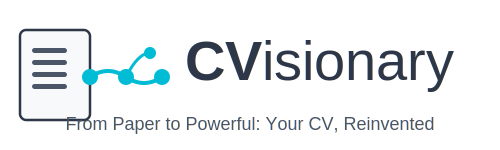

# CVPlus - From Paper to Powerful: Your CV, Reinvented

<div align="center">
  
  
  [](https://opensource.org/licenses/MIT)
  [](https://reactjs.org/)
  [](https://www.typescriptlang.org/)
  [](https://firebase.google.com/)
  [](https://www.anthropic.com/)
  
  Transform your traditional CV into an interactive, AI-enhanced professional profile with cutting-edge features!
  
  [Live Demo](https://cvisionary.ai) | [Documentation](#-documentation) | [Contributing](#-contributing)
</div>

## 🌟 About CVisionary

CVisionary is an open-source AI-powered platform that revolutionizes how professionals present themselves. Created by [Gil Klainert](https://klainert.com), a Software Engineering Leader and AI Expert, this project is a gift to the community - making powerful career advancement tools accessible to everyone, regardless of their background or financial situation.

## 🚀 Key Features

### 🤖 AI-Powered Enhancement
- **Intelligent CV Analysis**: Claude AI understands and enhances your professional story
- **ATS Optimization**: Ensure your CV passes Applicant Tracking Systems
- **Smart Keyword Enhancement**: Industry-specific terms that get you noticed
- **Achievement Highlighting**: Quantify and showcase your impact

### ✨ Interactive Elements
- **Dynamic QR Codes**: Instant mobile access to your online profile
- **Interactive Career Timeline**: Visual journey through your professional growth
- **Skills Visualization**: Beautiful charts and graphs that bring data to life
- **Contact Forms**: Let recruiters reach you directly

### 🎨 Professional Design
- **Multiple Templates**: Modern, Classic, and Creative designs
- **Responsive Layouts**: Perfect on any device
- **Custom Branding**: Make it uniquely yours
- **Print-Ready Formats**: PDF and DOCX exports

### 🔒 Privacy & Security
- **Smart Privacy Mode**: PII detection and masking for public sharing
- **Secure Storage**: Firebase-powered data protection
- **User Control**: You own your data
- **GDPR Compliant**: Privacy by design

### 🎙️ Innovative Features
- **AI Career Podcast**: Transform your CV into an engaging audio story
- **Personality Insights**: AI-driven analysis of work style and preferences
- **Video Introductions**: Make a memorable first impression
- **Portfolio Integration**: Showcase your work seamlessly

## 🛠️ Technology Stack

<table>
<tr>
<td align="center" width="50%">

### Frontend
- **React 18** with TypeScript
- **Vite** for blazing fast builds
- **Tailwind CSS** for beautiful UI
- **React Router** for navigation
- **Firebase SDK** for real-time features

</td>
<td align="center" width="50%">

### Backend
- **Firebase Functions** (Node.js 20)
- **Claude AI API** for intelligence
- **Firestore** for data persistence
- **Cloud Storage** for files
- **Authentication** (Anonymous & Google)

</td>
</tr>
</table>

## 📋 Prerequisites

- Node.js 20 or higher
- npm or yarn
- Firebase CLI (`npm install -g firebase-tools`)
- Anthropic API key for Claude AI

## 🔧 Quick Start

### 1. Clone the repository
```bash
git clone https://github.com/gilco1973/CVisionary.git
cd CVisionary
```

### 2. Install dependencies
```bash
# Frontend
cd frontend
npm install

# Functions
cd ../functions
npm install
```

### 3. Configure environment

Create `frontend/.env.local`:
```env
VITE_FIREBASE_API_KEY=your-api-key
VITE_FIREBASE_AUTH_DOMAIN=your-auth-domain
VITE_FIREBASE_PROJECT_ID=your-project-id
VITE_FIREBASE_STORAGE_BUCKET=your-storage-bucket
VITE_FIREBASE_MESSAGING_SENDER_ID=your-sender-id
VITE_FIREBASE_APP_ID=your-app-id
VITE_FIREBASE_MEASUREMENT_ID=your-measurement-id
```

Create `functions/.env`:
```env
ANTHROPIC_API_KEY=your-anthropic-api-key
```

### 4. Firebase setup
```bash
# Login
firebase login

# Initialize (select existing project or create new)
firebase init

# Set API key
firebase functions:secrets:set ANTHROPIC_API_KEY

# Deploy
firebase deploy
```

## 🚀 Development

### Run locally:
```bash
# Terminal 1 - Frontend
cd frontend
npm run dev

# Terminal 2 - Firebase Emulators
firebase emulators:start
```

### Build for production:
```bash
# Frontend
cd frontend
npm run build

# Functions
cd ../functions
npm run build
```

## 📁 Project Structure

```
CVisionary/
├── frontend/               # React application
│   ├── src/
│   │   ├── components/    # Reusable UI components
│   │   ├── contexts/      # React contexts
│   │   ├── pages/         # Page components
│   │   ├── services/      # API services
│   │   └── lib/          # Utilities
│   └── public/           # Static assets
├── functions/            # Cloud Functions
│   ├── src/
│   │   ├── functions/    # Function handlers
│   │   ├── services/     # Business logic
│   │   └── types/        # TypeScript types
│   └── lib/             # Compiled output
├── firebase.json         # Firebase config
├── firestore.rules      # Security rules
└── storage.rules        # Storage rules
```

## 🎯 How It Works

1. **Upload** - Drop your CV (PDF/DOCX) or paste a LinkedIn URL
2. **Analyze** - Claude AI extracts and enhances your content
3. **Review** - Check PII detection and preview enhancements
4. **Customize** - Choose templates and features
5. **Export** - Download or share your transformed CV

## 🔐 Security & Privacy

- End-to-end encryption for sensitive data
- Automatic PII detection and masking
- User-controlled data retention
- Regular security audits
- GDPR and privacy law compliant

## 🤝 Contributing

We welcome contributions! CVisionary is built for the community, by the community.

### How to contribute:
1. Fork the repository
2. Create your feature branch (`git checkout -b feature/AmazingFeature`)
3. Commit your changes (`git commit -m 'Add some AmazingFeature'`)
4. Push to the branch (`git push origin feature/AmazingFeature`)
5. Open a Pull Request

### Development Guidelines:
- Follow existing code style
- Write tests for new features
- Update documentation
- Ensure all tests pass
- Keep commits atomic and descriptive

## 📄 License

This project is licensed under the MIT License - see the [LICENSE](LICENSE) file for details.

## 🙏 Acknowledgments

- Created with ❤️ by [Gil Klainert](https://klainert.com)
- Powered by [Claude AI](https://www.anthropic.com/) from Anthropic
- Built on [Firebase](https://firebase.google.com/) infrastructure
- UI components from [Lucide Icons](https://lucide.dev/)
- Styling with [Tailwind CSS](https://tailwindcss.com/)

## 🆘 Support

- **Issues**: [GitHub Issues](https://github.com/gilco1973/CVisionary/issues)
- **Discussions**: [GitHub Discussions](https://github.com/gilco1973/CVisionary/discussions)
- **Email**: support@cvisionary.ai

## 🚀 Roadmap

- [x] Core CV transformation features
- [x] Multiple template support
- [x] AI-powered enhancements
- [ ] PDF generation with advanced formatting
- [ ] DOCX export with styles
- [ ] AI Career Podcast generation
- [ ] Multi-language support (10+ languages)
- [ ] LinkedIn direct integration
- [ ] Resume version tracking
- [ ] Interview preparation tools
- [ ] Career coaching AI assistant
- [ ] Mobile app (iOS & Android)

---

<div align="center">
  <p>Built with passion to democratize career advancement tools</p>
  <p>⭐ Star us on GitHub to support the project!</p>
  
  <a href="https://github.com/gilco1973/CVisionary">
    
  </a>
</div>
