# GetMyCV.ai - UI Design Mockup

## Landing Page Design

```mermaid
graph TB
    subgraph "Header Section"
        Logo[GetMyCV.ai Logo]
        Nav[Home | Features | Pricing | Login]
    end
    
    subgraph "Hero Section"
        Title[Transform Your CV in One Click]
        Subtitle[AI-Powered Professional CV Creator with Podcast Generation]
        
        subgraph "Upload Area"
            DragDrop[Drag & Drop Your CV Here<br/>PDF, DOC, DOCX, CSV]
            OR[--- OR ---]
            URLInput[Enter CV URL: _____________ ]
            UploadBtn[Start Processing →]
        end
    end
    
    subgraph "Features Grid"
        F1[🤖 AI Analysis<br/>Smart parsing]
        F2[🎨 Pro Templates<br/>10+ designs]
        F3[🎙️ AI Podcast<br/>Audio summary]
        F4[📄 Multi-format<br/>PDF/DOCX/HTML]
    end
```

## Processing Screen

```mermaid
graph TD
    subgraph "Processing View"
        Progress[Processing Your CV...]
        
        subgraph "Steps Progress"
            S1[✓ File Uploaded]
            S2[⟳ Analyzing Content]
            S3[○ Generating Enhanced CV]
            S4[○ Creating Podcast]
        end
        
        ProgressBar[▓▓▓▓▓▓░░░░ 60%]
        Status[Extracting professional experience...]
    end
```



## Preview & Download Screen

```mermaid
graph LR
    subgraph "Main Preview Area"
        subgraph "CV Preview"
            Preview[<br/>John Doe<br/>Senior Software Engineer<br/><br/>Experience:<br/>• Tech Lead at Google<br/>• Senior Dev at Meta<br/><br/>Skills:<br/>React, Node.js, Python<br/>]
        end
    end
    
    subgraph "Side Panel"
        subgraph "Template Options"
            T1[Modern]
            T2[Classic]
            T3[Creative]
            T4[Executive]
        end
        
        subgraph "Download Options"
            D1[📄 Download PDF]
            D2[📝 Download DOCX]
            D3[🌐 View Online]
        end
        
        subgraph "Podcast Section"
            Player[🎵 ▶️ Play AI Podcast<br/>Duration: 3:45]
        end
    end
```



## Mobile View

```mermaid
graph TD
    subgraph "Mobile Layout"
        Header[☰ GetMyCV.ai]
        
        subgraph "Upload Section"
            MobileUpload[📤 Upload CV]
            MobileURL[🔗 Enter URL]
        end
        
        subgraph "Collapsed Sections"
            Preview[▼ Preview CV]
            Templates[▼ Templates]
            Download[▼ Download]
            Podcast[▼ AI Podcast]
        end
        
        BottomNav[Home | Upload | Profile]
    end
```

## Color Scheme & Typography


## Interactive Elements

```mermaid
stateDiagram-v2
    [*] --> Default
    
    Default --> Hover: Mouse over
    Hover --> Clicked: Click
    Clicked --> Loading: Process
    Loading --> Success: Complete
    Loading --> Error: Failed
    
    Success --> Default: Reset
    Error --> Default: Retry
    Hover --> Default: Mouse out
```

## Responsive Grid Layout


## User Journey Map


## Component Library

