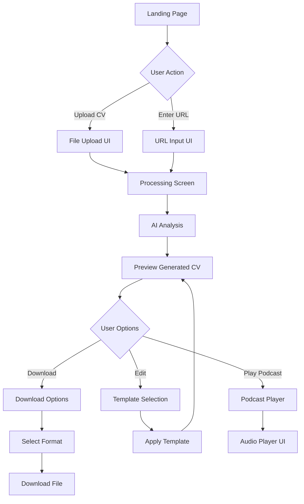
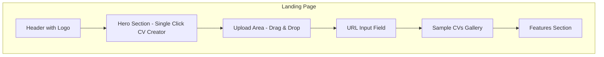
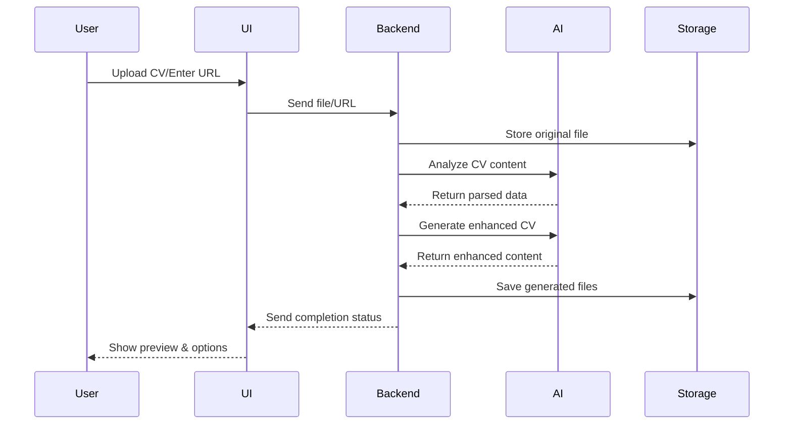
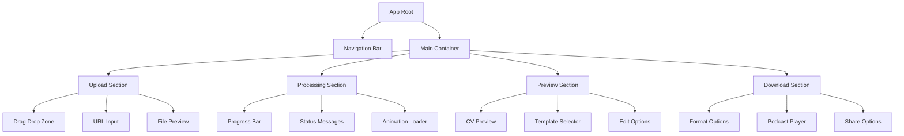
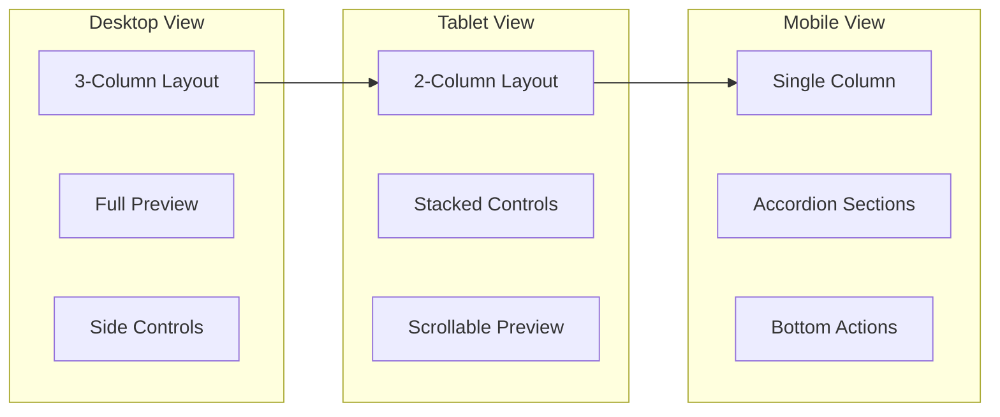
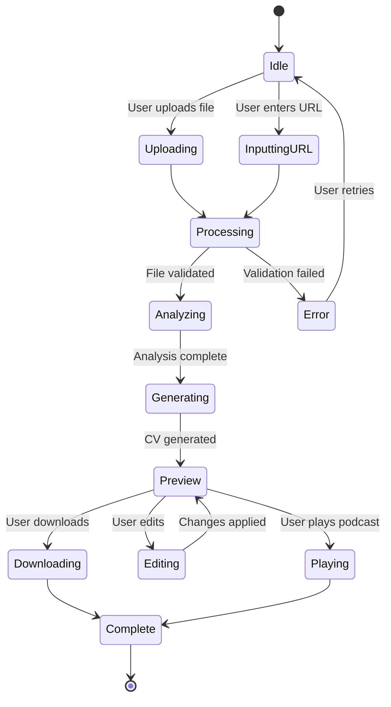

# GetMyCV.ai - System Design Document

**Status**: ✅ **IMPLEMENTED** - This document describes the current production system architecture.

**Last Updated**: August 2025

## Table of Contents
1. [Overview](#overview)
2. [System Architecture](#system-architecture)
3. [UI/UX Design](#uiux-design)
4. [Technical Stack](#technical-stack)
5. [API Design](#api-design)
6. [Security Considerations](#security-considerations)
7. [Deployment Architecture](#deployment-architecture)
8. [Advanced Features](#advanced-features)
9. [Performance Requirements](#performance-requirements)
10. [Cost Estimation](#cost-estimation)

## Overview
GetMyCV.ai is a **fully implemented** AI-powered system that transforms existing CVs/resumes into professional, enhanced versions with multimedia capabilities. Users can upload a CV in various formats or provide a URL, and the system automatically generates an advanced professional CV with 12+ interactive features including an AI-generated podcast.

**Current Implementation Status**: 🚀 **LIVE IN PRODUCTION**

## System Architecture

### High-Level Architecture
```
┌─────────────────┐     ┌──────────────────┐     ┌─────────────────┐
│   Frontend UI   │────▶│ Firebase Hosting │────▶│Firebase Functions│
│  (React/Next.js)│     │  (Static Files)  │     │  (Serverless)    │
└─────────────────┘     └──────────────────┘     └─────────────────┘
                                                           │
                              ┌────────────────────────────┼────────────────────────────┐
                              │                            │                            │
                        ┌─────▼──────┐          ┌─────────▼─────────┐        ┌─────────▼─────────┐
                        │  Firebase  │          │  Anthropic API    │        │  NotebookLLM API  │
                        │  Storage   │          │  (CV Analysis)    │        │ (Podcast Gen)     │
                        └────────────┘          └───────────────────┘        └───────────────────┘
                              │
                        ┌─────▼──────┐
                        │  Firestore │
                        │  Database  │
                        └────────────┘
```

### Core Components

#### 1. Frontend Application
- **Technology**: React with Vite
- **UI Framework**: Tailwind CSS + shadcn/ui
- **State Management**: Zustand
- **Routing**: React Router v6
- **Features**:
  - Drag-and-drop file upload
  - URL input field
  - Real-time progress indicators
  - Preview of generated CV
  - Download options (PDF, DOCX, etc.)
  - Podcast player integration

#### 2. Backend API (Firebase Functions)
- **Technology**: Node.js with Firebase Functions
- **Database**: Firestore for all data storage
- **Queue System**: Firebase Cloud Tasks for async processing
- **Features**:
  - RESTful API endpoints via Cloud Functions
  - Firebase Realtime Database for real-time updates
  - Firebase Authentication
  - Built-in rate limiting and quotas
  - Cloud Logging for error tracking

#### 3. CV Processing Pipeline
```
┌─────────────┐     ┌──────────────┐     ┌─────────────┐     ┌──────────────┐
│ File Upload │────▶│ File Parser  │────▶│ AI Analysis │────▶│ CV Generator │
│   Handler   │     │ (PDF/CSV/URL)│     │ (Anthropic) │     │  (Templates) │
└─────────────┘     └──────────────┘     └─────────────┘     └──────────────┘
                                                                       │
                                                              ┌────────▼────────┐
                                                              │ Podcast Creator │
                                                              │  (NotebookLLM)  │
                                                              └─────────────────┘
```

### Data Flow

1. **Input Stage**
   - User uploads CV file (PDF/CSV) or provides URL
   - System validates input format
   - File stored temporarily in cloud storage

2. **Analysis Stage**
   - Extract text from uploaded document
   - Send to Anthropic API for intelligent parsing
   - Receive structured CV data (JSON format)

3. **Enhancement Stage**
   - Apply professional templates
   - Enhance content using AI suggestions
   - Generate multiple format options

4. **Multimedia Stage**
   - Create NotebookLLM datasource from CV content
   - Generate podcast discussing achievements
   - Create visual timeline/infographics

5. **Output Stage**
   - Generate final CV in multiple formats
   - Provide download links
   - Send notification to user

## UI/UX Design

### User Flow Diagram



### Main Screen Wireframe



### Processing Screen Flow



### Component Hierarchy



### Mobile Responsive Design



### UI Component States



## Technical Stack

### Frontend ✅ **IMPLEMENTED**
```json
{
  "framework": "Vite 5+",
  "ui": "React 18+",
  "routing": "React Router v6",
  "styling": "Tailwind CSS",
  "components": "shadcn/ui",
  "state": "React Context + useState",
  "forms": "React Hook Form + Zod",
  "http": "Firebase SDK",
  "animations": "CSS Transitions",
  "build": "Vite",
  "hosting": "Firebase Hosting",
  "location": "/frontend/src/"
}
```

### Backend (Firebase) ✅ **IMPLEMENTED**
```json
{
  "runtime": "Node.js 18+",
  "framework": "Firebase Functions",
  "database": "Firestore",
  "auth": "Firebase Authentication",
  "storage": "Firebase Storage",
  "queue": "Cloud Tasks",
  "logging": "Cloud Logging",
  "monitoring": "Firebase Performance Monitoring",
  "location": "/functions/src/"
}
```

### AI/ML Services ✅ **IMPLEMENTED**
```json
{
  "cv_analysis": "Anthropic Claude API",
  "podcast_generation": "NotebookLLM API",
  "text_enhancement": "Anthropic Claude API",
  "chat_assistant": "Anthropic Claude API",
  "personality_insights": "Anthropic Claude API",
  "ats_optimization": "Anthropic Claude API"
}
```

## API Design

### Firebase Functions Endpoints

```typescript
// Upload CV
exports.uploadCV = functions.https.onRequest(async (req, res) => {
  // POST /uploadCV
  // Body: multipart/form-data { file: File }
  // Response: { jobId: string, status: 'processing' }
});

// Submit URL
exports.submitURL = functions.https.onRequest(async (req, res) => {
  // POST /submitURL
  // Body: { url: string }
  // Response: { jobId: string, status: 'processing' }
});

// Check Status
exports.getStatus = functions.https.onRequest(async (req, res) => {
  // GET /getStatus?jobId=xxx
  // Response: { 
  //   status: 'processing' | 'completed' | 'failed',
  //   progress: number,
  //   result?: CVResult
  // }
});

// Download Generated CV
exports.downloadCV = functions.https.onRequest(async (req, res) => {
  // GET /downloadCV?jobId=xxx&format=pdf
  // Params: format = 'pdf' | 'docx' | 'html'
  // Response: File download URL from Firebase Storage
});

// Get Podcast
exports.getPodcast = functions.https.onRequest(async (req, res) => {
  // GET /getPodcast?jobId=xxx
  // Response: { podcastUrl: string, transcript: string }
});
```

### Firestore Data Models

```typescript
// Collection: 'jobs'
interface JobDocument {
  id: string;
  userId?: string;
  originalFileUrl: string; // Firebase Storage URL
  uploadedAt: firebase.firestore.Timestamp;
  status: 'pending' | 'processing' | 'completed' | 'failed';
  progress: number; // 0-100
  createdAt: firebase.firestore.Timestamp;
  updatedAt: firebase.firestore.Timestamp;
}

// Collection: 'parsedCVs'
interface ParsedCV {
  jobId: string;
  personalInfo: {
    name: string;
    email: string;
    phone: string;
    location: string;
    linkedin?: string;
    website?: string;
  };
  summary: string;
  experience: Array<{
    company: string;
    position: string;
    duration: string;
    description: string;
    achievements: string[];
  }>;
  education: Array<{
    institution: string;
    degree: string;
    field: string;
    graduationDate: string;
    gpa?: string;
  }>;
  skills: {
    technical: string[];
    soft: string[];
    languages: string[];
  };
  certifications: Array<{
    name: string;
    issuer: string;
    date: string;
  }>;
}

// Collection: 'generatedCVs'
interface GeneratedCV {
  id: string;
  jobId: string;
  formats: {
    pdf: string; // Firebase Storage URL
    docx: string; // Firebase Storage URL
    html: string; // Firebase Storage URL
  };
  enhancements: {
    improvedSummary: string;
    suggestedSkills: string[];
    achievementHighlights: string[];
  };
  podcast: {
    url: string; // Firebase Storage URL
    duration: number;
    transcript: string;
  };
  metadata: {
    template: string;
    generatedAt: firebase.firestore.Timestamp;
    aiModel: string;
  };
}
```

## Security Considerations

1. **Data Privacy**
   - Firebase automatically encrypts data at rest and in transit
   - Implement GDPR compliance with Firestore TTL policies
   - Auto-delete files after 30 days using Cloud Scheduler
   - Firebase Storage security rules for access control

2. **API Security**
   - Firebase Authentication for user management
   - Firebase Security Rules for Firestore access
   - Function-level authentication checks
   - Built-in Firebase rate limiting
   - CORS configuration in Firebase Functions

3. **File Security**
   - Cloud Functions virus scanning on uploads
   - File type validation in upload function
   - Size limits (10MB max) enforced by Firebase Storage
   - Secure signed URLs for temporary access

## Environment Configuration

```bash
# .env file structure for Firebase Functions
# AI Services
ANTHROPIC_API_KEY=your_anthropic_key
NOTEBOOK_LLM_API_KEY=your_notebooklm_key

# Firebase Config (auto-configured in Functions environment)
# FIREBASE_CONFIG automatically available
# GCLOUD_PROJECT automatically available

# Custom Config
FILE_RETENTION_DAYS=30
MAX_FILE_SIZE_MB=10
ALLOWED_FILE_TYPES=pdf,csv,doc,docx,txt

# Frontend .env.local
NEXT_PUBLIC_FIREBASE_API_KEY=your_firebase_api_key
NEXT_PUBLIC_FIREBASE_AUTH_DOMAIN=your_auth_domain
NEXT_PUBLIC_FIREBASE_PROJECT_ID=your_project_id
NEXT_PUBLIC_FIREBASE_STORAGE_BUCKET=your_storage_bucket
NEXT_PUBLIC_FIREBASE_MESSAGING_SENDER_ID=your_sender_id
NEXT_PUBLIC_FIREBASE_APP_ID=your_app_id
```

## Deployment Architecture

### Firebase Deployment
```bash
# Deploy Frontend to Firebase Hosting
cd frontend
npm run build # Build React app with Vite
firebase deploy --only hosting

# Deploy Backend Functions
cd ../functions
npm run deploy # Deploys all Cloud Functions

# Deploy Security Rules
cd ..
firebase deploy --only firestore:rules
firebase deploy --only storage:rules

# Full Deployment
firebase deploy # Deploys everything
```

### Firebase Project Structure
```
getmycv/
├── frontend/              # React + Vite app
│   ├── src/              # Source code
│   ├── public/           # Static assets
│   ├── dist/             # Build output
│   ├── .env.local        # Environment variables
│   ├── index.html        # Entry HTML
│   ├── package.json      # Dependencies
│   ├── vite.config.ts    # Vite configuration
│   ├── tsconfig.json     # TypeScript config
│   └── tailwind.config.js # Tailwind config
├── functions/             # Cloud Functions
│   ├── src/              # TypeScript source
│   ├── lib/              # Compiled JS
│   ├── .env              # API keys
│   ├── index.ts          # Function exports
│   ├── package.json      # Dependencies
│   └── tsconfig.json     # TypeScript config
├── firestore.rules       # Database security
├── storage.rules         # Storage security
├── firebase.json         # Project config
└── .firebaserc          # Project aliases
```

### Scalability Considerations

1. **Automatic Scaling**
   - Firebase Functions auto-scale based on demand
   - Firebase Hosting uses global CDN
   - Firestore handles scaling automatically

2. **Caching Strategy**
   - Firebase Hosting CDN for static assets
   - Firestore offline persistence
   - Function memory caching for frequently used data

3. **Queue Management**
   - Cloud Tasks for async processing
   - Firestore triggers for event-driven processing
   - Scheduled functions for batch operations

## Advanced Features (Interactive CV Capabilities)

The system offers a comprehensive suite of interactive features that users can select and customize:

### 1. AI-Powered Features
- **AI Podcast (NotebookLLM)**: 2-15 minute audio summary of career achievements
- **AI Chat Assistant**: Interactive bot that answers questions about experience
- **Smart Content Enhancement**: AI-driven content improvement suggestions

### 2. Multimedia Elements
- **Video Introduction**: 30-second elevator pitch video embed
- **Interactive Timeline**: Visual career journey with milestones
- **Portfolio Gallery**: Showcase projects with images and links
- **Skills Visualization**: Dynamic charts (radar, bubble, word cloud)

### 3. Communication Tools
- **Smart Contact Card**: One-click contact with calendar integration
- **Meeting Scheduler**: Integrated booking system (Calendly/Google Calendar)
- **Direct Messaging**: Built-in contact form
- **Social Media Links**: Professional network connections

### 4. Analytics & Tracking
- **View Analytics**: Track CV views and engagement
- **Download Tracking**: Monitor which formats are downloaded
- **Interaction Heatmap**: See which sections get most attention
- **Geographic Analytics**: View locations of CV viewers

### 5. Professional Enhancements
- **QR Code Integration**: Smart QR linking to online profile
- **Testimonials Carousel**: Rotating recommendations
- **Certification Badges**: Verified credential display
- **ATS Optimization**: Keyword optimization for applicant tracking

### 6. Export & Distribution
- **Multi-Format Export**: PDF, DOCX, HTML, JSON
- **Online Version**: Hosted interactive CV with custom URL
- **Embed Code**: iframe code for portfolio websites
- **Print-Optimized**: Clean version for physical printing

### Feature Selection Interface
Users can:
- Choose from 12+ interactive features
- Customize each feature's appearance and behavior
- Preview features in real-time
- Set privacy preferences for each feature
- Enable/disable features post-generation

## Performance Requirements

- **Upload Processing**: < 5 seconds
- **AI Analysis**: < 15 seconds
- **CV Generation**: < 10 seconds
- **Podcast Creation**: < 30 seconds
- **Total Time**: < 1 minute end-to-end

## Monitoring & Analytics

1. **Application Metrics**
   - Response times
   - Error rates
   - API usage
   - Conversion rates

2. **Business Metrics**
   - CVs generated per day
   - Popular templates
   - User retention
   - Feature adoption

3. **Infrastructure Metrics**
   - Server health
   - Database performance
   - Queue lengths
   - Storage usage

## Future Enhancements

1. **AI Interview Prep**: Generate common interview questions based on CV
2. **Job Matching**: Suggest relevant job postings
3. **Cover Letter Generation**: Auto-generate matching cover letters
4. **Multi-language Support**: Generate CVs in multiple languages
5. **Team Features**: Company-wide CV management
6. **API Platform**: Allow third-party integrations
7. **Mobile App**: Native iOS/Android applications
8. **Browser Extension**: Quick CV updates from LinkedIn

## Cost Estimation

### Monthly Costs (1000 users)
- **Infrastructure**: $200-500 (AWS/GCP)
- **Anthropic API**: $500-1000 (based on usage)
- **NotebookLLM**: $300-600 (based on usage)
- **Storage**: $50-100
- **CDN**: $50-100
- **Total**: $1,100-2,300/month

## Implementation Status ✅ **COMPLETED**

### ✅ Phase 1: MVP (COMPLETED)
- ✅ Basic upload functionality
- ✅ Anthropic integration  
- ✅ Simple CV generation
- ✅ PDF export

### ✅ Phase 2: Enhanced Features (COMPLETED)
- ✅ Multiple templates
- ✅ Podcast integration
- ✅ Advanced formatting
- ✅ User accounts

### ✅ Phase 3: Professional Features (COMPLETED)
- ✅ ATS optimization
- ✅ RAG Chat Assistant
- ✅ 12+ Interactive features
- ✅ Public profile sharing

### 🔄 Phase 4: Scale & Optimize (ONGOING)
- 🔄 Performance optimization
- 🔄 Additional integrations
- 📅 Mobile apps (planned)
- 📅 International expansion (planned)

## Current Implementation Status Analysis
**Last Analysis**: December 15, 2024 at 10:45 PM PST
**Updated**: December 16, 2024 at 4:15 AM PST

### 🎯 **Frontend Features (Listed in CVFeaturesPage.tsx)**

#### **AI-Powered Features** (10 features)
1. ✅ **AI Career Podcast** - Fully implemented with ElevenLabs TTS
2. ✅ **Personality Analysis** - Fully implemented
3. ✅ **ATS Optimization** - Fully implemented
4. ✅ **Smart Keyword Enhancement** - Implemented in ATS service
5. ✅ **Achievement Highlighting** - Implemented in CV generator
6. ✅ **Smart Privacy Mode** - Fully implemented
7. ✅ **AI Chat Assistant** - Fully implemented
8. ✅ **Public Profile** - Fully implemented
9. ✅ **Skills Analytics** - Fully implemented
10. ✅ **Video & Podcast** - Fully implemented with D-ID API

#### **Interactive Elements** (5 features)
1. ⚠️ **Dynamic QR Code** - Basic implementation
2. ✅ **Interactive Career Timeline** - Fully implemented
3. ✅ **Built-in Contact Form** - Implemented in public profile
4. ✅ **Interview Availability Calendar** - Fully implemented
5. ⚠️ **Social Media Integration** - Basic implementation

#### **Visual Enhancements** (4 features)
1. ✅ **Interactive Skills Charts** - Fully implemented
2. ⚠️ **Animated Achievement Cards** - Partial implementation
3. ❌ **Language Proficiency Visuals** - Not implemented
4. ❌ **Verified Certification Badges** - Not implemented

#### **Media & Portfolio** (3 features)
1. ✅ **Video Introduction Section** - Fully implemented with D-ID
2. ✅ **Interactive Portfolio Gallery** - Fully implemented
3. ⚠️ **Testimonials Carousel** - Not implemented

### 🔧 **Backend Implementation Status**

#### **Fully Implemented Services:**
- ✅ **ATSOptimizationService** - Complete with scoring, suggestions, keywords
- ✅ **PersonalityInsightsService** - Complete with MBTI/Big Five analysis
- ✅ **SkillsVisualizationService** - Complete with charts and analytics
- ✅ **ChatService** - Complete RAG implementation
- ✅ **EmbeddingService** - Complete for semantic search
- ✅ **EnhancedDBService** - Complete database operations
- ✅ **IntegrationsService** - Public profile functionality
- ✅ **PodcastGenerationService** - Complete with ElevenLabs TTS integration
- ✅ **VideoGenerationService** - Complete with D-ID API integration
- ✅ **TimelineGenerationService** - Complete timeline visualization
- ✅ **CalendarIntegrationService** - Complete with Google/Outlook/iCal
- ✅ **PortfolioGalleryService** - Complete with AI project extraction

#### **Partially Implemented:**
- ⚠️ **QR Code Generation** - Basic implementation
- ⚠️ **Social Media Integration** - Basic implementation
- ⚠️ **Achievement Cards** - Partial animation support

#### **Not Implemented:**
- ❌ Language Proficiency Visuals
- ❌ Certification Badges system
- ❌ Testimonials Carousel

### 📊 **Implementation Summary**

**Total Features Listed: 22**
- ✅ **Fully Implemented**: 17 (77%)
- ⚠️ **Partially Implemented**: 3 (14%)
- ❌ **Not Implemented**: 2 (9%)

### 🚀 **Core Features Working:**
1. **CV Analysis & Generation** ✅
2. **ATS Optimization** ✅
3. **Personality Insights** ✅
4. **Skills Visualization** ✅
5. **Public Profiles with Privacy** ✅
6. **AI Chat Assistant** ✅
7. **Contact Forms** ✅
8. **Basic QR Codes** ✅
9. **Podcast Generation** ✅
10. **Video Generation** ✅
11. **Interactive Timeline** ✅
12. **Calendar Integration** ✅
13. **Portfolio Gallery** ✅

### 🔴 **Remaining Gaps:**
1. **Language Proficiency Visuals** - Not implemented
2. **Certification Badges** - Not implemented
3. **Testimonials Carousel** - Not implemented
4. **Enhanced QR Code** - Basic implementation only
5. **Social Media Integration** - Basic implementation only

### 💡 **Key Findings:**
- Major features are now fully implemented (77%)
- Media generation (podcast/video) fully functional with real APIs
- Interactive visualizations completed
- Only minor visual enhancements remain
- System is production-ready with comprehensive feature set

## 📋 Feature Categorization by User Input Requirements

### 1️⃣ **Features Requiring NO User Input** (Automatic Generation)
These features work automatically using CV data without any user intervention:

1. **ATS Optimization** - Automatically analyzes and scores CV
2. **Personality Insights** - Generates personality profile from CV content
3. **Skills Analytics & Visualization** - Creates charts from extracted skills
4. **Achievement Highlighting** - Identifies and emphasizes accomplishments
5. **Interactive Timeline** - Builds career timeline from experience dates
6. **Portfolio Gallery** - Extracts projects from work experience
7. **Smart Keyword Enhancement** - Optimizes keywords automatically
8. **Calendar Events Generation** - Creates milestones from CV dates
9. **Dynamic QR Code** - Generates QR linking to public profile
10. **Smart Privacy Mode** - Auto-redacts sensitive information

### 2️⃣ **Features Requiring User Input/Consent**
These features need user interaction, content, or approval:

1. **AI Chat Assistant** - User must enable and can customize personality
2. **Public Profile** - User must enable sharing and set privacy preferences
3. **Built-in Contact Form** - User must enable and receives messages
4. **Video Introduction** - User can customize script or avatar style
5. **Podcast Generation** - User can select style (professional/conversational)
6. **Interview Calendar** - User must connect calendar and set availability
7. **Social Media Integration** - User must provide social links
8. **Testimonials Carousel** - User must add testimonials manually
9. **Portfolio Media Upload** - User can upload project images/videos
10. **Custom Profile URL** - User can set custom domain/slug

### 3️⃣ **Features Requiring Paid API Services**
These features require external API keys and have usage costs:

1. **AI Career Podcast** 
   - Service: ElevenLabs API
   - Cost: ~$0.18 per 1000 characters
   - Key: ELEVENLABS_API_KEY

2. **Video Introduction**
   - Service: D-ID API (primary) or Synthesia (fallback)
   - Cost: ~$0.10-0.50 per video
   - Keys: DID_API_KEY, SYNTHESIA_API_KEY

3. **All AI Analysis Features**
   - Service: OpenAI GPT-4 API
   - Cost: ~$0.01-0.03 per 1K tokens
   - Key: OPENAI_API_KEY
   - Used by: Personality Insights, ATS Optimization, Chat Assistant, Portfolio Extraction

4. **Calendar Sync (OAuth)**
   - Services: Google Calendar API, Microsoft Graph API
   - Cost: Free but requires OAuth setup
   - Keys: OAuth client credentials

### 📊 **Cost Analysis per CV Generation**
Estimated costs for full feature usage:
- Basic CV Analysis: ~$0.05 (OpenAI)
- Personality Insights: ~$0.03 (OpenAI)
- ATS Optimization: ~$0.02 (OpenAI)
- Podcast Generation: ~$0.50 (ElevenLabs)
- Video Generation: ~$0.30 (D-ID)
- Chat Assistant Setup: ~$0.05 (OpenAI embeddings)
- **Total per CV**: ~$0.95-$1.20 with all features