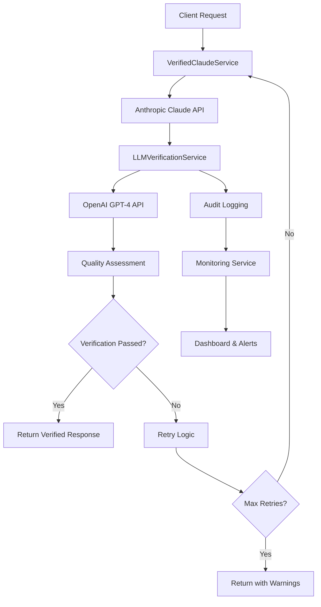

# LLM Verification System

## Overview

The CVPlus LLM Verification System is a comprehensive, production-ready solution that provides cross-validation of AI-generated responses using multiple LLM providers. The system uses Anthropic's Claude API as the primary provider and OpenAI's GPT-4 as a verification layer to ensure response quality, accuracy, and safety.

## 🏗️ Architecture



## 🚀 Key Features

### ✅ Core Verification Features
- **Cross-validation**: Claude responses verified by GPT-4
- **Retry Logic**: Automatic retry with exponential backoff
- **Quality Scoring**: Comprehensive scoring system (0-100)
- **Confidence Assessment**: AI confidence levels (0-1)
- **Issue Detection**: Categorized issue identification and reporting

### 🛡️ Security & Privacy
- **PII Sanitization**: Automatic detection and redaction of sensitive data
- **Rate Limiting**: Configurable request limiting and burst protection
- **Audit Logging**: Comprehensive activity logging with privacy controls
- **IP Blocking**: Automatic blocking of suspicious activity
- **Threat Detection**: Pattern recognition for security threats

### 📊 Monitoring & Analytics
- **Real-time Metrics**: Performance, quality, and reliability tracking
- **Health Checks**: Automated system health monitoring
- **Dashboard**: Comprehensive visualization of system status
- **Alerting**: Configurable alerts for various conditions
- **Export**: Prometheus and JSON export formats

### 🔧 Integration Features
- **Drop-in Replacement**: Seamless integration with existing code
- **Batch Processing**: Efficient handling of multiple requests
- **Streaming**: Real-time processing with progress updates
- **Service Wrappers**: Pre-configured wrappers for common use cases

## 📁 File Structure

```
functions/src/
├── config/
│   └── llm-verification.config.ts     # Environment-specific configuration
├── services/
│   ├── llm-verification.service.ts    # Core verification logic
│   ├── verified-claude.service.ts     # Verified Claude API wrapper
│   ├── llm-integration-wrapper.service.ts # Backward compatibility
│   └── llm-monitoring.service.ts      # Monitoring and analytics
├── functions/
│   └── llmVerificationStatus.ts       # Monitoring endpoint
└── examples/
    └── llm-verification-integration.example.ts # Usage examples
```

## 🔧 Configuration

### Environment Variables
```bash
# Required
ANTHROPIC_API_KEY=your_claude_api_key
OPENAI_API_KEY=your_openai_api_key

# Optional (with defaults)
NODE_ENV=development
LLM_VERIFICATION_ENABLED=true
LLM_VERIFICATION_CONFIDENCE_THRESHOLD=0.7
LLM_VERIFICATION_SCORE_THRESHOLD=70
LLM_VERIFICATION_MAX_RETRIES=3
```

### Configuration Profiles

The system supports three environment profiles:

#### Development
- Lower thresholds for faster development
- Detailed logging enabled
- Rate limiting relaxed
- PII sanitization optional

#### Staging  
- Moderate thresholds
- Security features enabled
- Performance monitoring active
- Full audit logging

#### Production
- Strict thresholds
- Maximum security features
- Optimized performance settings
- Comprehensive monitoring

## 🚀 Quick Start

### 1. Basic Integration (Drop-in Replacement)

Replace existing Claude calls with verified versions:

```typescript
// Before
const response = await callClaudeDirectly(prompt);

// After  
import { cvParsingWrapper } from './services/llm-integration-wrapper.service';
const response = await cvParsingWrapper.parseCV(cvText);
```

### 2. Advanced Integration (Custom Validation)

```typescript
import { verifiedClaudeService } from './services/verified-claude.service';

const response = await verifiedClaudeService.createVerifiedMessage({
  service: 'my-service',
  messages: [{ role: 'user', content: 'Analyze this data...' }],
  validationCriteria: {
    accuracy: true,
    completeness: true,
    relevance: true,
    consistency: true,
    safety: true,
    format: true,
    customCriteria: [{
      name: 'domain_expertise',
      description: 'Verify domain-specific knowledge accuracy',
      weight: 0.9
    }]
  }
});
```

### 3. Monitoring Integration

```typescript
import { llmMonitoringService } from './services/llm-monitoring.service';

// Get system health
const health = await verifiedClaudeService.getHealthStatus();

// Get performance metrics
const metrics = llmVerificationService.getDetailedMetrics();

// Get dashboard data
const dashboard = llmMonitoringService.getDashboardData('24h');
```

## 📊 API Reference

### LLMVerificationService

#### Methods

**`verifyResponse(request: VerificationRequest)`**
- Verifies a Claude response using OpenAI GPT-4
- Returns detailed verification results with scoring

**`verifyWithRetry(service, prompt, response, context?, criteria?)`**
- Includes automatic retry logic with exponential backoff
- Returns final verification result after all attempts

**`healthCheck()`**
- Performs comprehensive health check
- Tests API connectivity and system resources

**`getDetailedMetrics()`**  
- Returns comprehensive performance and quality metrics
- Includes P95/P99 response times and error rates

### VerifiedClaudeService

#### Methods

**`createVerifiedMessage(request: VerifiedClaudeRequest)`**
- Main method for verified Claude API calls
- Handles verification, retries, and audit logging

**`createBatchVerifiedMessages(requests, options?)`**
- Processes multiple requests efficiently
- Configurable concurrency and failure handling

**`streamVerifiedMessage(request)`**
- Streaming API for real-time applications
- Yields progress updates and verification status

**`getHealthStatus()`**
- Comprehensive health status including all components
- Returns component-wise status and metrics

### Configuration

**`llmVerificationConfig`**
- Environment-specific configuration object
- Includes API settings, thresholds, security options

**`validateLLMConfig(config)`**
- Validates configuration for required fields and ranges
- Returns validation results with specific errors

## 🔍 Monitoring & Health Checks

### Health Check Endpoint

```bash
POST /llmVerificationStatus
{
  "action": "health"
}
```

Response:
```json
{
  "status": "healthy",
  "components": {
    "verification": { "status": "healthy" },
    "claude": { "status": "healthy" },
    "memory": { "status": "healthy" }
  },
  "configuration": {
    "verificationEnabled": true,
    "confidenceThreshold": 0.75,
    "scoreThreshold": 75
  }
}
```

### Metrics Endpoint

```bash
POST /llmVerificationStatus
{
  "action": "metrics",
  "timeRange": "24h"
}
```

### Dashboard Endpoint

```bash
POST /llmVerificationStatus
{
  "action": "dashboard",
  "timeRange": "24h"
}
```

### Prometheus Export

```bash
POST /llmVerificationStatus
{
  "action": "export",
  "format": "prometheus"
}
```

## 🛡️ Security Features

### PII Protection
- Automatic detection of sensitive data
- Configurable sanitization for logs
- Support for custom PII patterns
- Real-time privacy risk assessment

### Rate Limiting
```typescript
// Per-service rate limiting
rateLimiting: {
  enabled: true,
  requestsPerMinute: 60,
  burstLimit: 10,
  blockDuration: 15 // minutes
}
```

### Audit Logging
- Comprehensive request/response logging
- PII sanitization for compliance
- Configurable retention periods
- Security event tracking

### Threat Detection
- Pattern-based suspicious activity detection
- Automatic alerting for security events
- IP-based blocking capabilities
- Anomaly detection algorithms

## 📈 Performance Optimization

### Caching Strategy
- Response caching with TTL
- Rate limit counter optimization
- Memory-efficient audit log storage
- Configurable cleanup intervals

### Batch Processing
- Concurrent request processing
- Configurable batch sizes
- Failure isolation and handling
- Progress tracking and reporting

### Resource Management
- Memory usage monitoring
- Automatic cleanup mechanisms
- Connection pooling optimization
- Graceful degradation patterns

## 🚨 Error Handling

### Error Types
- **ValidationError**: Configuration or input validation failures
- **RateLimitError**: Rate limiting violations
- **APIError**: External API failures (Claude/OpenAI)
- **VerificationError**: Verification process failures
- **TimeoutError**: Request timeout handling

### Retry Strategy
- Exponential backoff with jitter
- Configurable maximum retry attempts
- Selective retry based on error type
- Circuit breaker pattern implementation

## 📝 Usage Examples

### Example 1: Simple CV Parsing
```typescript
import { cvParsingWrapper } from './services/llm-integration-wrapper.service';

const result = await cvParsingWrapper.parseCV(
  cvText,
  'Focus on technical skills and experience',
  { fileName: 'resume.pdf' }
);

console.log('Verification Score:', result.verificationScore);
console.log('Parsed Data:', JSON.parse(result.content));
```

### Example 2: Custom Validation
```typescript
import { verifiedClaudeService } from './services/verified-claude.service';

const response = await verifiedClaudeService.createVerifiedMessage({
  service: 'custom-analysis',
  messages: [{ role: 'user', content: 'Analyze this data...' }],
  validationCriteria: {
    accuracy: true,
    completeness: true,
    customCriteria: [{
      name: 'technical_accuracy',
      description: 'Verify technical claims',
      weight: 0.9
    }]
  }
});
```

### Example 3: Batch Processing
```typescript
const batchRequests = cvList.map(cv => ({
  service: 'batch-cv-processing',
  messages: [{ role: 'user', content: `Parse: ${cv}` }]
}));

const results = await verifiedClaudeService.createBatchVerifiedMessages(
  batchRequests,
  { maxConcurrent: 3 }
);

console.log(`Processed ${results.successCount}/${results.results.length} successfully`);
```

### Example 4: Streaming Processing
```typescript
for await (const update of verifiedClaudeService.streamVerifiedMessage(request)) {
  switch (update.type) {
    case 'progress':
      console.log('Progress:', update.data.message);
      break;
    case 'verification':
      console.log('Verification:', update.data.score);
      break;
    case 'complete':
      console.log('Result:', update.data.content);
      break;
  }
}
```

## 🔧 Troubleshooting

### Common Issues

**High Error Rates**
- Check API key validity
- Verify rate limiting settings
- Review network connectivity
- Check verification thresholds

**Slow Response Times**
- Optimize prompt lengths
- Adjust concurrency settings
- Review timeout configurations
- Check system resources

**Low Verification Scores**
- Review validation criteria
- Adjust confidence thresholds
- Improve prompt quality
- Check for PII contamination

**Memory Issues**
- Review audit log retention
- Check cache size limits
- Monitor process memory usage
- Implement cleanup routines

### Health Check Commands

```typescript
// Quick health check
const health = await llmVerificationService.healthCheck();
console.log('System Status:', health.status);

// Detailed metrics
const metrics = await llmVerificationService.getDetailedMetrics();
console.log('Success Rate:', metrics.reliability.successRate);

// Service information
const info = await llmVerificationService.getServiceInfo();
console.log('Uptime:', info.uptime, 'Total Requests:', info.totalRequests);
```

## 📚 Best Practices

### 1. Configuration Management
- Use environment-specific configurations
- Validate configuration on startup
- Monitor configuration changes
- Document custom validation criteria

### 2. Error Handling
- Implement comprehensive error logging
- Use appropriate retry strategies
- Handle graceful degradation
- Monitor error patterns

### 3. Performance Optimization
- Monitor response times regularly
- Use batch processing for bulk operations
- Implement caching where appropriate
- Optimize prompt engineering

### 4. Security
- Enable all security features in production
- Regularly review audit logs
- Monitor for suspicious patterns
- Keep API keys secure and rotated

### 5. Monitoring
- Set up comprehensive alerting
- Monitor key performance indicators
- Review verification scores regularly
- Track cost and usage patterns

## 🔄 Migration Guide

### From Direct Claude Calls

**Before:**
```typescript
const claudeResponse = await callClaudeAPI(prompt);
```

**After:**
```typescript
import { cvParsingWrapper } from './services/llm-integration-wrapper.service';
const verifiedResponse = await cvParsingWrapper.callClaude({ prompt });
```

### From Custom LLM Implementations

1. **Assess Current Implementation**: Review existing error handling, logging, and retry logic
2. **Choose Integration Pattern**: Select wrapper service or direct verified service
3. **Update Configuration**: Set up environment-specific configurations
4. **Test Thoroughly**: Validate verification scores and performance
5. **Monitor Deployment**: Track metrics during rollout

## 📞 Support & Maintenance

### Monitoring Checklist
- [ ] Health checks passing
- [ ] Error rates within acceptable limits
- [ ] Response times meeting SLAs
- [ ] Verification scores stable
- [ ] No active critical alerts
- [ ] API costs within budget
- [ ] Security events reviewed

### Regular Maintenance
- Review and update validation criteria
- Analyze performance trends
- Update API keys and security settings
- Clean up old audit logs
- Review and tune alert thresholds
- Update documentation and examples

---

## 📄 License

This LLM Verification System is part of the CVPlus platform and follows the same licensing terms.

For additional support or questions, refer to the CVPlus documentation or contact the development team.