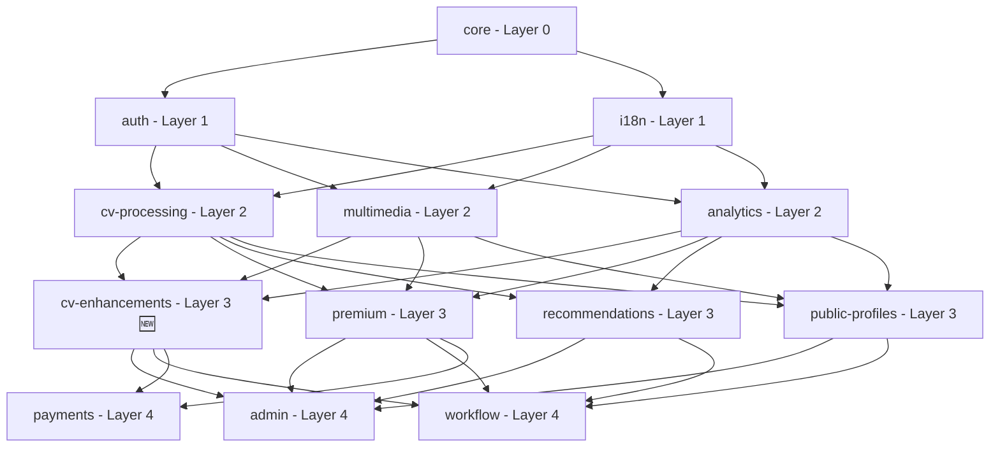

# CVPlus Dependency Mapping - Updated with CV Enhancements Module

**Author**: Gil Klainert
**Date**: 2025-09-16
**Version**: 2.1
**Document Type**: Dependency Architecture Specification

## 🎯 **Updated Module Dependency Matrix**

| Module | Layer | Imports From | Exported To | Build Order |
|--------|--------|-------------|-------------|-------------|
| **core** | 0 | External libraries only | All modules | 1 |
| **auth** | 1 | core | All Layer 1+ | 2 |
| **i18n** | 1 | core | All Layer 1+ | 3 |
| **cv-processing** | 2 | core, auth, i18n | Layer 2+ | 4 |
| **multimedia** | 2 | core, auth, i18n | Layer 2+ | 5 |
| **analytics** | 2 | core, auth, i18n | Layer 2+ | 6 |
| **cv-enhancements** 🆕 | **3** | **core, auth, i18n, cv-processing, multimedia, analytics** | **Layer 3+** | **7** |
| **premium** | 3 | core, auth, i18n, cv-processing, multimedia, analytics | Layer 3+ | 8 |
| **recommendations** | 3 | core, auth, i18n, cv-processing, multimedia, analytics | Layer 3+ | 9 |
| **public-profiles** | 3 | core, auth, i18n, cv-processing, multimedia, analytics | Layer 3+ | 10 |
| **admin** | 4 | All Layers 0-3 | None (top layer) | 11 |
| **workflow** | 4 | All Layers 0-3 | None (top layer) | 12 |
| **payments** | 4 | All Layers 0-3 | None (top layer) | 13 |

## 🆕 **CV Enhancements Module Dependencies**

### **Allowed Imports (Layer 0-2)**
```typescript
// ✅ Layer 0: Core Foundation
import {
  User,
  Job,
  ApiResponse,
  CVData,
  ProcessingStatus,
  ValidationError
} from '@cvplus/core';
import {
  validateInput,
  formatDate,
  logger,
  errorHandler
} from '@cvplus/core/utils';

// ✅ Layer 1: Base Services
import {
  AuthService,
  SessionManager,
  UserPermissions
} from '@cvplus/auth';
import {
  TranslationService,
  LocaleManager,
  formatLocalizedText
} from '@cvplus/i18n';

// ✅ Layer 2: Domain Services
import {
  CVProcessingService,
  CVAnalyzer,
  CareerDataExtractor
} from '@cvplus/cv-processing';
import {
  MultimediaService,
  VideoGenerator,
  AudioProcessor
} from '@cvplus/multimedia';
import {
  AnalyticsService,
  EventTracker,
  MetricsCollector
} from '@cvplus/analytics';
```

### **Forbidden Imports (Layer 3+)**
```typescript
// ❌ FORBIDDEN: Same Layer (Layer 3)
import { PremiumService } from '@cvplus/premium'; // PEER DEPENDENCY
import { RecommendationService } from '@cvplus/recommendations'; // PEER DEPENDENCY
import { PublicProfileService } from '@cvplus/public-profiles'; // PEER DEPENDENCY

// ❌ FORBIDDEN: Higher Layers (Layer 4)
import { AdminService } from '@cvplus/admin'; // ORCHESTRATION LAYER
import { WorkflowService } from '@cvplus/workflow'; // ORCHESTRATION LAYER
import { PaymentService } from '@cvplus/payments'; // ORCHESTRATION LAYER
```

## 📊 **Updated Import/Export Patterns**

### **CV Enhancements Exports**
```typescript
// Frontend Components
export {
  BookingScheduler,
  CalendarSync,
  NetworkingDashboard,
  ContactManager,
  MeetingScheduler
} from './frontend/components';

// Frontend Hooks
export {
  useBooking,
  useCalendar,
  useNetworking,
  useContacts,
  useMeetingScheduler
} from './frontend/hooks';

// Backend Services
export {
  CalendarIntegrationService,
  BookingManagementService,
  ProfessionalNetworkingService,
  EmailAutomationService
} from './backend/services';

// Backend Functions
export {
  bookMeeting,
  sendSchedulingEmail,
  generateAvailabilityCalendar,
  syncCareerCalendar
} from './backend/functions';

// Types
export * from './types';
```

### **Modules That Can Import CV Enhancements**
```typescript
// ✅ Layer 3 Peers (with careful justification)
// @cvplus/premium - for premium calendar features
import { CalendarIntegrationService } from '@cvplus/cv-enhancements';

// ✅ Layer 4 Orchestration
// @cvplus/admin - for booking management
import { BookingManagementService } from '@cvplus/cv-enhancements';

// @cvplus/workflow - for calendar workflow integration
import { CalendarIntegrationService } from '@cvplus/cv-enhancements';

// @cvplus/payments - for booking-related payment flows (if needed)
import { BookingScheduler } from '@cvplus/cv-enhancements';
```

## 🔄 **Migration Impact on Existing Modules**

### **Payments Module Updates**
```typescript
// ❌ OLD: Payments importing calendar/booking (VIOLATION)
import { calendarIntegrationService } from '../services/calendar-integration.service';
import { BookingService } from './booking.service';

// ✅ NEW: Payments importing only from cv-enhancements if needed
import { BookingManagementService } from '@cvplus/cv-enhancements';
```

**Payments Module Refocus**:
- ❌ **REMOVED**: Calendar integration services
- ❌ **REMOVED**: Meeting booking functionality
- ❌ **REMOVED**: Scheduling email automation
- ❌ **REMOVED**: Professional networking features
- ✅ **RETAINED**: Payment processing (Stripe, PayPal)
- ✅ **RETAINED**: Transaction management
- ✅ **RETAINED**: Subscription billing
- ✅ **RETAINED**: Financial reporting

### **Frontend Application Updates**
```typescript
// ❌ OLD: Importing calendar/booking from payments
import {
  BookingScheduler,
  useBooking,
  sendSchedulingEmail
} from '@cvplus/payments';

// ✅ NEW: Importing from cv-enhancements
import {
  BookingScheduler,
  CalendarSync,
  NetworkingDashboard
} from '@cvplus/cv-enhancements';
import {
  useBooking,
  useCalendar,
  useNetworking
} from '@cvplus/cv-enhancements';
```

### **Backend Function Updates**
```typescript
// ❌ OLD: Root functions importing from payments
import { bookMeeting } from './functions/payments/bookMeeting';

// ✅ NEW: Root functions importing from cv-enhancements
import { bookMeeting } from '@cvplus/cv-enhancements/backend/functions';

// Firebase Functions index.ts update
export {
  // Calendar & Booking Enhancement Functions
  bookMeeting,
  sendSchedulingEmail,
  generateAvailabilityCalendar,
  syncCareerCalendar
} from '@cvplus/cv-enhancements/backend/functions';
```

## 🏗️ **Build Dependencies Update**

### **Updated Build Graph**


### **Parallel Build Groups**
```bash
# Build Group 1 (No dependencies)
npm run build:core

# Build Group 2 (Layer 1 - depends on core)
npm run build:auth & npm run build:i18n

# Build Group 3 (Layer 2 - depends on Layers 0-1)
npm run build:cv-processing & npm run build:multimedia & npm run build:analytics

# Build Group 4 (Layer 3 - depends on Layers 0-2) 🆕
npm run build:cv-enhancements & npm run build:premium & npm run build:recommendations & npm run build:public-profiles

# Build Group 5 (Layer 4 - depends on Layers 0-3)
npm run build:admin & npm run build:workflow & npm run build:payments
```

## 🔧 **Updated Package.json Dependencies**

### **CV Enhancements Dependencies**
```json
{
  "name": "@cvplus/cv-enhancements",
  "dependencies": {
    "@cvplus/core": "file:../core",
    "@cvplus/auth": "file:../auth",
    "@cvplus/i18n": "file:../i18n",
    "@cvplus/cv-processing": "file:../cv-processing",
    "@cvplus/multimedia": "file:../multimedia",
    "@cvplus/analytics": "file:../analytics",
    "googleapis": "^126.0.1",
    "nodemailer": "^6.9.0",
    "ical-generator": "^4.1.0"
  }
}
```

### **Payments Module Dependencies (Cleaned)**
```json
{
  "name": "@cvplus/payments",
  "dependencies": {
    "@cvplus/core": "file:../core",
    "@cvplus/auth": "file:../auth",
    "@cvplus/premium": "file:../premium",
    "stripe": "^13.0.0",
    "paypal-rest-sdk": "^1.8.1"
    // ❌ REMOVED: googleapis, nodemailer, ical-generator
    // ❌ REMOVED: calendar/booking related dependencies
  }
}
```

### **Higher Layer Modules Using CV Enhancements**
```json
// @cvplus/premium package.json
{
  "dependencies": {
    "@cvplus/cv-enhancements": "file:../cv-enhancements"
  }
}

// @cvplus/admin package.json
{
  "dependencies": {
    "@cvplus/cv-enhancements": "file:../cv-enhancements"
  }
}
```

## 🧪 **Testing Dependencies**

### **CV Enhancements Test Setup**
```typescript
// Test imports from lower layers only
import { mockUser, mockJob } from '@cvplus/core/testing';
import { mockAuthService } from '@cvplus/auth/testing';
import { mockCVData } from '@cvplus/cv-processing/testing';
import { mockAnalytics } from '@cvplus/analytics/testing';

// Test calendar integration
import { CalendarIntegrationService } from '../services/calendar-integration.service';
import { BookingManagementService } from '../services/booking-management.service';
```

### **Integration Tests**
```typescript
// Cross-module integration tests
describe('CV Enhancements Integration', () => {
  it('should integrate with CV Processing for career data', async () => {
    const cvData = await CVProcessingService.analyzeCV(mockCV);
    const calendarEvents = await CalendarIntegrationService.extractCareerEvents(cvData);
    expect(calendarEvents).toBeDefined();
  });

  it('should integrate with Analytics for booking metrics', async () => {
    const booking = await BookingManagementService.createBooking(mockBooking);
    await AnalyticsService.trackEvent('booking_created', booking.id);
    // Verify analytics integration
  });
});
```

## 📋 **Migration Checklist**

### **Phase 1: Create CV Enhancements Module**
- [x] Create cv-enhancements submodule structure
- [x] Configure Layer 3 architecture with proper dependencies
- [x] Move calendar/booking functionality from payments
- [x] Update imports and dependencies

### **Phase 2: Update Existing Modules**
- [ ] Update payments module to remove calendar/booking code
- [ ] Update frontend applications to import from cv-enhancements
- [ ] Update Firebase Functions index to use cv-enhancements
- [ ] Update all import statements across CVPlus ecosystem

### **Phase 3: Validate Dependencies**
- [ ] Run dependency validation scripts
- [ ] Verify no circular dependencies
- [ ] Validate layer compliance across all modules
- [ ] Update build scripts and CI/CD pipelines

### **Phase 4: Testing & Documentation**
- [ ] Update test suites for both cv-enhancements and payments
- [ ] Validate cross-module integration tests
- [ ] Update architectural documentation
- [ ] Update module documentation (CLAUDE.md files)

## 🚨 **Dependency Validation Commands**

```bash
# Validate layer compliance
npm run validate:layer-dependencies

# Check for circular dependencies
npm run check:circular-deps

# Validate build order
npm run validate:build-order

# Test cross-module integration
npm run test:integration

# Validate architectural compliance
npm run validate:architecture
```

## 🎯 **Success Metrics**

### **Architectural Compliance**
- ✅ Zero circular dependencies
- ✅ Strict layer hierarchy maintained
- ✅ Clean domain boundaries
- ✅ Proper build order validation

### **Module Health**
- ✅ Independent module builds
- ✅ Comprehensive test coverage
- ✅ Clear dependency documentation
- ✅ Proper error handling and logging

---

**Compliance Note**: This dependency mapping ensures that the new CV Enhancements module maintains proper Layer 3 positioning while providing essential calendar, booking, and networking features available to all CVPlus users, maintaining clean architectural boundaries and dependency management.