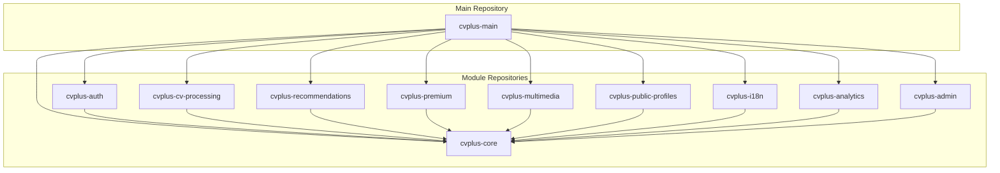

# CVPlus Modular Architecture & Git Submodules Refactoring Plan

**Author:** Gil Klainert  
**Date:** 2025-01-27  
**Status:** Draft

## Executive Summary

This plan outlines the transformation of CVPlus from a monolithic architecture to a modular, self-contained system using git submodules. The refactoring addresses critical issues including a fragmented backend (63+ individual function files), tightly coupled frontend components, and lack of shared packages. The migration will be implemented in phases to ensure zero disruption to production operations.

## Current State Analysis

### Critical Issues Identified

#### Backend Architecture
- **Fragmented Functions:** 63+ individual Firebase function files in `/functions/src/functions/`
- **No Central Orchestration:** Each function operates independently without shared context
- **Type Duplication:** Types scattered across 35+ files in `/functions/src/types/`
- **Service Sprawl:** 107+ service files with overlapping responsibilities

#### Frontend Architecture
- **Component Coupling:** 200+ components with heavy interdependencies
- **Service Duplication:** Multiple services handling similar operations (cvService, cvServiceEnhanced, cvUpdateService)
- **No State Management:** Absence of Redux/Zustand leading to prop drilling
- **Type Redundancy:** 30+ type definition files with overlapping definitions

#### Shared Code Issues
- **Zero Code Sharing:** No shared packages between frontend and backend
- **Type Duplication:** Same types defined in both frontend and backend
- **Constant Duplication:** Configuration values duplicated across layers
- **Utility Duplication:** Common utilities implemented separately

## Proposed Modular Architecture

### Core Principles
1. **Domain-Driven Design:** Modules organized by business domain
2. **Self-Contained Units:** Each module includes its own types, tests, and documentation
3. **Clear Interfaces:** Well-defined contracts between modules
4. **Independent Deployment:** Modules can be versioned and deployed independently
5. **Progressive Migration:** Existing code continues working during migration

### Module Structure

```
cvplus/
├── modules/                          # Git submodules repository root
│   ├── core/                        # Core shared module
│   │   ├── types/                   # Shared TypeScript types
│   │   ├── constants/               # Shared constants
│   │   ├── utils/                   # Shared utilities
│   │   ├── validators/              # Shared validators
│   │   └── package.json
│   │
│   ├── auth/                        # Authentication module
│   │   ├── frontend/                # React components & hooks
│   │   ├── backend/                 # Firebase functions
│   │   ├── shared/                  # Shared auth logic
│   │   ├── types/                   # Auth-specific types
│   │   └── package.json
│   │
│   ├── cv-processing/               # CV Processing module
│   │   ├── frontend/                # CV UI components
│   │   ├── backend/                 # Processing functions
│   │   ├── ai/                      # AI integration
│   │   ├── parsers/                 # Document parsers
│   │   ├── templates/               # CV templates
│   │   └── package.json
│   │
│   ├── recommendations/             # Recommendations module
│   │   ├── frontend/                # Recommendation UI
│   │   ├── backend/                 # Recommendation engine
│   │   ├── ai/                      # AI analysis
│   │   ├── algorithms/              # Recommendation algorithms
│   │   └── package.json
│   │
│   ├── premium/                     # Premium features module
│   │   ├── frontend/                # Premium UI components
│   │   ├── backend/                 # Subscription management
│   │   ├── stripe/                  # Payment integration
│   │   ├── gates/                   # Feature gating
│   │   └── package.json
│   │
│   ├── multimedia/                  # Multimedia module
│   │   ├── video/                   # Video generation
│   │   ├── audio/                   # Podcast generation
│   │   ├── gallery/                 # Portfolio gallery
│   │   ├── qr/                      # QR code generation
│   │   └── package.json
│   │
│   ├── public-profiles/             # Public profiles module
│   │   ├── frontend/                # Profile UI
│   │   ├── backend/                 # Profile management
│   │   ├── portal/                  # Web portal generation
│   │   ├── seo/                     # SEO optimization
│   │   └── package.json
│   │
│   ├── i18n/                        # Internationalization module
│   │   ├── translations/            # Translation files
│   │   ├── providers/               # i18n providers
│   │   ├── tools/                   # Translation tools
│   │   └── package.json
│   │
│   ├── analytics/                   # Analytics module
│   │   ├── frontend/                # Analytics dashboard
│   │   ├── backend/                 # Data collection
│   │   ├── reports/                 # Report generation
│   │   └── package.json
│   │
│   └── admin/                       # Admin module
│       ├── dashboard/               # Admin dashboard
│       ├── user-management/         # User administration
│       ├── monitoring/              # System monitoring
│       └── package.json
│
├── apps/                            # Application layer
│   ├── web/                        # Main web application
│   │   └── src/
│   │       └── bootstrap.tsx      # Module composition
│   │
│   └── functions/                  # Firebase functions app
│       └── src/
│           └── index.ts           # Function registration
│
└── infrastructure/                 # Infrastructure configuration
    ├── firebase/                   # Firebase config
    ├── docker/                     # Docker configs
    └── ci-cd/                      # CI/CD pipelines
```

## Git Submodule Strategy

### Repository Organization



### Submodule Configuration

Each module will be a separate Git repository with:
- Independent versioning (semantic versioning)
- Own CI/CD pipeline
- Dedicated documentation
- Module-specific testing
- Release notes and changelog

## Module Interface Contracts

### Core Module Exports

```typescript
// @cvplus/core
export interface CVData {
  id: string;
  userId: string;
  data: CVContent;
  metadata: CVMetadata;
  version: string;
}

export interface User {
  id: string;
  email: string;
  profile: UserProfile;
  subscription: SubscriptionStatus;
}

export interface ApiResponse<T> {
  success: boolean;
  data?: T;
  error?: ErrorDetails;
  metadata?: ResponseMetadata;
}
```

### Module Communication Patterns

```typescript
// Authentication Module Interface
export interface AuthModule {
  // Core authentication
  login(credentials: LoginCredentials): Promise<AuthToken>;
  logout(): Promise<void>;
  refresh(): Promise<AuthToken>;
  
  // User management
  getCurrentUser(): Promise<User | null>;
  updateProfile(data: ProfileUpdate): Promise<User>;
  
  // Hooks (frontend)
  useAuth(): AuthState;
  usePermissions(): PermissionState;
}

// CV Processing Module Interface
export interface CVProcessingModule {
  // Processing operations
  parseCV(file: File): Promise<ParsedCV>;
  analyzeCV(data: CVData): Promise<CVAnalysis>;
  generateCV(options: GenerationOptions): Promise<GeneratedCV>;
  
  // Template management
  getTemplates(): Promise<Template[]>;
  applyTemplate(cvId: string, templateId: string): Promise<CVData>;
  
  // Hooks (frontend)
  useCVGeneration(): CVGenerationState;
  useTemplates(): TemplateState;
}
```

## Migration Strategy

### Phase 1: Foundation (Week 1-2)

**Objective:** Establish module structure without breaking existing code

1. **Create Core Module**
   - Extract shared types to `@cvplus/core`
   - Create type mapping layer for backward compatibility
   - Set up module build pipeline

2. **Setup Infrastructure**
   - Initialize git submodules
   - Configure monorepo tooling (Nx or Lerna)
   - Setup shared ESLint/Prettier configs

3. **Validation**
   - Ensure existing code compiles
   - Run full test suite
   - Deploy to staging environment

### Phase 2: Authentication & User Management (Week 3-4)

**Objective:** Extract authentication into self-contained module

1. **Extract Backend Functions**
   ```typescript
   // Before: functions/src/functions/auth-*.ts
   // After: modules/auth/backend/functions/
   
   - authLogin.ts → login.ts
   - authRefresh.ts → refresh.ts
   - authLogout.ts → logout.ts
   - userProfile.ts → profile.ts
   ```

2. **Extract Frontend Components**
   ```typescript
   // Before: frontend/src/components/
   // After: modules/auth/frontend/
   
   - AuthGuard.tsx
   - SignInDialog.tsx
   - UserMenu.tsx
   - AuthContext.tsx → providers/AuthProvider.tsx
   ```

3. **Create Module Interface**
   ```typescript
   // modules/auth/index.ts
   export * from './frontend';
   export * from './backend';
   export * from './types';
   ```

### Phase 3: CV Processing (Week 5-7)

**Objective:** Consolidate CV processing logic

1. **Merge Duplicate Services**
   ```typescript
   // Consolidate:
   - cvService.ts
   - cvServiceEnhanced.ts
   - cvUpdateService.ts
   
   // Into:
   - modules/cv-processing/shared/CVService.ts
   ```

2. **Extract Processing Functions**
   - Group 20+ CV-related functions into logical units
   - Create processing pipeline architecture
   - Implement queue-based processing

3. **Template System**
   - Move all templates to module
   - Create template registry
   - Implement template versioning

### Phase 4: Recommendations System (Week 8-9)

**Objective:** Create self-contained recommendations module

1. **Extract Components**
   - RecommendationsContainer
   - Recommendation cards
   - Placeholder system

2. **Backend Consolidation**
   - Merge recommendation functions
   - Create recommendation engine
   - Implement caching layer

3. **AI Integration**
   - Centralize AI prompts
   - Create prompt versioning
   - Implement A/B testing framework

### Phase 5: Premium Features (Week 10-11)

**Objective:** Centralize subscription management

1. **Payment Integration**
   - Extract Stripe integration
   - Create subscription service
   - Implement webhook handling

2. **Feature Gating**
   - Centralize premium gates
   - Create feature flag system
   - Implement gradual rollout

### Phase 6: Multimedia (Week 12-13)

**Objective:** Consolidate media handling

1. **Video Module**
   - Extract video generation
   - Create video service
   - Implement CDN integration

2. **Audio Module**
   - Extract podcast generation
   - Create audio processing pipeline
   - Implement streaming support

3. **Gallery Module**
   - Extract portfolio components
   - Create media management
   - Implement lazy loading

### Phase 7: Final Integration (Week 14-15)

**Objective:** Complete migration and optimization

1. **Remove Legacy Code**
   - Delete deprecated files
   - Remove compatibility layers
   - Clean up unused dependencies

2. **Optimize Bundle Size**
   - Implement code splitting
   - Setup lazy loading
   - Optimize imports

3. **Documentation**
   - Update all documentation
   - Create migration guide
   - Document new architecture

## Testing Strategy

### Unit Testing
```typescript
// Each module has its own test suite
modules/
  auth/
    __tests__/
      backend/
        login.test.ts
        refresh.test.ts
      frontend/
        AuthGuard.test.tsx
        useAuth.test.ts
```

### Integration Testing
```typescript
// Cross-module integration tests
apps/
  web/
    __tests__/
      integration/
        auth-cv-flow.test.ts
        premium-features.test.ts
```

### E2E Testing
```typescript
// Full application flow tests
e2e/
  user-journeys/
    signup-to-cv.test.ts
    free-to-premium.test.ts
```

## CI/CD Pipeline Modifications

### Module Pipeline
```yaml
# .github/workflows/module-auth.yml
name: Auth Module CI/CD

on:
  push:
    paths:
      - 'modules/auth/**'

jobs:
  test:
    runs-on: ubuntu-latest
    steps:
      - uses: actions/checkout@v2
        with:
          submodules: recursive
      - name: Test Auth Module
        run: |
          cd modules/auth
          npm test
          
  deploy:
    needs: test
    if: github.ref == 'refs/heads/main'
    steps:
      - name: Deploy Auth Module
        run: |
          cd modules/auth
          npm run deploy
```

### Main Application Pipeline
```yaml
# .github/workflows/main.yml
name: Main Application CI/CD

on:
  push:
    branches: [main, develop]

jobs:
  integrate:
    runs-on: ubuntu-latest
    steps:
      - uses: actions/checkout@v2
        with:
          submodules: recursive
      - name: Build All Modules
        run: npm run build:all
      - name: Integration Tests
        run: npm run test:integration
      - name: Deploy
        if: github.ref == 'refs/heads/main'
        run: npm run deploy:production
```

## Dependency Management

### Module Dependencies
```json
// modules/auth/package.json
{
  "name": "@cvplus/auth",
  "version": "1.0.0",
  "dependencies": {
    "@cvplus/core": "^1.0.0",
    "firebase-admin": "^11.0.0",
    "firebase": "^10.0.0"
  },
  "peerDependencies": {
    "react": "^18.0.0",
    "react-dom": "^18.0.0"
  }
}
```

### Version Management
- Use semantic versioning for all modules
- Implement automated version bumping
- Maintain compatibility matrix
- Use lockfiles for reproducible builds

## Rollback Strategy

### Rollback Triggers
1. Performance degradation > 20%
2. Critical bug in production
3. Module incompatibility
4. Build failures

### Rollback Procedure
```bash
# Quick rollback to previous version
git submodule update --init --recursive
git checkout previous-stable-tag
npm ci
npm run deploy:rollback

# Module-specific rollback
cd modules/auth
git checkout v1.2.3
cd ../..
git add modules/auth
git commit -m "Rollback auth module to v1.2.3"
npm run deploy
```

### Feature Flags for Safe Rollout
```typescript
// Progressive rollout configuration
export const featureFlags = {
  useNewAuthModule: {
    enabled: true,
    rolloutPercentage: 100,
    whitelist: ['beta-users'],
    blacklist: [],
  },
  useNewCVProcessor: {
    enabled: true,
    rolloutPercentage: 50,
    whitelist: [],
    blacklist: [],
  },
};
```

## Success Metrics

### Technical Metrics
- **Bundle Size Reduction:** Target 40% reduction
- **Build Time:** < 2 minutes per module
- **Test Coverage:** > 80% per module
- **Type Safety:** 100% TypeScript coverage
- **Code Duplication:** < 5% across modules

### Performance Metrics
- **Initial Load Time:** < 2 seconds
- **Time to Interactive:** < 3 seconds
- **API Response Time:** < 200ms p95
- **Memory Usage:** < 100MB client-side

### Development Metrics
- **PR Review Time:** < 4 hours
- **Deployment Frequency:** Daily
- **Mean Time to Recovery:** < 30 minutes
- **Developer Satisfaction:** > 4/5 score

## Risk Mitigation

### Identified Risks

1. **Breaking Changes During Migration**
   - Mitigation: Compatibility layers, feature flags
   - Monitoring: Automated regression tests

2. **Submodule Complexity**
   - Mitigation: Comprehensive documentation, tooling
   - Monitoring: Developer feedback surveys

3. **Performance Degradation**
   - Mitigation: Progressive rollout, monitoring
   - Monitoring: Real-time performance metrics

4. **Team Adoption**
   - Mitigation: Training sessions, documentation
   - Monitoring: Team velocity metrics

## Documentation Requirements

### Per Module
- README with setup instructions
- API documentation
- Integration examples
- Migration guides
- Changelog

### Main Repository
- Architecture overview
- Module dependency graph
- Development workflow
- Deployment procedures
- Troubleshooting guide

## Timeline Summary

| Phase | Duration | Deliverables |
|-------|----------|-------------|
| Phase 1: Foundation | 2 weeks | Core module, infrastructure |
| Phase 2: Auth | 2 weeks | Auth module extraction |
| Phase 3: CV Processing | 3 weeks | CV module consolidation |
| Phase 4: Recommendations | 2 weeks | Recommendations module |
| Phase 5: Premium | 2 weeks | Premium features module |
| Phase 6: Multimedia | 2 weeks | Media modules |
| Phase 7: Integration | 2 weeks | Final cleanup, optimization |
| **Total** | **15 weeks** | **Complete modular architecture** |

## Next Steps

1. **Approval & Team Alignment**
   - Review plan with development team
   - Get stakeholder approval
   - Assign module owners

2. **Tooling Setup**
   - Initialize module repositories
   - Setup CI/CD templates
   - Configure development environment

3. **Pilot Module**
   - Start with Core module as proof of concept
   - Validate approach
   - Refine process based on learnings

4. **Full Implementation**
   - Execute phases according to timeline
   - Weekly progress reviews
   - Continuous refinement

## Conclusion

This modular architecture transformation will significantly improve CVPlus's maintainability, scalability, and development velocity. By using git submodules and domain-driven design, we create a system where teams can work independently while maintaining system coherence. The phased approach ensures business continuity while progressively improving the architecture.

## Appendix A: Module Ownership

| Module | Owner | Team |
|--------|-------|------|
| Core | TBD | Platform Team |
| Auth | TBD | Security Team |
| CV Processing | TBD | AI Team |
| Recommendations | TBD | AI Team |
| Premium | TBD | Business Team |
| Multimedia | TBD | Media Team |
| Public Profiles | TBD | Frontend Team |
| i18n | TBD | Frontend Team |
| Analytics | TBD | Data Team |
| Admin | TBD | Operations Team |

## Appendix B: Technology Decisions

### Build Tools
- **Monorepo Tool:** Nx (preferred) or Lerna
- **Bundler:** Vite for frontend, esbuild for backend
- **Package Manager:** pnpm for efficient module linking
- **Type Checking:** TypeScript with project references

### Development Tools
- **Code Quality:** ESLint, Prettier, Husky
- **Testing:** Jest, React Testing Library, Cypress
- **Documentation:** TypeDoc, Storybook
- **Monitoring:** Sentry, DataDog

### Infrastructure
- **Hosting:** Firebase (current), consider AWS/GCP for modules
- **CDN:** CloudFlare for static assets
- **CI/CD:** GitHub Actions
- **Container Registry:** GitHub Packages or Docker Hub