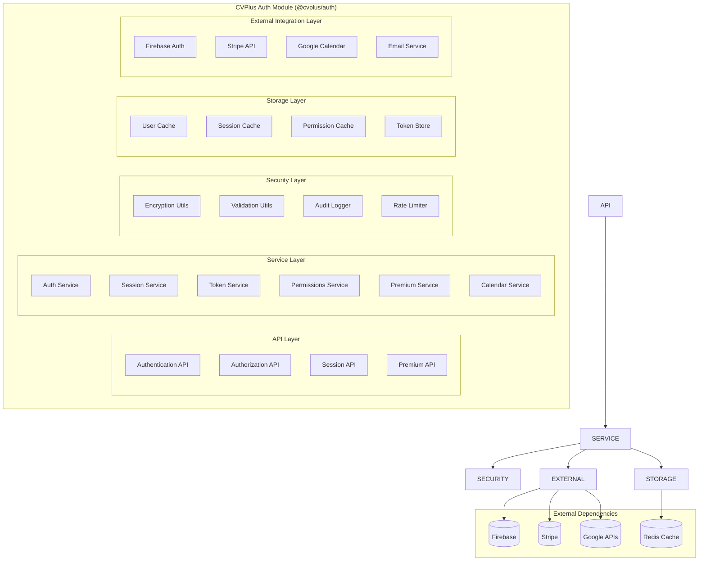
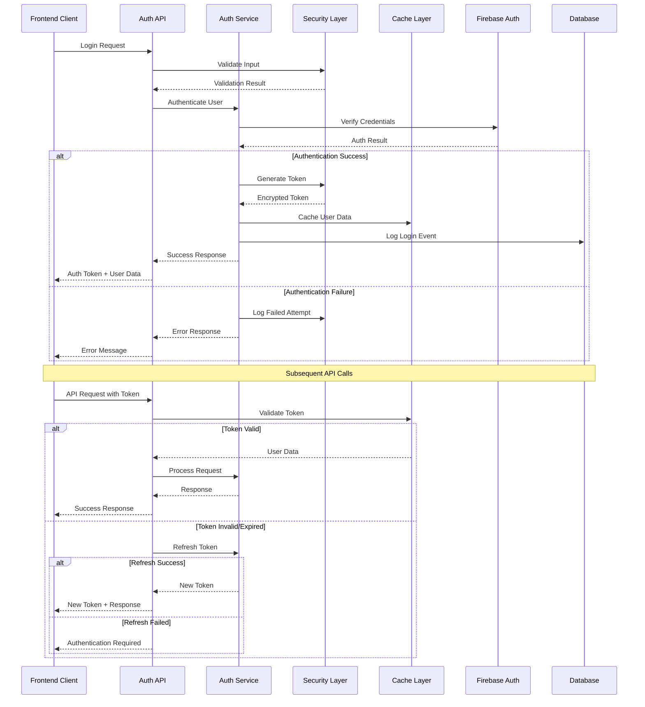
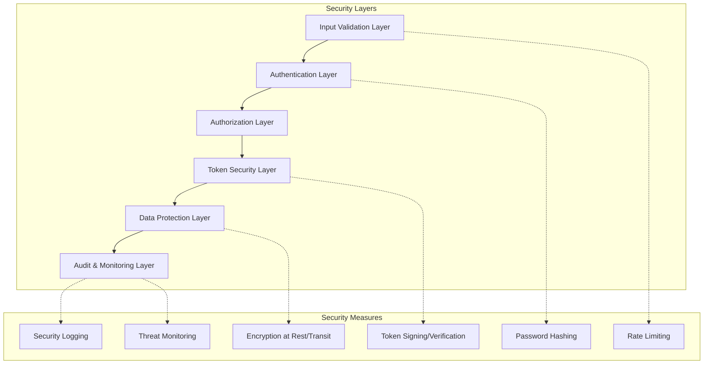
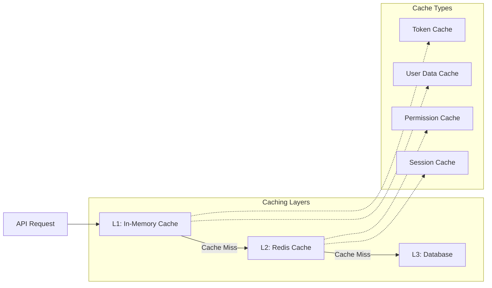
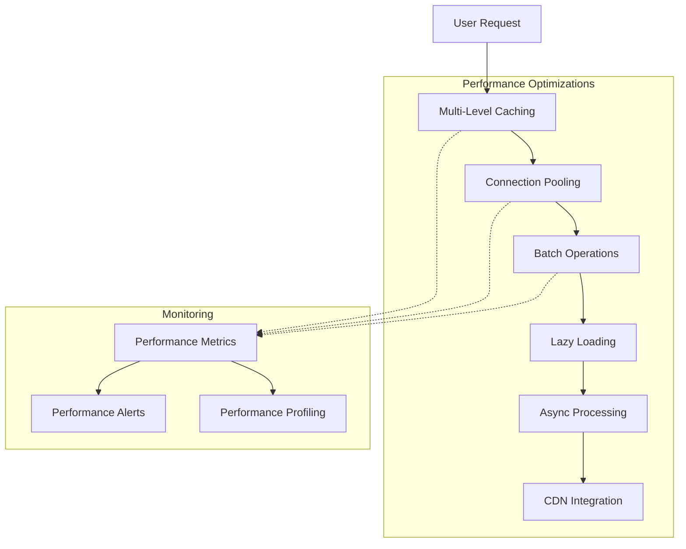
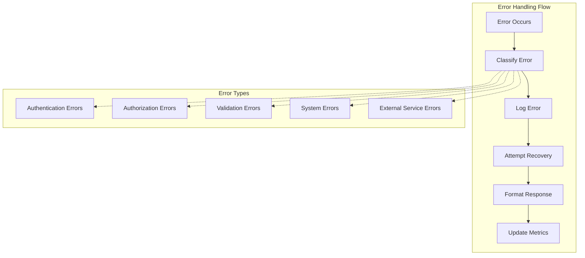
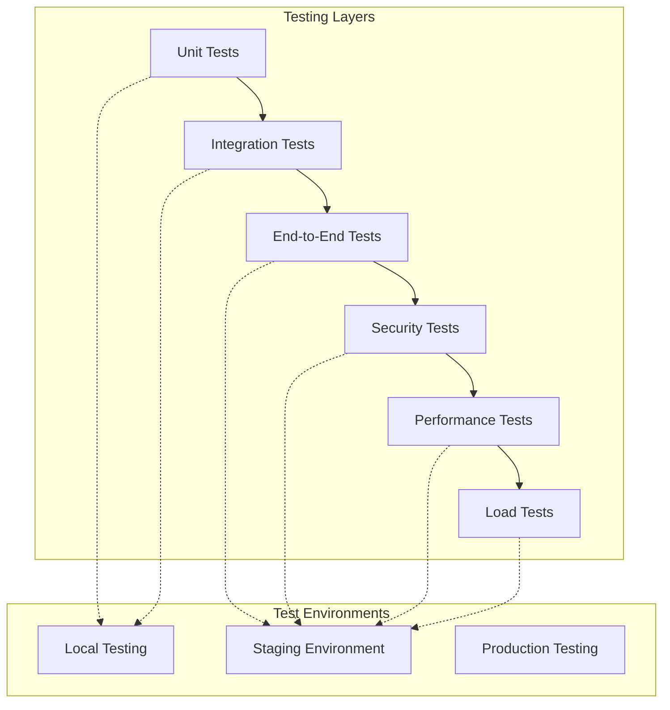
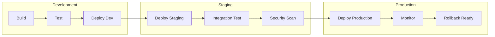

# CVPlus Auth Module - Architecture Document

**Author**: Gil Klainert  
**Date**: 2025-08-27  
**Module**: @cvplus/auth  
**Version**: 1.0.0

## Architectural Overview

The Auth module implements a comprehensive security-first architecture that provides authentication, authorization, session management, and premium access control for the CVPlus platform. The architecture follows a layered approach with clear separation of concerns and robust security measures.

## System Architecture



## Layer Architecture

### 1. **API Layer**
Provides clean, type-safe interfaces for authentication operations.

**Components:**
- `Authentication API`: User login, logout, registration, password management
- `Authorization API`: Permission checking, role management
- `Session API`: Session creation, validation, termination
- `Premium API`: Subscription status, feature access control

**Responsibilities:**
- Input validation and sanitization
- Request/response formatting
- Error handling and messaging
- Rate limiting enforcement

### 2. **Service Layer**
Core business logic for authentication and authorization operations.

**Components:**
- `Auth Service`: Core authentication operations and user management
- `Session Service`: Session lifecycle management and validation
- `Token Service`: JWT token generation, validation, and management
- `Permissions Service`: Role-based and permission-based access control
- `Premium Service`: Subscription management and feature gating
- `Calendar Service`: Calendar integration authentication

**Responsibilities:**
- Business logic implementation
- Data validation and processing
- Service coordination and orchestration
- Integration with external services

### 3. **Security Layer**
Comprehensive security infrastructure for the authentication system.

**Components:**
- `Encryption Utils`: Data encryption, hashing, and cryptographic operations
- `Validation Utils`: Input validation and sanitization
- `Audit Logger`: Security event logging and monitoring
- `Rate Limiter`: Request rate limiting and abuse prevention

**Responsibilities:**
- Data security and encryption
- Audit logging and compliance
- Threat detection and prevention
- Security policy enforcement

### 4. **Storage Layer**
Caching and storage infrastructure for authentication data.

**Components:**
- `User Cache`: In-memory user data caching
- `Session Cache`: Distributed session storage
- `Permission Cache`: Role and permission caching
- `Token Store`: Secure token storage and management

**Responsibilities:**
- Performance optimization through caching
- Session persistence and management
- Token lifecycle management
- Data consistency and synchronization

### 5. **External Integration Layer**
Integration with external services and APIs.

**Components:**
- `Firebase Auth`: Primary authentication provider integration
- `Stripe API`: Subscription and billing integration
- `Google Calendar`: Calendar service authentication
- `Email Service`: Email verification and notifications

**Responsibilities:**
- External service integration
- API client management
- Error handling for external dependencies
- Data transformation and mapping

## Data Flow Architecture



## Component Integration Architecture

### Authentication Flow
```typescript
// Authentication Service Integration
class AuthService {
  async signIn(credentials: LoginCredentials): Promise<AuthResult> {
    // 1. Validate input
    await this.validationService.validateCredentials(credentials);
    
    // 2. Check rate limits
    await this.rateLimitService.checkLoginAttempts(credentials.email);
    
    // 3. Authenticate with Firebase
    const firebaseResult = await this.firebaseAuth.signIn(credentials);
    
    // 4. Generate session and tokens
    const session = await this.sessionService.createSession(firebaseResult.user);
    const tokens = await this.tokenService.generateTokenPair(firebaseResult.user);
    
    // 5. Cache user data
    await this.cacheService.setUserData(firebaseResult.user.id, firebaseResult.user);
    
    // 6. Log authentication event
    await this.auditLogger.logAuthEvent('LOGIN_SUCCESS', firebaseResult.user.id);
    
    return {
      user: firebaseResult.user,
      session,
      tokens,
      permissions: await this.permissionsService.getUserPermissions(firebaseResult.user.id)
    };
  }
}
```

### Authorization Integration
```typescript
// Permission Service Integration
class PermissionsService {
  async checkPermission(userId: string, permission: Permission): Promise<boolean> {
    // 1. Check cache first
    const cached = await this.cache.getPermissions(userId);
    if (cached) {
      return cached.includes(permission);
    }
    
    // 2. Load from database
    const userPermissions = await this.db.getUserPermissions(userId);
    const rolePermissions = await this.db.getRolePermissions(userId);
    
    // 3. Merge and cache permissions
    const allPermissions = [...userPermissions, ...rolePermissions];
    await this.cache.setPermissions(userId, allPermissions);
    
    // 4. Check permission
    return allPermissions.includes(permission);
  }
}
```

### Premium Integration
```typescript
// Premium Service Integration
class PremiumService {
  async checkFeatureAccess(userId: string, feature: PremiumFeature): Promise<FeatureAccessResult> {
    // 1. Get subscription status
    const subscription = await this.getSubscriptionStatus(userId);
    
    // 2. Check feature availability
    const featureConfig = await this.getFeatureConfig(feature);
    
    // 3. Validate access
    if (!featureConfig.requiredPlan || subscription.plan >= featureConfig.requiredPlan) {
      // 4. Check usage limits
      const usage = await this.getFeatureUsage(userId, feature);
      const limits = await this.getUsageLimits(userId, feature);
      
      if (usage.count < limits.maxUsage) {
        return { hasAccess: true, remainingUsage: limits.maxUsage - usage.count };
      }
      
      return { hasAccess: false, reason: 'USAGE_LIMIT_EXCEEDED' };
    }
    
    return { hasAccess: false, reason: 'PREMIUM_REQUIRED' };
  }
}
```

## Security Architecture

### Multi-Layer Security Model


### Token Security Architecture
```typescript
// Token Security Implementation
class TokenService {
  private readonly secretKey: string;
  private readonly algorithm = 'HS256';
  private readonly accessTokenTTL = 15 * 60; // 15 minutes
  private readonly refreshTokenTTL = 7 * 24 * 60 * 60; // 7 days
  
  async generateTokenPair(user: User): Promise<TokenPair> {
    const payload: TokenPayload = {
      userId: user.id,
      email: user.email,
      role: user.role,
      permissions: await this.getPermissions(user.id)
    };
    
    const accessToken = await this.generateToken(payload, this.accessTokenTTL);
    const refreshToken = await this.generateRefreshToken(user.id);
    
    // Store refresh token securely
    await this.storeRefreshToken(user.id, refreshToken);
    
    return { accessToken, refreshToken };
  }
  
  private async generateToken(payload: TokenPayload, ttl: number): Promise<string> {
    const token = jwt.sign(payload, this.secretKey, {
      algorithm: this.algorithm,
      expiresIn: ttl,
      issuer: 'cvplus-auth',
      audience: 'cvplus-api'
    });
    
    // Encrypt token for additional security
    return await this.encryptionService.encrypt(token);
  }
}
```

## Caching Architecture

### Multi-Level Caching Strategy


### Cache Implementation
```typescript
// Caching Service Implementation
class AuthCacheService {
  private memoryCache = new Map<string, CacheEntry>();
  private redisClient: Redis;
  
  async getUserData(userId: string): Promise<User | null> {
    // L1: Check memory cache
    const memoryKey = `user:${userId}`;
    const memoryCached = this.memoryCache.get(memoryKey);
    if (memoryCached && !memoryCached.isExpired()) {
      return memoryCached.data;
    }
    
    // L2: Check Redis cache
    const redisKey = `auth:user:${userId}`;
    const redisCached = await this.redisClient.get(redisKey);
    if (redisCached) {
      const userData = JSON.parse(redisCached);
      // Update L1 cache
      this.setMemoryCache(memoryKey, userData, 5 * 60); // 5 minutes
      return userData;
    }
    
    // L3: Load from database
    const userData = await this.database.getUser(userId);
    if (userData) {
      // Update both caches
      await this.redisClient.setex(redisKey, 30 * 60, JSON.stringify(userData)); // 30 minutes
      this.setMemoryCache(memoryKey, userData, 5 * 60); // 5 minutes
    }
    
    return userData;
  }
  
  async invalidateUserData(userId: string): Promise<void> {
    // Invalidate all cache levels
    this.memoryCache.delete(`user:${userId}`);
    await this.redisClient.del(`auth:user:${userId}`);
    await this.redisClient.del(`auth:permissions:${userId}`);
    await this.redisClient.del(`auth:session:${userId}:*`);
  }
}
```

## Performance Architecture

### Performance Optimization Strategies


### Performance Monitoring
```typescript
// Performance Monitoring Implementation
class AuthPerformanceMonitor {
  private metrics = new Map<string, PerformanceMetric>();
  
  async measureAuthOperation<T>(
    operation: string,
    fn: () => Promise<T>
  ): Promise<T> {
    const startTime = performance.now();
    const startMemory = process.memoryUsage().heapUsed;
    
    try {
      const result = await fn();
      
      // Record success metrics
      this.recordMetric(operation, {
        duration: performance.now() - startTime,
        memoryUsage: process.memoryUsage().heapUsed - startMemory,
        status: 'success'
      });
      
      return result;
    } catch (error) {
      // Record error metrics
      this.recordMetric(operation, {
        duration: performance.now() - startTime,
        memoryUsage: process.memoryUsage().heapUsed - startMemory,
        status: 'error',
        error: error.message
      });
      
      throw error;
    }
  }
  
  private recordMetric(operation: string, data: PerformanceData): void {
    const metric = this.metrics.get(operation) || new PerformanceMetric(operation);
    metric.addDataPoint(data);
    this.metrics.set(operation, metric);
    
    // Send to monitoring system
    this.sendToMonitoring(operation, data);
  }
}
```

## Error Handling Architecture

### Comprehensive Error Management


### Error Recovery Implementation
```typescript
// Error Recovery System
class AuthErrorHandler {
  async handleError(error: unknown, context: ErrorContext): Promise<ErrorResponse> {
    const authError = this.classifyError(error, context);
    
    // Log error with context
    await this.auditLogger.logError(authError, context);
    
    // Attempt error recovery
    const recovered = await this.attemptRecovery(authError, context);
    if (recovered) {
      return recovered;
    }
    
    // Update error metrics
    this.metricsService.incrementErrorCount(authError.code, authError.category);
    
    // Format user-facing response
    return this.formatErrorResponse(authError);
  }
  
  private async attemptRecovery(
    error: AuthError,
    context: ErrorContext
  ): Promise<ErrorResponse | null> {
    switch (error.code) {
      case 'TOKEN_EXPIRED':
        // Attempt token refresh
        return await this.attemptTokenRefresh(context);
      
      case 'SESSION_EXPIRED':
        // Attempt session renewal
        return await this.attemptSessionRenewal(context);
      
      case 'RATE_LIMITED':
        // Suggest retry after delay
        return this.createRetryResponse(error);
      
      default:
        return null;
    }
  }
}
```

## Testing Architecture

### Comprehensive Testing Strategy


## Deployment Architecture

### Multi-Environment Deployment


## Related Documentation

- [Design Document](./design.md)
- [Implementation Plan](./implementation-plan.md)
- [API Reference](./api-reference.md)
- [Security Guide](./security-guide.md)
- [Performance Guide](./performance-guide.md)