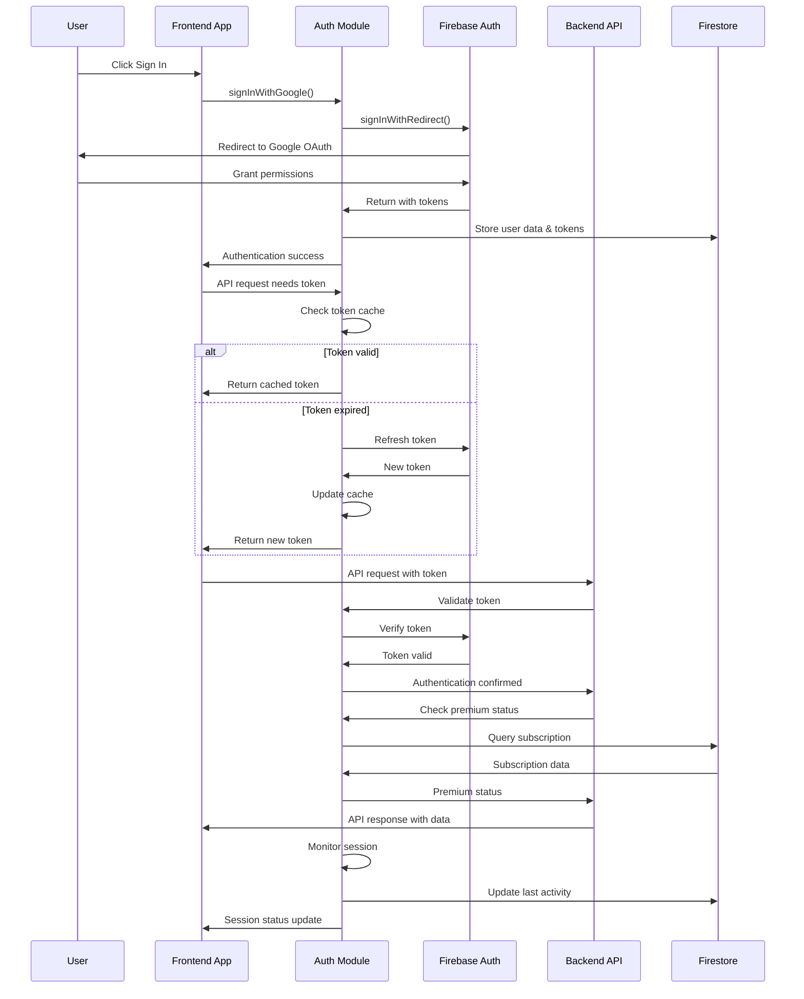
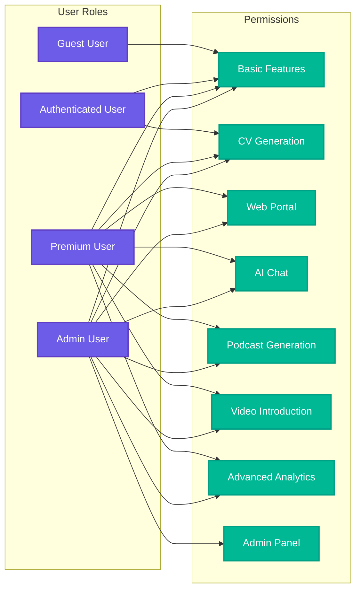

# Authentication Module Architecture Diagram

This diagram illustrates the comprehensive architecture of the @cvplus/auth module, showing the relationships between different components and services.

```mermaid
graph TB
    %% External Dependencies
    Firebase[Firebase Auth]
    GoogleOAuth[Google OAuth]
    Firestore[Firebase Firestore]
    
    %% Core Types Layer
    subgraph "Types Layer"
        UserTypes[User Types]
        SessionTypes[Session Types]
        PermissionTypes[Permission Types]
        PremiumTypes[Premium Types]
        AuthTypes[Auth Types]
    end
    
    %% Services Layer
    subgraph "Services Layer"
        AuthService[Auth Service]
        TokenService[Token Service]
        SessionService[Session Service]
        PermissionsService[Permissions Service]
        PremiumService[Premium Service]
        CalendarService[Calendar Service]
    end
    
    %% React Integration Layer
    subgraph "React Layer"
        AuthContext[Auth Context]
        UseAuth[useAuth Hook]
        UsePremium[usePremium Hook]
        UsePermissions[usePermissions Hook]
        UseSession[useSession Hook]
        UseCalendar[useCalendar Hook]
        
        AuthGuard[Auth Guard]
        SignInDialog[SignIn Dialog]
        UserMenu[User Menu]
        PermissionGate[Permission Gate]
    end
    
    %% Server Middleware Layer
    subgraph "Server Layer"
        AuthMiddleware[Auth Middleware]
        PremiumMiddleware[Premium Middleware]
        RateLimitMiddleware[Rate Limit Middleware]
    end
    
    %% Utilities Layer
    subgraph "Utils Layer"
        ValidationUtils[Validation Utils]
        EncryptionUtils[Encryption Utils]
        StorageUtils[Storage Utils]
        CacheUtils[Cache Utils]
        ErrorUtils[Error Utils]
    end
    
    %% Constants Layer
    subgraph "Constants Layer"
        AuthConstants[Auth Constants]
        PermissionConstants[Permission Constants]
        PremiumConstants[Premium Constants]
    end
    
    %% External System Connections
    Firebase --> AuthService
    GoogleOAuth --> AuthService
    Firestore --> SessionService
    Firestore --> PremiumService
    Firestore --> PermissionsService
    
    %% Service Dependencies
    AuthService --> TokenService
    AuthService --> SessionService
    SessionService --> CacheUtils
    TokenService --> EncryptionUtils
    PremiumService --> CacheUtils
    PermissionsService --> ValidationUtils
    CalendarService --> GoogleOAuth
    
    %% React Layer Dependencies
    AuthContext --> AuthService
    AuthContext --> SessionService
    AuthContext --> PremiumService
    
    UseAuth --> AuthContext
    UsePremium --> PremiumService
    UsePermissions --> PermissionsService
    UseSession --> SessionService
    UseCalendar --> CalendarService
    
    AuthGuard --> UseAuth
    SignInDialog --> UseAuth
    UserMenu --> UseAuth
    UserMenu --> UsePremium
    PermissionGate --> UsePermissions
    
    %% Server Layer Dependencies
    AuthMiddleware --> AuthService
    AuthMiddleware --> TokenService
    PremiumMiddleware --> PremiumService
    RateLimitMiddleware --> CacheUtils
    
    %% Utility Dependencies
    AuthService --> ValidationUtils
    AuthService --> ErrorUtils
    TokenService --> StorageUtils
    SessionService --> StorageUtils
    
    %% Constants Usage
    AuthService --> AuthConstants
    PermissionsService --> PermissionConstants
    PremiumService --> PremiumConstants
    
    %% Styling
    classDef external fill:#ff6b6b,stroke:#d63031,stroke-width:2px,color:#fff
    classDef types fill:#74b9ff,stroke:#0984e3,stroke-width:2px,color:#fff
    classDef services fill:#6c5ce7,stroke:#5f3dc4,stroke-width:2px,color:#fff
    classDef react fill:#a29bfe,stroke:#6c5ce7,stroke-width:2px,color:#fff
    classDef server fill:#fd79a8,stroke:#e84393,stroke-width:2px,color:#fff
    classDef utils fill:#00b894,stroke:#00a085,stroke-width:2px,color:#fff
    classDef constants fill:#fdcb6e,stroke:#e17055,stroke-width:2px,color:#fff
    
    class Firebase,GoogleOAuth,Firestore external
    class UserTypes,SessionTypes,PermissionTypes,PremiumTypes,AuthTypes types
    class AuthService,TokenService,SessionService,PermissionsService,PremiumService,CalendarService services
    class AuthContext,UseAuth,UsePremium,UsePermissions,UseSession,UseCalendar,AuthGuard,SignInDialog,UserMenu,PermissionGate react
    class AuthMiddleware,PremiumMiddleware,RateLimitMiddleware server
    class ValidationUtils,EncryptionUtils,StorageUtils,CacheUtils,ErrorUtils utils
    class AuthConstants,PermissionConstants,PremiumConstants constants
```

## Authentication Flow Diagram

## Permission System Diagram

This architecture ensures:

1. **Separation of Concerns**: Clear boundaries between authentication, authorization, and premium features
2. **Modularity**: Each service has a single responsibility
3. **Extensibility**: Easy to add new authentication providers or features
4. **Type Safety**: Comprehensive TypeScript integration
5. **Framework Agnostic**: Core business logic independent of React/Firebase
6. **Security**: Multiple layers of validation and encryption
7. **Performance**: Caching and session optimization
8. **Maintainability**: Well-organized structure with clear dependencies