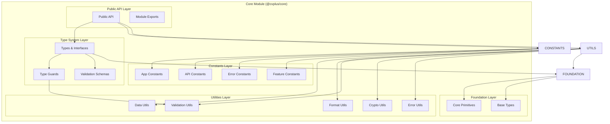
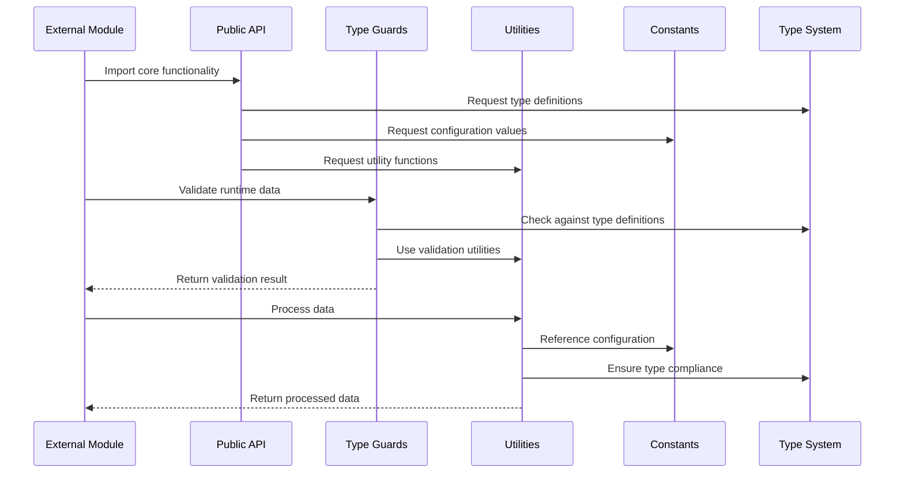
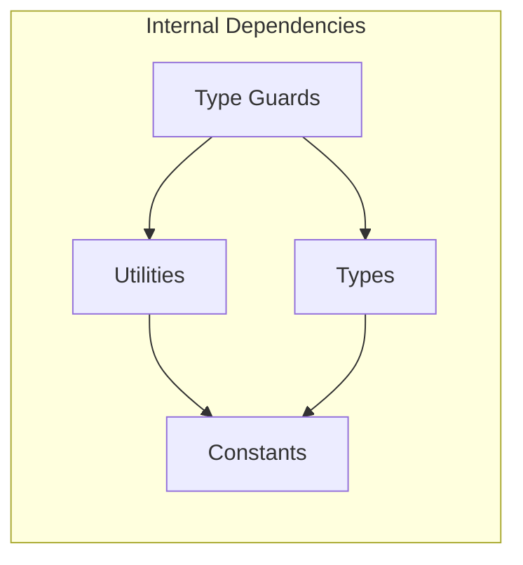

# CVPlus Core Module - Architecture Document

**Author**: Gil Klainert  
**Date**: 2025-08-27  
**Module**: @cvplus/core  
**Version**: 1.0.0

## Architectural Overview

The Core module implements a layered architecture that serves as the foundation for the entire CVPlus ecosystem. It provides a clean separation of concerns between data structures, business logic, and utility functions while maintaining strict type safety and zero external dependencies.

## System Architecture



## Layer Architecture

### 1. **Foundation Layer**
The bottom-most layer providing core primitives and base types.

**Components:**
- `Base Types`: Fundamental TypeScript types and interfaces
- `Core Primitives`: Basic data structures and enums

**Responsibilities:**
- Define fundamental data structures
- Provide base types for extension
- Establish core enumerations

### 2. **Utilities Layer**
Business-agnostic utility functions for common operations.

**Components:**
- `Data Utils`: Array, object, and data manipulation functions
- `Format Utils`: Text formatting, date formatting, currency formatting
- `Validation Utils`: Input validation, schema validation, type checking
- `Crypto Utils`: Hashing, encryption, and security utilities
- `Error Utils`: Error creation, formatting, and handling

**Responsibilities:**
- Provide reusable utility functions
- Implement common algorithms
- Handle cross-cutting concerns

### 3. **Constants Layer**
Centralized configuration and constant definitions.

**Components:**
- `App Constants`: Application-wide settings and configurations
- `API Constants`: Endpoint URLs, HTTP status codes, headers
- `Error Constants`: Error codes, messages, and categories
- `Feature Constants`: Feature flags and toggles

**Responsibilities:**
- Centralize configuration management
- Provide compile-time constants
- Enable feature flag management

### 4. **Type System Layer**
TypeScript type definitions and validation logic.

**Components:**
- `Types & Interfaces`: Core business domain types
- `Type Guards`: Runtime type checking functions
- `Validation Schemas`: Data validation rules and schemas

**Responsibilities:**
- Define domain-specific types
- Provide runtime type safety
- Enable data validation

### 5. **Public API Layer**
External interface and module exports management.

**Components:**
- `Public API`: Clean interface for external consumption
- `Module Exports`: Controlled exports with tree-shaking support

**Responsibilities:**
- Provide clean external API
- Control module surface area
- Enable optimal bundling

## Data Flow Architecture



## Component Integration

### Type System Integration
```typescript
// Core type definition
interface CVData {
  id: string;
  userId: string;
  personalInfo: PersonalInfo;
  // ... other properties
}

// Type guard implementation
export function isCVData(data: unknown): data is CVData {
  return (
    typeof data === 'object' &&
    data !== null &&
    typeof (data as any).id === 'string' &&
    typeof (data as any).userId === 'string' &&
    isPersonalInfo((data as any).personalInfo)
  );
}

// Validation utility usage
export function validateCVData(data: unknown): ValidationResult<CVData> {
  if (!isCVData(data)) {
    return {
      isValid: false,
      error: createError('INVALID_CV_DATA', 'Invalid CV data structure')
    };
  }
  
  return { isValid: true, data };
}
```

### Constants Integration
```typescript
// API constants
export const API_ENDPOINTS = {
  CV: {
    CREATE: '/api/cv/create',
    UPDATE: '/api/cv/update',
    GET: '/api/cv/:id'
  }
} as const;

// Error constants
export const ERROR_CODES = {
  VALIDATION_ERROR: 'VALIDATION_ERROR',
  NOT_FOUND: 'NOT_FOUND',
  UNAUTHORIZED: 'UNAUTHORIZED'
} as const;

// Feature flags
export const FEATURES = {
  AI_RECOMMENDATIONS: true,
  PREMIUM_TEMPLATES: true,
  MULTIMEDIA_CV: false
} as const;
```

### Utility Integration
```typescript
// Utility function composition
export function processCV(rawData: unknown): ProcessedCV {
  // 1. Validate input
  const validation = validateCVData(rawData);
  if (!validation.isValid) {
    throw validation.error;
  }
  
  // 2. Sanitize data
  const sanitized = sanitizeObject(validation.data);
  
  // 3. Format output
  const formatted = formatCVData(sanitized);
  
  return formatted;
}
```

## Dependency Management

### Internal Dependencies


### External Dependencies
- **None**: Core module maintains zero external dependencies
- **TypeScript**: Development dependency for type checking
- **Build Tools**: Development dependencies for compilation

## Security Architecture

### Type Safety
- Compile-time type checking with TypeScript
- Runtime type validation with type guards
- Strict null checks and undefined handling

### Data Sanitization
- HTML sanitization for user-generated content
- Input validation for all external data
- SQL injection prevention utilities

### Error Handling
- Structured error objects with context
- Error code standardization
- Safe error message formatting

## Performance Architecture

### Bundle Optimization
- Tree-shaking friendly exports
- Modular function organization
- Minimal runtime overhead

### Memory Management
- Immutable data structures where possible
- Efficient algorithms for common operations
- Lazy loading for optional functionality

### Execution Performance
- Pure functions without side effects
- Optimized utility implementations
- Minimal computational complexity

## Testing Architecture

### Unit Testing Strategy
```typescript
describe('Core Module', () => {
  describe('Type Guards', () => {
    it('should validate CV data correctly', () => {
      const validCV = createMockCVData();
      expect(isCVData(validCV)).toBe(true);
      
      const invalidCV = { id: null };
      expect(isCVData(invalidCV)).toBe(false);
    });
  });
  
  describe('Utilities', () => {
    it('should format dates correctly', () => {
      const date = new Date('2025-08-27');
      expect(formatDate(date, 'YYYY-MM-DD')).toBe('2025-08-27');
    });
  });
});
```

### Integration Testing
- Cross-module compatibility testing
- API contract validation
- Performance benchmarking

## Build Architecture

### Compilation Pipeline
1. **TypeScript Compilation**: Convert TS to JS with type checking
2. **Bundle Generation**: Create multiple output formats (ESM, CJS)
3. **Type Declaration**: Generate .d.ts files for consumers
4. **Optimization**: Minification and tree-shaking preparation

### Output Structure
```
dist/
├── esm/           # ES Module build
├── cjs/           # CommonJS build
├── types/         # TypeScript declarations
└── package.json   # Package metadata
```

## Monitoring and Observability

### Performance Metrics
- Bundle size tracking
- Function execution time monitoring
- Memory usage profiling

### Error Tracking
- Error rate monitoring
- Error categorization
- Performance impact analysis

## Related Documentation

- [Design Document](./design.md)
- [Implementation Plan](./implementation-plan.md)
- [API Reference](./api-reference.md)
- [Testing Guide](./testing-guide.md)