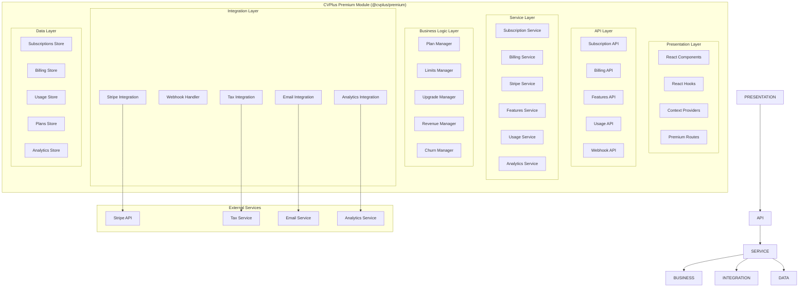
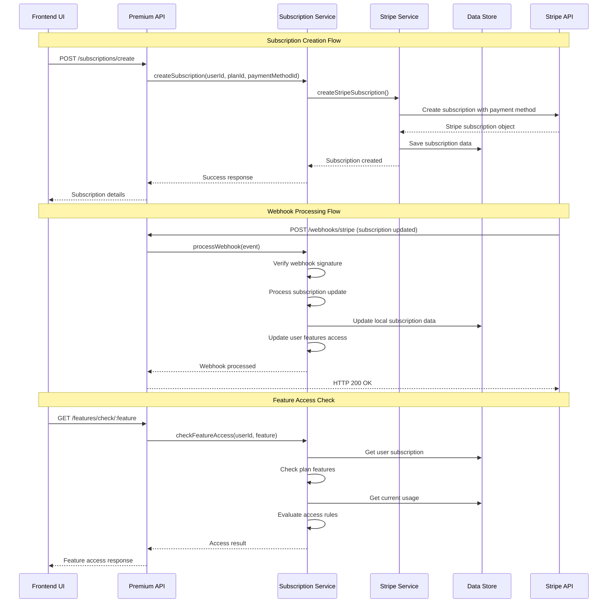
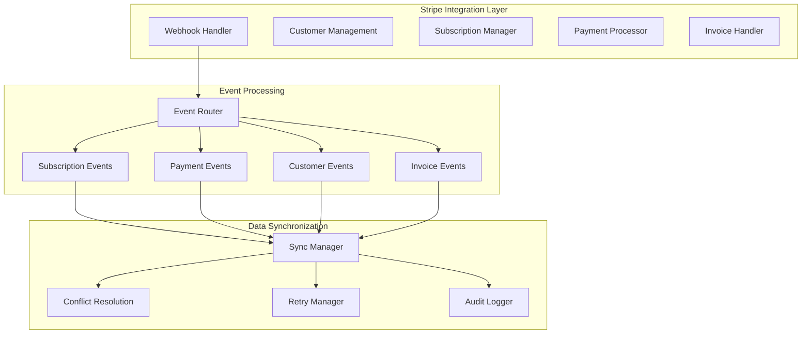
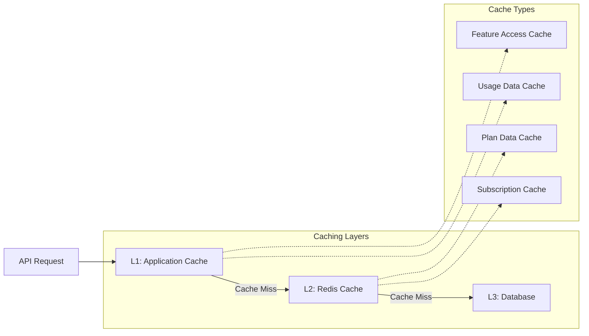
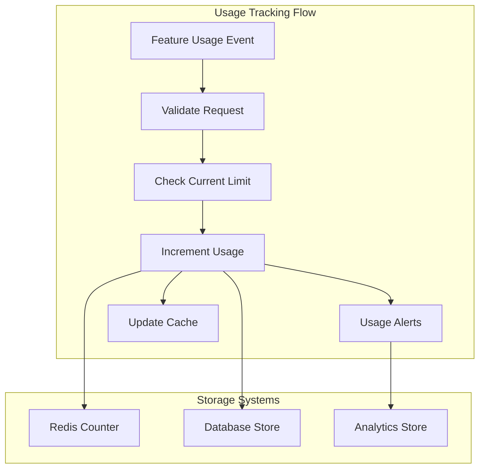
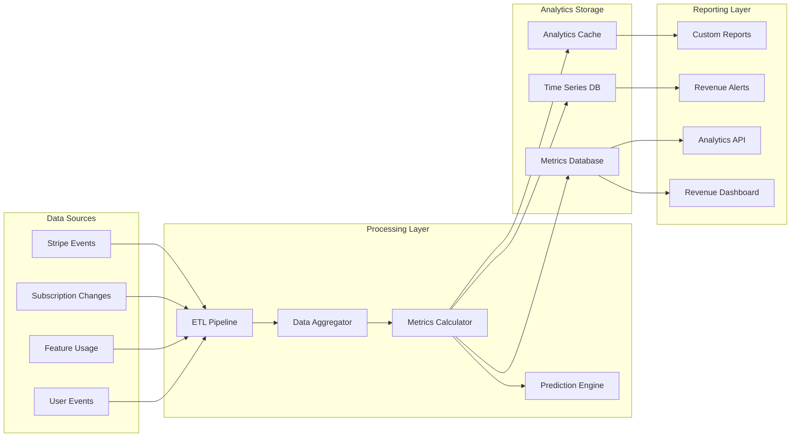
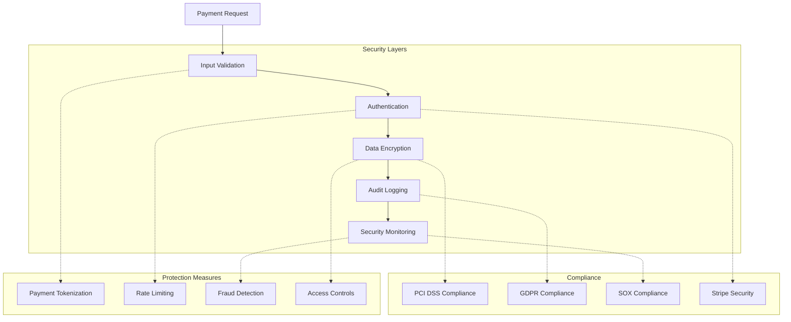
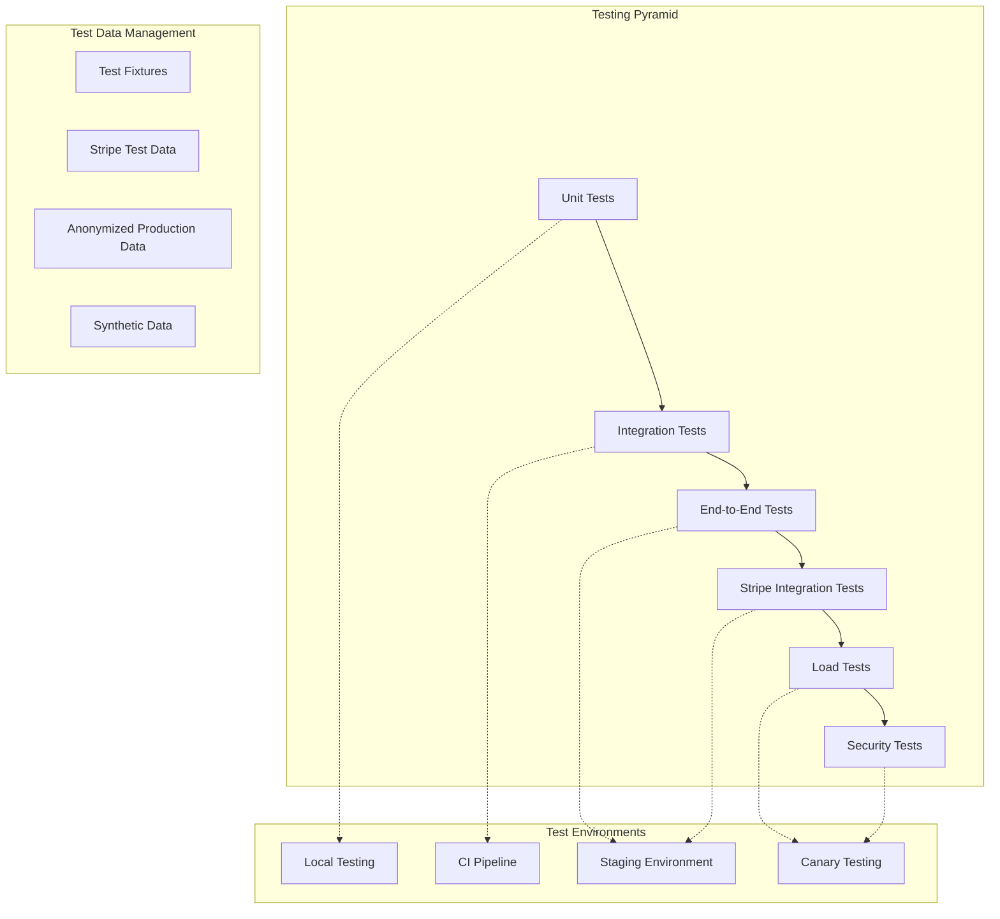
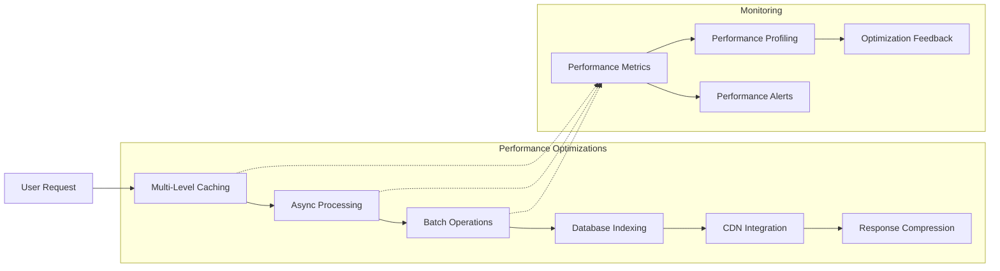

# CVPlus Premium Module - Architecture Document

**Author**: Gil Klainert  
**Date**: 2025-08-27  
**Module**: @cvplus/premium  
**Version**: 1.0.0

## Architectural Overview

The Premium module implements a comprehensive subscription and monetization architecture that handles billing, feature gating, usage tracking, and revenue optimization for the CVPlus platform. The architecture emphasizes reliability, security, and scalability to support global subscription management and payment processing.

## System Architecture



## Layer Architecture

### 1. **Presentation Layer**
Frontend components and interfaces for subscription management.

**Components:**
- `React Components`: UI components for subscription plans, billing, and feature gates
- `React Hooks`: Custom hooks for subscription state and feature access
- `Context Providers`: Global premium state management and data sharing
- `Premium Routes`: Subscription-specific routing and navigation

**Responsibilities:**
- User interface for subscription management
- Feature gating and access control UI
- Payment flow and billing interface
- Usage tracking and analytics display

### 2. **API Layer**
RESTful and webhook APIs for subscription operations.

**Components:**
- `Subscription API`: CRUD operations for subscription management
- `Billing API`: Payment processing and invoice management
- `Features API`: Feature access checking and usage tracking
- `Usage API`: Usage limits and quota management
- `Webhook API`: Secure webhook handling for payment events

**Responsibilities:**
- Request validation and authentication
- Rate limiting and quota enforcement
- Response formatting and error handling
- Webhook signature verification

### 3. **Service Layer**
Core business logic and orchestration services.

**Components:**
- `Subscription Service`: Core subscription lifecycle management
- `Billing Service`: Payment processing and invoice generation
- `Stripe Service`: Stripe API integration and management
- `Features Service`: Feature access control and gating
- `Usage Service`: Usage tracking and limit enforcement
- `Analytics Service`: Revenue analytics and reporting

**Responsibilities:**
- Business logic implementation
- Service orchestration and coordination
- Data transformation and processing
- Integration with external services

### 4. **Business Logic Layer**
Specialized business logic managers for complex operations.

**Components:**
- `Plan Manager`: Subscription plan management and pricing
- `Limits Manager`: Usage limits and quota enforcement
- `Upgrade Manager`: Subscription upgrade/downgrade workflows
- `Revenue Manager`: Revenue optimization and pricing strategies
- `Churn Manager`: Churn prediction and retention strategies

**Responsibilities:**
- Complex business rule implementation
- Decision-making algorithms
- Optimization strategies
- Predictive analytics

### 5. **Integration Layer**
External service integration and data synchronization.

**Components:**
- `Stripe Integration`: Complete Stripe API integration
- `Webhook Handler`: Secure webhook processing and validation
- `Email Integration`: Billing and subscription notifications
- `Tax Integration`: Tax calculation and compliance
- `Analytics Integration`: Usage and revenue analytics

**Responsibilities:**
- External service communication
- Data synchronization and mapping
- Error handling for external dependencies
- Security and compliance management

### 6. **Data Layer**
Data persistence and retrieval infrastructure.

**Components:**
- `Subscriptions Store`: Subscription data and history
- `Billing Store`: Payment and invoice data
- `Usage Store`: Feature usage and limits tracking
- `Plans Store`: Subscription plans and pricing
- `Analytics Store`: Revenue and usage analytics

**Responsibilities:**
- Data persistence and retrieval
- Query optimization and indexing
- Data consistency and integrity
- Backup and recovery

## Data Flow Architecture



## Component Integration Architecture

### Subscription Management Integration
```typescript
// Subscription Service Implementation
class SubscriptionService {
  private stripeService: StripeService;
  private billingService: BillingService;
  private featuresService: FeaturesService;
  private usageService: UsageService;
  
  async createSubscription(
    userId: string,
    planId: string,
    paymentMethodId: string
  ): Promise<Subscription> {
    
    // 1. Validate user and plan
    await this.validateUser(userId);
    const plan = await this.validatePlan(planId);
    
    // 2. Check for existing subscription
    const existingSubscription = await this.getActiveSubscription(userId);
    if (existingSubscription) {
      throw new SubscriptionError('User already has active subscription');
    }
    
    // 3. Create Stripe subscription
    const stripeSubscription = await this.stripeService.createSubscription(
      userId,
      planId,
      paymentMethodId
    );
    
    // 4. Create local subscription record
    const subscription = await this.createLocalSubscription({
      id: generateId(),
      userId,
      planId,
      stripeSubscriptionId: stripeSubscription.id,
      status: stripeSubscription.status as SubscriptionStatus,
      currentPeriodStart: new Date(stripeSubscription.current_period_start * 1000),
      currentPeriodEnd: new Date(stripeSubscription.current_period_end * 1000),
      trialEnd: stripeSubscription.trial_end ? 
        new Date(stripeSubscription.trial_end * 1000) : undefined
    });
    
    // 5. Initialize usage tracking
    await this.usageService.initializeUsage(userId, subscription.id, plan);
    
    // 6. Update user features
    await this.featuresService.updateUserFeatures(userId, plan);
    
    // 7. Send welcome email
    await this.notificationService.sendSubscriptionWelcome(userId, subscription);
    
    // 8. Track analytics
    await this.analyticsService.trackSubscriptionCreated({
      userId,
      subscriptionId: subscription.id,
      planId,
      revenue: plan.pricing.monthly,
      source: 'direct'
    });
    
    return subscription;
  }
  
  async upgradeSubscription(subscriptionId: string, newPlanId: string): Promise<Subscription> {
    const subscription = await this.getSubscription(subscriptionId);
    const currentPlan = await this.getPlan(subscription.planId);
    const newPlan = await this.getPlan(newPlanId);
    
    // Validate upgrade path
    if (!this.isValidUpgrade(currentPlan, newPlan)) {
      throw new UpgradeError('Invalid upgrade path');
    }
    
    try {
      // 1. Update Stripe subscription
      const stripeSubscription = await this.stripeService.updateSubscription(
        subscription.stripeSubscriptionId,
        { priceId: newPlan.stripePriceId }
      );
      
      // 2. Update local subscription
      const updatedSubscription = await this.updateSubscription(subscriptionId, {
        planId: newPlanId,
        status: stripeSubscription.status as SubscriptionStatus,
        updatedAt: new Date()
      });
      
      // 3. Update usage limits
      await this.usageService.updateUsageLimits(subscription.userId, newPlan);
      
      // 4. Update user features
      await this.featuresService.updateUserFeatures(subscription.userId, newPlan);
      
      // 5. Calculate prorated charges
      const proratedAmount = await this.calculateProration(subscription, newPlan);
      
      // 6. Send upgrade confirmation
      await this.notificationService.sendUpgradeConfirmation(
        subscription.userId,
        updatedSubscription,
        proratedAmount
      );
      
      // 7. Track analytics
      await this.analyticsService.trackSubscriptionUpgrade({
        userId: subscription.userId,
        subscriptionId,
        fromPlan: currentPlan.id,
        toPlan: newPlan.id,
        revenueIncrease: newPlan.pricing.monthly - currentPlan.pricing.monthly
      });
      
      return updatedSubscription;
      
    } catch (error) {
      // Rollback on failure
      await this.handleUpgradeFailure(subscriptionId, error);
      throw error;
    }
  }
}
```

### Feature Gating Integration
```typescript
// Features Service Implementation
class FeaturesService {
  private subscriptionService: SubscriptionService;
  private usageService: UsageService;
  private cacheService: CacheService;
  
  async checkFeatureAccess(userId: string, feature: string): Promise<FeatureAccess> {
    // 1. Check cache first
    const cacheKey = `feature_access:${userId}:${feature}`;
    const cached = await this.cacheService.get(cacheKey);
    if (cached) {
      return cached;
    }
    
    // 2. Get user subscription
    const subscription = await this.subscriptionService.getActiveSubscription(userId);
    
    if (!subscription || subscription.status !== 'active') {
      const result = { hasAccess: false, reason: 'NO_ACTIVE_SUBSCRIPTION' };
      await this.cacheService.set(cacheKey, result, { ttl: 60 }); // Cache for 1 minute
      return result;
    }
    
    // 3. Get plan details
    const plan = await this.subscriptionService.getPlan(subscription.planId);
    
    // 4. Check if feature is included in plan
    const featureConfig = await this.getFeatureConfig(feature);
    if (!this.isFeatureIncludedInPlan(featureConfig, plan)) {
      const result = {
        hasAccess: false,
        reason: 'FEATURE_NOT_INCLUDED',
        upgradeRequired: featureConfig.minimumTier
      };
      await this.cacheService.set(cacheKey, result, { ttl: 300 }); // Cache for 5 minutes
      return result;
    }
    
    // 5. Check usage limits
    const usage = await this.usageService.getCurrentUsage(userId, feature);
    const limit = this.getFeatureLimit(plan, feature);
    
    if (usage >= limit) {
      const resetDate = await this.usageService.getResetDate(userId);
      const result = {
        hasAccess: false,
        reason: 'USAGE_LIMIT_EXCEEDED',
        currentUsage: usage,
        limit,
        resetDate
      };
      await this.cacheService.set(cacheKey, result, { ttl: 60 }); // Cache for 1 minute
      return result;
    }
    
    // 6. Grant access
    const result = {
      hasAccess: true,
      remainingUsage: limit - usage,
      resetDate: await this.usageService.getResetDate(userId)
    };
    
    await this.cacheService.set(cacheKey, result, { ttl: 300 }); // Cache for 5 minutes
    return result;
  }
  
  async trackFeatureUsage(
    userId: string, 
    feature: string, 
    amount: number = 1
  ): Promise<UsageResult> {
    
    // 1. Check if tracking is needed
    const featureConfig = await this.getFeatureConfig(feature);
    if (!featureConfig.trackUsage) {
      return { success: true, tracked: false };
    }
    
    // 2. Increment usage
    const newUsage = await this.usageService.incrementUsage(userId, feature, amount);
    
    // 3. Check if approaching limits
    const subscription = await this.subscriptionService.getActiveSubscription(userId);
    const plan = await this.subscriptionService.getPlan(subscription.planId);
    const limit = this.getFeatureLimit(plan, feature);
    
    // 4. Send usage alerts
    const percentage = (newUsage / limit) * 100;
    if (percentage >= 80 && percentage < 100) {
      await this.sendUsageWarning(userId, feature, newUsage, limit);
    } else if (percentage >= 100) {
      await this.sendUsageLimitReached(userId, feature, limit);
    }
    
    // 5. Invalidate cache
    await this.cacheService.delete(`feature_access:${userId}:${feature}`);
    
    // 6. Track analytics
    await this.analyticsService.trackFeatureUsage({
      userId,
      feature,
      amount,
      newTotal: newUsage,
      limit,
      timestamp: new Date()
    });
    
    return {
      success: true,
      tracked: true,
      newUsage,
      limit,
      remainingUsage: Math.max(0, limit - newUsage)
    };
  }
}
```

### Stripe Integration Architecture


### Stripe Webhook Implementation
```typescript
class StripeWebhookHandler {
  private eventHandlers: Map<string, EventHandler>;
  private retryService: RetryService;
  private auditLogger: AuditLogger;
  
  constructor() {
    this.setupEventHandlers();
  }
  
  async processWebhook(
    payload: string,
    signature: string,
    timestamp: number
  ): Promise<WebhookResult> {
    
    // 1. Verify webhook signature
    const event = await this.verifyWebhook(payload, signature);
    
    // 2. Check for duplicate events
    if (await this.isDuplicateEvent(event.id)) {
      return { status: 'duplicate', eventId: event.id };
    }
    
    // 3. Log incoming event
    await this.auditLogger.logWebhookReceived(event);
    
    try {
      // 4. Route event to appropriate handler
      const handler = this.eventHandlers.get(event.type);
      if (!handler) {
        console.warn(`No handler for event type: ${event.type}`);
        return { status: 'unhandled', eventId: event.id };
      }
      
      // 5. Process event with retry logic
      await this.retryService.withRetry(
        () => handler.handle(event),
        { maxAttempts: 3, baseDelay: 1000 }
      );
      
      // 6. Mark as processed
      await this.markEventProcessed(event.id);
      
      // 7. Log success
      await this.auditLogger.logWebhookProcessed(event);
      
      return { status: 'processed', eventId: event.id };
      
    } catch (error) {
      // 8. Log error and schedule retry
      await this.auditLogger.logWebhookError(event, error);
      await this.scheduleEventRetry(event);
      throw error;
    }
  }
  
  private setupEventHandlers(): void {
    this.eventHandlers.set('customer.subscription.created', {
      handle: async (event: Stripe.Event) => {
        const subscription = event.data.object as Stripe.Subscription;
        await this.handleSubscriptionCreated(subscription);
      }
    });
    
    this.eventHandlers.set('customer.subscription.updated', {
      handle: async (event: Stripe.Event) => {
        const subscription = event.data.object as Stripe.Subscription;
        await this.handleSubscriptionUpdated(subscription);
      }
    });
    
    this.eventHandlers.set('invoice.payment_succeeded', {
      handle: async (event: Stripe.Event) => {
        const invoice = event.data.object as Stripe.Invoice;
        await this.handlePaymentSucceeded(invoice);
      }
    });
    
    this.eventHandlers.set('invoice.payment_failed', {
      handle: async (event: Stripe.Event) => {
        const invoice = event.data.object as Stripe.Invoice;
        await this.handlePaymentFailed(invoice);
      }
    });
  }
  
  private async handleSubscriptionUpdated(stripeSubscription: Stripe.Subscription): Promise<void> {
    const localSubscription = await this.subscriptionService.getByStripeId(
      stripeSubscription.id
    );
    
    if (!localSubscription) {
      console.warn(`Local subscription not found for Stripe ID: ${stripeSubscription.id}`);
      return;
    }
    
    // Detect significant changes
    const changes = this.detectSubscriptionChanges(localSubscription, stripeSubscription);
    
    // Update local subscription
    const updates: Partial<Subscription> = {
      status: stripeSubscription.status as SubscriptionStatus,
      currentPeriodStart: new Date(stripeSubscription.current_period_start * 1000),
      currentPeriodEnd: new Date(stripeSubscription.current_period_end * 1000),
      updatedAt: new Date()
    };
    
    // Handle plan changes
    if (changes.planChanged) {
      const newPlan = await this.getPlanByStripePrice(stripeSubscription.items.data[0].price.id);
      updates.planId = newPlan.id;
      
      // Update user features
      await this.featuresService.updateUserFeatures(localSubscription.userId, newPlan);
      
      // Update usage limits
      await this.usageService.updateUsageLimits(localSubscription.userId, newPlan);
    }
    
    // Handle status changes
    if (changes.statusChanged) {
      await this.handleStatusChange(
        localSubscription,
        localSubscription.status,
        stripeSubscription.status as SubscriptionStatus
      );
    }
    
    await this.subscriptionService.updateSubscription(localSubscription.id, updates);
  }
}
```

## Caching Architecture

### Multi-Level Caching Strategy


### Cache Implementation
```typescript
class PremiumCacheService {
  private memoryCache: Map<string, CacheEntry>;
  private redisClient: Redis;
  
  async getFeatureAccess(userId: string, feature: string): Promise<FeatureAccess | null> {
    const key = `feature:${userId}:${feature}`;
    
    // L1: Memory cache
    const memoryResult = this.memoryCache.get(key);
    if (memoryResult && !memoryResult.isExpired()) {
      this.trackCacheHit('memory', key);
      return memoryResult.data;
    }
    
    // L2: Redis cache
    const redisResult = await this.redisClient.get(key);
    if (redisResult) {
      const data = JSON.parse(redisResult);
      // Update L1 cache
      this.memoryCache.set(key, new CacheEntry(data, 60)); // 1 minute
      this.trackCacheHit('redis', key);
      return data;
    }
    
    this.trackCacheMiss(key);
    return null;
  }
  
  async setFeatureAccess(
    userId: string,
    feature: string,
    access: FeatureAccess,
    ttl: number = 300
  ): Promise<void> {
    const key = `feature:${userId}:${feature}`;
    
    // Store in both cache levels
    this.memoryCache.set(key, new CacheEntry(access, Math.min(ttl, 60)));
    await this.redisClient.setex(key, ttl, JSON.stringify(access));
    
    this.trackCacheWrite(key);
  }
  
  async invalidateUserFeatures(userId: string): Promise<void> {
    // Invalidate all feature caches for user
    const pattern = `feature:${userId}:*`;
    
    // Clear from memory cache
    for (const key of this.memoryCache.keys()) {
      if (key.startsWith(`feature:${userId}:`)) {
        this.memoryCache.delete(key);
      }
    }
    
    // Clear from Redis
    const keys = await this.redisClient.keys(pattern);
    if (keys.length > 0) {
      await this.redisClient.del(...keys);
    }
    
    this.trackCacheInvalidation(pattern);
  }
}
```

## Usage Tracking Architecture

### Real-Time Usage Monitoring


### Usage Service Implementation
```typescript
class UsageService {
  private redisClient: Redis;
  private database: Database;
  private alertService: AlertService;
  
  async trackUsage(userId: string, feature: string, amount: number = 1): Promise<UsageResult> {
    const key = `usage:${userId}:${feature}`;
    const periodKey = this.getCurrentPeriodKey(userId);
    
    // 1. Get current usage from Redis
    const currentUsage = await this.redisClient.hincrby(
      `${key}:${periodKey}`,
      feature,
      amount
    );
    
    // 2. Get user limits
    const subscription = await this.subscriptionService.getActiveSubscription(userId);
    const plan = await this.subscriptionService.getPlan(subscription.planId);
    const limit = plan.limits[feature];
    
    // 3. Check if limit exceeded
    if (currentUsage > limit) {
      // Rollback the increment
      await this.redisClient.hincrby(`${key}:${periodKey}`, feature, -amount);
      
      return {
        success: false,
        reason: 'USAGE_LIMIT_EXCEEDED',
        currentUsage: currentUsage - amount,
        limit,
        blocked: true
      };
    }
    
    // 4. Update persistent storage asynchronously
    this.updatePersistentUsage(userId, feature, amount, currentUsage);
    
    // 5. Check for usage alerts
    const percentage = (currentUsage / limit) * 100;
    await this.checkUsageAlerts(userId, feature, percentage, currentUsage, limit);
    
    // 6. Invalidate cache
    await this.cacheService.invalidatePattern(`feature:${userId}:*`);
    
    return {
      success: true,
      currentUsage,
      limit,
      remainingUsage: limit - currentUsage,
      percentage
    };
  }
  
  async getCurrentUsage(userId: string, feature: string): Promise<number> {
    const key = `usage:${userId}:${feature}`;
    const periodKey = this.getCurrentPeriodKey(userId);
    
    // Try Redis first
    const redisUsage = await this.redisClient.hget(`${key}:${periodKey}`, feature);
    if (redisUsage !== null) {
      return parseInt(redisUsage, 10);
    }
    
    // Fallback to database
    const dbUsage = await this.database.getUsage(userId, feature, periodKey);
    
    // Warm Redis cache
    if (dbUsage > 0) {
      await this.redisClient.hset(`${key}:${periodKey}`, feature, dbUsage);
    }
    
    return dbUsage || 0;
  }
  
  async resetUsage(userId: string): Promise<void> {
    const subscription = await this.subscriptionService.getActiveSubscription(userId);
    if (!subscription) return;
    
    const currentPeriodKey = this.getCurrentPeriodKey(userId);
    const nextPeriodKey = this.getNextPeriodKey(userId);
    
    // Archive current period usage
    await this.archiveUsage(userId, currentPeriodKey);
    
    // Clear Redis cache for current period
    const pattern = `usage:${userId}:*:${currentPeriodKey}`;
    const keys = await this.redisClient.keys(pattern);
    if (keys.length > 0) {
      await this.redisClient.del(...keys);
    }
    
    // Initialize new period
    await this.initializeUsagePeriod(userId, nextPeriodKey);
    
    // Invalidate all feature access caches
    await this.cacheService.invalidateUserFeatures(userId);
  }
  
  private async checkUsageAlerts(
    userId: string,
    feature: string,
    percentage: number,
    currentUsage: number,
    limit: number
  ): Promise<void> {
    
    // 80% warning
    if (percentage >= 80 && percentage < 90) {
      const lastAlert = await this.getLastAlert(userId, feature, '80_percent');
      if (!this.wasRecentlyAlerted(lastAlert)) {
        await this.alertService.sendUsageWarning(userId, {
          feature,
          currentUsage,
          limit,
          percentage,
          level: 'warning'
        });
        await this.recordAlert(userId, feature, '80_percent');
      }
    }
    
    // 90% critical warning
    if (percentage >= 90 && percentage < 100) {
      const lastAlert = await this.getLastAlert(userId, feature, '90_percent');
      if (!this.wasRecentlyAlerted(lastAlert)) {
        await this.alertService.sendUsageCritical(userId, {
          feature,
          currentUsage,
          limit,
          percentage,
          level: 'critical'
        });
        await this.recordAlert(userId, feature, '90_percent');
      }
    }
    
    // 100% limit reached
    if (percentage >= 100) {
      await this.alertService.sendUsageLimitReached(userId, {
        feature,
        currentUsage,
        limit,
        upgradeOptions: await this.getUpgradeOptions(userId, feature)
      });
    }
  }
}
```

## Revenue Analytics Architecture

### Analytics Data Pipeline


### Revenue Analytics Implementation
```typescript
class RevenueAnalytics {
  private metricsCalculator: MetricsCalculator;
  private predictionEngine: PredictionEngine;
  private alertManager: AlertManager;
  
  async generateRevenueReport(
    startDate: Date,
    endDate: Date,
    granularity: 'daily' | 'weekly' | 'monthly' = 'daily'
  ): Promise<RevenueReport> {
    
    const [
      subscriptionMetrics,
      revenueMetrics,
      churnMetrics,
      conversionMetrics,
      cohortAnalysis
    ] = await Promise.all([
      this.getSubscriptionMetrics(startDate, endDate),
      this.getRevenueMetrics(startDate, endDate, granularity),
      this.getChurnMetrics(startDate, endDate),
      this.getConversionMetrics(startDate, endDate),
      this.getCohortAnalysis(startDate, endDate)
    ]);
    
    return {
      period: { startDate, endDate, granularity },
      summary: {
        totalRevenue: revenueMetrics.total,
        newRevenue: revenueMetrics.new,
        expansionRevenue: revenueMetrics.expansion,
        contractionRevenue: revenueMetrics.contraction,
        churnedRevenue: revenueMetrics.churned,
        netRevenueRetention: this.calculateNRR(revenueMetrics),
        grossRevenueRetention: this.calculateGRR(revenueMetrics)
      },
      subscriptions: subscriptionMetrics,
      churn: churnMetrics,
      conversions: conversionMetrics,
      cohorts: cohortAnalysis,
      forecasts: await this.generateForecasts(revenueMetrics),
      recommendations: await this.generateRecommendations(revenueMetrics)
    };
  }
  
  async predictChurnRisk(userId: string): Promise<ChurnPrediction> {
    const features = await this.extractChurnFeatures(userId);
    
    const prediction = await this.predictionEngine.predictChurn({
      userId,
      features,
      modelVersion: 'v2.1'
    });
    
    return {
      userId,
      riskScore: prediction.probability,
      riskLevel: this.categorizeRisk(prediction.probability),
      factors: prediction.factors,
      recommendations: await this.generateRetentionRecommendations(
        userId,
        prediction.factors
      ),
      confidence: prediction.confidence,
      nextReviewDate: this.calculateNextReviewDate(prediction.probability)
    };
  }
  
  private async extractChurnFeatures(userId: string): Promise<ChurnFeatures> {
    const [
      subscription,
      usage,
      engagement,
      support,
      billing
    ] = await Promise.all([
      this.subscriptionService.getSubscription(userId),
      this.usageService.getUsageHistory(userId, 90),
      this.analyticsService.getEngagementMetrics(userId, 90),
      this.supportService.getTicketHistory(userId, 90),
      this.billingService.getBillingHistory(userId, 90)
    ]);
    
    return {
      subscriptionAge: this.calculateSubscriptionAge(subscription),
      usageDecline: this.calculateUsageDecline(usage),
      engagementScore: engagement.score,
      featureAdoption: engagement.featureAdoption,
      supportTickets: support.length,
      paymentFailures: billing.filter(b => b.status === 'failed').length,
      lastLogin: engagement.lastLogin,
      planUtilization: this.calculatePlanUtilization(subscription, usage),
      referralActivity: engagement.referrals,
      feedbackSentiment: engagement.feedbackSentiment
    };
  }
  
  async optimizePricing(planId: string): Promise<PricingOptimization> {
    const plan = await this.subscriptionService.getPlan(planId);
    
    const analysis = await Promise.all([
      this.analyzeConversionRates(planId),
      this.analyzeChurnRates(planId),
      this.analyzeCompetitivePricing(planId),
      this.analyzeValuePerception(planId),
      this.analyzePriceElasticity(planId)
    ]);
    
    const recommendations = this.generatePricingRecommendations(plan, analysis);
    
    return {
      planId,
      currentPricing: plan.pricing,
      analysis: {
        conversionRate: analysis[0],
        churnRate: analysis[1],
        competitivePosition: analysis[2],
        valuePerception: analysis[3],
        priceElasticity: analysis[4]
      },
      recommendations,
      projectedImpact: await this.projectPricingImpact(plan, recommendations)
    };
  }
}
```

## Security Architecture

### Payment Security Implementation


## Testing Architecture

### Comprehensive Testing Strategy


## Performance Architecture

### Optimization Strategies


## Related Documentation

- [Design Document](./design.md)
- [Implementation Plan](./implementation-plan.md)
- [API Reference](./api-reference.md)
- [Stripe Integration Guide](./stripe-integration-guide.md)
- [Security Guide](./security-guide.md)
- [Testing Guide](./testing-guide.md)