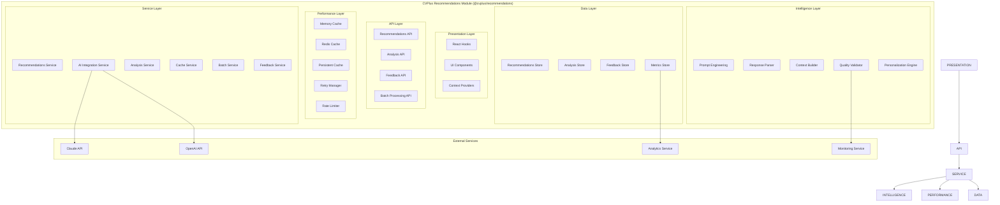
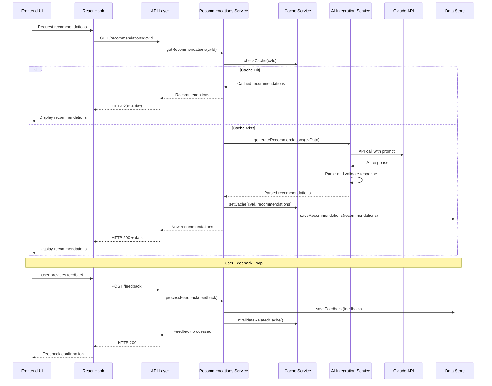
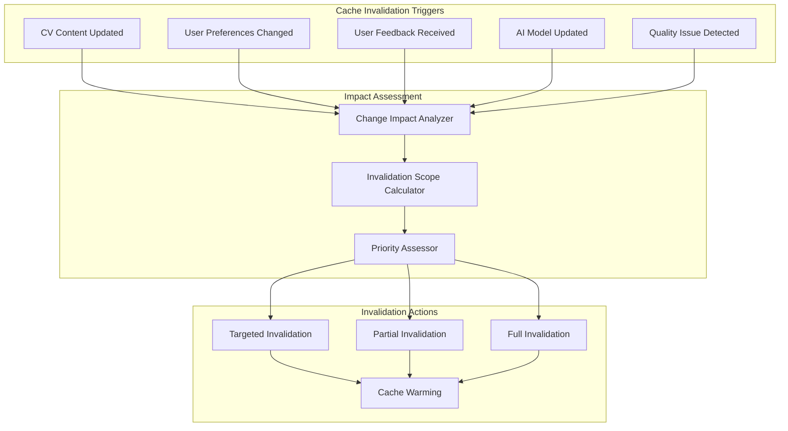
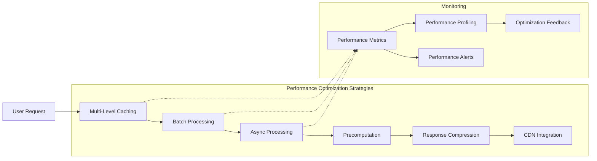
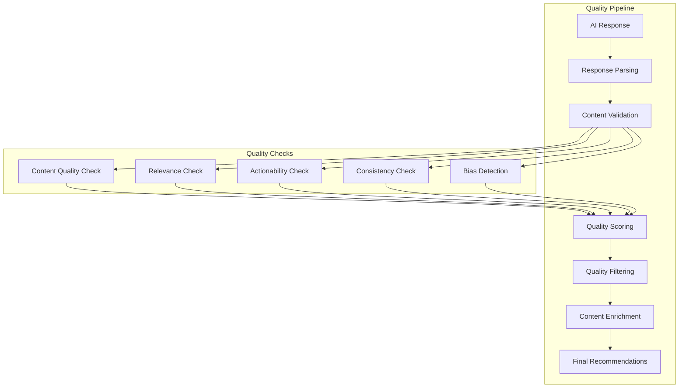
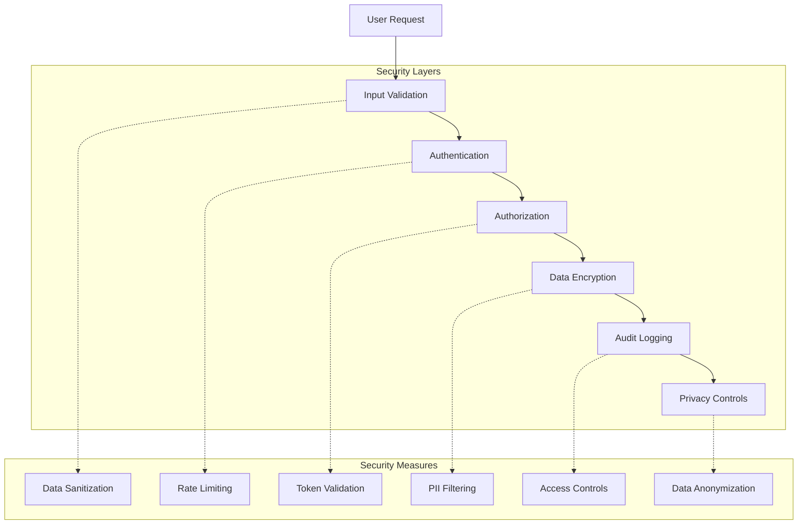
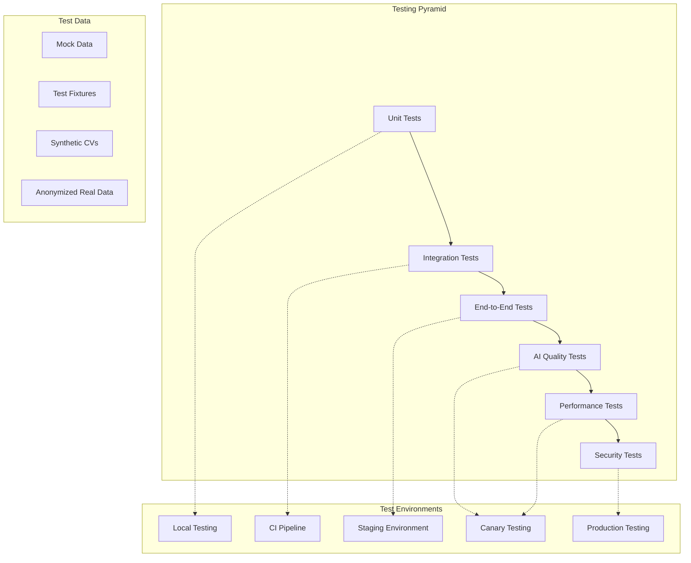

# CVPlus Recommendations Module - Architecture Document

**Author**: Gil Klainert  
**Date**: 2025-08-27  
**Module**: @cvplus/recommendations  
**Version**: 1.0.0

## Architectural Overview

The Recommendations module implements an intelligent, AI-powered architecture that analyzes CVs and provides personalized enhancement suggestions. The architecture emphasizes performance, scalability, and user experience through sophisticated caching, batch processing, and real-time feedback integration.

## System Architecture



## Layer Architecture

### 1. **Presentation Layer**
Frontend integration components for seamless user interaction.

**Components:**
- `React Hooks`: Custom hooks for recommendations state management
- `UI Components`: Reusable components for displaying recommendations
- `Context Providers`: Global state management and data sharing

**Responsibilities:**
- User interface integration
- State management and data flow
- Real-time updates and notifications
- User feedback collection

### 2. **API Layer**
RESTful and real-time APIs for recommendation operations.

**Components:**
- `Recommendations API`: CRUD operations for recommendations
- `Analysis API`: CV analysis and insight generation
- `Feedback API`: User feedback collection and processing
- `Batch Processing API`: Bulk operation endpoints

**Responsibilities:**
- Request validation and sanitization
- Authentication and authorization
- Response formatting and error handling
- Rate limiting and quota management

### 3. **Service Layer**
Core business logic and orchestration services.

**Components:**
- `Recommendations Service`: Core recommendation logic and workflow
- `AI Integration Service`: External AI service integration and management
- `Analysis Service`: CV analysis engine and scoring system
- `Cache Service`: Multi-level caching and invalidation
- `Batch Service`: Bulk processing and job management
- `Feedback Service`: User feedback processing and learning

**Responsibilities:**
- Business logic implementation
- Service orchestration and coordination
- Data transformation and processing
- Integration with external services

### 4. **Intelligence Layer**
AI-powered analysis and recommendation generation.

**Components:**
- `Prompt Engineering`: AI prompt optimization and management
- `Response Parser`: AI response processing and standardization
- `Context Builder`: Analysis context preparation and enrichment
- `Quality Validator`: Recommendation quality assessment
- `Personalization Engine`: User-specific customization and targeting

**Responsibilities:**
- AI prompt generation and optimization
- Response parsing and validation
- Content quality assurance
- Personalization and contextualization

### 5. **Performance Layer**
Caching, optimization, and resilience infrastructure.

**Components:**
- `Memory Cache`: In-process caching for fast access
- `Redis Cache`: Distributed caching for scalability
- `Persistent Cache`: Long-term caching and storage
- `Retry Manager`: Intelligent retry mechanisms
- `Rate Limiter`: API rate limiting and abuse prevention

**Responsibilities:**
- Performance optimization through caching
- Resilience and fault tolerance
- Resource management and optimization
- Scalability and load distribution

### 6. **Data Layer**
Data persistence and retrieval infrastructure.

**Components:**
- `Recommendations Store`: Recommendation data persistence
- `Analysis Store`: Analysis results and history storage
- `Feedback Store`: User feedback and learning data
- `Metrics Store`: Performance and quality metrics

**Responsibilities:**
- Data persistence and retrieval
- Data consistency and integrity
- Query optimization and indexing
- Backup and recovery

## Data Flow Architecture



## Component Integration Architecture

### AI Integration Architecture
```typescript
// AI Service Integration Pattern
class AIIntegrationService {
  private claudeClient: ClaudeAPI;
  private openaiClient: OpenAIAPI;
  private promptEngine: PromptEngine;
  private responseParser: ResponseParser;
  private fallbackStrategy: FallbackStrategy;
  
  async generateRecommendations(
    cvData: CVData,
    context: AnalysisContext
  ): Promise<Recommendation[]> {
    // 1. Build analysis context
    const enrichedContext = await this.contextBuilder.enrichContext(context, cvData);
    
    // 2. Generate optimized prompt
    const prompt = await this.promptEngine.generatePrompt(cvData, enrichedContext);
    
    // 3. Estimate token usage for cost optimization
    const tokenEstimate = await this.estimateTokens(prompt);
    
    try {
      // 4. Primary AI service call (Claude)
      const response = await this.callPrimaryService(prompt, tokenEstimate);
      
      // 5. Parse and validate response
      const recommendations = await this.responseParser.parse(response);
      
      // 6. Quality validation
      const validatedRecommendations = await this.validateQuality(recommendations);
      
      return validatedRecommendations;
      
    } catch (error) {
      // 7. Fallback to secondary service if needed
      return await this.handleFallback(prompt, error);
    }
  }
  
  private async callPrimaryService(prompt: string, tokenEstimate: number): Promise<string> {
    // Rate limiting check
    await this.rateLimiter.checkLimit('claude-api');
    
    // Cost optimization
    if (tokenEstimate > this.maxTokenThreshold) {
      throw new TokenLimitExceededError('Prompt too large for primary service');
    }
    
    // API call with retry logic
    return await this.retryManager.withRetry(
      () => this.claudeClient.generateContent(prompt),
      { maxAttempts: 3, backoffMultiplier: 2 }
    );
  }
  
  private async handleFallback(prompt: string, primaryError: Error): Promise<Recommendation[]> {
    this.logger.warn('Primary AI service failed, attempting fallback', { error: primaryError });
    
    try {
      // Fallback to OpenAI with simplified prompt
      const simplifiedPrompt = this.promptEngine.simplifyPrompt(prompt);
      const fallbackResponse = await this.openaiClient.generateContent(simplifiedPrompt);
      const recommendations = await this.responseParser.parse(fallbackResponse);
      
      // Mark as fallback for quality tracking
      return recommendations.map(rec => ({ ...rec, source: 'fallback' }));
      
    } catch (fallbackError) {
      // Both services failed, return cached or default recommendations
      this.logger.error('Both AI services failed', { 
        primaryError, 
        fallbackError 
      });
      
      return await this.getEmergencyRecommendations();
    }
  }
}
```

### Caching Architecture
```typescript
// Multi-Level Caching Implementation
class CacheService {
  private l1Cache: MemoryCache; // In-process cache
  private l2Cache: RedisCache;  // Distributed cache
  private l3Cache: PersistentStore; // Database cache
  
  async getRecommendations(key: string): Promise<Recommendation[] | null> {
    // L1: Check memory cache (fastest, ~1ms)
    const l1Result = await this.l1Cache.get(key);
    if (l1Result) {
      this.metricsService.recordCacheHit('l1', key);
      return l1Result;
    }
    
    // L2: Check Redis cache (fast, ~5ms)
    const l2Result = await this.l2Cache.get(key);
    if (l2Result) {
      // Populate L1 cache for future requests
      await this.l1Cache.set(key, l2Result, { ttl: 300 }); // 5 minutes
      this.metricsService.recordCacheHit('l2', key);
      return l2Result;
    }
    
    // L3: Check persistent cache (slower, ~50ms)
    const l3Result = await this.l3Cache.get(key);
    if (l3Result) {
      // Populate both upper levels
      await this.l2Cache.set(key, l3Result, { ttl: 1800 }); // 30 minutes
      await this.l1Cache.set(key, l3Result, { ttl: 300 });  // 5 minutes
      this.metricsService.recordCacheHit('l3', key);
      return l3Result;
    }
    
    this.metricsService.recordCacheMiss(key);
    return null;
  }
  
  async setRecommendations(key: string, recommendations: Recommendation[]): Promise<void> {
    // Write to all cache levels with appropriate TTLs
    const operations = [
      this.l1Cache.set(key, recommendations, { ttl: 300 }),    // 5 minutes
      this.l2Cache.set(key, recommendations, { ttl: 1800 }),   // 30 minutes
      this.l3Cache.set(key, recommendations, { ttl: 86400 })   // 24 hours
    ];
    
    await Promise.allSettled(operations);
    
    // Track cache writes
    this.metricsService.recordCacheWrite(key, recommendations.length);
  }
  
  generateCacheKey(cvData: CVData, context: AnalysisContext): string {
    // Generate deterministic cache key based on content and context
    const contentSignature = this.hashService.hashCVContent(cvData);
    const contextSignature = this.hashService.hashContext(context);
    const version = this.getAnalysisVersion();
    
    return `rec:${version}:${contentSignature}:${contextSignature}`;
  }
}
```

### Intelligent Cache Invalidation


### Batch Processing Architecture
```typescript
// Batch Processing Implementation
class BatchService {
  private jobQueue: Queue<BatchJob>;
  private workerPool: WorkerPool;
  
  async processBatch(requests: AnalysisRequest[]): Promise<BatchResult> {
    // 1. Validate batch size and limits
    this.validateBatchSize(requests);
    
    // 2. Group similar requests for efficiency
    const groups = this.groupSimilarRequests(requests);
    
    // 3. Create batch jobs
    const jobs = groups.map(group => this.createBatchJob(group));
    
    // 4. Process jobs with concurrency control
    const results = await this.processConcurrently(jobs, { 
      concurrency: this.calculateOptimalConcurrency(jobs.length) 
    });
    
    // 5. Aggregate and return results
    return this.aggregateResults(results);
  }
  
  private groupSimilarRequests(requests: AnalysisRequest[]): RequestGroup[] {
    // Group by similarity factors for optimization
    const groups = new Map<string, AnalysisRequest[]>();
    
    for (const request of requests) {
      const similarity = this.calculateSimilarityKey(request);
      
      if (!groups.has(similarity)) {
        groups.set(similarity, []);
      }
      
      groups.get(similarity)!.push(request);
    }
    
    // Optimize group sizes
    return this.optimizeGroups(Array.from(groups.values()));
  }
  
  private calculateSimilarityKey(request: AnalysisRequest): string {
    // Create key based on factors that affect AI processing efficiency
    const factors = [
      request.targetIndustry || 'general',
      request.targetRole || 'general',
      request.analysisType || 'standard',
      request.careerLevel || 'mid',
      Math.floor(request.cvLength / 1000) // Group by CV length ranges
    ];
    
    return factors.join('-');
  }
}
```

## Performance Architecture

### Response Time Optimization


### Performance Monitoring Implementation
```typescript
class PerformanceMonitor {
  private metricsCollector: MetricsCollector;
  private alertManager: AlertManager;
  
  async measureOperation<T>(
    operationName: string,
    operation: () => Promise<T>,
    context?: PerformanceContext
  ): Promise<T> {
    const startTime = performance.now();
    const startMemory = process.memoryUsage();
    
    try {
      const result = await operation();
      
      // Record success metrics
      const endTime = performance.now();
      const endMemory = process.memoryUsage();
      
      const metrics = {
        operationName,
        duration: endTime - startTime,
        memoryDelta: endMemory.heapUsed - startMemory.heapUsed,
        status: 'success',
        timestamp: new Date(),
        context
      };
      
      await this.recordMetrics(metrics);
      
      // Check for performance issues
      await this.checkPerformanceThresholds(metrics);
      
      return result;
      
    } catch (error) {
      // Record error metrics
      const errorMetrics = {
        operationName,
        duration: performance.now() - startTime,
        status: 'error',
        error: error.message,
        timestamp: new Date(),
        context
      };
      
      await this.recordMetrics(errorMetrics);
      throw error;
    }
  }
  
  private async checkPerformanceThresholds(metrics: PerformanceMetrics): Promise<void> {
    const thresholds = await this.getPerformanceThresholds(metrics.operationName);
    
    if (metrics.duration > thresholds.duration) {
      await this.alertManager.sendAlert({
        type: 'performance',
        severity: 'warning',
        message: `Operation ${metrics.operationName} exceeded duration threshold`,
        details: { actual: metrics.duration, threshold: thresholds.duration }
      });
    }
    
    if (metrics.memoryDelta > thresholds.memory) {
      await this.alertManager.sendAlert({
        type: 'memory',
        severity: 'warning',
        message: `Operation ${metrics.operationName} exceeded memory threshold`,
        details: { actual: metrics.memoryDelta, threshold: thresholds.memory }
      });
    }
  }
}
```

## Quality Assurance Architecture

### Recommendation Quality Pipeline


### Quality Validation Implementation
```typescript
class QualityValidator {
  private contentValidator: ContentValidator;
  private relevanceValidator: RelevanceValidator;
  private biasDetector: BiasDetector;
  
  async validateRecommendations(
    recommendations: ParsedRecommendation[],
    context: ValidationContext
  ): Promise<ValidationResult> {
    
    const validationResults = await Promise.all([
      this.validateContent(recommendations),
      this.validateRelevance(recommendations, context),
      this.validateActionability(recommendations),
      this.validateConsistency(recommendations),
      this.detectBias(recommendations, context)
    ]);
    
    // Calculate overall quality score
    const qualityScore = this.calculateQualityScore(validationResults);
    
    // Filter recommendations based on quality thresholds
    const filteredRecommendations = this.filterByQuality(
      recommendations, 
      validationResults, 
      qualityScore
    );
    
    return {
      originalCount: recommendations.length,
      validCount: filteredRecommendations.length,
      qualityScore,
      recommendations: filteredRecommendations,
      issues: validationResults.flatMap(r => r.issues),
      metrics: this.calculateValidationMetrics(validationResults)
    };
  }
  
  private async validateContent(recommendations: ParsedRecommendation[]): Promise<ContentValidationResult> {
    const issues: ValidationIssue[] = [];
    const scores: number[] = [];
    
    for (const rec of recommendations) {
      let score = 1.0;
      
      // Title quality check
      if (!rec.title || rec.title.length < 10) {
        issues.push({
          type: 'content',
          severity: 'high',
          message: `Recommendation ${rec.id} has insufficient title`,
          impact: 0.3
        });
        score -= 0.3;
      }
      
      // Description quality check
      if (!rec.description || rec.description.length < 20) {
        issues.push({
          type: 'content',
          severity: 'medium',
          message: `Recommendation ${rec.id} has insufficient description`,
          impact: 0.2
        });
        score -= 0.2;
      }
      
      // Reasoning quality check
      if (!rec.reasoning || rec.reasoning.length < 30) {
        issues.push({
          type: 'content',
          severity: 'medium',
          message: `Recommendation ${rec.id} lacks detailed reasoning`,
          impact: 0.2
        });
        score -= 0.2;
      }
      
      // Examples quality check
      if (!rec.before || !rec.after) {
        issues.push({
          type: 'content',
          severity: 'low',
          message: `Recommendation ${rec.id} missing before/after examples`,
          impact: 0.1
        });
        score -= 0.1;
      }
      
      scores.push(Math.max(0, score));
    }
    
    return {
      issues,
      averageScore: scores.reduce((a, b) => a + b, 0) / scores.length,
      individualScores: scores
    };
  }
  
  private async validateRelevance(
    recommendations: ParsedRecommendation[],
    context: ValidationContext
  ): Promise<RelevanceValidationResult> {
    
    const relevanceScores = await Promise.all(
      recommendations.map(rec => this.calculateRelevanceScore(rec, context))
    );
    
    const issues = recommendations
      .map((rec, index) => ({ rec, score: relevanceScores[index] }))
      .filter(({ score }) => score < 0.6)
      .map(({ rec, score }) => ({
        type: 'relevance' as const,
        severity: score < 0.3 ? 'high' as const : 'medium' as const,
        message: `Recommendation ${rec.id} has low relevance score: ${score}`,
        impact: 1 - score
      }));
    
    return {
      issues,
      averageScore: relevanceScores.reduce((a, b) => a + b, 0) / relevanceScores.length,
      individualScores: relevanceScores
    };
  }
  
  private async calculateRelevanceScore(
    recommendation: ParsedRecommendation,
    context: ValidationContext
  ): Promise<number> {
    let score = 1.0;
    
    // Industry relevance
    if (context.targetIndustry) {
      const industryRelevance = await this.checkIndustryRelevance(
        recommendation, 
        context.targetIndustry
      );
      score *= (0.7 + 0.3 * industryRelevance);
    }
    
    // Role relevance
    if (context.targetRole) {
      const roleRelevance = await this.checkRoleRelevance(
        recommendation, 
        context.targetRole
      );
      score *= (0.7 + 0.3 * roleRelevance);
    }
    
    // Career level relevance
    if (context.careerLevel) {
      const levelRelevance = await this.checkCareerLevelRelevance(
        recommendation, 
        context.careerLevel
      );
      score *= (0.8 + 0.2 * levelRelevance);
    }
    
    return Math.max(0, Math.min(1, score));
  }
}
```

## Security Architecture

### Data Security and Privacy


### Security Implementation
```typescript
class SecurityService {
  private piiDetector: PIIDetector;
  private dataAnonymizer: DataAnonymizer;
  private auditLogger: AuditLogger;
  
  async secureCVData(cvData: CVData, userId: string): Promise<SecureCVData> {
    // 1. Detect and flag PII
    const piiDetection = await this.piiDetector.detectPII(cvData);
    
    // 2. Create anonymized version for AI processing
    const anonymizedData = await this.dataAnonymizer.anonymize(cvData, piiDetection);
    
    // 3. Log data access for compliance
    await this.auditLogger.logDataAccess({
      userId,
      dataType: 'cv-analysis',
      operation: 'anonymize',
      piiCount: piiDetection.detectedPII.length,
      timestamp: new Date()
    });
    
    return {
      original: cvData,
      anonymized: anonymizedData,
      piiDetection,
      securityContext: {
        userId,
        anonymizationLevel: this.calculateAnonymizationLevel(piiDetection),
        retentionPolicy: await this.getRetentionPolicy(userId),
        accessControls: await this.getAccessControls(userId)
      }
    };
  }
  
  async validateApiAccess(userId: string, operation: string): Promise<AccessValidation> {
    // Check user permissions
    const permissions = await this.getUserPermissions(userId);
    
    // Check rate limits
    const rateLimitStatus = await this.checkRateLimit(userId, operation);
    
    // Check premium features
    const premiumStatus = await this.checkPremiumAccess(userId, operation);
    
    // Validate access
    const hasAccess = (
      permissions.includes(operation) &&
      !rateLimitStatus.exceeded &&
      (premiumStatus.required ? premiumStatus.hasAccess : true)
    );
    
    return {
      hasAccess,
      permissions,
      rateLimitStatus,
      premiumStatus,
      restrictions: this.calculateRestrictions(permissions, rateLimitStatus, premiumStatus)
    };
  }
}
```

## Testing Architecture

### Comprehensive Testing Strategy


### AI Quality Testing Implementation
```typescript
class AIQualityTester {
  private testDataSets: TestDataSet[];
  private qualityMetrics: QualityMetricsCalculator;
  
  async runQualityTests(): Promise<QualityTestResults> {
    const results = await Promise.all([
      this.testRecommendationQuality(),
      this.testResponseConsistency(),
      this.testBiasDetection(),
      this.testRelevanceAccuracy(),
      this.testPersonalizationEffectiveness()
    ]);
    
    return {
      overallScore: this.calculateOverallScore(results),
      individualResults: results,
      recommendations: this.generateQualityRecommendations(results),
      timestamp: new Date()
    };
  }
  
  private async testRecommendationQuality(): Promise<QualityTestResult> {
    const testCases = await this.getQualityTestCases();
    const results: TestCaseResult[] = [];
    
    for (const testCase of testCases) {
      const recommendations = await this.generateRecommendations(testCase.cvData, testCase.context);
      
      const qualityScore = await this.qualityMetrics.calculateQuality(
        recommendations,
        testCase.expectedQualities
      );
      
      results.push({
        testCaseId: testCase.id,
        qualityScore,
        recommendations,
        expectedQualities: testCase.expectedQualities,
        passed: qualityScore >= testCase.minimumScore
      });
    }
    
    return {
      testName: 'recommendation-quality',
      passRate: results.filter(r => r.passed).length / results.length,
      averageScore: results.reduce((sum, r) => sum + r.qualityScore, 0) / results.length,
      results
    };
  }
  
  private async testBiasDetection(): Promise<BiasTestResult> {
    const biasTestCases = await this.getBiasTestCases();
    const biasDetectionResults: BiasDetectionResult[] = [];
    
    for (const testCase of biasTestCases) {
      const recommendations = await this.generateRecommendations(testCase.cvData, testCase.context);
      
      const biasAnalysis = await this.biasDetector.analyzeBias(
        recommendations,
        testCase.biasCategories
      );
      
      biasDetectionResults.push({
        testCaseId: testCase.id,
        biasCategories: testCase.biasCategories,
        detectedBias: biasAnalysis.detectedBias,
        biasScore: biasAnalysis.overallBiasScore,
        passed: biasAnalysis.overallBiasScore < testCase.maxBiasThreshold
      });
    }
    
    return {
      testName: 'bias-detection',
      passRate: biasDetectionResults.filter(r => r.passed).length / biasDetectionResults.length,
      averageBiasScore: biasDetectionResults.reduce((sum, r) => sum + r.biasScore, 0) / biasDetectionResults.length,
      results: biasDetectionResults
    };
  }
}
```

## Deployment Architecture

### Multi-Stage Deployment Pipeline

```mermaid
graph LR
    subgraph "Development"
        DEV_BUILD[Build & Test]
        DEV_QUALITY[Quality Checks]
        DEV_AI[AI Model Validation]
    end
    
    subgraph "Staging"
        STAGE_DEPLOY[Deploy to Staging]
        STAGE_AI_TEST[AI Quality Testing]
        STAGE_PERF[Performance Testing]
        STAGE_SEC[Security Testing]
    end
    
    subgraph "Production"
        CANARY[Canary Deployment]
        MONITOR[Health Monitoring]
        ROLLOUT[Full Rollout]
        ROLLBACK[Rollback Ready]
    end
    
    DEV_BUILD --> DEV_QUALITY
    DEV_QUALITY --> DEV_AI
    DEV_AI --> STAGE_DEPLOY
    
    STAGE_DEPLOY --> STAGE_AI_TEST
    STAGE_AI_TEST --> STAGE_PERF
    STAGE_PERF --> STAGE_SEC
    
    STAGE_SEC --> CANARY
    CANARY --> MONITOR
    MONITOR --> ROLLOUT
    ROLLOUT --> ROLLBACK
```


## Related Documentation

- [Design Document](./design.md)
- [Implementation Plan](./implementation-plan.md)
- [API Reference](./api-reference.md)
- [AI Integration Guide](./ai-integration-guide.md)
- [Performance Optimization Guide](./performance-guide.md)
- [Testing Guide](./testing-guide.md)