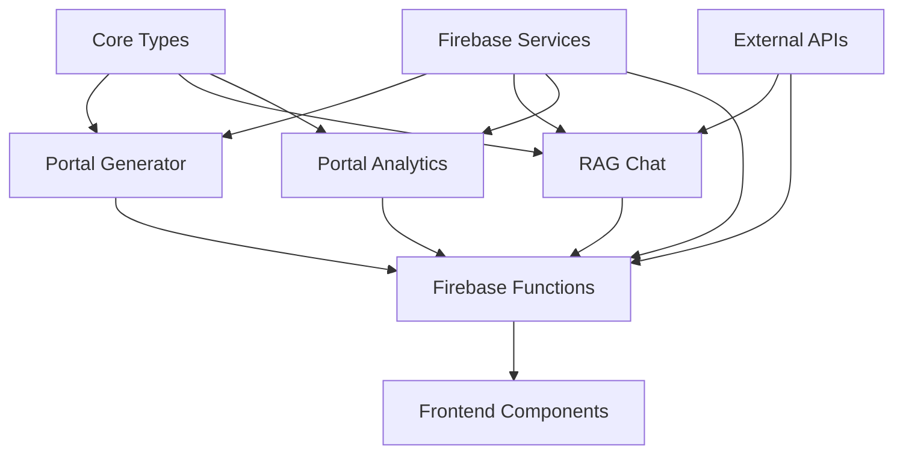

# CVPlus One Click Portal - Module Structure

**Author**: Gil Klainert
**Created**: 2025-09-13
**Task**: T001 - Create One Click Portal module structure in existing CVPlus monorepo

## Overview

This document describes the module structure created for the CVPlus One Click Portal feature as part of the implementation of T001. The structure supports the planned components from the One Click Portal implementation tasks (T001-T056) while adhering to CVPlus architectural principles.

## Module Architecture

The One Click Portal functionality is organized across three new packages within the existing CVPlus monorepo, plus integration points in existing systems:

### New Packages

#### 1. `@cvplus/portal-generator` (`packages/portal-generator/`)
**Purpose**: Automated portal generation and deployment service

```
packages/portal-generator/
├── package.json                      # Package configuration
├── tsconfig.json                     # TypeScript configuration
├── src/
│   ├── index.ts                      # Main export file
│   ├── portal-generator.ts           # Core service (T029)
│   ├── types/
│   │   ├── index.ts                  # Type exports
│   │   ├── portal-generation.ts      # Generation types
│   │   ├── deployment.ts             # Deployment types
│   │   └── configuration.ts          # Config types
│   ├── cli/
│   │   ├── index.ts                  # CLI exports
│   │   └── portal-cli.ts             # CLI commands (T052)
│   └── tests/
│       └── portal-generator.test.ts  # Unit tests (T046)
```

**Key Dependencies**:
- `@cvplus/core` - Core types and utilities
- `firebase-admin` - Firebase integration
- `nanoid` - ID generation

#### 2. `@cvplus/rag-chat` (`packages/rag-chat/`)
**Purpose**: AI-powered conversational interface using Retrieval Augmented Generation

```
packages/rag-chat/
├── package.json                      # Package configuration
├── tsconfig.json                     # TypeScript configuration
├── src/
│   ├── index.ts                      # Main export file
│   ├── rag-chat-engine.ts            # Core engine (T030)
│   ├── embedding-service.ts          # Vector embeddings (T037)
│   ├── vector-store.ts               # Pinecone integration (T038)
│   ├── document-retrieval.ts         # RAG retrieval (T039)
│   ├── claude-integration.ts         # Anthropic Claude (T040)
│   ├── types/
│   │   ├── index.ts                  # Type exports
│   │   ├── chat-session.ts           # Chat types
│   │   ├── rag-embedding.ts          # Embedding types
│   │   ├── vector-store.ts           # Vector store types
│   │   └── claude-integration.ts     # Claude types
│   ├── cli/
│   │   ├── index.ts                  # CLI exports
│   │   └── chat-cli.ts               # CLI commands (T053)
│   └── tests/
│       └── rag-chat-engine.test.ts   # Unit tests (T047)
```

**Key Dependencies**:
- `@cvplus/core` - Core types and utilities
- `@anthropic-ai/sdk` - Anthropic Claude API
- `openai` - OpenAI embeddings
- `@pinecone-database/pinecone` - Vector database
- `firebase-admin` - Firebase integration

#### 3. `@cvplus/portal-analytics` (`packages/portal-analytics/`)
**Purpose**: Comprehensive tracking and analytics for portal interactions

```
packages/portal-analytics/
├── package.json                      # Package configuration
├── tsconfig.json                     # TypeScript configuration
├── src/
│   ├── index.ts                      # Main export file
│   ├── analytics-tracker.ts          # Core tracker (T031)
│   ├── types/
│   │   ├── index.ts                  # Type exports
│   │   ├── analytics-data.ts         # Analytics types
│   │   ├── metrics.ts                # Metrics types
│   │   └── tracking.ts               # Tracking types
│   ├── cli/
│   │   ├── index.ts                  # CLI exports
│   │   └── analytics-cli.ts          # CLI commands (T054)
│   └── tests/
│       └── analytics-tracker.test.ts # Unit tests (T048)
```

**Key Dependencies**:
- `@cvplus/core` - Core types and utilities
- `firebase-admin` - Firebase integration

### Integration Points

#### Firebase Functions (`functions/src/portal/`)
**Purpose**: API endpoints for One Click Portal functionality

```
functions/src/portal/
├── index.ts                          # Export file
├── generatePortal.ts                 # POST /portal/generate (T032)
├── getPortalStatus.ts                # GET /portal/{portalId}/status (T033)
├── startChatSession.ts               # POST /portal/{portalId}/chat/start (T034)
├── sendChatMessage.ts                # POST /portal/{portalId}/chat/{sessionId}/message (T035)
└── getPortalAnalytics.ts             # GET /portal/{portalId}/analytics (T036)
```

#### Frontend Components (`frontend/src/components/features/Portal/`)
**Purpose**: React components for portal UI

```
frontend/src/components/features/Portal/
├── index.ts                          # Component exports
├── OneClickPortalGenerator.tsx       # Portal generation UI (T042)
└── PortalAnalyticsDashboard.tsx      # Analytics dashboard (T043)
```

#### Core Types (`packages/core/src/types/`)
**Purpose**: Shared data models (T023-T028)

- `portal-configuration.ts` - Portal configuration model
- `chat-session.ts` - Chat session model
- `rag-embedding.ts` - RAG embedding model
- `portal-analytics.ts` - Analytics model
- `deployment-status.ts` - Deployment status model
- `user-subscription.ts` - Subscription model

#### Test Structure
**Purpose**: Comprehensive testing infrastructure

```
functions/src/tests/
├── contract/                         # API contract tests (T011-T015)
├── integration/                      # User scenario tests (T016-T022)
└── performance/                      # Performance validation (T049)

frontend/src/tests/integration/       # Frontend integration tests (T044-T045)

packages/*/src/tests/                 # Package-specific unit tests (T046-T048)
```

## Module Relationships

### Dependencies Flow


### Package Interdependencies
- All packages depend on `@cvplus/core` for shared types
- Firebase Functions integrate all three packages
- Frontend components consume Firebase Functions APIs
- RAG Chat integrates external AI services (OpenAI, Anthropic, Pinecone)

## Implementation Phases

### Phase 3.1: Setup & Environment (T001-T010)
- ✅ **T001**: Module structure created
- ⏳ T002-T004: Initialize individual packages with TypeScript
- ⏳ T005-T010: Configure dependencies and development environment

### Phase 3.2: Tests First - TDD (T011-T022)
All tests must be written and failing before implementation begins.

### Phase 3.3: Core Implementation (T023-T036)
Data models, core services, and API endpoints.

### Phase 3.4: Integration & External Services (T037-T041)
Vector database, AI integrations, and middleware.

### Phase 3.5: Frontend Components (T042-T045)
React UI components and integration tests.

### Phase 3.6: Polish & Performance (T046-T056)
Unit tests, performance validation, and documentation.

## Key Features Supported

### Portal Generation
- Automated CV-to-portal conversion
- Multiple deployment targets (Firebase Hosting, HuggingFace Spaces)
- Custom theming and branding
- Real-time generation status tracking

### RAG-Powered Chat
- Vector-based document retrieval
- Anthropic Claude integration for responses
- Session management and persistence
- Context-aware conversations

### Comprehensive Analytics
- User interaction tracking
- Performance metrics
- Engagement analytics
- Real-time dashboards

### Premium Integration
- Subscription validation middleware
- Feature gating based on user tier
- Usage tracking and limits

## Architecture Principles

### Modularity
Each package has a single, well-defined responsibility and clear interfaces.

### Type Safety
Comprehensive TypeScript coverage with strict configuration.

### Testing
Test-Driven Development with contract tests, integration tests, and unit tests.

### Performance
- Portal generation <60 seconds
- Chat responses <3 seconds
- Support for 100+ concurrent sessions

### Scalability
Firebase-native architecture with auto-scaling capabilities.

## Development Guidelines

### Package Development
1. Each package must remain under 200 lines per file
2. Comprehensive TypeScript types and interfaces
3. Unit tests with >90% coverage
4. CLI utilities for development and debugging

### Integration Testing
1. Contract tests for all API endpoints
2. Integration tests for complete user scenarios
3. Performance validation for all critical paths

### Deployment
1. Independent package versioning
2. Firebase Functions deployment with batching
3. Frontend component lazy loading
4. Comprehensive error handling and recovery

## Status

**Current Status**: T001 Complete - Module structure created
**Next Tasks**: T002-T004 - Initialize package TypeScript configurations
**Implementation Start**: Phase 3.2 (Tests First - TDD)
**Expected Completion**: Phase 3.6 (56 total tasks across 6 phases)

---

This module structure provides a solid foundation for implementing the complete One Click Portal feature while maintaining CVPlus architectural standards and supporting future scalability requirements.