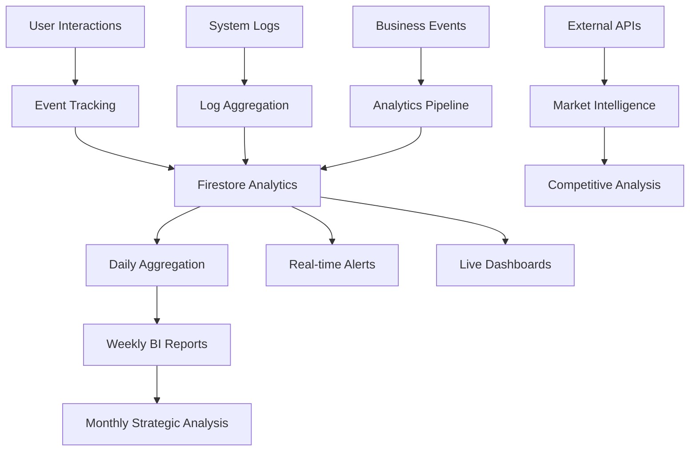

# Phase 5: Success Metrics & Monitoring Plan - External Data Premium Gating

**Author:** Gil Klainert  
**Date:** 2025-08-25  
**Version:** 1.0  
**Status:** Ready for Implementation

## Overview

This document establishes comprehensive success metrics, monitoring strategies, and business intelligence frameworks for the External Data Sources premium gating system deployment. The monitoring plan ensures we track technical excellence, business objectives, and user satisfaction throughout the rollout and beyond.

## Executive Success Criteria

### Primary Success Indicators
1. **Technical Excellence**: 99.9% system uptime with <2.5s response times
2. **Business Growth**: >20% premium conversion rate from external data previews  
3. **Revenue Protection**: Zero unauthorized access to premium features
4. **User Satisfaction**: >4.0/5.0 user experience rating
5. **Support Excellence**: <24hr average resolution time for premium gating issues

### Strategic Objectives
- **Revenue Growth**: Measurable increase in premium subscription revenue
- **Feature Adoption**: >60% of users engage with external data previews  
- **User Retention**: No increase in churn rate due to premium gating
- **Market Position**: Enhanced competitive advantage through data-driven insights

## Technical Metrics Framework

### System Performance KPIs

#### Response Time Metrics
| Metric | Target | Warning | Critical | Monitoring Frequency |
|--------|--------|---------|----------|---------------------|
| External Data Enrichment P95 | <2.5s | >3.0s | >5.0s | Every 5 minutes |
| Premium Validation Overhead | <100ms | >150ms | >300ms | Every 5 minutes |
| Database Query Performance | <200ms | >500ms | >1000ms | Every 2 minutes |
| API Gateway Response Time | <50ms | >100ms | >200ms | Every 1 minute |

**Monitoring Implementation:**
```yaml
# Cloud Monitoring Alert Policy - Response Time
displayName: "External Data - Response Time Alert"
conditions:
  - displayName: "High Response Time"
    conditionThreshold:
      filter: 'resource.type="cloud_function" AND resource.labels.function_name="enrichCVWithExternalData"'
      comparison: COMPARISON_GT
      thresholdValue: 3000  # 3 seconds in milliseconds
      duration: 300s  # 5 minutes
notificationChannels:
  - "projects/cvplus/notificationChannels/performance-alerts"
```

#### System Reliability Metrics
| Metric | Target | Warning | Critical | Monitoring Frequency |
|--------|--------|---------|----------|---------------------|
| Function Success Rate | >99% | <98% | <95% | Every 2 minutes |
| Error Rate | <1% | >2% | >5% | Every 1 minute |
| Cold Start Frequency | <5% | >10% | >20% | Every 15 minutes |
| Firestore Write Success | >99.5% | <99% | <95% | Every 5 minutes |

**Automated Monitoring Script:**
```bash
#!/bin/bash
# technical-metrics-monitor.sh
# Monitors technical metrics and alerts on thresholds

METRICS_LOG="/var/log/external-data-metrics.log"
ALERT_WEBHOOK="https://hooks.slack.com/services/YOUR/WEBHOOK/URL"

check_function_performance() {
    echo "$(date): Checking function performance..." >> $METRICS_LOG
    
    # Get function metrics from Cloud Monitoring
    ERROR_RATE=$(gcloud logging read \
        "resource.type=cloud_function AND resource.labels.function_name=enrichCVWithExternalData AND severity=ERROR" \
        --since="5m" --format="value(timestamp)" | wc -l)
    
    TOTAL_REQUESTS=$(gcloud logging read \
        "resource.type=cloud_function AND resource.labels.function_name=enrichCVWithExternalData" \
        --since="5m" --format="value(timestamp)" | wc -l)
    
    if [ $TOTAL_REQUESTS -gt 0 ]; then
        ERROR_PERCENTAGE=$((ERROR_RATE * 100 / TOTAL_REQUESTS))
        echo "$(date): Error rate: $ERROR_PERCENTAGE%" >> $METRICS_LOG
        
        if [ $ERROR_PERCENTAGE -gt 2 ]; then
            send_alert "HIGH ERROR RATE: $ERROR_PERCENTAGE% errors in external data function"
        fi
    fi
}

check_response_times() {
    echo "$(date): Checking response times..." >> $METRICS_LOG
    
    # Query response time metrics (example with hypothetical monitoring setup)
    AVG_RESPONSE=$(gcloud monitoring metrics list --filter="metric.type=cloudfunctions.googleapis.com/function/execution_time" \
        --format="value(points[0].value.doubleValue)" | head -1)
    
    if [ $(echo "$AVG_RESPONSE > 3.0" | bc -l) -eq 1 ]; then
        send_alert "HIGH RESPONSE TIME: Average response time is ${AVG_RESPONSE}s"
    fi
}

send_alert() {
    local MESSAGE=$1
    echo "$(date): ALERT - $MESSAGE" >> $METRICS_LOG
    
    # Send Slack notification
    curl -X POST -H 'Content-type: application/json' \
        --data "{\"text\":\"🚨 External Data Alert: $MESSAGE\"}" \
        $ALERT_WEBHOOK
}

# Run checks every 5 minutes
while true; do
    check_function_performance
    check_response_times
    sleep 300
done
```

### Security Metrics

#### Security Monitoring KPIs
| Metric | Target | Warning | Critical | Monitoring Frequency |
|--------|--------|---------|----------|---------------------|
| Unauthorized Access Attempts | <10/day | >50/day | >100/day | Every 15 minutes |
| Premium Bypass Attempts | 0 | >1/day | >5/day | Every 5 minutes |
| Rate Limit Violations | <20/day | >100/day | >500/day | Every 10 minutes |
| Suspicious Activity Patterns | 0 | >3/day | >10/day | Every 30 minutes |

**Security Monitoring Dashboard:**
```javascript
// Firebase Function for security metrics aggregation
export const generateSecurityMetrics = onSchedule("every 15 minutes", async () => {
    const now = new Date();
    const fifteenMinutesAgo = new Date(now.getTime() - 15 * 60 * 1000);
    
    // Query security audit logs
    const securityEvents = await admin.firestore()
        .collection('external_data_security_audit')
        .where('timestamp', '>=', fifteenMinutesAgo)
        .get();
    
    const metrics = {
        unauthorizedAttempts: 0,
        rateLimitViolations: 0,
        premiumBypassAttempts: 0,
        suspiciousPatterns: 0,
        timestamp: now
    };
    
    securityEvents.docs.forEach(doc => {
        const event = doc.data();
        switch (event.action) {
            case 'unauthorized_access':
                metrics.unauthorizedAttempts++;
                break;
            case 'rate_limit_exceeded':
                metrics.rateLimitViolations++;
                break;
            case 'premium_bypass_attempt':
                metrics.premiumBypassAttempts++;
                break;
        }
    });
    
    // Store aggregated metrics
    await admin.firestore()
        .collection('security_metrics')
        .doc('latest')
        .set(metrics);
    
    // Check alert thresholds
    if (metrics.unauthorizedAttempts > 10) {
        await sendSecurityAlert('High unauthorized access attempts', metrics);
    }
    
    if (metrics.premiumBypassAttempts > 0) {
        await sendSecurityAlert('Premium bypass attempts detected', metrics);
    }
});
```

## Business Metrics Framework

### Revenue Impact KPIs

#### Premium Conversion Metrics
| Metric | Target | Current Baseline | Monitoring Period | Data Source |
|--------|--------|-----------------|--------------------|-------------|
| External Data Preview → Premium | >20% | TBD | Daily | Conversion tracking |
| Revenue per External Data User | +15% vs baseline | TBD | Weekly | Revenue analytics |
| Premium Subscription Growth Rate | +25% MoM | TBD | Monthly | Subscription data |
| Customer Lifetime Value (CLV) | +20% for external data users | TBD | Monthly | Revenue analytics |

**Conversion Tracking Implementation:**
```typescript
// Conversion event tracking system
interface ConversionEvent {
  userId: string;
  eventType: 'preview_viewed' | 'premium_gate_shown' | 'upgrade_clicked' | 'subscription_completed';
  timestamp: Date;
  source: 'external_data_preview' | 'premium_gate_modal' | 'upgrade_button';
  metadata: {
    previewDuration?: number;
    premiumFeatureInteracted?: string;
    conversionPath?: string[];
  };
}

export const trackConversionEvent = onCall<ConversionEvent>(async (request) => {
  const { userId, eventType, source, metadata } = request.data;
  
  // Record individual event
  await admin.firestore()
    .collection('external_data_conversions')
    .doc(userId)
    .collection('events')
    .add({
      eventType,
      source,
      metadata,
      timestamp: new Date()
    });
  
  // Update conversion funnel analytics
  await updateConversionFunnel(userId, eventType);
  
  // Calculate real-time conversion rate
  if (eventType === 'subscription_completed') {
    await calculateConversionRate(userId, source);
  }
});

async function calculateConversionRate(userId: string, source: string) {
  // Get all users who viewed preview in last 30 days
  const previewUsers = await admin.firestore()
    .collection('external_data_conversions')
    .where('events.eventType', '==', 'preview_viewed')
    .where('events.timestamp', '>=', new Date(Date.now() - 30 * 24 * 60 * 60 * 1000))
    .get();
  
  // Get all users who converted in last 30 days
  const convertedUsers = await admin.firestore()
    .collection('external_data_conversions')
    .where('events.eventType', '==', 'subscription_completed')
    .where('events.source', '==', source)
    .where('events.timestamp', '>=', new Date(Date.now() - 30 * 24 * 60 * 60 * 1000))
    .get();
  
  const conversionRate = (convertedUsers.size / previewUsers.size) * 100;
  
  // Store conversion rate metric
  await admin.firestore()
    .collection('business_metrics')
    .doc('conversion_rates')
    .update({
      [`external_data_${source}`]: {
        rate: conversionRate,
        previewUsers: previewUsers.size,
        convertedUsers: convertedUsers.size,
        lastUpdated: new Date()
      }
    });
  
  return conversionRate;
}
```

#### User Engagement Metrics
| Metric | Target | Monitoring Frequency | Success Threshold |
|--------|--------|--------------------|------------------|
| External Data Preview Engagement Rate | >60% of free users | Daily | 60% within 2 weeks |
| Time to Premium Conversion | <7 days average | Daily | <7 days median |
| Feature Utilization Rate | >40% monthly active premium users | Weekly | 40% by end of month 1 |
| User Satisfaction Score | >4.0/5.0 | Weekly via surveys | 4.0+ maintained |

### Customer Success Metrics

#### Support and Experience KPIs
| Metric | Target | Warning | Critical | Response Action |
|--------|--------|---------|----------|-----------------|
| Support Ticket Volume | <5% increase | >20% increase | >50% increase | Escalate to product team |
| Average Resolution Time | <24 hours | >48 hours | >72 hours | Add support resources |
| Customer Satisfaction (CSAT) | >4.5/5.0 | <4.0/5.0 | <3.5/5.0 | Review user experience |
| Escalation Rate | <10% | >15% | >25% | Enhanced support training |

**Support Metrics Tracking:**
```javascript
// Support metrics aggregation
export const aggregateSupportMetrics = onSchedule("every 1 hours", async () => {
  const now = new Date();
  const oneDayAgo = new Date(now.getTime() - 24 * 60 * 60 * 1000);
  
  // Query support tickets related to external data
  const tickets = await admin.firestore()
    .collection('support_tickets')
    .where('category', '==', 'external_data')
    .where('created', '>=', oneDayAgo)
    .get();
  
  const metrics = {
    totalTickets: tickets.size,
    avgResolutionTime: 0,
    satisfactionScore: 0,
    escalationRate: 0,
    timestamp: now
  };
  
  let totalResolutionTime = 0;
  let totalSatisfactionScore = 0;
  let escalatedCount = 0;
  let resolvedCount = 0;
  
  tickets.docs.forEach(doc => {
    const ticket = doc.data();
    
    if (ticket.status === 'resolved') {
      resolvedCount++;
      totalResolutionTime += ticket.resolutionTime || 0;
      totalSatisfactionScore += ticket.satisfactionScore || 0;
    }
    
    if (ticket.escalated) {
      escalatedCount++;
    }
  });
  
  if (resolvedCount > 0) {
    metrics.avgResolutionTime = totalResolutionTime / resolvedCount;
    metrics.satisfactionScore = totalSatisfactionScore / resolvedCount;
  }
  
  metrics.escalationRate = (escalatedCount / tickets.size) * 100;
  
  // Store metrics
  await admin.firestore()
    .collection('support_metrics')
    .doc('daily')
    .collection('data')
    .doc(now.toISOString().split('T')[0])
    .set(metrics);
  
  // Check alert thresholds
  if (metrics.avgResolutionTime > 48) {
    await sendSupportAlert('High resolution time', metrics);
  }
  
  if (metrics.satisfactionScore < 4.0) {
    await sendSupportAlert('Low satisfaction score', metrics);
  }
});
```

## User Experience Monitoring

### User Journey Analytics

#### Key User Flows to Monitor
1. **Free User Premium Discovery Flow**
   - Landing on external data section → Preview interaction → Premium gate encounter → Upgrade decision
   
2. **Premium User Onboarding Flow**  
   - First external data access → Feature discovery → Regular usage adoption

3. **Support Journey Flow**
   - Issue encounter → Support contact → Resolution → Satisfaction rating

**User Flow Tracking Implementation:**
```typescript
interface UserFlowEvent {
  userId: string;
  sessionId: string;
  flowType: 'premium_discovery' | 'premium_onboarding' | 'support_journey';
  step: string;
  timestamp: Date;
  metadata: any;
}

export const trackUserFlow = onCall<UserFlowEvent>(async (request) => {
  const { userId, sessionId, flowType, step, metadata } = request.data;
  
  // Record step in user journey
  await admin.firestore()
    .collection('user_flows')
    .doc(userId)
    .collection('sessions')
    .doc(sessionId)
    .collection('steps')
    .add({
      flowType,
      step,
      metadata,
      timestamp: new Date()
    });
  
  // Update flow analytics
  await updateFlowAnalytics(flowType, step);
});

async function updateFlowAnalytics(flowType: string, step: string) {
  const analyticsRef = admin.firestore()
    .collection('flow_analytics')
    .doc(flowType);
  
  await analyticsRef.update({
    [`steps.${step}.count`]: admin.firestore.FieldValue.increment(1),
    [`steps.${step}.lastUpdated`]: new Date()
  });
}
```

### User Feedback Systems

#### Feedback Collection Methods
1. **In-App Feedback Widget**: Continuous feedback collection
2. **Post-Interaction Surveys**: After premium gate encounters
3. **Email Surveys**: Weekly satisfaction surveys
4. **User Interviews**: Monthly qualitative research

**Feedback Aggregation System:**
```typescript
interface FeedbackEntry {
  userId: string;
  feedbackType: 'widget' | 'survey' | 'interview' | 'support';
  rating: number;
  comments: string;
  category: 'external_data' | 'premium_gating' | 'user_experience' | 'pricing';
  metadata: any;
  timestamp: Date;
}

export const collectFeedback = onCall<FeedbackEntry>(async (request) => {
  const feedbackData = request.data;
  
  // Store individual feedback
  await admin.firestore()
    .collection('user_feedback')
    .add(feedbackData);
  
  // Update aggregated metrics
  await updateFeedbackMetrics(feedbackData);
  
  // Check for urgent issues
  if (feedbackData.rating <= 2) {
    await flagUrgentFeedback(feedbackData);
  }
});

async function updateFeedbackMetrics(feedback: FeedbackEntry) {
  const today = new Date().toISOString().split('T')[0];
  
  await admin.firestore()
    .collection('feedback_metrics')
    .doc('daily')
    .collection('data')
    .doc(today)
    .update({
      [`${feedback.category}.totalRatings`]: admin.firestore.FieldValue.increment(1),
      [`${feedback.category}.totalScore`]: admin.firestore.FieldValue.increment(feedback.rating),
      [`${feedback.category}.lastUpdated`]: new Date()
    });
}
```

## Business Intelligence Dashboard

### Real-time Analytics Dashboard

#### Dashboard Sections
1. **Technical Health Overview**
   - System performance metrics
   - Error rates and availability
   - Security status indicators

2. **Business Performance Summary**
   - Conversion rates and revenue impact
   - User engagement metrics
   - Growth trends and projections

3. **User Experience Insights**
   - User flow completion rates
   - Satisfaction scores and feedback trends
   - Support metrics and escalations

**Dashboard Configuration (Google Data Studio/Looker):**
```sql
-- Example SQL for business intelligence queries
-- Conversion Rate Analysis
SELECT 
  DATE(timestamp) as date,
  COUNT(CASE WHEN event_type = 'preview_viewed' THEN 1 END) as preview_views,
  COUNT(CASE WHEN event_type = 'subscription_completed' THEN 1 END) as conversions,
  ROUND(
    COUNT(CASE WHEN event_type = 'subscription_completed' THEN 1 END) * 100.0 / 
    NULLIF(COUNT(CASE WHEN event_type = 'preview_viewed' THEN 1 END), 0), 
    2
  ) as conversion_rate
FROM external_data_conversions_events
WHERE timestamp >= DATE_SUB(CURRENT_DATE(), INTERVAL 30 DAY)
GROUP BY DATE(timestamp)
ORDER BY date DESC;

-- User Engagement Analysis
SELECT 
  premium_status,
  COUNT(DISTINCT user_id) as unique_users,
  COUNT(*) as total_interactions,
  AVG(session_duration) as avg_session_duration,
  COUNT(*) / COUNT(DISTINCT user_id) as interactions_per_user
FROM external_data_usage_events
WHERE timestamp >= DATE_SUB(CURRENT_DATE(), INTERVAL 7 DAY)
GROUP BY premium_status;

-- Revenue Impact Analysis
SELECT 
  source,
  COUNT(DISTINCT user_id) as converted_users,
  SUM(subscription_value) as total_revenue,
  AVG(subscription_value) as avg_revenue_per_user,
  AVG(days_to_conversion) as avg_conversion_time
FROM conversion_revenue_events
WHERE timestamp >= DATE_SUB(CURRENT_DATE(), INTERVAL 30 DAY)
GROUP BY source
ORDER BY total_revenue DESC;
```

### Automated Reporting System

#### Daily Executive Summary Report
```typescript
export const generateDailySummaryReport = onSchedule("0 9 * * *", async () => {
  const today = new Date();
  const yesterday = new Date(today.getTime() - 24 * 60 * 60 * 1000);
  
  // Gather key metrics
  const technicalMetrics = await getTechnicalMetrics(yesterday);
  const businessMetrics = await getBusinessMetrics(yesterday);
  const userMetrics = await getUserMetrics(yesterday);
  const supportMetrics = await getSupportMetrics(yesterday);
  
  const report = {
    date: yesterday.toISOString().split('T')[0],
    technicalHealth: {
      systemUptime: technicalMetrics.uptime,
      avgResponseTime: technicalMetrics.responseTime,
      errorRate: technicalMetrics.errorRate,
      status: technicalMetrics.errorRate < 1 ? 'Excellent' : 'Needs Attention'
    },
    businessPerformance: {
      conversionRate: businessMetrics.conversionRate,
      newPremiumSubscriptions: businessMetrics.newSubscriptions,
      revenueImpact: businessMetrics.revenue,
      status: businessMetrics.conversionRate > 20 ? 'Exceeding Target' : 'Below Target'
    },
    userExperience: {
      satisfactionScore: userMetrics.satisfaction,
      engagementRate: userMetrics.engagement,
      supportTickets: supportMetrics.newTickets,
      status: userMetrics.satisfaction > 4.0 ? 'Excellent' : 'Needs Improvement'
    },
    keyInsights: await generateKeyInsights(technicalMetrics, businessMetrics, userMetrics),
    recommendedActions: await generateRecommendations(technicalMetrics, businessMetrics, userMetrics)
  };
  
  // Store report
  await admin.firestore()
    .collection('daily_reports')
    .doc(report.date)
    .set(report);
  
  // Send to stakeholders
  await sendExecutiveSummary(report);
});

async function generateKeyInsights(technical: any, business: any, user: any) {
  const insights = [];
  
  if (business.conversionRate > 25) {
    insights.push("🚀 Conversion rate exceeding targets - premium gating strategy highly effective");
  }
  
  if (technical.responseTime > 3000) {
    insights.push("⚠️ Response times elevated - may impact user experience and conversions");
  }
  
  if (user.satisfaction < 4.0) {
    insights.push("📉 User satisfaction below target - review premium gating UX");
  }
  
  return insights;
}
```

#### Weekly Business Intelligence Report
```typescript
export const generateWeeklyBIReport = onSchedule("0 10 * * MON", async () => {
  const endDate = new Date();
  const startDate = new Date(endDate.getTime() - 7 * 24 * 60 * 60 * 1000);
  
  const report = {
    period: `${startDate.toISOString().split('T')[0]} to ${endDate.toISOString().split('T')[0]}`,
    executiveSummary: await generateExecutiveSummary(startDate, endDate),
    conversionAnalysis: await analyzeConversionFunnel(startDate, endDate),
    userSegmentAnalysis: await analyzeUserSegments(startDate, endDate),
    revenueImpactAnalysis: await analyzeRevenueImpact(startDate, endDate),
    competitivePositioning: await analyzeMarketPosition(startDate, endDate),
    recommendations: await generateStrategicRecommendations(startDate, endDate)
  };
  
  // Store comprehensive report
  await admin.firestore()
    .collection('weekly_bi_reports')
    .doc(startDate.toISOString().split('T')[0])
    .set(report);
  
  // Send to leadership team
  await sendBIReport(report);
});
```

## Monitoring Implementation Plan

### Phase 1: Core Monitoring Setup (Week 1)

#### Day 1-2: Infrastructure Monitoring
- [ ] Deploy Cloud Monitoring dashboards
- [ ] Configure alerting policies for critical metrics
- [ ] Set up automated health checks
- [ ] Implement error rate monitoring

#### Day 3-4: Business Metrics Implementation  
- [ ] Deploy conversion tracking functions
- [ ] Set up revenue analytics collection
- [ ] Implement user engagement tracking
- [ ] Create business intelligence data pipeline

#### Day 5-7: User Experience Monitoring
- [ ] Deploy user flow tracking
- [ ] Implement feedback collection systems
- [ ] Set up satisfaction surveys
- [ ] Create support metrics dashboard

### Phase 2: Advanced Analytics (Week 2-3)

#### Week 2: Predictive Analytics
- [ ] Implement conversion prediction models
- [ ] Create churn risk scoring
- [ ] Deploy anomaly detection systems
- [ ] Set up trend analysis automation

#### Week 3: Intelligence Automation
- [ ] Deploy automated reporting systems
- [ ] Create real-time alert systems
- [ ] Implement recommendation engines
- [ ] Set up competitive intelligence tracking

### Phase 3: Optimization & Enhancement (Week 4+)

#### Ongoing Improvements
- [ ] A/B testing framework for premium gates
- [ ] Advanced user segmentation analysis
- [ ] Predictive conversion optimization
- [ ] Machine learning insights implementation

## Success Review Schedule

### Daily Reviews (First 30 Days)
**Time:** 9:00 AM daily  
**Attendees:** Technical Lead, Product Manager  
**Duration:** 15 minutes  
**Focus:** Technical health, critical issues, user feedback

**Daily Review Agenda:**
1. Technical metrics review (5 min)
2. Business performance check (5 min)
3. Critical issues discussion (3 min)
4. Action items for the day (2 min)

### Weekly Reviews (Ongoing)
**Time:** Monday 10:00 AM  
**Attendees:** Full product team, stakeholders  
**Duration:** 60 minutes  
**Focus:** Comprehensive performance analysis

**Weekly Review Agenda:**
1. Executive summary presentation (10 min)
2. Technical performance deep-dive (15 min)
3. Business metrics analysis (15 min)
4. User experience review (10 min)
5. Strategic recommendations (10 min)

### Monthly Reviews (Ongoing)
**Time:** First Monday of each month  
**Attendees:** Leadership team, key stakeholders  
**Duration:** 90 minutes  
**Focus:** Strategic analysis and planning

**Monthly Review Agenda:**
1. Business intelligence report presentation (30 min)
2. ROI analysis and projections (20 min)
3. Competitive positioning review (20 min)
4. Strategic planning for next month (20 min)

## Success Criteria Validation

### Week 1 Success Validation
- [ ] Technical: 99.9% uptime achieved, <2.5s response times
- [ ] Business: >15% conversion rate from external data previews
- [ ] User: >3.5/5.0 satisfaction score, manageable support volume
- [ ] Security: Zero critical security incidents

### Month 1 Success Validation  
- [ ] Technical: System performance optimized and stable
- [ ] Business: >20% conversion rate, measurable revenue growth
- [ ] User: >4.0/5.0 satisfaction, <24hr support resolution
- [ ] Strategic: Enhanced competitive position validated

### Quarter 1 Success Validation
- [ ] Technical: Platform scalability and reliability proven
- [ ] Business: Significant ROI and growth acceleration
- [ ] User: Premium feature adoption >40% of premium users
- [ ] Strategic: Market leadership in AI-powered CV optimization

---

## Monitoring Tools & Technologies

### Primary Monitoring Stack
- **System Monitoring**: Google Cloud Monitoring
- **Error Tracking**: Google Cloud Error Reporting  
- **Business Intelligence**: Google Analytics + Custom BI Dashboard
- **User Experience**: Hotjar + Custom Feedback Systems
- **Alerting**: Google Cloud Alerting + Slack Integration

### Data Pipeline Architecture


**Implementation Responsibility:**
- **Technical Monitoring**: Gil Klainert (Senior Engineer)
- **Business Intelligence**: Product Manager + Data Analyst
- **User Experience**: UX Lead + Customer Success Manager
- **Strategic Analysis**: VP Product + Leadership Team

**Review and Update Schedule:**
- **Metrics Review**: Monthly
- **Dashboard Updates**: Quarterly  
- **Success Criteria Revision**: Semi-annually
- **Monitoring Infrastructure**: Annual comprehensive review

**Approved By:** Gil Klainert, Senior Engineer  
**Last Updated:** 2025-08-25  
**Next Review:** 2025-09-25  
**Success Criteria Owner:** VP Product