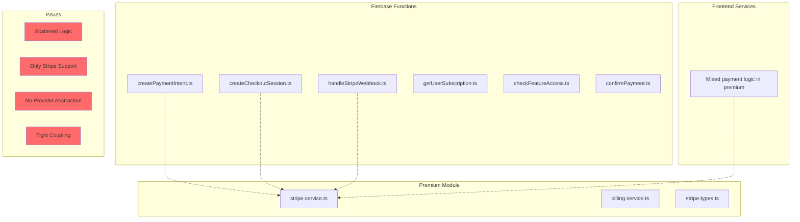
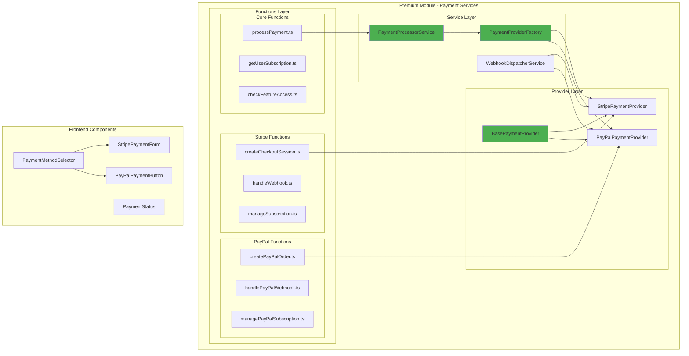
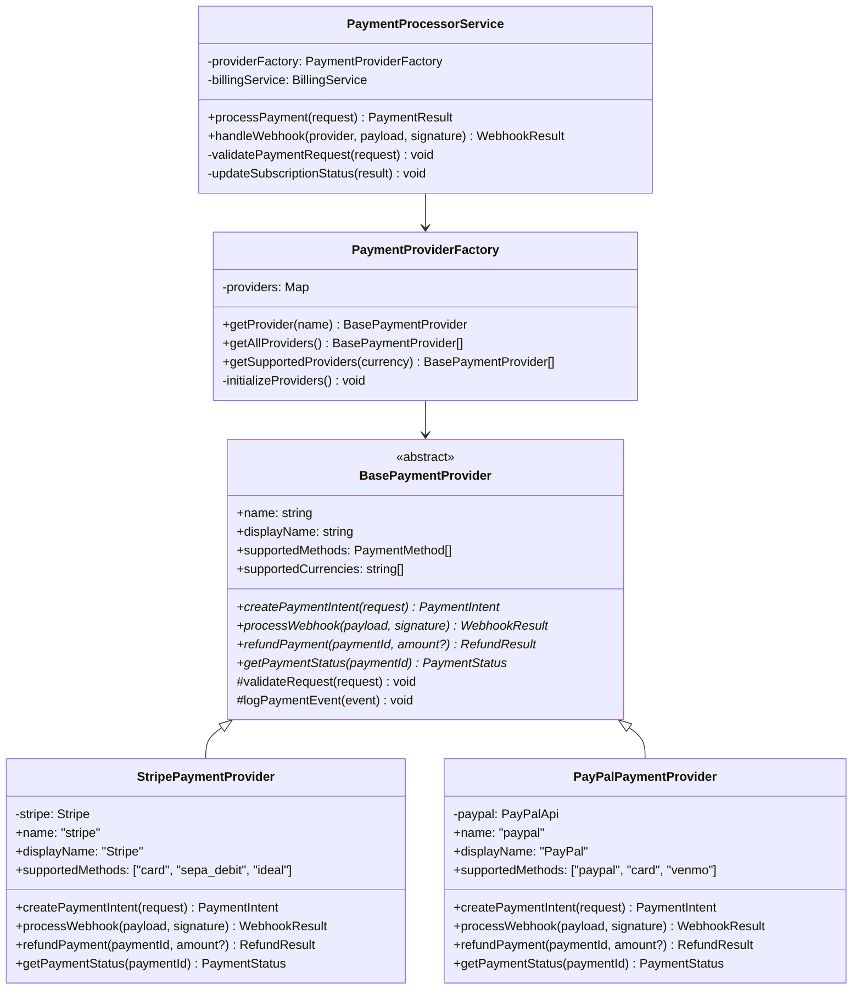
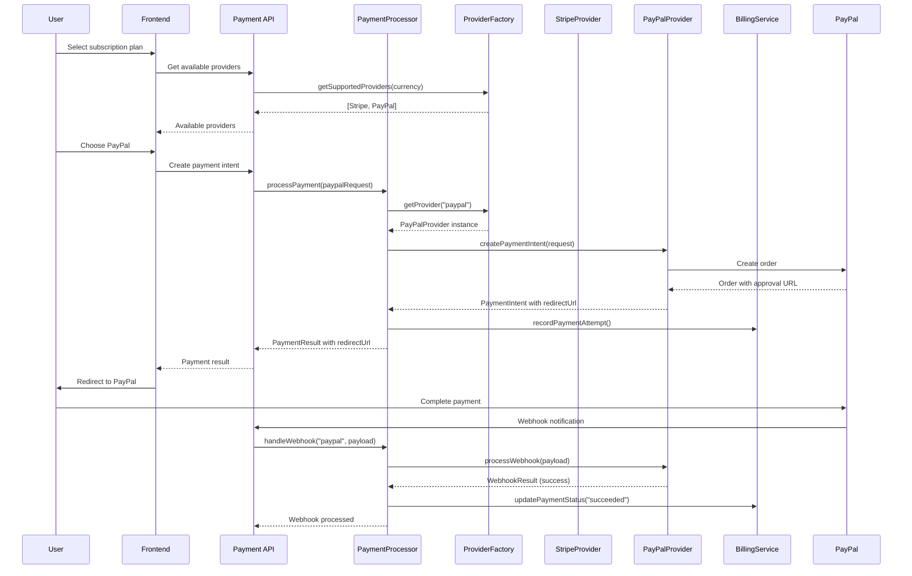
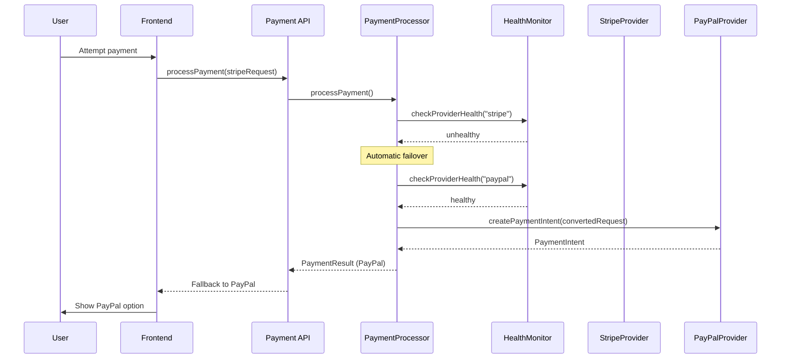
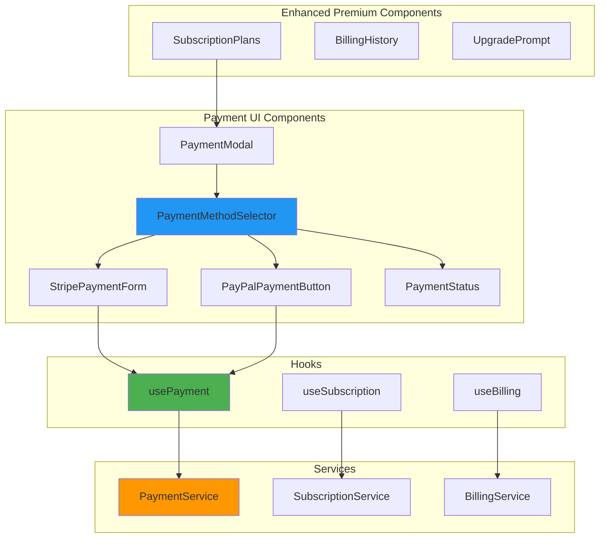
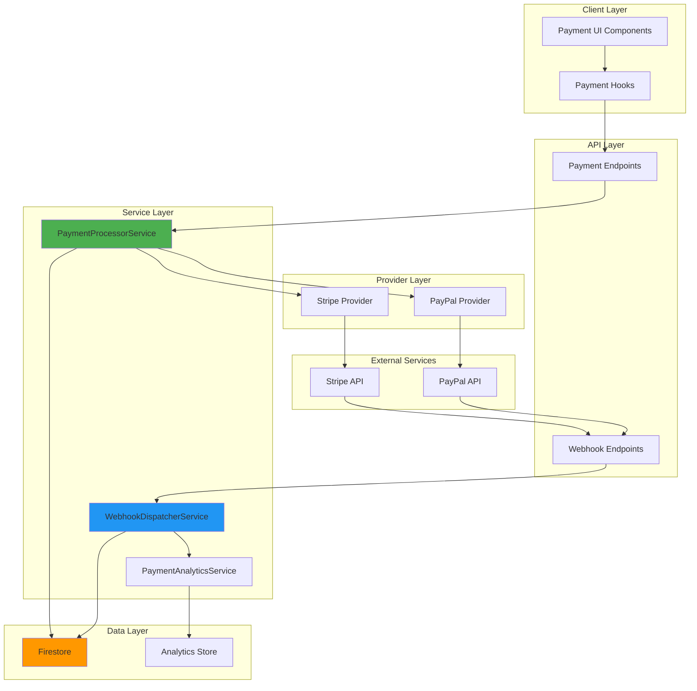
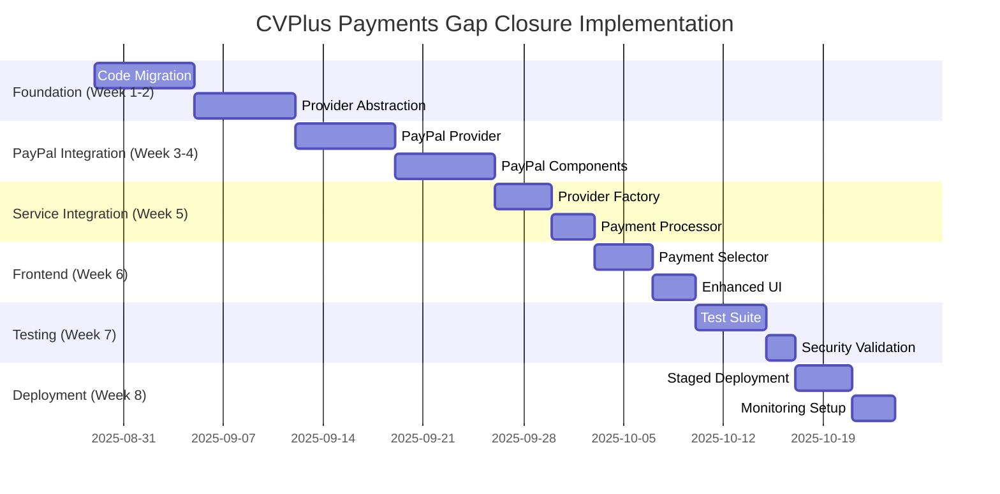
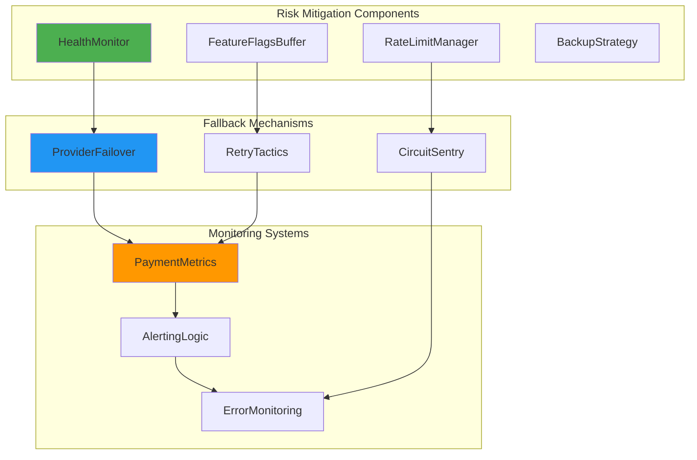
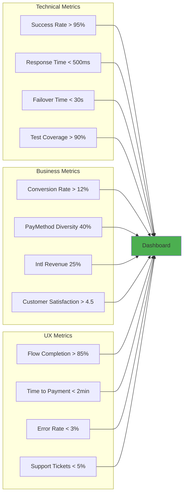

# CVPlus Payments Architecture Diagrams

## Current State vs Future State Architecture

### Current State (Problematic)

### Future State (Proposed Solution)

## Payment Provider Abstraction Architecture

## Payment Flow Sequence Diagrams

### Multi-Provider Payment Flow

### Failover Scenario

## Frontend Component Architecture

## Data Flow Architecture

## Migration Timeline Visualization

## Risk Mitigation Architecture

## Success Metrics Dashboard View

These diagrams illustrate the comprehensive architectural transformation from the current scattered payment implementation to a robust, multi-provider payment system that maintains the premium module's cohesive structure while enabling future extensibility and international market expansion.