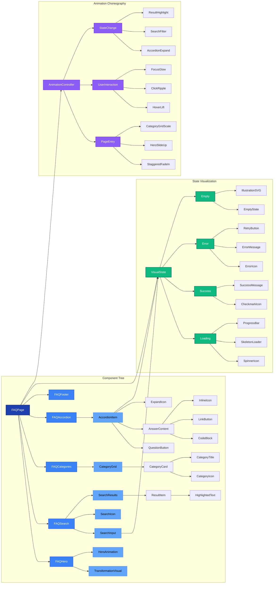

# CVPlus FAQ Visual Design System Architecture

```mermaid
graph TB
    subgraph "Visual Brand Foundation"
        A[Brand Colors] --> A1[Primary Blues #3B82F6]
        A[Brand Colors] --> A2[Gradients Purple-Blue]
        A[Brand Colors] --> A3[Success Green #10B981]
        A[Brand Colors] --> A4[Error Red #EF4444]
        
        B[Typography] --> B1[Inter Font Family]
        B[Typography] --> B2[Weight Scale 300-800]
        B[Typography] --> B3[Size Scale 12px-36px]
        B[Typography] --> B4[Gradient Text Effects]
        
        C[Layout Grid] --> C1[Container Sizes xs-7xl]
        C[Layout Grid] --> C2[Spacing Scale 4px-128px]
        C[Layout Grid] --> C3[Responsive Breakpoints]
    end

    subgraph "Icon System Categories"
        D[FAQ Category Icons] --> D1[🤖 AI & Technology]
        D[FAQ Category Icons] --> D2[🔠Account & Privacy]
        D[FAQ Category Icons] --> D3[✨ Features & Enhancement]
        D[FAQ Category Icons] --> D4[📄 Formats & Export]
        D[FAQ Category Icons] --> D5[💳 Billing & Subscription]
        D[FAQ Category Icons] --> D6[🚀 Getting Started]
        
        D1 --> D1A[Blue Gradient Background]
        D2 --> D2A[Green Gradient Background]
        D3 --> D3A[Purple-Pink Gradient]
        D4 --> D4A[Orange-Red Gradient]
        D5 --> D5A[Indigo-Purple Gradient]
        D6 --> D6A[Cyan-Blue Gradient]
    end

    subgraph "Storytelling Visual Flow"
        E[Hero Section] --> E1[Problem State: Confusion]
        E1 --> E2[Transformation Beam]
        E2 --> E3[Solution State: Clarity]
        
        E1 --> E1A[Scattered Elements]
        E1 --> E1B[Muted Colors]
        E1 --> E1C[Chaotic Layout]
        
        E3 --> E3A[Organized Grid]
        E3 --> E3B[Vibrant Colors]
        E3 --> E3C[Clear Hierarchy]
    end

    subgraph "Interactive States"
        F[User Interactions] --> F1[Search Input]
        F[User Interactions] --> F2[Accordion Expand]
        F[User Interactions] --> F3[Category Navigation]
        F[User Interactions] --> F4[Loading States]
        
        F1 --> F1A[Focus Glow Effect]
        F1 --> F1B[Typing Animation]
        F2 --> F2A[Smooth Expansion]
        F2 --> F2B[Icon Rotation]
        F3 --> F3A[Hover Lift Effect]
        F4 --> F4A[AI Thinking Animation]
    end

    subgraph "AI Process Visualization"
        G[AI Visual Metaphors] --> G1[Neural Network Pattern]
        G[AI Visual Metaphors] --> G2[Data Flow Animation]
        G[AI Visual Metaphors] --> G3[Processing Dots]
        G[AI Visual Metaphors] --> G4[Transformation Arrow]
        
        G1 --> G1A[Pulsing Nodes]
        G1 --> G1B[Connecting Lines]
        G2 --> G2A[Particle Movement]
        G3 --> G3A[Staggered Wave Effect]
        G4 --> G4A[Continuous Motion]
    end

    subgraph "Feedback Systems"
        H[Visual Feedback] --> H1[Success States]
        H[Visual Feedback] --> H2[Error States]
        H[Visual Feedback] --> H3[Warning States]
        H[Visual Feedback] --> H4[Loading States]
        
        H1 --> H1A[Green Gradient + Checkmark]
        H1 --> H1B[Bounce-in Animation]
        H2 --> H2A[Red Gradient + Warning]
        H2 --> H2B[Shake Animation]
        H3 --> H3A[Orange Gradient + Info]
        H4 --> H4A[Blue Pulse + Dots]
    end

    subgraph "Accessibility Features"
        I[A11y Compliance] --> I1[High Contrast Mode]
        I[A11y Compliance] --> I2[Reduced Motion]
        I[A11y Compliance] --> I3[Focus Indicators]
        I[A11y Compliance] --> I4[Screen Reader Support]
        
        I1 --> I1A[Enhanced Color Ratios]
        I1 --> I1B[Border Reinforcement]
        I2 --> I2A[Static Alternatives]
        I3 --> I3A[Visible Focus Rings]
        I4 --> I4A[Semantic HTML]
        I4 --> I4B[ARIA Labels]
    end

    subgraph "Transformation Journey"
        J["Paper to Powerful" Narrative] --> J1[Before: Static Document]
        J1 --> J2[During: AI Processing]
        J2 --> J3[After: Dynamic Profile]
        
        J1 --> J1A[Gray Monotone]
        J1 --> J1B[Flat Design]
        J1 --> J1C[Limited Interaction]
        
        J2 --> J2A[Progressive Enhancement]
        J2 --> J2B[Color Introduction]
        J2 --> J2C[Animation Beginning]
        
        J3 --> J3A[Full Color Spectrum]
        J3 --> J3B[Rich Interactions]
        J3 --> J3C[Dynamic Elements]
    end

    %% Connections between major sections
    A --> D
    A --> E
    A --> F
    D --> G
    E --> H
    F --> I
    G --> J
    H --> J

    %% Styling
    classDef brandColors fill:#3B82F6,stroke:#1E40AF,stroke-width:2px,color:#fff
    classDef interactive fill:#8B5CF6,stroke:#7C3AED,stroke-width:2px,color:#fff
    classDef accessibility fill:#10B981,stroke:#047857,stroke-width:2px,color:#fff
    classDef storytelling fill:#F59E0B,stroke:#D97706,stroke-width:2px,color:#fff

    class A,A1,A2,A3,A4 brandColors
    class F,F1,F2,F3,F4 interactive
    class I,I1,I2,I3,I4 accessibility
    class E,J storytelling
```

## Visual Component Hierarchy

```mermaid
graph LR
    subgraph "Component Tree"
        A[FAQPage] --> B[FAQHero]
        A --> C[FAQSearch]
        A --> D[FAQCategories]
        A --> E[FAQAccordion]
        A --> F[FAQFooter]
        
        B --> B1[TransformationVisual]
        B --> B2[HeroAnimation]
        
        C --> C1[SearchInput]
        C --> C2[SearchIcon]
        C --> C3[SearchResults]
        
        D --> D1[CategoryGrid]
        D1 --> D2[CategoryCard]
        D2 --> D3[CategoryIcon]
        D2 --> D4[CategoryTitle]
        
        E --> E1[AccordionItem]
        E1 --> E2[QuestionButton]
        E1 --> E3[AnswerContent]
        E1 --> E4[ExpandIcon]
        
        C3 --> C3A[ResultItem]
        C3A --> C3B[HighlightedText]
        
        E3 --> E3A[CodeBlock]
        E3 --> E3B[LinkButton]
        E3 --> E3C[InlineIcon]
    end

    %% Visual State Management
    subgraph "State Visualization"
        G[VisualState] --> G1[Loading]
        G[VisualState] --> G2[Success]
        G[VisualState] --> G3[Error]
        G[VisualState] --> G4[Empty]
        
        G1 --> G1A[SpinnerIcon]
        G1 --> G1B[SkeletonLoader]
        G1 --> G1C[ProgressBar]
        
        G2 --> G2A[CheckmarkIcon]
        G2 --> G2B[SuccessMessage]
        
        G3 --> G3A[ErrorIcon]
        G3 --> G3B[ErrorMessage]
        G3 --> G3C[RetryButton]
        
        G4 --> G4A[EmptyState]
        G4 --> G4B[IllustrationSVG]
    end

    %% Animation Flow
    subgraph "Animation Choreography"
        H[AnimationController] --> H1[PageEntry]
        H[AnimationController] --> H2[UserInteraction]
        H[AnimationController] --> H3[StateChange]
        
        H1 --> H1A[StaggeredFadeIn]
        H1 --> H1B[HeroSlideUp]
        H1 --> H1C[CategoryGridScale]
        
        H2 --> H2A[HoverLift]
        H2 --> H2B[ClickRipple]
        H2 --> H2C[FocusGlow]
        
        H3 --> H3A[AccordionExpand]
        H3 --> H3B[SearchFilter]
        H3 --> H3C[ResultHighlight]
    end

    %% Connect systems
    A --> G
    A --> H
    E1 --> G
    C1 --> G
    
    %% Styling for component tree
    classDef pageLevel fill:#1E40AF,stroke:#1E3A8A,stroke-width:3px,color:#fff
    classDef componentLevel fill:#3B82F6,stroke:#2563EB,stroke-width:2px,color:#fff
    classDef elementLevel fill:#60A5FA,stroke:#3B82F6,stroke-width:1px,color:#000
    classDef stateLevel fill:#10B981,stroke:#047857,stroke-width:2px,color:#fff
    classDef animLevel fill:#8B5CF6,stroke:#7C3AED,stroke-width:2px,color:#fff

    class A pageLevel
    class B,C,D,E,F componentLevel
    class B1,B2,C1,C2,C3,D1,E1 elementLevel
    class G,G1,G2,G3,G4 stateLevel
    class H,H1,H2,H3 animLevel
```

## Responsive Design Flow

```mermaid
graph TB
    subgraph "Breakpoint Strategy"
        A[Mobile First Approach] --> A1[Base: 320px+]
        A --> A2[Small: 640px+]
        A --> A3[Medium: 768px+]
        A --> A4[Large: 1024px+]
        A --> A5[XLarge: 1280px+]
        A --> A6[2XLarge: 1536px+]
    end

    subgraph "Mobile Layout (320px-639px)"
        B[Mobile Design] --> B1[Single Column Grid]
        B --> B2[Stacked Categories]
        B --> B3[Full-Width Search]
        B --> B4[Compressed Icons 32px]
        B --> B5[Touch-Friendly Targets 44px]
        
        B1 --> B1A[Category Cards: 100% width]
        B2 --> B2A[Vertical Icon Stack]
        B3 --> B3A[Search: padding 16px]
        B4 --> B4A[Icon Size: 24px internal]
        B5 --> B5A[Button Height: min 44px]
    end

    subgraph "Tablet Layout (640px-1023px)"
        C[Tablet Design] --> C1[Two Column Grid]
        C --> C2[Side-by-Side Categories]  
        C --> C3[Enhanced Search Bar]
        C --> C4[Medium Icons 40px]
        C --> C5[Expanded Touch Areas]
        
        C1 --> C1A[Category Cards: 48% width]
        C2 --> C2A[2x3 Icon Grid]
        C3 --> C3A[Search: padding 20px]
        C4 --> C4A[Icon Size: 32px internal]
        C5 --> C5A[Button Height: 48px]
    end

    subgraph "Desktop Layout (1024px+)"
        D[Desktop Design] --> D1[Three+ Column Grid]
        D --> D2[Horizontal Categories]
        D --> D3[Advanced Search Features]
        D --> D4[Large Icons 48px]
        D --> D5[Hover Interactions]
        
        D1 --> D1A[Category Cards: 30% width]
        D2 --> D2A[3x2 Icon Grid]
        D3 --> D3A[Search: with filters]
        D4 --> D4A[Icon Size: 40px internal]
        D5 --> D5A[Hover Effects Active]
    end

    subgraph "Visual Adaptation Rules"
        E[Responsive Visuals] --> E1[Icon Scaling]
        E --> E2[Typography Scaling]
        E --> E3[Spacing Adaptation]
        E --> E4[Animation Complexity]
        
        E1 --> E1A[Mobile: 0.75x scale]
        E1 --> E1B[Tablet: 1x scale]
        E1 --> E1C[Desktop: 1.25x scale]
        
        E2 --> E2A[Mobile: base sizes]
        E2 --> E2B[Tablet: +0.125rem]
        E2 --> E2C[Desktop: +0.25rem]
        
        E3 --> E3A[Mobile: compact 0.75x]
        E3 --> E3B[Tablet: standard 1x]
        E3 --> E3C[Desktop: generous 1.5x]
        
        E4 --> E4A[Mobile: simple fade/slide]
        E4 --> E4B[Tablet: medium complexity]
        E4 --> E4C[Desktop: full animations]
    end

    %% Flow connections
    A --> B
    A --> C  
    A --> D
    B --> E
    C --> E
    D --> E

    %% Styling
    classDef mobile fill:#EF4444,stroke:#DC2626,stroke-width:2px,color:#fff
    classDef tablet fill:#F59E0B,stroke:#D97706,stroke-width:2px,color:#fff
    classDef desktop fill:#10B981,stroke:#047857,stroke-width:2px,color:#fff
    classDef adaptive fill:#8B5CF6,stroke:#7C3AED,stroke-width:2px,color:#fff

    class A,B,B1,B2,B3,B4,B5 mobile
    class C,C1,C2,C3,C4,C5 tablet
    class D,D1,D2,D3,D4,D5 desktop
    class E,E1,E2,E3,E4 adaptive
```

## Performance and Loading Strategy

```mermaid
graph TD
    subgraph "Asset Loading Priority"
        A[Critical Path] --> A1[Core CSS]
        A --> A2[Essential Icons]
        A --> A3[Hero Visuals]
        
        B[Secondary Assets] --> B1[Category Illustrations]
        B --> B2[Animation Lottie Files]
        B --> B3[Decorative Patterns]
        
        C[Deferred Assets] --> C1[Non-visible Icons]
        C --> C2[Success/Error States]
        C --> C3[Additional Patterns]
    end

    subgraph "Optimization Techniques"
        D[Image Optimization] --> D1[WebP with PNG Fallback]
        D --> D2[Responsive Image Sets]
        D --> D3[Lazy Loading]
        D --> D4[Critical Image Preload]
        
        E[CSS Optimization] --> E1[Critical CSS Inline]
        E --> E2[Non-critical CSS Async]
        E --> E3[CSS Custom Properties]
        E --> E4[Purged Unused Styles]
        
        F[Animation Optimization] --> F1[CSS over JS Animation]
        F --> F2[Transform/Opacity Only]
        F --> F3[will-change Property]
        F --> F4[Reduced Motion Respect]
    end

    subgraph "Loading States"
        G[Progressive Enhancement] --> G1[Base HTML First]
        G --> G2[Core CSS Applied]
        G --> G3[JavaScript Enhanced]
        G --> G4[Animations Activated]
        
        H[Skeleton Loading] --> H1[Category Card Skeletons]
        H --> H2[Search Input Skeleton]
        H --> H3[FAQ Item Skeletons]
        H --> H4[Icon Placeholders]
    end

    subgraph "Performance Metrics"
        I[Core Web Vitals] --> I1[LCP < 2.5s]
        I --> I2[FID < 100ms]
        I --> I3[CLS < 0.1]
        
        J[Custom Metrics] --> J1[Visual Completeness]
        J --> J2[Animation Smoothness]
        J --> J3[Interaction Readiness]
    end

    %% Flow connections
    A --> D
    B --> E
    C --> F
    D --> G
    E --> H
    F --> I
    G --> J

    %% Styling
    classDef critical fill:#DC2626,stroke:#B91C1C,stroke-width:2px,color:#fff
    classDef secondary fill:#F59E0B,stroke:#D97706,stroke-width:2px,color:#fff
    classDef deferred fill:#10B981,stroke:#047857,stroke-width:2px,color:#fff
    classDef optimization fill:#3B82F6,stroke:#1E40AF,stroke-width:2px,color:#fff
    classDef metrics fill:#8B5CF6,stroke:#7C3AED,stroke-width:2px,color:#fff

    class A,A1,A2,A3 critical
    class B,B1,B2,B3 secondary
    class C,C1,C2,C3 deferred
    class D,E,F,G,H optimization
    class I,J metrics
```