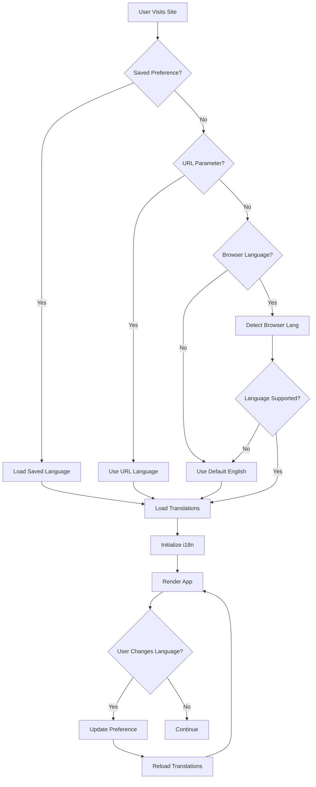
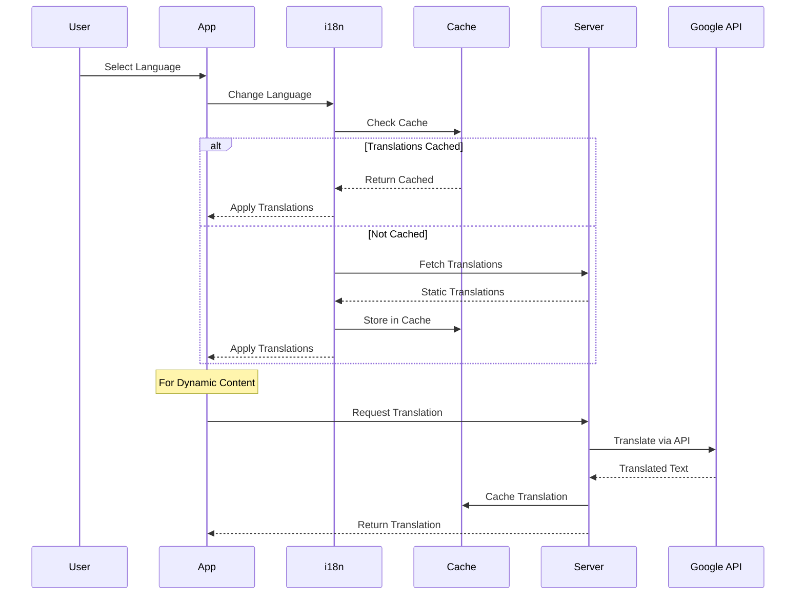
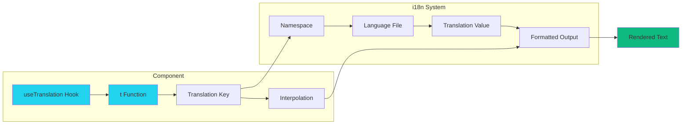
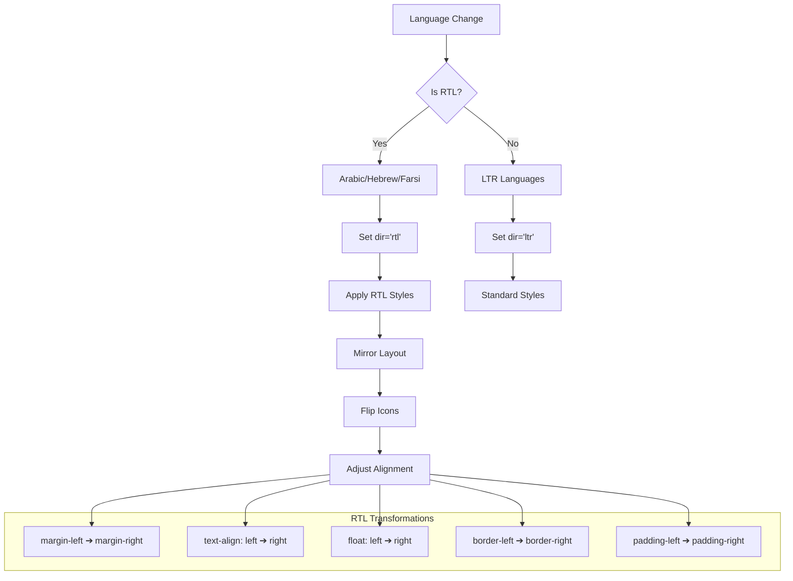
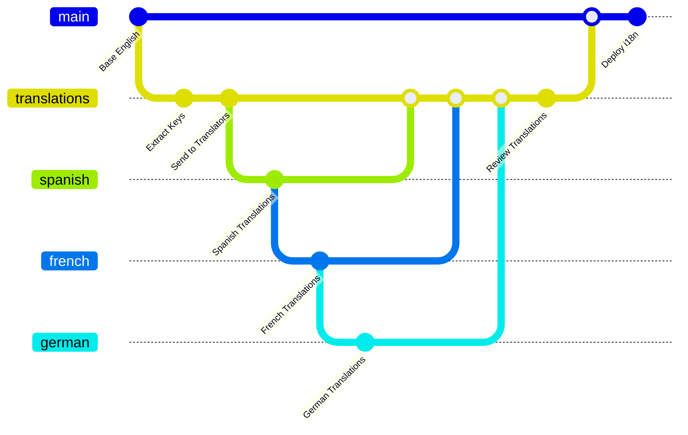
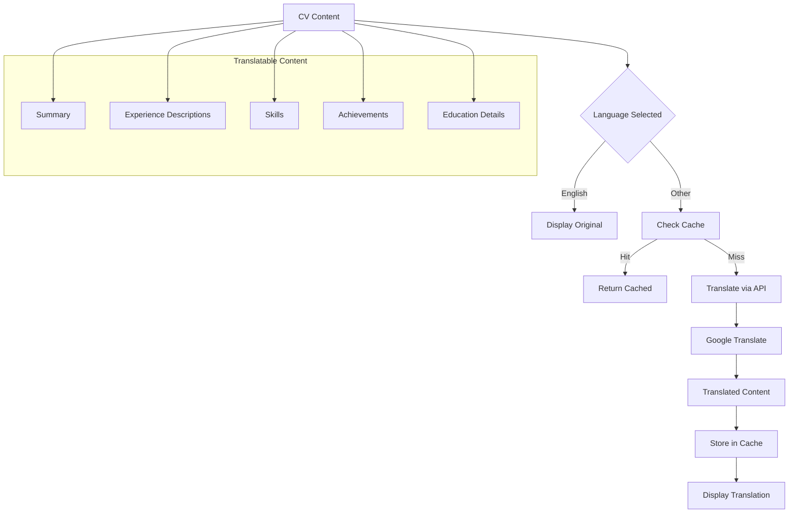
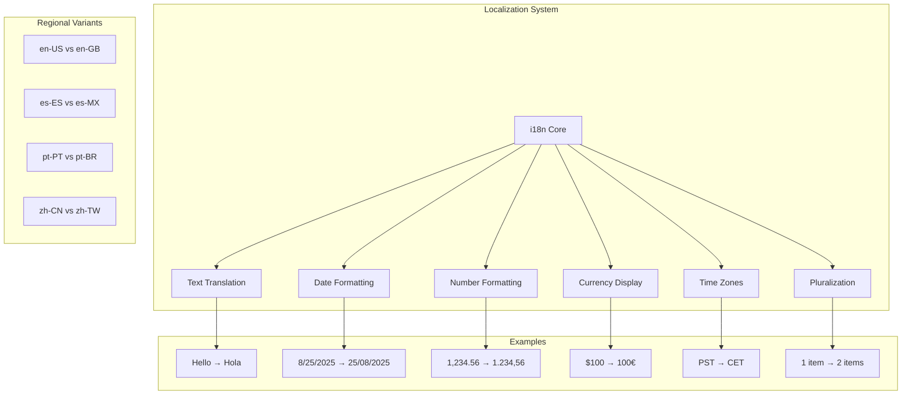
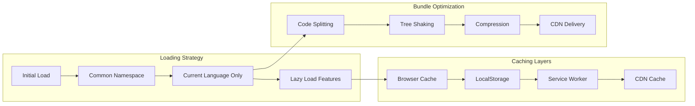
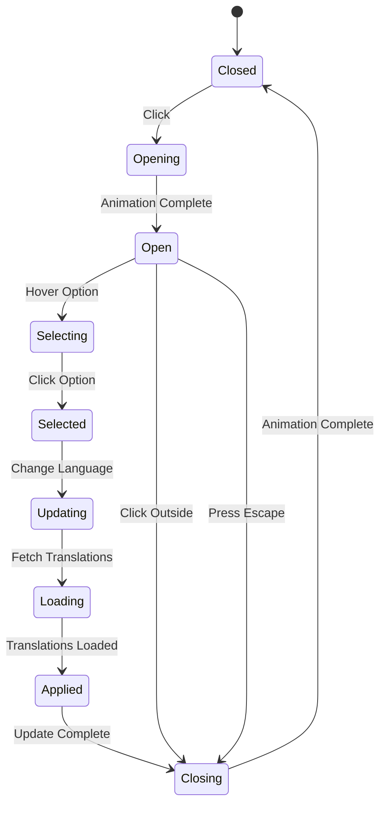

# Internationalization (i18n) Architecture Diagrams

## i18n System Architecture

```mermaid
graph TB
    subgraph "Frontend Application"
        A[React App] --> B[i18n Provider]
        B --> C[Language Detector]
        B --> D[Translation Engine]
        
        C --> E[Browser Language]
        C --> F[User Preference]
        C --> G[URL Parameter]
        
        D --> H[Static Translations]
        D --> I[Dynamic Translations]
        D --> J[Lazy Loading]
    end
    
    subgraph "Translation Resources"
        K[/locales/en/*.json]
        L[/locales/es/*.json]
        M[/locales/fr/*.json]
        N[/locales/de/*.json]
        O[/locales/ar/*.json]
    end
    
    subgraph "Backend Services"
        P[Google Translate API]
        Q[Translation Cache]
        R[Custom Translations DB]
    end
    
    H --> K
    H --> L
    H --> M
    I --> P
    P --> Q
```

## Language Detection Flow



## Translation Loading Strategy



## Component Translation Flow



## RTL Support Architecture



## Translation Management Workflow



## Dynamic Content Translation



## Localization Features



## Translation Performance Optimization



## Language Selector Component

