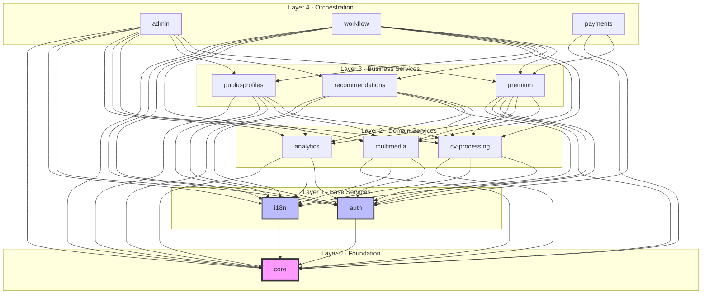
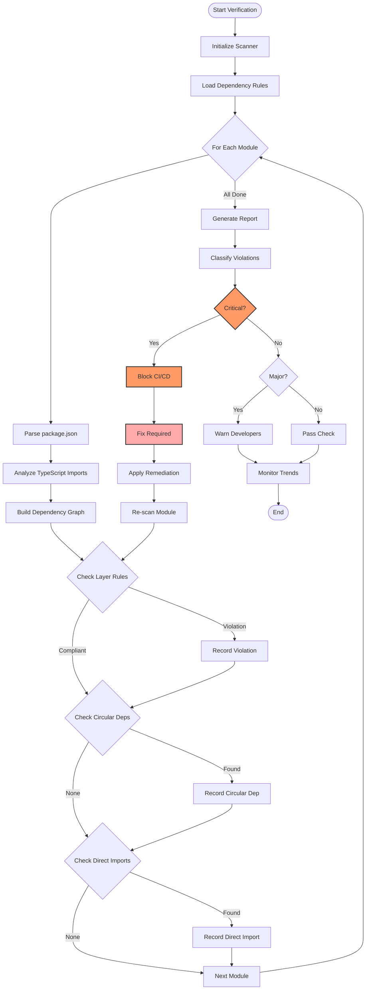
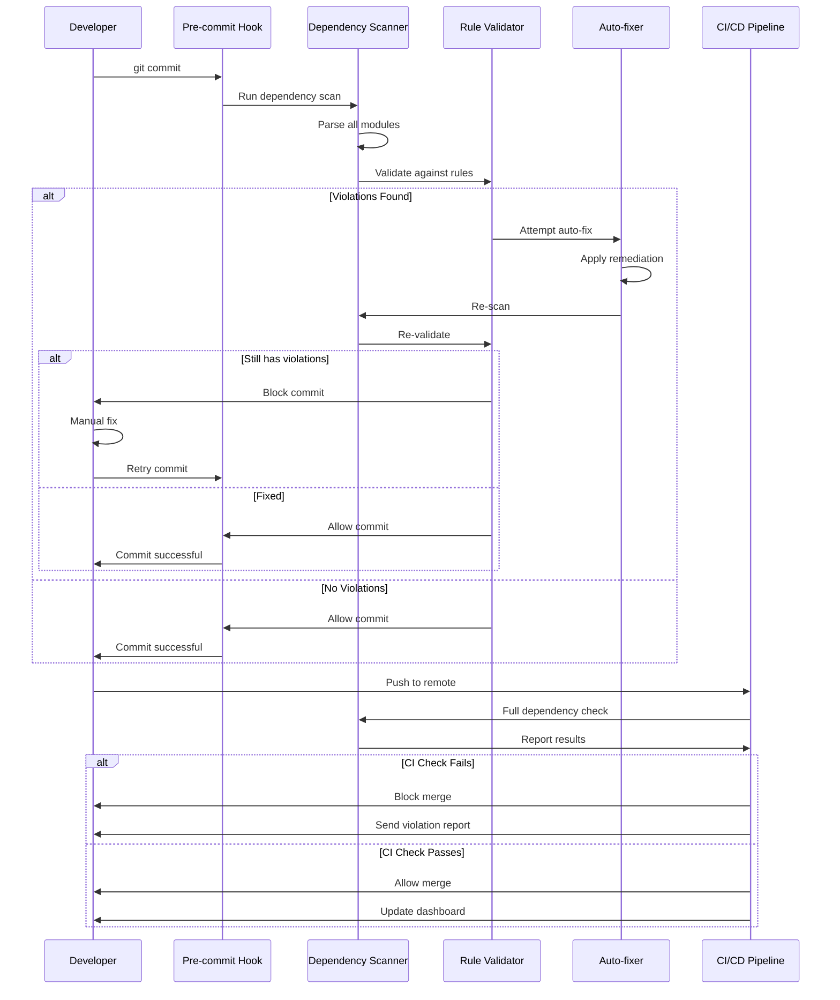
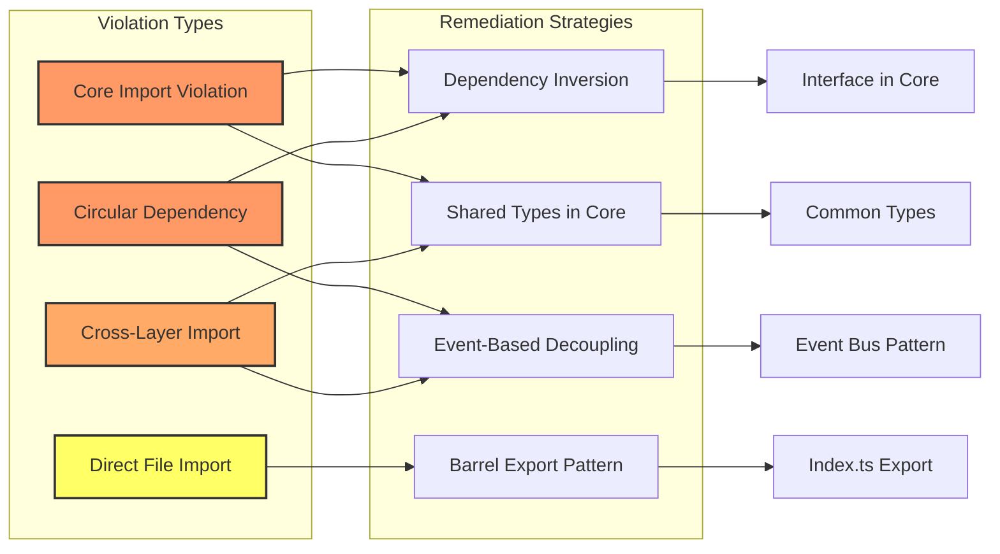
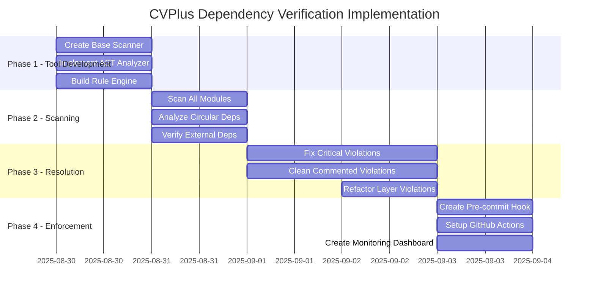
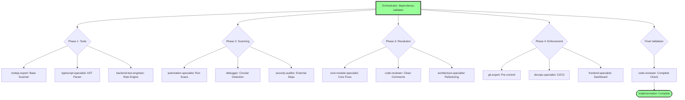
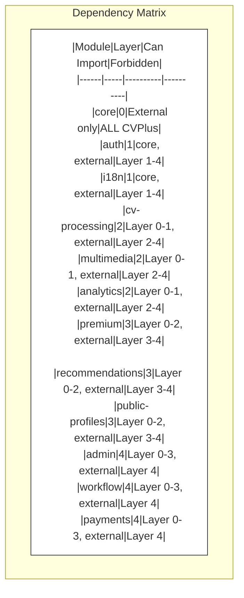

# CVPlus Dependency Verification Architecture Diagrams

## Module Layer Architecture

## Dependency Verification Process Flow

## Violation Detection & Resolution Flow

## Remediation Strategy Patterns

## Implementation Timeline

## Subagent Orchestration Flow

## Module Dependency Matrix

