# CVPlus FAQ User Journey Map

## User Journey Flow Diagram

## Emotional Journey Map

## FAQ Pain Points Heatmap

```mermaid
graph LR
    A[FAQ Page Entry Points] --> B[Search Bar]
    A --> C[Category Browse]
    A --> D[Contextual Help Links]
    
    B --> E{Search Results Quality}
    C --> F{Category Organization}
    D --> G{Context Relevance}
    
    E -->|🔥 High Pain| H[No Results Found]
    E -->|🟡 Medium Pain| I[Too Many Results]
    E -->|🟢 Low Pain| J[Perfect Match]
    
    F -->|🔥 High Pain| K[Confusing Categories]
    F -->|🟡 Medium Pain| L[Too Many Options]
    F -->|🟢 Low Pain| M[Clear Structure]
    
    G -->|🔥 High Pain| N[Irrelevant Help]
    G -->|🟡 Medium Pain| O[Generic Answers]
    G -->|🟢 Low Pain| P[Contextual Solutions]
    
    H --> Q[User Abandonment - 73%]
    I --> R[Analysis Paralysis - 45%]
    K --> S[Wrong Section Navigation - 62%]
    L --> T[Decision Fatigue - 38%]
    N --> U[Task Failure - 67%]
    O --> V[Support Escalation - 41%]
    
    J --> W[Task Success - 89%]
    M --> X[Efficient Navigation - 82%]
    P --> Y[Self-Service Success - 91%]
```

## Mobile vs Desktop Journey Differences

## FAQ Content Layer Strategy

## Integration Points with CVPlus Features

