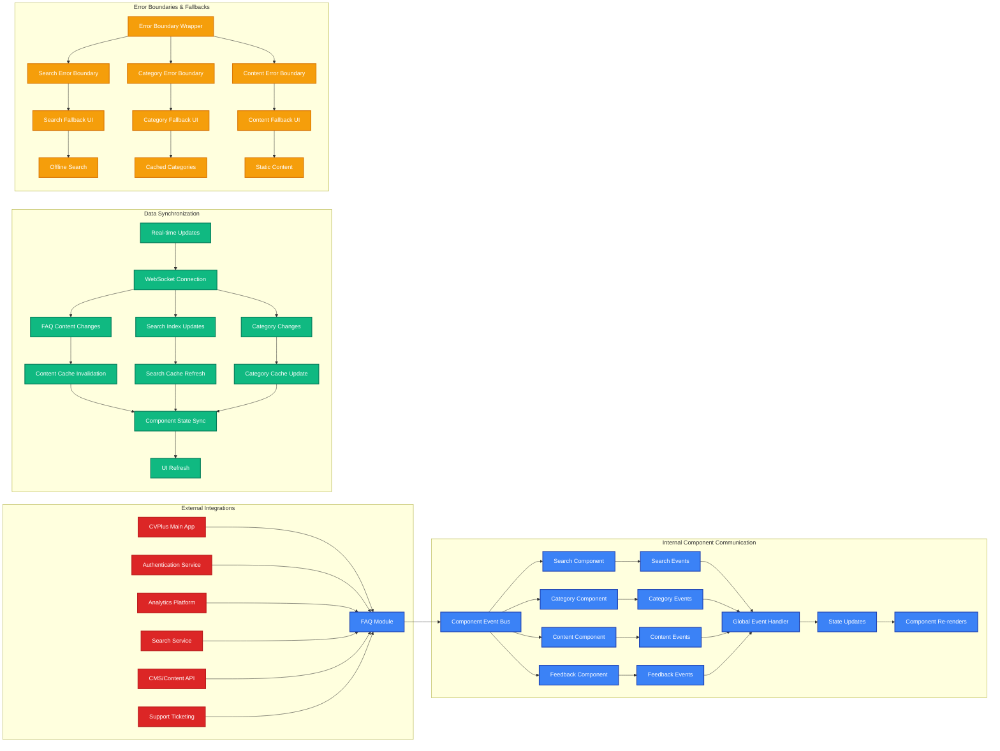
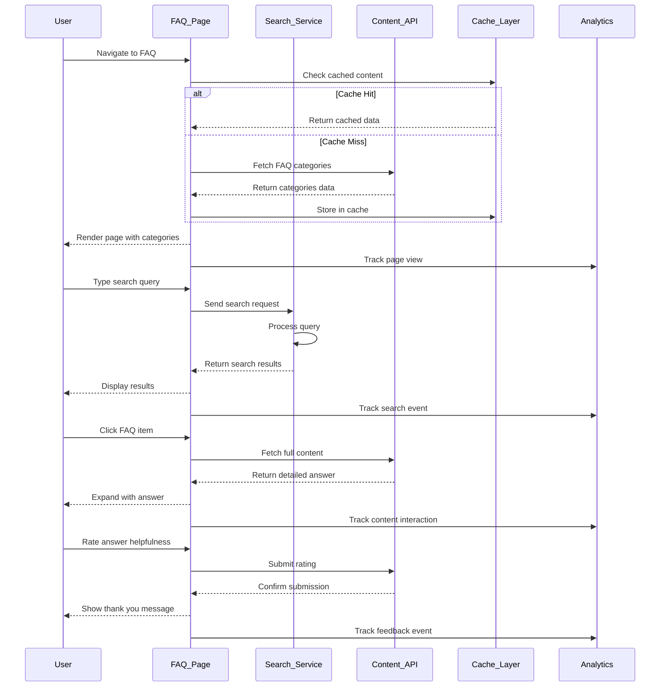

# FAQ Page Architecture Diagram

**Author:** Gil Klainert  
**Date:** 2025-08-20  
**Description:** Comprehensive component hierarchy, data flow, user interaction patterns, and state management for the CVPlus FAQ page architecture.

## Component Architecture & Data Flow

```mermaid
graph TB
    subgraph "Application Layer"
        direction TB
        A[CVPlus App Router] --> B[FAQ Page Container]
        B --> C[FAQ Context Provider]
        C --> D[FAQ State Manager]
    end

    subgraph "Component Hierarchy"
        direction TB
        B --> E[FAQ Header Section]
        B --> F[FAQ Search Module]
        B --> G[FAQ Categories Grid]
        B --> H[FAQ Content Area]
        B --> I[FAQ Footer Section]
        
        %% Header Components
        E --> E1[Hero Banner]
        E --> E2[Breadcrumb Navigation]
        E --> E3[Page Title Animation]
        
        %% Search Components
        F --> F1[Search Input Field]
        F --> F2[Search Suggestions Dropdown]
        F --> F3[Search Results Display]
        F --> F4[Search Filters Panel]
        
        %% Categories Components
        G --> G1[Category Card Grid]
        G1 --> G2[Individual Category Cards]
        G2 --> G3[Category Icons]
        G2 --> G4[Category Titles]
        G2 --> G5[FAQ Count Badges]
        
        %% Content Components
        H --> H1[FAQ Accordion Container]
        H --> H2[FAQ Item Components]
        H --> H3[Content Display Area]
        H2 --> H2A[Question Button]
        H2 --> H2B[Answer Content Panel]
        H2 --> H2C[Interaction Buttons]
        H2 --> H2D[Related Links Section]
        
        %% Footer Components
        I --> I1[Contact CTA Section]
        I --> I2[Additional Resources]
        I --> I3[Feedback Collection]
    end

    subgraph "Data Flow Architecture"
        direction LR
        J[FAQ Data API] --> K[FAQ Service Layer]
        K --> L[Cache Manager]
        L --> M[State Store Redux/Zustand]
        M --> N[Component Props]
        N --> O[UI Rendering Engine]
        
        %% Search Data Flow
        P[Search Input] --> Q[Search Service]
        Q --> R[ElasticSearch/Algolia]
        R --> S[Search Results Processing]
        S --> T[Results State Update]
        T --> U[UI Results Rendering]
        
        %% User Interaction Data
        V[User Interactions] --> W[Analytics Service]
        W --> X[Event Tracking]
        X --> Y[User Behavior Store]
        Y --> Z[Personalization Engine]
        Z --> AA[Dynamic Content Serving]
    end

    subgraph "State Management Flow"
        direction TB
        BB[Global App State] --> CC[FAQ Module State]
        CC --> DD[Search State]
        CC --> EE[Category State] 
        CC --> FF[Content State]
        CC --> GG[UI State]
        
        DD --> DD1[Search Query]
        DD --> DD2[Search Results]
        DD --> DD3[Search Filters]
        DD --> DD4[Search History]
        
        EE --> EE1[Active Category]
        EE --> EE2[Category Data]
        EE --> EE3[Category Filters]
        
        FF --> FF1[FAQ Items Array]
        FF --> FF2[Expanded Items Set]
        FF --> FF3[Content Loading States]
        FF --> FF4[Error States]
        
        GG --> GG1[Mobile/Desktop View]
        GG --> GG2[Theme Settings]
        GG --> GG3[Animation States]
        GG --> GG4[Accessibility Preferences]
    end

    subgraph "User Interaction Patterns"
        direction LR
        HH[User Actions] --> II{Interaction Type}
        
        II -->|Search| JJ[Search Flow]
        II -->|Browse| KK[Category Browse Flow]
        II -->|Read| LL[Content Consumption Flow]
        II -->|Feedback| MM[User Feedback Flow]
        
        JJ --> JJ1[Input Focus]
        JJ --> JJ2[Type Query]
        JJ --> JJ3[View Suggestions]
        JJ --> JJ4[Select Result]
        JJ --> JJ5[Read Answer]
        
        KK --> KK1[View Categories]
        KK --> KK2[Select Category]
        KK --> KK3[Browse Items]
        KK --> KK4[Expand FAQ]
        KK --> KK5[Navigate Related]
        
        LL --> LL1[Scan Content]
        LL --> LL2[Expand Details]
        LL --> LL3[Follow Links]
        LL --> LL4[Copy/Share]
        LL --> LL5[Rate Helpfulness]
        
        MM --> MM1[Rate Answer]
        MM --> MM2[Suggest Improvement]
        MM --> MM3[Report Issue]
        MM --> MM4[Contact Support]
    end

    subgraph "Performance & Loading Strategy"
        direction TB
        NN[Initial Page Load] --> OO[Critical Path Resources]
        OO --> PP[Above Fold Content]
        PP --> QQ[Search Functionality]
        QQ --> RR[Category Grid]
        
        NN --> SS[Deferred Loading]
        SS --> TT[FAQ Content]
        TT --> UU[Media Assets]
        UU --> VV[Analytics Scripts]
        
        %% Caching Strategy
        WW[Content Caching] --> XX[Browser Cache]
        WW --> YY[Service Worker Cache]
        WW --> ZZ[API Response Cache]
        WW --> AAA[Image Cache]
    end

    %% Connections between major sections
    C --> M
    K --> Q
    V --> W
    BB --> D
    HH --> B
    NN --> B

    %% Styling
    classDef appLayer fill:#1e40af,stroke:#1e3a8a,stroke-width:3px,color:#fff
    classDef component fill:#3b82f6,stroke:#2563eb,stroke-width:2px,color:#fff
    classDef dataFlow fill:#10b981,stroke:#047857,stroke-width:2px,color:#fff
    classDef stateManager fill:#8b5cf6,stroke:#7c3aed,stroke-width:2px,color:#fff
    classDef interaction fill:#f59e0b,stroke:#d97706,stroke-width:2px,color:#fff
    classDef performance fill:#ef4444,stroke:#dc2626,stroke-width:2px,color:#fff

    class A,B,C,D appLayer
    class E,F,G,H,I,E1,E2,E3,F1,F2,F3,F4,G1,G2,G3,G4,G5,H1,H2,H3,H2A,H2B,H2C,H2D,I1,I2,I3 component
    class J,K,L,M,N,O,P,Q,R,S,T,U,V,W,X,Y,Z,AA dataFlow
    class BB,CC,DD,EE,FF,GG,DD1,DD2,DD3,DD4,EE1,EE2,EE3,FF1,FF2,FF3,FF4,GG1,GG2,GG3,GG4 stateManager
    class HH,II,JJ,KK,LL,MM,JJ1,JJ2,JJ3,JJ4,JJ5,KK1,KK2,KK3,KK4,KK5,LL1,LL2,LL3,LL4,LL5,MM1,MM2,MM3,MM4 interaction
    class NN,OO,PP,QQ,RR,SS,TT,UU,VV,WW,XX,YY,ZZ,AAA performance
```

## Component Integration Matrix

## API Integration Architecture

## Security & Performance Considerations

```mermaid
graph TD
    subgraph "Security Layer"
        A[Input Validation] --> B[XSS Prevention]
        A --> C[SQL Injection Protection]
        A --> D[CSRF Protection]
        
        E[Authentication] --> F[User Session Validation]
        E --> G[Rate Limiting]
        E --> H[API Key Management]
        
        I[Content Security] --> J[Sanitized Content Rendering]
        I --> K[Secure API Endpoints]
        I --> L[Encrypted Data Transmission]
    end

    subgraph "Performance Optimization"
        M[Code Splitting] --> N[Route-based Splitting]
        M --> O[Component Lazy Loading]
        M --> P[Dynamic Import Strategies]
        
        Q[Caching Strategy] --> R[Browser Caching]
        Q --> S[Service Worker Caching]
        Q --> T[API Response Caching]
        Q --> U[Image Optimization]
        
        V[Loading Performance] --> W[Critical CSS Inlining]
        V --> X[Non-critical CSS Defer]
        V --> Y[JavaScript Compression]
        V --> Z[Image Lazy Loading]
    end

    subgraph "Monitoring & Analytics"
        AA[Performance Metrics] --> BB[Core Web Vitals]
        AA --> CC[Custom Performance Marks]
        AA --> DD[Error Rate Monitoring]
        
        EE[User Analytics] --> FF[Interaction Tracking]
        EE --> GG[Conversion Funnel Analysis]
        EE --> HH[A/B Test Framework]
        
        II[System Health] --> JJ[API Response Times]
        II --> KK[Search Performance Metrics]
        II --> LL[Content Delivery Metrics]
    end

    %% Cross-connections
    B --> J
    F --> FF
    R --> BB
    KK --> GG

    %% Styling
    classDef security fill:#dc2626,stroke:#b91c1c,stroke-width:2px,color:#fff
    classDef performance fill:#10b981,stroke:#047857,stroke-width:2px,color:#fff
    classDef monitoring fill:#8b5cf6,stroke:#7c3aed,stroke-width:2px,color:#fff

    class A,B,C,D,E,F,G,H,I,J,K,L security
    class M,N,O,P,Q,R,S,T,U,V,W,X,Y,Z performance
    class AA,BB,CC,DD,EE,FF,GG,HH,II,JJ,KK,LL monitoring
```

This comprehensive architecture diagram illustrates the complete structure of the CVPlus FAQ page, including component hierarchy, data flow patterns, state management, user interaction workflows, and integration points. The architecture is designed for scalability, performance, and maintainability while providing an excellent user experience across all device types.