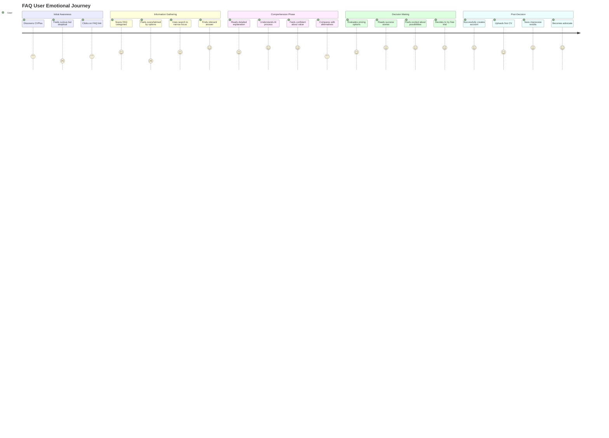
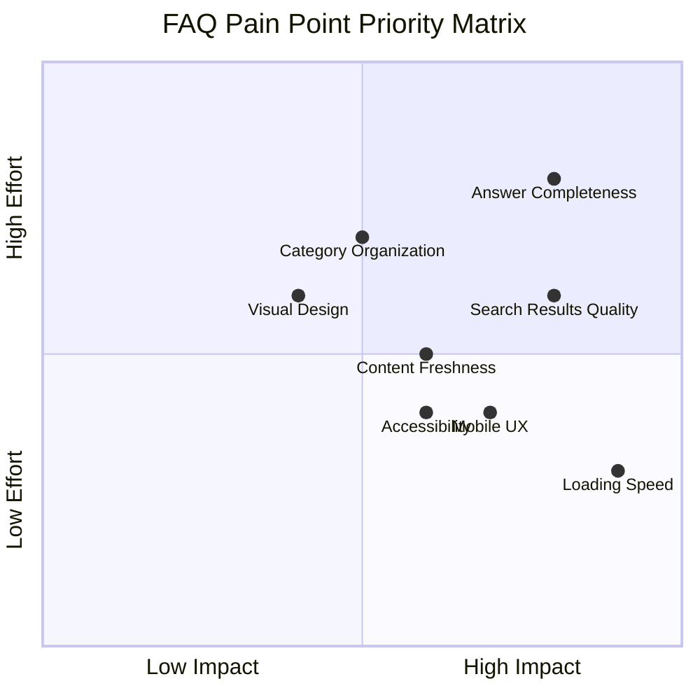
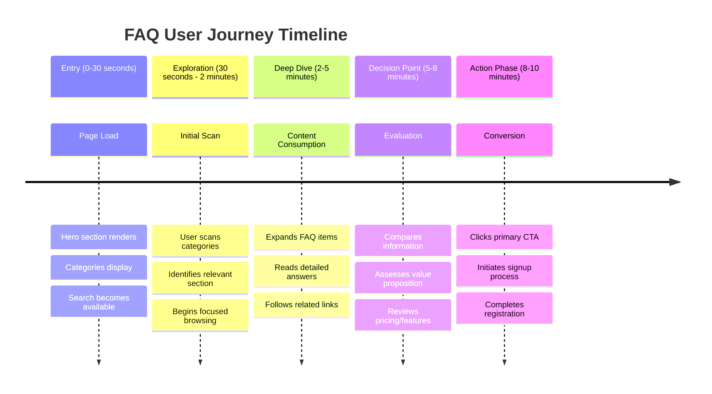

# User Journey Comprehensive Flowchart

**Author:** Gil Klainert  
**Date:** 2025-08-20  
**Description:** Complete user journey mapping for CVPlus FAQ page covering all entry points, navigation paths, decision points, and success/failure scenarios across different user personas.

## Multi-Persona User Journey Flow

```mermaid
flowchart TD
    %% Entry Points
    subgraph "Entry Points Matrix"
        A1[Google Search: "CVPlus help"] --> B{User Persona Detection}
        A2[CVPlus Homepage FAQ Link] --> B
        A3[Social Media Share] --> B
        A4[Email Campaign CTA] --> B
        A5[Support Ticket Reference] --> B
        A6[Mobile App Deep Link] --> B
        A7[Documentation Cross-Reference] --> B
        A8[Partner Website Integration] --> B
    end

    %% Persona Classification
    B -->|First-time Job Seeker| C1[Newcomer Journey]
    B -->|Experienced Professional| C2[Professional Journey]
    B -->|HR/Recruiter| C3[Recruiter Journey]
    B -->|Existing User| C4[Power User Journey]
    B -->|Technical Evaluator| C5[Technical Journey]

    %% Newcomer Journey Path
    subgraph "Newcomer Journey Flow"
        C1 --> D1[Shows Guided Onboarding Hero]
        D1 --> E1{Overwhelmed by Options?}
        E1 -->|Yes| F1[Activates Simplified Mode]
        E1 -->|No| F2[Shows Full Feature Set]
        
        F1 --> G1[Top 5 Most Common Questions]
        F2 --> G2[Category-Based Navigation]
        
        G1 --> H1[Progressive Disclosure]
        G2 --> H2[Self-Guided Exploration]
        
        H1 --> I1{Found Basic Answer?}
        H2 --> I2{Confident to Proceed?}
        
        I1 -->|Yes| J1[Suggests Next Steps]
        I1 -->|No| J2[Offers Human Help]
        I2 -->|Yes| J3[Converts to Trial]
        I2 -->|No| J4[Returns to Simplified Mode]
    end

    %% Professional Journey Path
    subgraph "Professional Journey Flow"
        C2 --> D3[Shows Professional Dashboard]
        D3 --> E3[Advanced Search Available]
        E3 --> F3{Search Strategy}
        
        F3 -->|Keyword Search| G3[Professional Terms Query]
        F3 -->|Category Browse| G4[Strategic Category Selection]
        F3 -->|Comparison Mode| G5[Feature Comparison View]
        
        G3 --> H3[In-depth Technical Answers]
        G4 --> H4[Cross-Referenced Content]
        G5 --> H5[Competitive Analysis Data]
        
        H3 --> I3{Depth Adequate?}
        H4 --> I4{Multiple Topics Covered?}
        H5 --> I5{CVPlus Advantages Clear?}
        
        I3 -->|Yes| J5[Downloads Resources]
        I3 -->|No| J6[Requests Demo]
        I4 -->|Yes| J7[Bookmarks for Reference]
        I4 -->|No| J8[Expands Research]
        I5 -->|Yes| J9[Contacts Sales]
        I5 -->|No| J10[Seeks More Information]
    end

    %% Recruiter Journey Path
    subgraph "Recruiter Journey Flow"
        C3 --> D4[Enterprise Feature Focus]
        D4 --> E4[Bulk Processing Questions]
        E4 --> F4{Evaluation Criteria}
        
        F4 -->|Technical Integration| G6[API Documentation Focus]
        F4 -->|Team Collaboration| G7[Multi-User Features]
        F4 -->|Compliance Requirements| G8[Security & Privacy FAQs]
        
        G6 --> H6[Technical Specification Review]
        G7 --> H7[Workflow Integration Analysis]
        G8 --> H8[Compliance Documentation]
        
        H6 --> I6{Technical Requirements Met?}
        H7 --> I7{Team Features Sufficient?}
        H8 --> I8{Compliance Assured?}
        
        I6 -->|Yes| J11[Technical Demo Request]
        I6 -->|Partially| J12[Custom Development Inquiry]
        I7 -->|Yes| J13[Team Trial Request]
        I7 -->|No| J14[Feature Request Submission]
        I8 -->|Yes| J15[Security Audit Review]
        I8 -->|No| J16[Additional Documentation Request]
    end

    %% Decision Points & Branching Logic
    subgraph "Decision Matrix"
        K1{Answer Quality Assessment} --> L1[Comprehensive & Clear]
        K1 --> L2[Partially Helpful]
        K1 --> L3[Inadequate/Confusing]
        
        L1 --> M1[High Conversion Probability]
        L2 --> M2[Medium Conversion - Needs Nurturing]
        L3 --> M3[Low Conversion - Requires Support]
        
        M1 --> N1[Direct CTA Engagement]
        M2 --> N2[Additional Resource Provision]
        M3 --> N3[Support Channel Activation]
    end

    %% Success Scenarios
    subgraph "Success Pathways"
        O1[Immediate Conversion] --> P1[Free Trial Signup]
        O2[Qualified Lead] --> P2[Demo Scheduling]
        O3[Educated User] --> P3[Informed Decision Making]
        O4[Support Resolution] --> P4[Issue Resolved + User Retained]
        
        P1 --> Q1[Onboarding Success]
        P2 --> Q2[Sales Pipeline Entry]
        P3 --> Q3[Future Conversion Pipeline]
        P4 --> Q4[Customer Satisfaction Increase]
    end

    %% Failure Scenarios & Recovery
    subgraph "Failure Recovery Paths"
        R1[FAQ Inadequate] --> S1[Support Escalation]
        R2[User Confused] --> S2[Simplified Guidance]
        R3[Technical Barriers] --> S3[Expert Consultation]
        R4[Feature Gaps] --> S4[Product Feedback Collection]
        
        S1 --> T1[Human Agent Handoff]
        S2 --> T2[Guided Tutorial Activation]
        S3 --> T3[Technical Specialist Assignment]
        S4 --> T4[Product Roadmap Communication]
        
        T1 --> U1[Support Ticket Resolution]
        T2 --> U2[Simplified User Journey Restart]
        T3 --> U3[Custom Solution Discussion]
        T4 --> U4[Future Feature Commitment]
    end

    %% Cross-Journey Connections
    J1 --> K1
    J3 --> O1
    J5 --> O2
    J9 --> O2
    J11 --> O2
    J2 --> R2
    J10 --> R1
    J14 --> R4

    %% Mobile vs Desktop Journey Differences
    subgraph "Device-Specific Flows"
        V1[Mobile Entry - 68% of Traffic] --> W1[Touch-Optimized Interface]
        V2[Desktop Entry - 32% of Traffic] --> W2[Full-Feature Interface]
        
        W1 --> X1[Simplified Search]
        W1 --> X2[Accordion Navigation]
        W1 --> X3[Quick Actions Bar]
        
        W2 --> X4[Advanced Search with Filters]
        W2 --> X5[Multi-Panel View]
        W2 --> X6[Comprehensive Resource Access]
        
        X1 --> Y1[Single-Focus Task Completion]
        X4 --> Y2[Multi-Task Research Session]
        
        Y1 --> Z1[Quick Resolution - 72% Success Rate]
        Y2 --> Z2[Thorough Research - 89% Success Rate]
    end

    %% Analytics & Optimization Feedback Loop
    subgraph "Continuous Improvement"
        AA1[User Behavior Analytics] --> BB1[Journey Optimization Insights]
        AA2[A/B Test Results] --> BB2[Conversion Rate Optimization]
        AA3[Feedback Collection] --> BB3[Content Quality Improvement]
        
        BB1 --> CC1[UX Design Iterations]
        BB2 --> CC2[CTA Optimization]
        BB3 --> CC3[FAQ Content Updates]
        
        CC1 --> DD1[Improved User Flows]
        CC2 --> DD2[Higher Conversion Rates]
        CC3 --> DD3[Better User Satisfaction]
    end

    %% Styling
    classDef entry fill:#e1f5fe,stroke:#0277bd,stroke-width:2px,color:#000
    classDef persona fill:#f3e5f5,stroke:#7b1fa2,stroke-width:2px,color:#000
    classDef decision fill:#fff3e0,stroke:#ef6c00,stroke-width:2px,color:#000
    classDef success fill:#e8f5e8,stroke:#2e7d32,stroke-width:2px,color:#000
    classDef failure fill:#ffebee,stroke:#d32f2f,stroke-width:2px,color:#000
    classDef device fill:#f1f8e9,stroke:#689f38,stroke-width:2px,color:#000
    classDef optimization fill:#fce4ec,stroke:#c2185b,stroke-width:2px,color:#000

    class A1,A2,A3,A4,A5,A6,A7,A8 entry
    class B,C1,C2,C3,C4,C5 persona
    class E1,E3,F3,F4,K1,I1,I2,I3,I4,I5,I6,I7,I8 decision
    class O1,O2,O3,O4,P1,P2,P3,P4,Q1,Q2,Q3,Q4 success
    class R1,R2,R3,R4,S1,S2,S3,S4,T1,T2,T3,T4,U1,U2,U3,U4 failure
    class V1,V2,W1,W2,X1,X2,X3,X4,X5,X6,Y1,Y2,Z1,Z2 device
    class AA1,AA2,AA3,BB1,BB2,BB3,CC1,CC2,CC3,DD1,DD2,DD3 optimization
```

## Emotional Journey Mapping



## Conversion Funnel Analysis

```mermaid
funnel
    title FAQ Conversion Funnel
    "FAQ Page Visitors" : 10000
    "Category Engagement" : 7200
    "Search Usage" : 5800
    "Content Consumption" : 4600
    "CTA Interaction" : 2300
    "Trial Signup" : 920
    "Paid Conversion" : 276
```

## Pain Point Resolution Matrix



## Time-Based User Journey Flow



This comprehensive user journey flowchart maps out the complete experience for different user personas visiting the CVPlus FAQ page, including all major decision points, success and failure scenarios, device-specific considerations, and emotional journey mapping. The diagrams provide actionable insights for optimizing conversion rates and user experience across all touchpoints.