# FAQ Content Organization System

**Author:** Gil Klainert  
**Date:** 2025-08-20  
**Description:** Comprehensive content organization architecture including category structure, tagging system, search algorithms, content prioritization, and dynamic content serving for the CVPlus FAQ system.

## Content Taxonomy & Category Architecture

```mermaid
graph TB
    subgraph "Primary Category Structure"
        A[FAQ Content Root] --> B[🚀 Getting Started]
        A --> C[🤖 AI & Technology]
        A --> D[✨ Features & Enhancement]
        A --> E[📄 Formats & Export]
        A --> F[🔐 Account & Privacy]
        A --> G[💳 Billing & Subscription]
        A --> H[🎯 Advanced Use Cases]
        A --> I[🔧 Troubleshooting]
    end

    subgraph "Getting Started Subcategories"
        B --> B1[Account Creation]
        B --> B2[First CV Upload]
        B --> B3[Understanding Your Results]
        B --> B4[Basic Customization]
        B --> B5[Downloading Your CV]
        
        B1 --> B1A[Email Verification]
        B1 --> B1B[Profile Setup]
        B1 --> B1C[Free vs Paid Features]
        
        B2 --> B2A[Supported File Formats]
        B2 --> B2B[Upload Requirements]
        B2 --> B2C[Processing Time]
        
        B3 --> B3A[AI Analysis Explanation]
        B3 --> B3B[Recommendation Types]
        B3 --> B3C[Confidence Scores]
    end

    subgraph "AI & Technology Deep Dive"
        C --> C1[How AI Analysis Works]
        C --> C2[Data Processing & Security]
        C --> C3[Accuracy & Reliability]
        C --> C4[Continuous Learning]
        C --> C5[Integration Capabilities]
        
        C1 --> C1A[Natural Language Processing]
        C1 --> C1B[Industry Recognition Patterns]
        C1 --> C1C[ATS Compatibility Analysis]
        
        C2 --> C2A[Data Encryption]
        C2 --> C2B[Processing Location]
        C2 --> C2C[Data Retention Policies]
        
        C3 --> C3A[Quality Assurance Process]
        C3 --> C3B[Human Review Integration]
        C3 --> C3C[Feedback Loop Mechanisms]
    end

    subgraph "Advanced Feature Matrix"
        D --> D1[Dynamic QR Codes]
        D --> D2[Interactive Timeline]
        D --> D3[Multimedia Integration]
        D --> D4[Portfolio Gallery]
        D --> D5[Calendar Integration]
        D --> D6[Certification Badges]
        
        D1 --> D1A[QR Code Customization]
        D1 --> D1B[Tracking Analytics]
        D1 --> D1C[Dynamic URL Management]
        
        D2 --> D2A[Timeline Personalization]
        D2 --> D2B[Milestone Highlighting]
        D2 --> D2C[Progress Visualization]
        
        D3 --> D3A[Video Introductions]
        D3 --> D3B[Audio Portfolios]
        D3 --> D3C[Image Galleries]
    end

    %% Styling
    classDef primaryCat fill:#1e40af,stroke:#1e3a8a,stroke-width:3px,color:#fff
    classDef subCat fill:#3b82f6,stroke:#2563eb,stroke-width:2px,color:#fff
    classDef detailCat fill:#60a5fa,stroke:#3b82f6,stroke-width:1px,color:#000
    
    class A,B,C,D,E,F,G,H,I primaryCat
    class B1,B2,B3,B4,B5,C1,C2,C3,C4,C5,D1,D2,D3,D4,D5,D6 subCat
    class B1A,B1B,B1C,B2A,B2B,B2C,B3A,B3B,B3C,C1A,C1B,C1C,C2A,C2B,C2C,C3A,C3B,C3C,D1A,D1B,D1C,D2A,D2B,D2C,D3A,D3B,D3C detailCat
```

## Content Tagging & Metadata System

## Search Algorithm & Ranking System

## Content Prioritization Matrix

## Content Lifecycle Management

## Personalization & Adaptive Content System

This comprehensive content organization system provides a robust foundation for managing, categorizing, searching, and personalizing FAQ content to deliver the most relevant and effective information to each user based on their context, needs, and journey stage within the CVPlus platform.