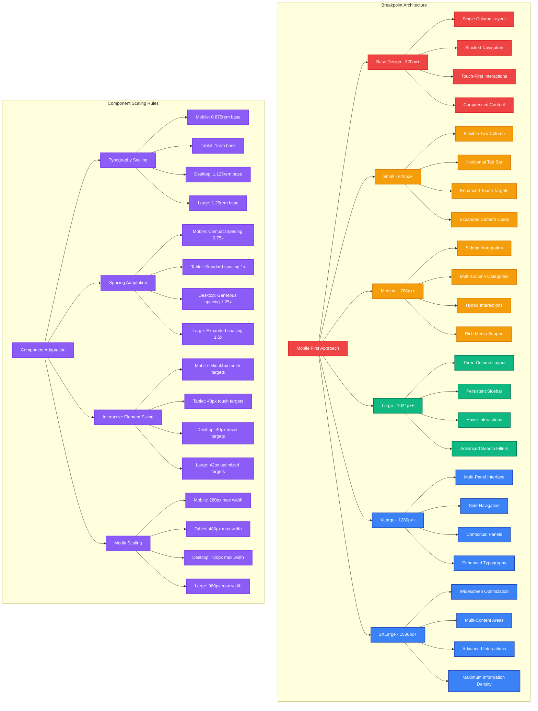
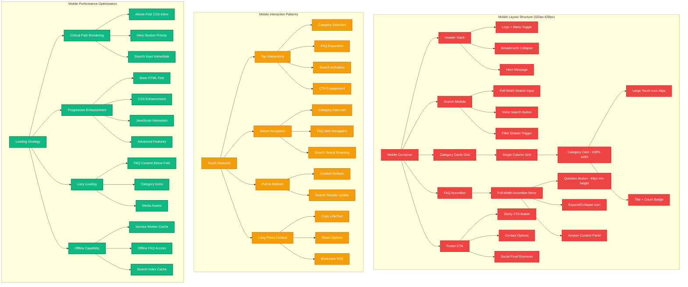
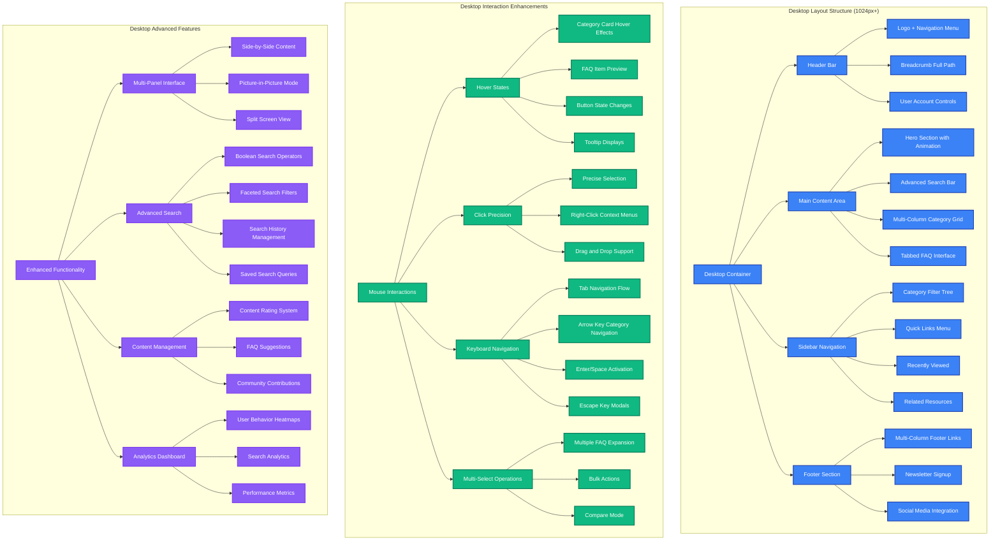
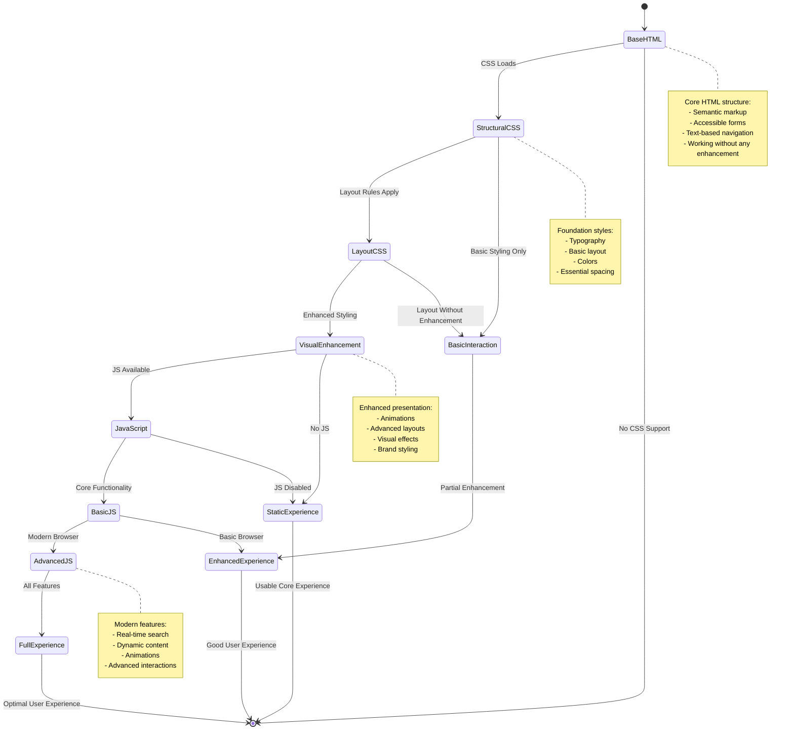
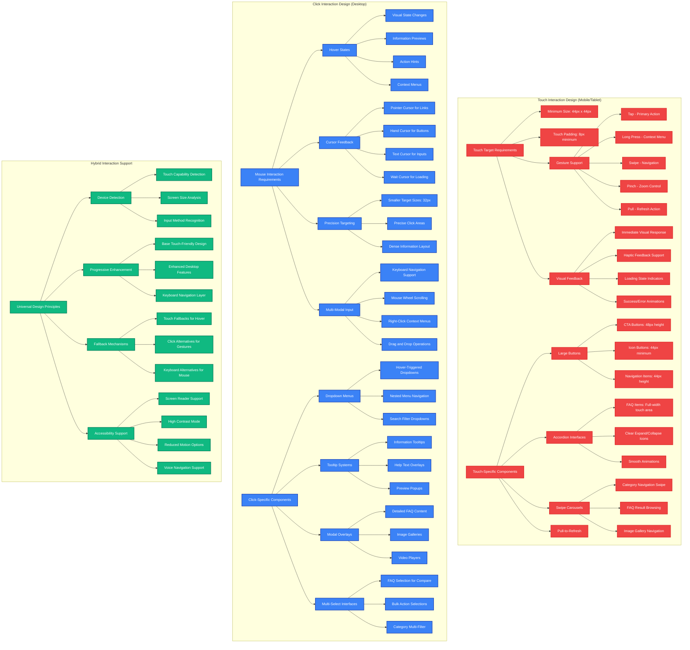

# Responsive Design Breakdown

**Author:** Gil Klainert  
**Date:** 2025-08-20  
**Description:** Comprehensive responsive design architecture for CVPlus FAQ page covering component layout across breakpoints, mobile vs desktop interaction patterns, progressive enhancement strategy, and touch vs click interaction flows.

## Responsive Breakpoint Strategy

## Mobile-First Layout Components

## Desktop Layout Components

## Progressive Enhancement Strategy

## Touch vs Click Interaction Design

## Component Responsiveness Matrix

```mermaid
graph LR
    subgraph "Component Adaptation Rules"
        A[FAQ Search Bar] --> B[Mobile: Full Width]
        A --> C[Tablet: 75% Width]
        A --> D[Desktop: 50% Width]
        A --> E[Large: 40% Width]
        
        F[Category Grid] --> G[Mobile: 1 Column]
        F --> H[Tablet: 2 Columns]
        F --> I[Desktop: 3 Columns]
        F --> J[Large: 4 Columns]
        
        K[FAQ Accordion] --> L[Mobile: Single Panel]
        K --> M[Tablet: Single Panel Enhanced]
        K --> N[Desktop: Multi-Panel Option]
        K --> O[Large: Side-by-Side View]
        
        P[Navigation] --> Q[Mobile: Hamburger Menu]
        P --> R[Tablet: Tab Bar]
        P --> S[Desktop: Horizontal Menu]
        P --> T[Large: Mega Menu]
        
        U[Content Typography] --> V[Mobile: 16px base]
        U --> W[Tablet: 17px base]
        U --> X[Desktop: 18px base]
        U --> Y[Large: 19px base]
        
        Z[Interactive Elements] --> AA[Mobile: 44px minimum]
        Z --> BB[Tablet: 48px optimal]
        Z --> CC[Desktop: 40px standard]
        Z --> DD[Large: 42px enhanced]
    end

    subgraph "Layout Transformation Patterns"
        EE[Stacked → Horizontal] --> FF[Mobile: Vertical Stack]
        EE --> GG[Desktop: Horizontal Flow]
        
        HH[Hidden → Visible] --> II[Mobile: Progressive Disclosure]
        HH --> JJ[Desktop: Always Visible]
        
        KK[Overlay → Inline] --> LL[Mobile: Modal/Drawer]
        KK --> MM[Desktop: Inline Panel]
        
        NN[Simplified → Enhanced] --> OO[Mobile: Core Features]
        NN --> PP[Desktop: Full Feature Set]
    end

    %% Styling
    classDef adaptation fill:#8b5cf6,stroke:#7c3aed,stroke-width:2px,color:#fff
    classDef transformation fill:#f59e0b,stroke:#d97706,stroke-width:2px,color:#fff

    class A,B,C,D,E,F,G,H,I,J,K,L,M,N,O,P,Q,R,S,T,U,V,W,X,Y,Z,AA,BB,CC,DD adaptation
    class EE,FF,GG,HH,II,JJ,KK,LL,MM,NN,OO,PP transformation
```

This comprehensive responsive design breakdown ensures the CVPlus FAQ page provides an optimal user experience across all device types and screen sizes, with careful attention to interaction patterns, performance optimization, and accessibility considerations.