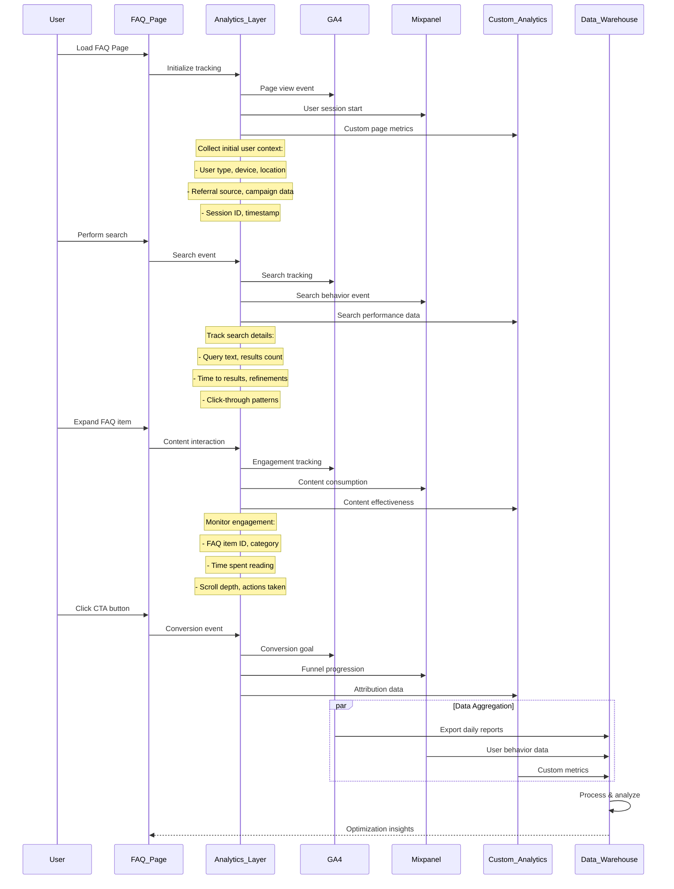
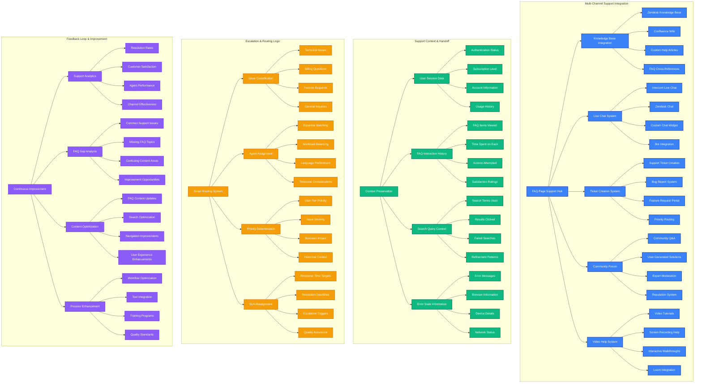
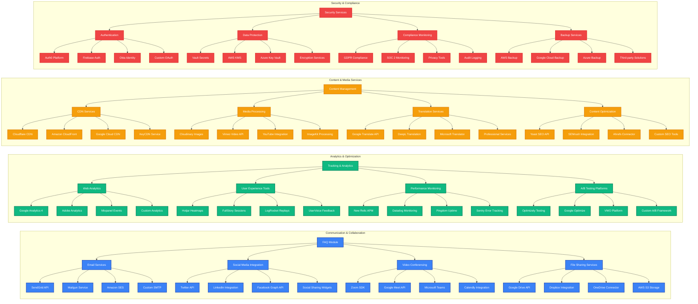
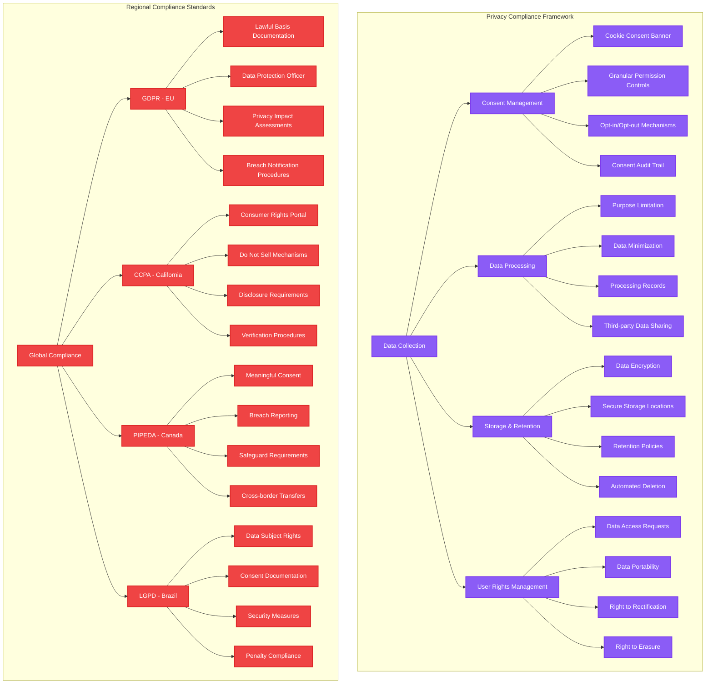

# Integration Architecture

**Author:** Gil Klainert  
**Date:** 2025-08-20  
**Description:** Comprehensive integration architecture for CVPlus FAQ page covering platform integration, API connections, data sources, analytics implementation, support system integration, and third-party service connections.

## CVPlus Platform Integration Architecture

```mermaid
graph TB
    subgraph "CVPlus Core Platform"
        A[CVPlus Main Application] --> B[Shared Authentication Service]
        A --> C[User Profile Management]
        A --> D[Subscription & Billing System]
        A --> E[Content Management System]
        A --> F[Analytics & Tracking Hub]
        
        B --> B1[Firebase Authentication]
        B --> B2[OAuth Providers]
        B --> B3[Session Management]
        B --> B4[Role-Based Access Control]
        
        C --> C1[User Preferences]
        C --> C2[Usage History]
        C --> C3[Personalization Data]
        C --> C4[Account Settings]
        
        D --> D1[Subscription Status]
        D --> D2[Feature Access Control]
        D --> D3[Usage Limits]
        D --> D4[Billing History]
        
        E --> E1[FAQ Content Database]
        E --> E2[Dynamic Content Rules]
        E --> E3[Content Versioning]
        E --> E4[Workflow Management]
        
        F --> F1[User Behavior Tracking]
        F --> F2[Conversion Analytics]
        F --> F3[Performance Monitoring]
        F --> F4[A/B Testing Framework]
    end

    subgraph "FAQ Module Integration Points"
        G[FAQ Page Module] --> H[Authentication Integration]
        G --> I[Content Personalization]
        G --> J[Feature Gate Integration]
        G --> K[Analytics Integration]
        G --> L[Support Integration]
        
        H --> H1[Single Sign-On (SSO)]
        H --> H2[User Context Passing]
        H --> H3[Permission Validation]
        
        I --> I1[User-Specific Content]
        I --> I2[Journey-Based Recommendations]
        I --> I3[Contextual Help Content]
        
        J --> J1[Premium Feature Explanations]
        J --> J2[Upgrade Prompts]
        J --> J3[Feature Availability Display]
        
        K --> K1[Page View Tracking]
        K --> K2[Interaction Event Logging]
        K --> K3[Conversion Attribution]
        K --> K4[Performance Metrics Collection]
        
        L --> L1[Support Ticket Creation]
        L --> L2[Live Chat Integration]
        L --> L3[Knowledge Base Sync]
        L --> L4[Escalation Workflows]
    end

    subgraph "Cross-Platform Data Flow"
        M[Data Synchronization] --> N[Real-time Updates]
        M --> O[Batch Processing]
        M --> P[Event-Driven Updates]
        
        N --> N1[WebSocket Connections]
        N --> N2[Server-Sent Events]
        N --> N3[Live Content Updates]
        
        O --> O1[Scheduled Content Sync]
        O --> O2[User Data Aggregation]
        O --> O3[Analytics Data Processing]
        
        P --> P1[User Action Triggers]
        P --> P2[Content Change Events]
        P --> P3[System State Changes]
    end

    %% Styling
    classDef corePlatform fill:#1e40af,stroke:#1e3a8a,stroke-width:3px,color:#fff
    classDef faqIntegration fill:#3b82f6,stroke:#2563eb,stroke-width:2px,color:#fff
    classDef dataFlow fill:#10b981,stroke:#047857,stroke-width:2px,color:#fff

    class A,B,C,D,E,F,B1,B2,B3,B4,C1,C2,C3,C4,D1,D2,D3,D4,E1,E2,E3,E4,F1,F2,F3,F4 corePlatform
    class G,H,I,J,K,L,H1,H2,H3,I1,I2,I3,J1,J2,J3,K1,K2,K3,K4,L1,L2,L3,L4 faqIntegration
    class M,N,O,P,N1,N2,N3,O1,O2,O3,P1,P2,P3 dataFlow
```

## API Integration & Data Sources

```mermaid
graph LR
    subgraph "External API Integrations"
        A[FAQ Module] --> B[Search API Service]
        A --> C[Content Management API]
        A --> D[User Analytics API]
        A --> E[Support System API]
        A --> F[Email Service API]
        
        B --> B1[Elasticsearch/Algolia]
        B --> B2[Full-text Search]
        B --> B3[Faceted Search]
        B --> B4[Search Analytics]
        
        C --> C1[Headless CMS]
        C --> C2[Content Delivery Network]
        C --> C3[Media Asset Management]
        C --> C4[Version Control]
        
        D --> D1[Google Analytics 4]
        D --> D2[Mixpanel Events]
        D --> D3[Hotjar Heatmaps]
        D --> D4[Custom Analytics]
        
        E --> E1[Zendesk Integration]
        E --> E2[Intercom Chat]
        E --> E3[Freshdesk Tickets]
        E --> E4[Custom Support Portal]
        
        F --> F1[SendGrid Transactional]
        F --> F2[Mailchimp Campaigns]
        F --> F3[Notification Service]
        F --> F4[Email Templates]
    end

    subgraph "Internal Data Sources"
        G[FAQ Database] --> H[Primary Content Store]
        G --> I[Search Index]
        G --> J[Media Repository]
        G --> K[Analytics Warehouse]
        
        H --> H1[FAQ Articles]
        H --> H2[Category Definitions]
        H --> H3[Tag Relationships]
        H --> H4[Content Metadata]
        
        I --> I1[Indexed FAQ Content]
        I --> I2[Search Terms]
        I --> I3[Popular Queries]
        I --> I4[Result Rankings]
        
        J --> J1[Screenshots]
        J --> J2[Video Tutorials]
        J --> J3[Icons & Graphics]
        J --> J4[Audio Files]
        
        K --> K1[User Interaction Data]
        K --> K2[Search Performance]
        K --> K3[Content Effectiveness]
        K --> K4[Conversion Metrics]
    end

    subgraph "API Security & Performance"
        L[Security Layer] --> M[Authentication]
        L --> N[Authorization]
        L --> O[Rate Limiting]
        L --> P[Data Validation]
        
        M --> M1[API Keys]
        M --> M2[JWT Tokens]
        M --> M3[OAuth 2.0]
        
        N --> N1[Role-Based Access]
        N --> N2[Resource Permissions]
        N --> N3[Scope Validation]
        
        O --> O1[Request Throttling]
        O --> O2[Usage Quotas]
        O --> O3[Fair Use Policies]
        
        P --> P1[Input Sanitization]
        P --> P2[Schema Validation]
        P --> P3[Output Filtering]
        
        Q[Performance Optimization] --> R[Caching Strategies]
        Q --> S[Connection Pooling]
        Q --> T[Response Compression]
        
        R --> R1[Redis Cache]
        R --> R2[CDN Integration]
        R --> R3[Browser Caching]
        
        S --> S1[Database Connections]
        S --> S2[API Connection Reuse]
        S --> S3[Connection Limiting]
        
        T --> T1[Gzip Compression]
        T --> T2[JSON Minification]
        T --> T3[Image Optimization]
    end

    %% Styling
    classDef externalAPI fill:#ef4444,stroke:#dc2626,stroke-width:2px,color:#fff
    classDef internalData fill:#3b82f6,stroke:#1e40af,stroke-width:2px,color:#fff
    classDef security fill:#10b981,stroke:#047857,stroke-width:2px,color:#fff
    classDef performance fill:#f59e0b,stroke:#d97706,stroke-width:2px,color:#fff

    class A,B,C,D,E,F,B1,B2,B3,B4,C1,C2,C3,C4,D1,D2,D3,D4,E1,E2,E3,E4,F1,F2,F3,F4 externalAPI
    class G,H,I,J,K,H1,H2,H3,H4,I1,I2,I3,I4,J1,J2,J3,J4,K1,K2,K3,K4 internalData
    class L,M,N,O,P,M1,M2,M3,N1,N2,N3,O1,O2,O3,P1,P2,P3 security
    class Q,R,S,T,R1,R2,R3,S1,S2,S3,T1,T2,T3 performance
```



## Analytics & Tracking Implementation



## Support System Integration Architecture



## Third-Party Service Integration



## Data Privacy & Compliance Integration



This comprehensive integration architecture ensures seamless connectivity between the CVPlus FAQ page and all necessary systems, services, and compliance requirements while maintaining high performance, security, and user experience standards.