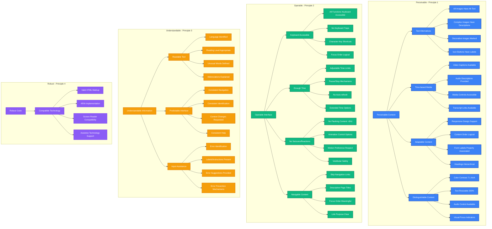
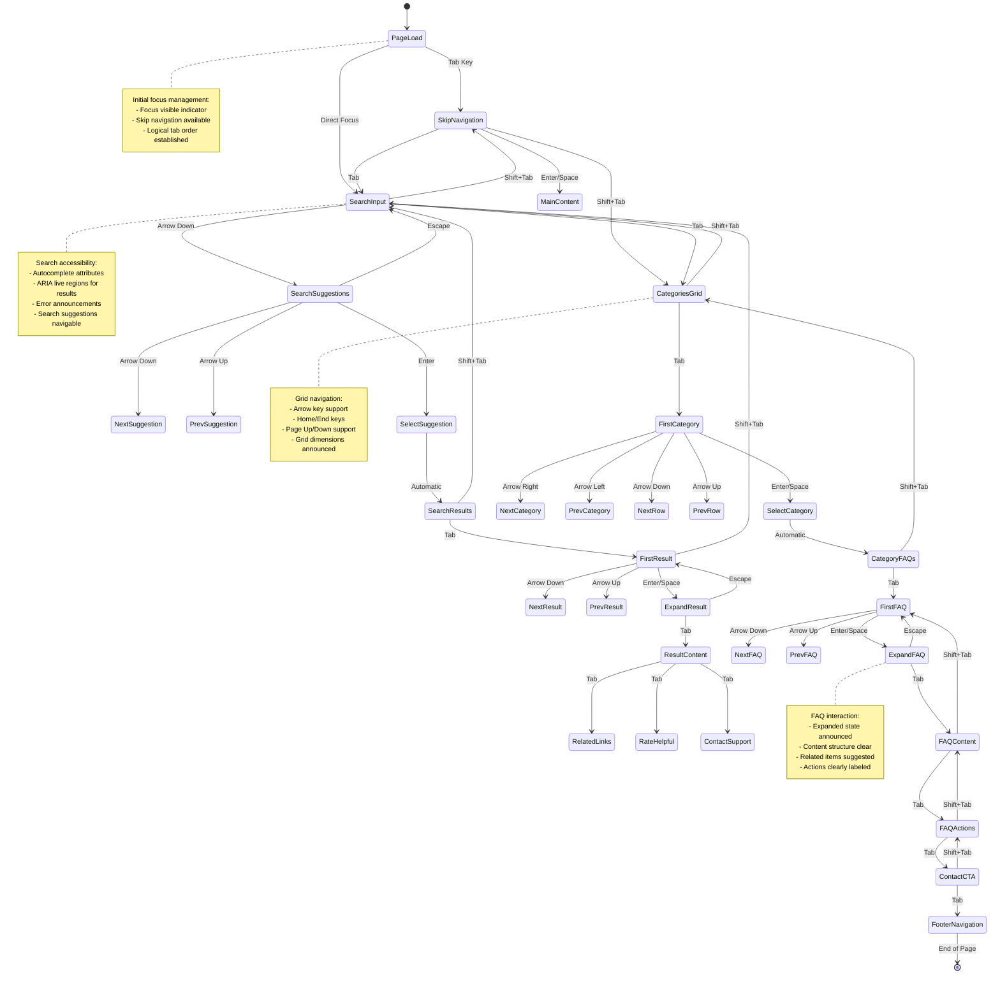
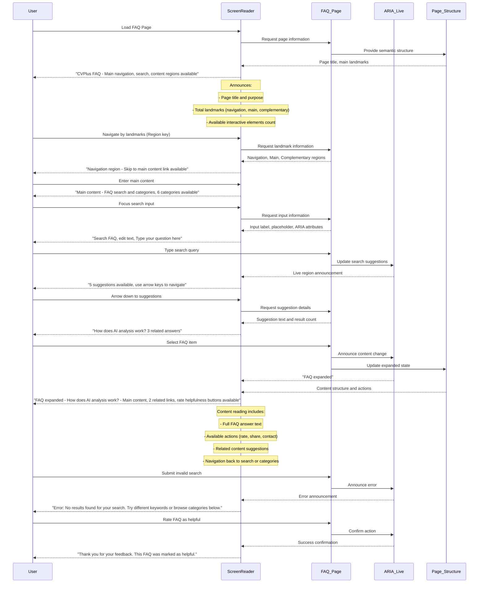
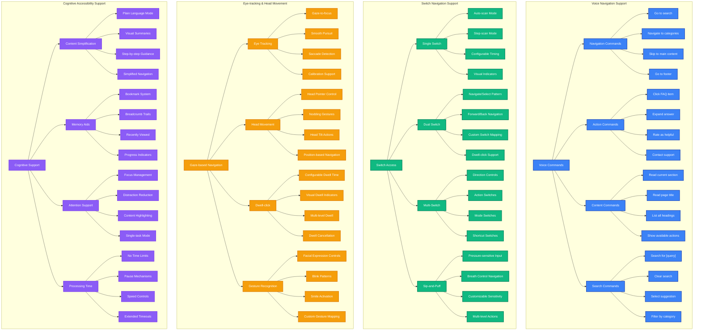

# Accessibility Flow Diagram

**Author:** Gil Klainert  
**Date:** 2025-08-20  
**Description:** Comprehensive accessibility architecture for CVPlus FAQ page covering keyboard navigation paths, screen reader interaction patterns, WCAG compliance checkpoints, alternative access methods, and inclusive design principles.

## WCAG 2.1 AAA Compliance Architecture



## Keyboard Navigation Architecture



## Screen Reader Interaction Patterns



## Alternative Access Methods



## ARIA Implementation Architecture

```mermaid
graph LR
    subgraph "ARIA Landmarks & Structure"
        A[Page Structure] --> B[Banner Role]
        A --> C[Navigation Role]
        A --> D[Main Role]
        A --> E[Complementary Role]
        A --> F[Contentinfo Role]
        
        B --> B1[Site Header]
        B --> B2[Page Title]
        B --> B3[User Account Info]
        
        C --> C1[Skip Navigation Links]
        C --> C2[Breadcrumb Navigation]
        C --> C3[Category Menu]
        
        D --> D1[Search Section]
        D --> D2[FAQ Content Area]
        D --> D3[Results Display]
        
        E --> E1[Related Links Sidebar]
        E --> E2[Help Resources]
        E --> E3[Contact Information]
        
        F --> F1[Footer Links]
        F --> F2[Legal Information]
        F --> F3[Social Media]
    end

    subgraph "Interactive Elements ARIA"
        G[Form Controls] --> H[Search Input]
        G --> I[Filter Controls]
        G --> J[Rating Buttons]
        G --> K[Contact Forms]
        
        H --> H1[aria-label="Search FAQ"]
        H --> H2[aria-describedby="search-help"]
        H --> H3[aria-expanded for suggestions]
        H --> H4[aria-activedescendant]
        
        I --> I1[aria-controls="faq-list"]
        I --> I2[aria-pressed for toggles]
        I --> I3[role="group" for sets]
        I --> I4[aria-labelledby for groups]
        
        J --> J1[aria-label="Rate helpful"]
        J --> J2[aria-pressed for selections]
        J --> J3[role="radiogroup"]
        J --> J4[aria-describedby="rating-help"]
        
        K --> K1[aria-required="true"]
        K --> K2[aria-invalid for errors]
        K --> K3[aria-describedby for help]
        K --> K4[role="alert" for messages]
    end

    subgraph "Dynamic Content ARIA"
        L[Live Regions] --> M[Search Results]
        L --> N[Status Messages]
        L --> O[Error Announcements]
        L --> P[Loading States]
        
        M --> M1[aria-live="polite"]
        M --> M2[aria-atomic="true"]
        M --> M3[aria-relevant="additions text"]
        M --> M4[role="status"]
        
        N --> N1[aria-live="assertive"]
        N --> N2[role="alert"]
        N --> N3[aria-describedby connections]
        N --> N4[Temporary announcements]
        
        O --> O1[role="alert"]
        O --> O2[aria-live="assertive"]
        O --> O3[Error correction guidance]
        O --> O4[Focus management]
        
        P --> P1[aria-busy="true"]
        P --> P2[aria-live="polite"]
        P --> P3[Progress indicators]
        P --> P4[Completion announcements]
    end

    subgraph "Content Relationships"
        Q[Semantic Relationships] --> R[Headings Hierarchy]
        Q --> S[Content Grouping]
        Q --> T[Cross References]
        Q --> U[Contextual Help]
        
        R --> R1[h1-h6 proper nesting]
        R --> R2[aria-labelledby for sections]
        R --> R3[Logical heading structure]
        R --> R4[Heading navigation support]
        
        S --> S1[role="group" for related items]
        S --> S2[fieldset/legend for forms]
        S --> S3[aria-labelledby for groups]
        S --> S4[list/listitem for sequences]
        
        T --> T1[aria-describedby links]
        T --> T2[Related content tagging]
        T --> T3[Cross-reference indicators]
        T --> T4[Context preservation]
        
        U --> U1[aria-describedby for help text]
        U --> U2[Tooltip associations]
        U --> U3[Contextual instructions]
        U --> U4[Help text timing]
    end

    %% Styling
    classDef structure fill:#3b82f6,stroke:#1e40af,stroke-width:2px,color:#fff
    classDef interactive fill:#10b981,stroke:#047857,stroke-width:2px,color:#fff
    classDef dynamic fill:#f59e0b,stroke:#d97706,stroke-width:2px,color:#fff
    classDef relationships fill:#8b5cf6,stroke:#7c3aed,stroke-width:2px,color:#fff

    class A,B,C,D,E,F,B1,B2,B3,C1,C2,C3,D1,D2,D3,E1,E2,E3,F1,F2,F3 structure
    class G,H,I,J,K,H1,H2,H3,H4,I1,I2,I3,I4,J1,J2,J3,J4,K1,K2,K3,K4 interactive
    class L,M,N,O,P,M1,M2,M3,M4,N1,N2,N3,N4,O1,O2,O3,O4,P1,P2,P3,P4 dynamic
    class Q,R,S,T,U,R1,R2,R3,R4,S1,S2,S3,S4,T1,T2,T3,T4,U1,U2,U3,U4 relationships
```

## Accessibility Testing & Validation Framework

```mermaid
flowchart TD
    subgraph "Automated Testing Pipeline"
        A[Accessibility Testing] --> B[Static Analysis]
        A --> C[Dynamic Testing]
        A --> D[Visual Regression]
        A --> E[Performance Impact]
        
        B --> B1[HTML Validation]
        B --> B2[ARIA Validation]
        B --> B3[Color Contrast Checking]
        B --> B4[Heading Structure Analysis]
        
        C --> C1[Keyboard Navigation Testing]
        C --> C2[Screen Reader Simulation]
        C --> C3[Focus Management Testing]
        C --> C4[Live Region Validation]
        
        D --> D1[Focus Indicator Visibility]
        D --> D2[High Contrast Mode]
        D --> D3[Text Scaling Validation]
        D --> D4[Layout Stability Checks]
        
        E --> E1[AT Performance Impact]
        E --> E2[DOM Complexity Analysis]
        E --> E3[Event Handler Overhead]
        E --> E4[Memory Usage Monitoring]
    end

    subgraph "Manual Testing Protocols"
        F[Human Testing] --> G[Keyboard-Only Testing]
        F --> H[Screen Reader Testing]
        F --> I[Voice Navigation Testing]
        F --> J[Cognitive Load Testing]
        
        G --> G1[Tab Navigation Flow]
        G --> G2[Keyboard Shortcuts]
        G --> G3[Focus Trap Testing]
        G --> G4[Modal Navigation]
        
        H --> H1[NVDA Testing]
        H --> H2[JAWS Testing]
        H --> H3[VoiceOver Testing]
        H --> H4[Dragon NaturallySpeaking]
        
        I --> I1[Voice Control Testing]
        I --> I2[Voice Access Testing]
        I --> I3[Switch Navigation]
        I --> I4[Eye-tracking Testing]
        
        J --> J1[Task Completion Time]
        J --> J2[Error Recovery Testing]
        J --> J3[Cognitive Load Assessment]
        J --> J4[User Comprehension]
    end

    subgraph "User Acceptance Testing"
        K[Real User Testing] --> L[Disabled User Community]
        K --> M[Assistive Technology Users]
        K --> N[Diverse Ability Groups]
        K --> O[Cognitive Accessibility Users]
        
        L --> L1[Blind/Low Vision Users]
        L --> L2[Motor Impairment Users]
        L --> L3[Hearing Impairment Users]
        L --> L4[Multiple Disability Users]
        
        M --> M1[Screen Reader Power Users]
        M --> M2[Switch Navigation Experts]
        M --> M3[Voice Control Users]
        M --> M4[Eye-tracking Users]
        
        N --> N1[Age-related Accessibility]
        N --> N2[Temporary Disability]
        N --> N3[Environmental Constraints]
        N --> N4[Technology Limitations]
        
        O --> O1[Learning Disabilities]
        O --> O2[Memory Challenges]
        O --> O3[Attention Difficulties]
        O --> O4[Processing Speed Variations]
    end

    %% Testing Flow Connections
    B --> F
    C --> F
    D --> F
    E --> F
    F --> K
    K --> P[Accessibility Certification]
    
    P --> Q[WCAG 2.1 AAA Compliance]
    P --> R[Section 508 Compliance]
    P --> S[ADA Compliance]
    P --> T[International Standards]

    %% Styling
    classDef automated fill:#3b82f6,stroke:#1e40af,stroke-width:2px,color:#fff
    classDef manual fill:#10b981,stroke:#047857,stroke-width:2px,color:#fff
    classDef userTesting fill:#f59e0b,stroke:#d97706,stroke-width:2px,color:#fff
    classDef certification fill:#8b5cf6,stroke:#7c3aed,stroke-width:2px,color:#fff

    class A,B,C,D,E,B1,B2,B3,B4,C1,C2,C3,C4,D1,D2,D3,D4,E1,E2,E3,E4 automated
    class F,G,H,I,J,G1,G2,G3,G4,H1,H2,H3,H4,I1,I2,I3,I4,J1,J2,J3,J4 manual
    class K,L,M,N,O,L1,L2,L3,L4,M1,M2,M3,M4,N1,N2,N3,N4,O1,O2,O3,O4 userTesting
    class P,Q,R,S,T certification
```



This comprehensive accessibility flow diagram ensures that the CVPlus FAQ page is fully accessible to users with all types of disabilities, meeting the highest international accessibility standards while providing multiple interaction methods and comprehensive testing validation.