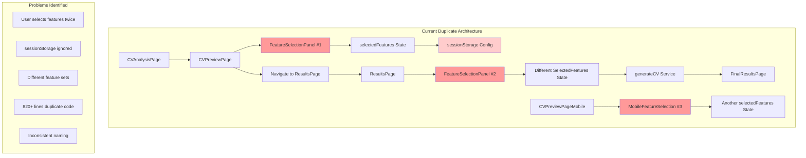
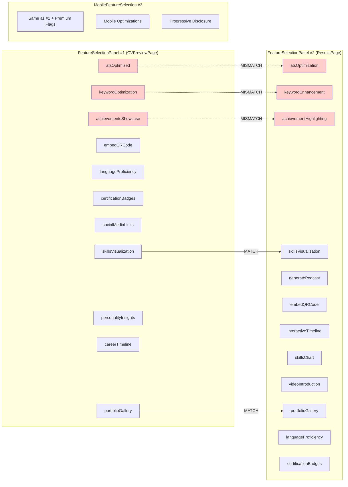
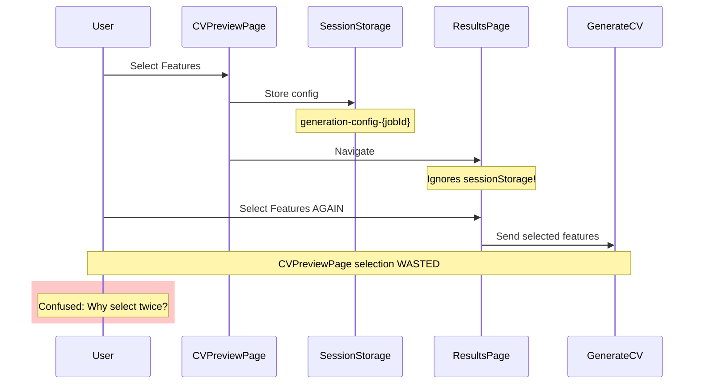
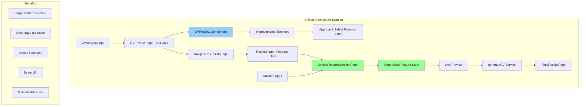
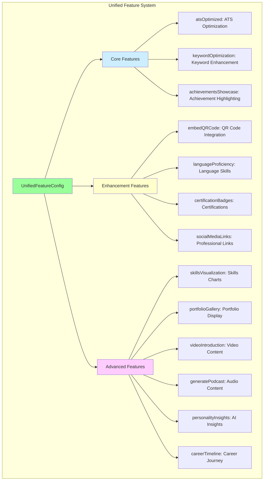
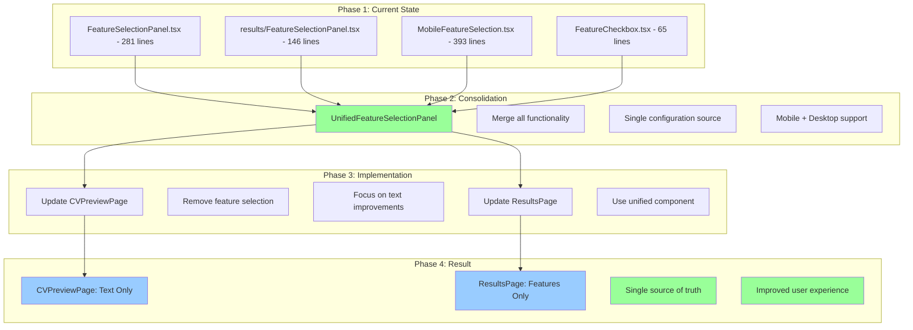
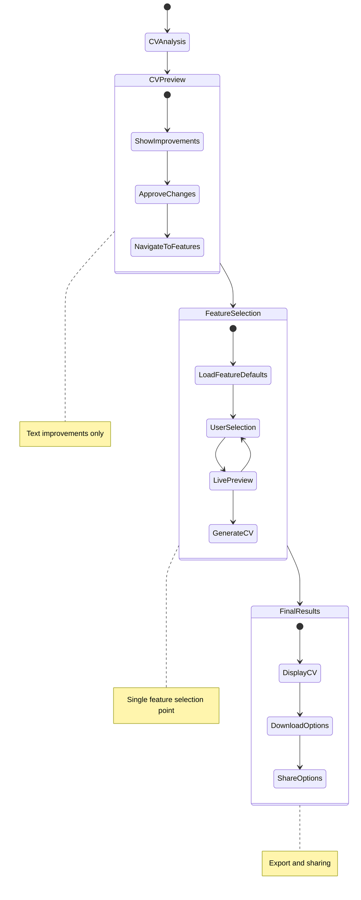
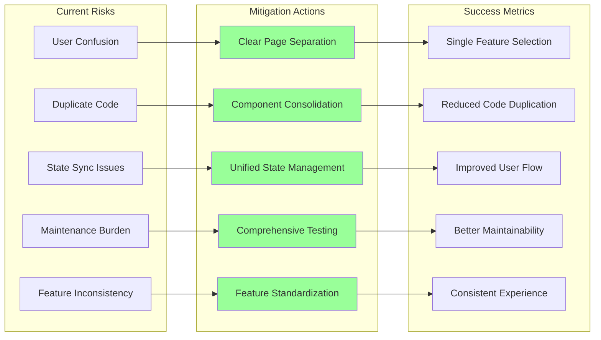

# Feature Selection Consolidation - Architecture Diagrams

## Current State Architecture (Problematic)

## Current Feature Set Comparison

## Data Flow Issues

## Proposed Unified Architecture

## Unified Feature Configuration

## Component Consolidation Plan

## State Management Improvement

## Risk Mitigation Strategy

