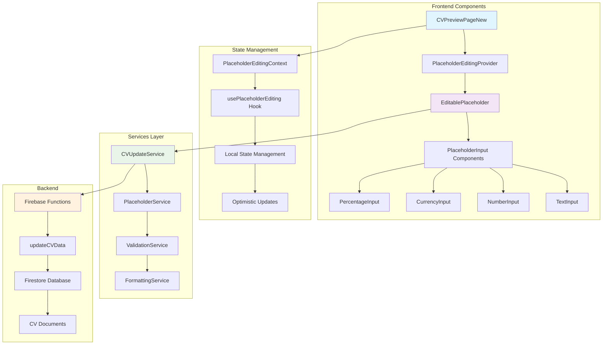
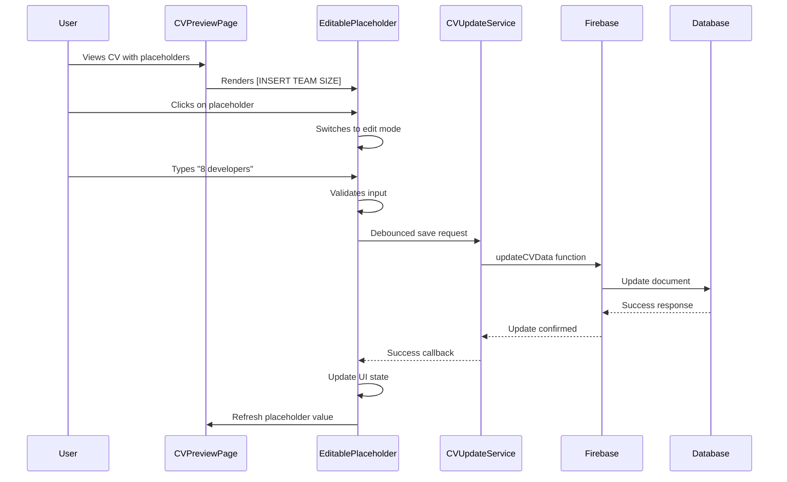
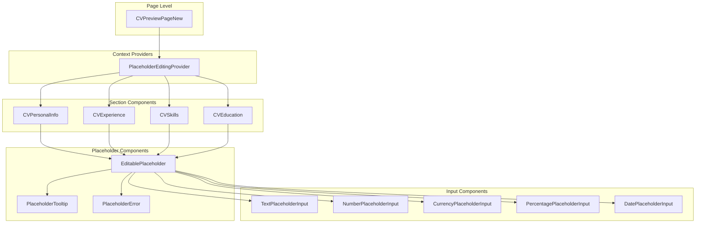
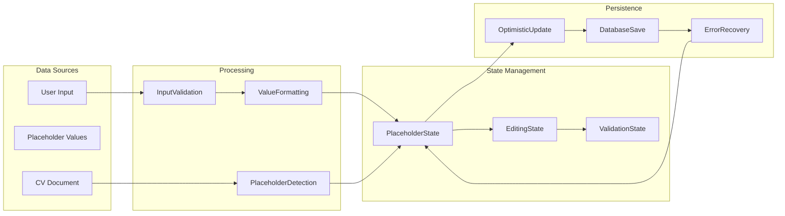
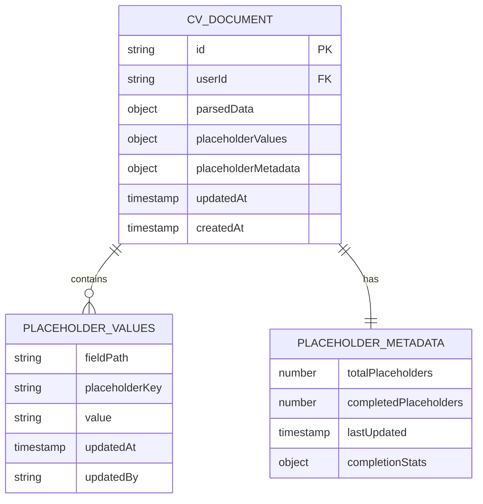
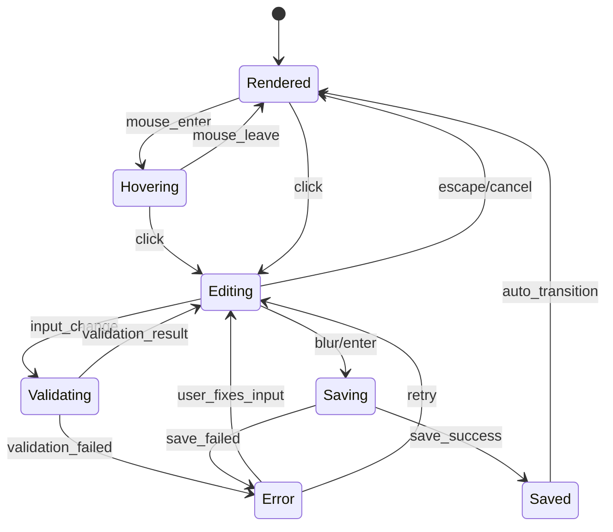
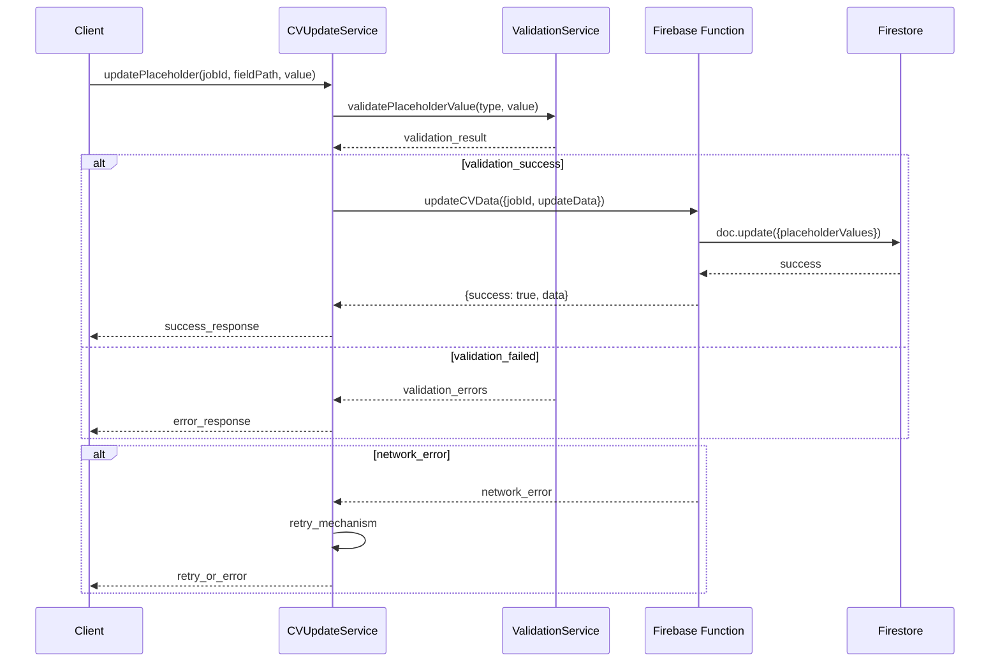
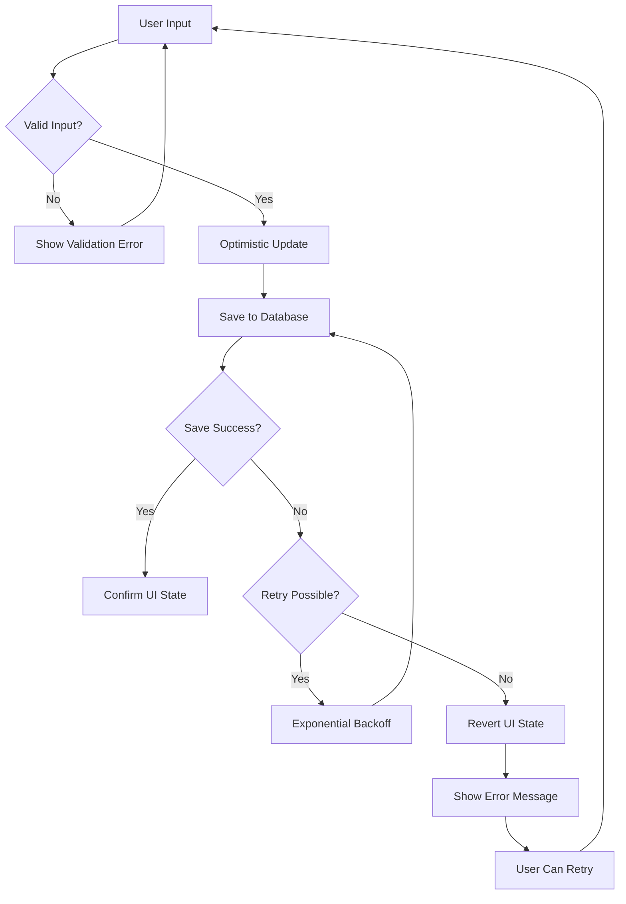
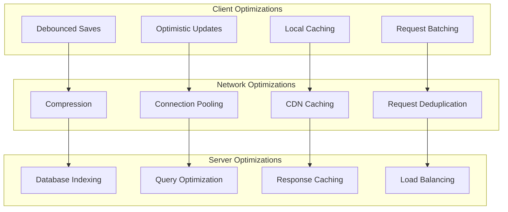
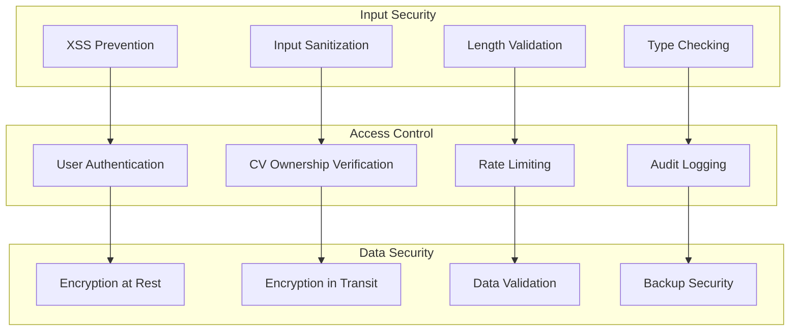

# Inline Placeholder Editing - System Architecture Diagrams

## 1. Overall System Architecture

## 2. User Interaction Flow

## 3. Component Hierarchy

## 4. Data Flow Architecture

## 5. Database Schema

## 6. State Transition Diagram

## 7. API Integration Flow

## 8. Error Handling Flow

## 9. Performance Optimization Strategy

## 10. Security Architecture

