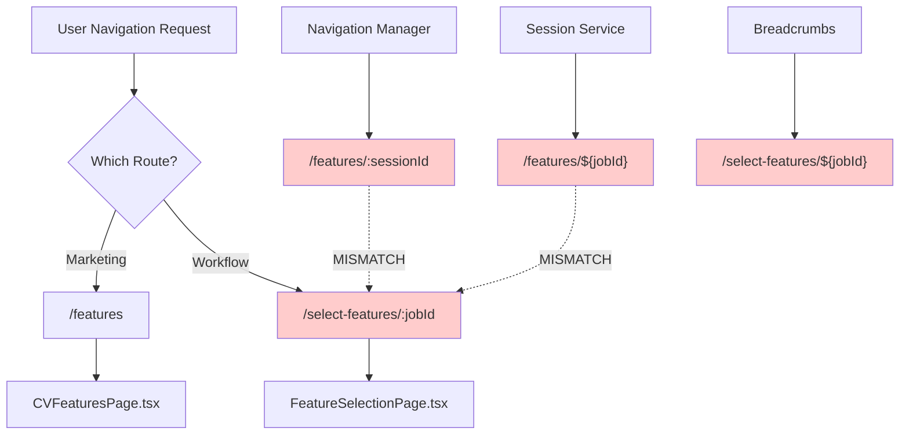
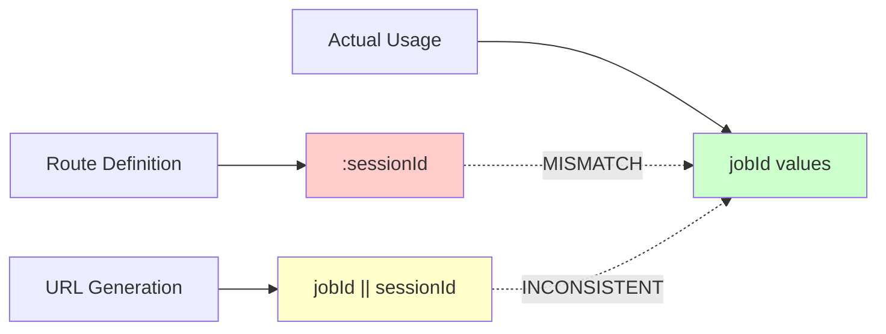
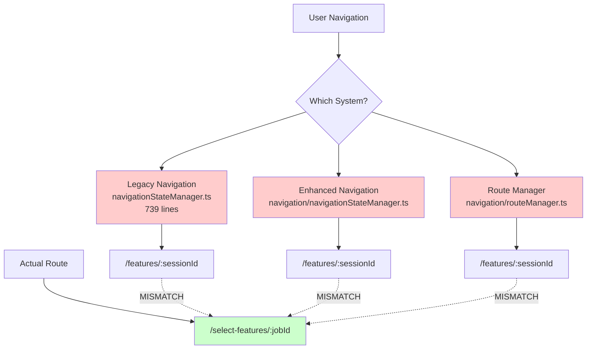
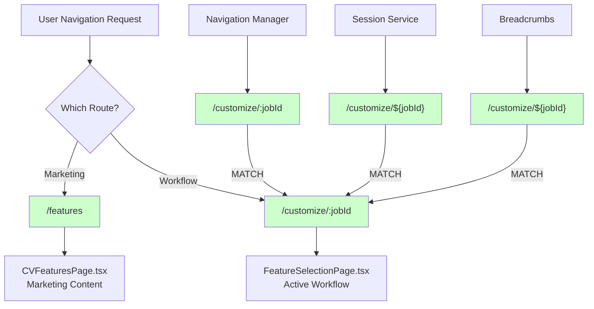
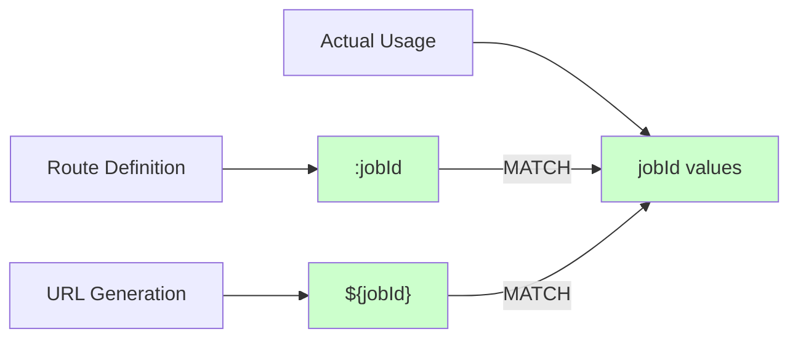
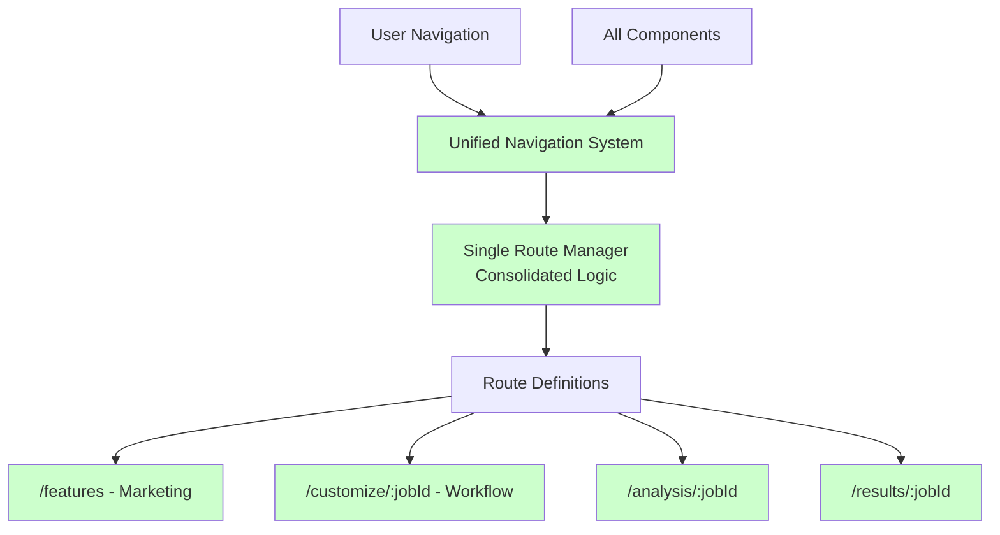
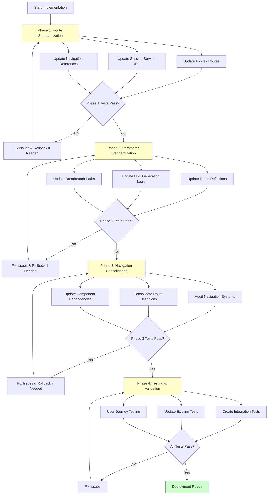
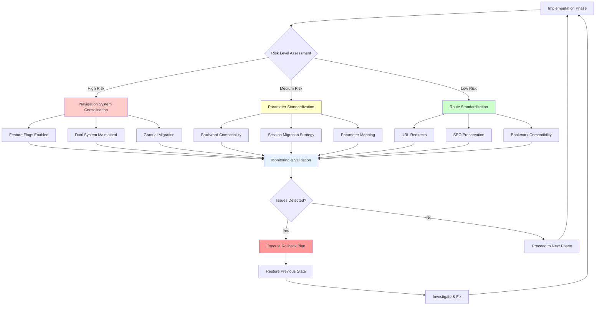
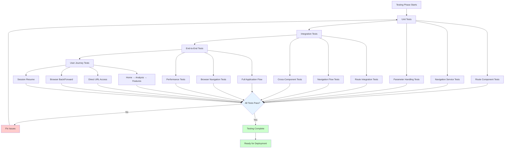

# CVPlus Navigation System Fix - Flow Diagrams

## Current State - Navigation Issues

### Current Route Conflicts


### Current Parameter Inconsistencies


### Current Navigation System Conflicts


## Proposed Solution - Fixed Navigation Flow

### Phase 1: Route Standardization


### Phase 2: Parameter Standardization


### Phase 3: Navigation System Consolidation


## Implementation Flow Diagram

### Phase-by-Phase Implementation


## User Journey Flow - Before & After

### Before: Broken User Journey with THREE Duplicates
```mermaid
graph TD
    A[User Starts CV Analysis] --> B[Analysis Complete]
    B --> C[Click 'Select Features']
    C --> D{Which Navigation Path?}
    
    D -->|Path 1| E[/select-features/:jobId]
    D -->|Path 2| F[/results/:jobId - MISNAMED!]
    D -->|Path 3| G[/features - Marketing]
    
    E --> H[FeatureSelectionPage - Feature Selection #1]
    F --> I[ResultsPage - Feature Selection #2 🚨]
    G --> J[CVFeaturesPage - Marketing Features]
    
    H --> K[Navigates to /final-results/:jobId]
    I --> L[Navigates to /final-results/:jobId]
    
    K --> M[Actual Results Display]
    L --> M
    
    N[User Expects Results] --> F
    N --> O[Gets Feature Selection Instead! 🚨]
    
    style F fill:#ff6b6b
    style I fill:#ff6b6b
    style O fill:#ff6b6b
    style N fill:#ffcccc
```

### After: Fixed User Journey - Single Feature Selection Flow
```mermaid
graph TD
    A[User Starts CV Analysis] --> B[Analysis Complete]
    B --> C[Click 'Customize Features']
    C --> D[Unified Navigation System]
    
    D --> E[Single Route: /customize/${jobId}]
    
    E --> F[FeatureSelectionPage - ONLY Feature Selection]
    F --> G[User Completes Feature Selection]
    G --> H[Generate CV]
    H --> I[Navigate to /results/${jobId}]
    
    I --> J[ACTUAL Results Display]
    
    K[Marketing Path] --> L[/features - CVFeaturesPage]
    L --> M[Call to Action: Start CV Upload]
    M --> A
    
    N[Direct Results Access] --> O[/results/abc123]
    O --> J
    P[User Expects Results] --> O
    P --> Q[Gets Actual Results! ✅]
    
    style D fill:#ccffcc
    style E fill:#ccffcc
    style F fill:#ccffcc
    style J fill:#ccffcc
    style Q fill:#ccffcc
    style I fill:#ccffcc
```

## Risk Mitigation Flow

### Risk Assessment and Mitigation


## Testing Strategy Flow

### Comprehensive Testing Approach


These diagrams provide a visual representation of the current navigation issues, proposed solutions, implementation flow, and testing strategy for the CVPlus navigation system fix.