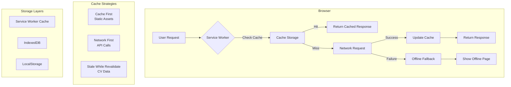
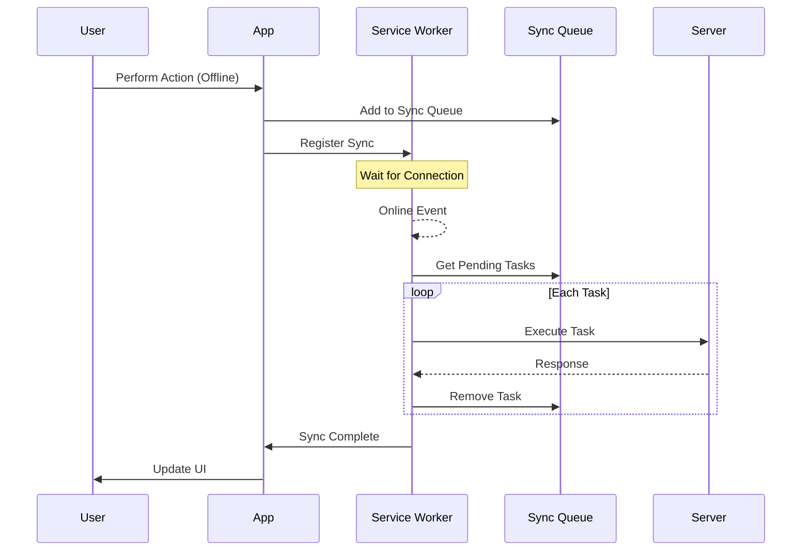
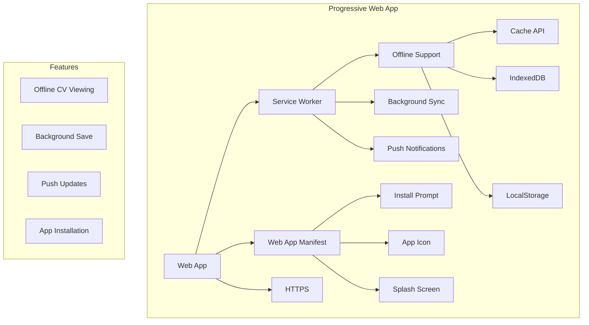
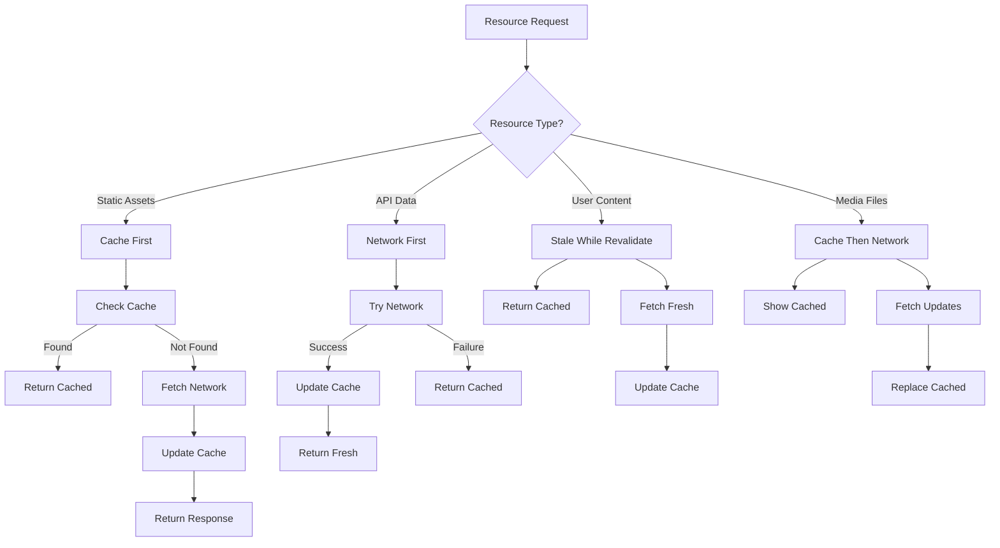
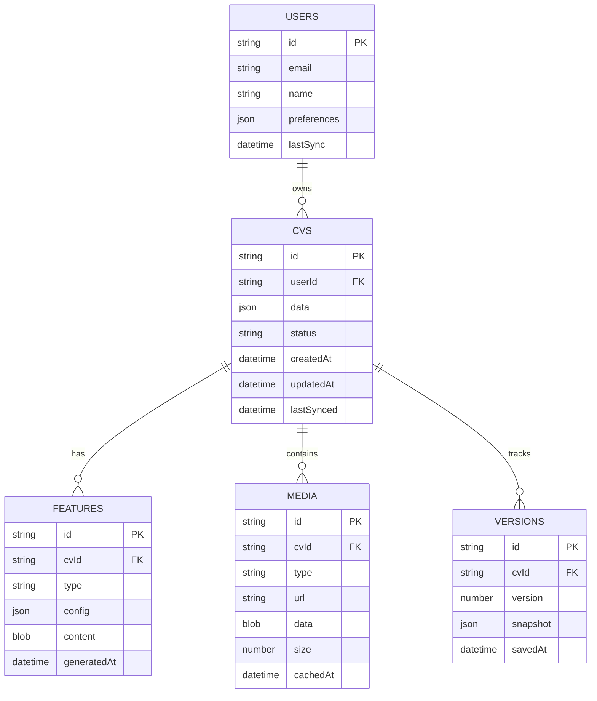
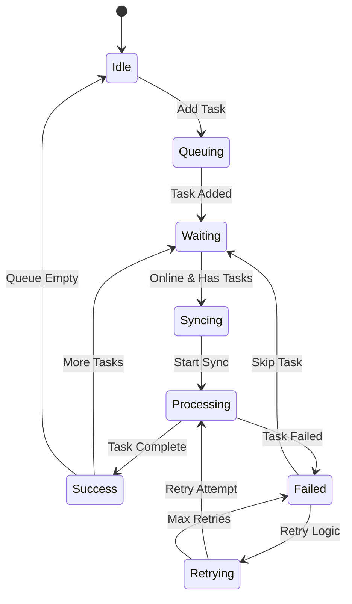

# Offline Support Architecture Diagrams

## Service Worker Cache Flow

## Background Sync Architecture

## PWA Architecture

## Cache Strategy Decision Tree

## IndexedDB Schema

## Sync Queue State Machine

