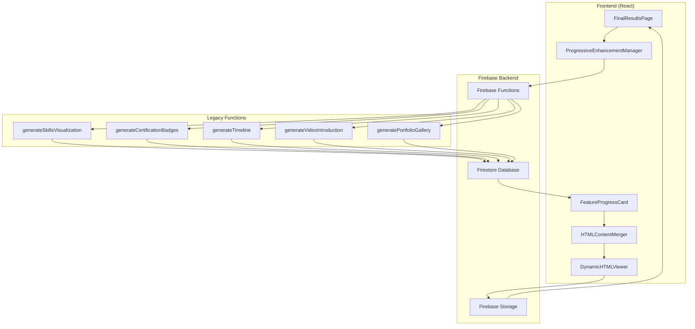
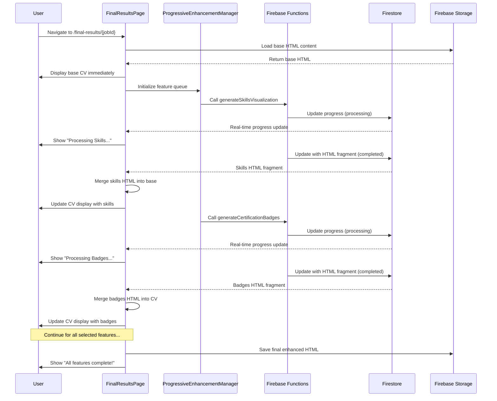
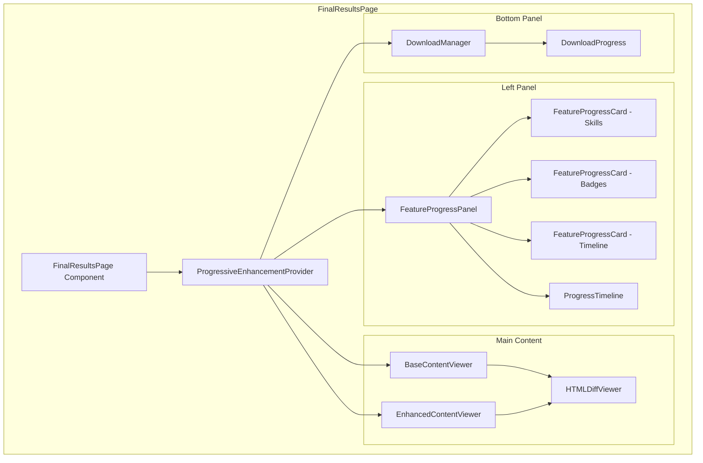
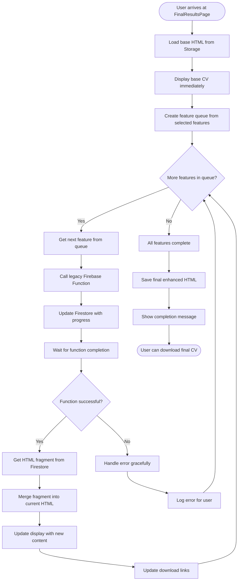
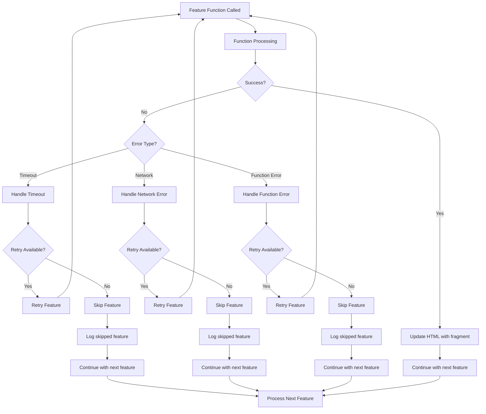
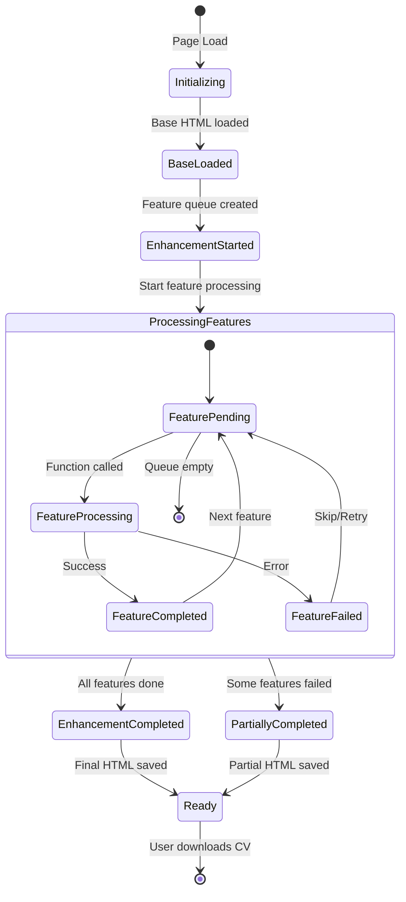
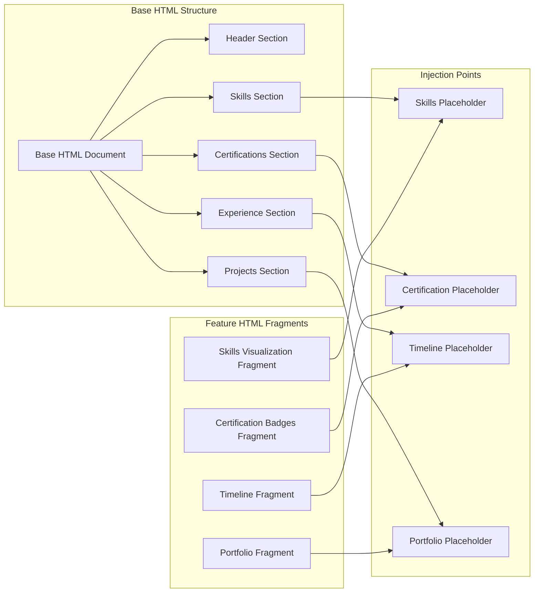
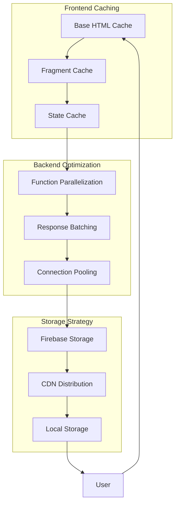

# Progressive CV Enhancement System - Architecture Diagrams

## System Architecture Overview

## Data Flow Sequence

## Component Architecture

## Feature Processing Flow

## Error Handling Flow

## State Management Flow

## HTML Merging Strategy

## Performance and Caching Strategy

These diagrams provide comprehensive visual representation of:
1. **System Architecture**: Overall component relationships
2. **Data Flow**: Sequence of operations from user action to completion
3. **Component Structure**: Internal organization of React components
4. **Feature Processing**: Step-by-step feature enhancement workflow
5. **Error Handling**: Robust error management and recovery
6. **State Management**: Application state transitions
7. **HTML Merging**: Strategy for combining base HTML with feature fragments
8. **Performance**: Caching and optimization approaches

The diagrams complement the implementation plan by providing clear visual guidance for development teams implementing the progressive enhancement system.