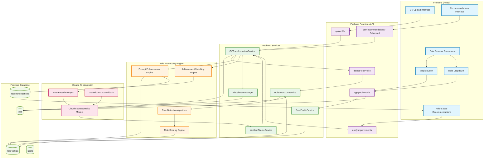
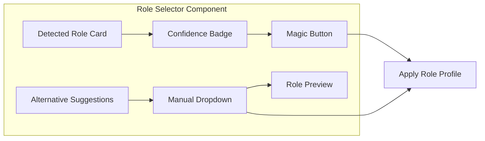
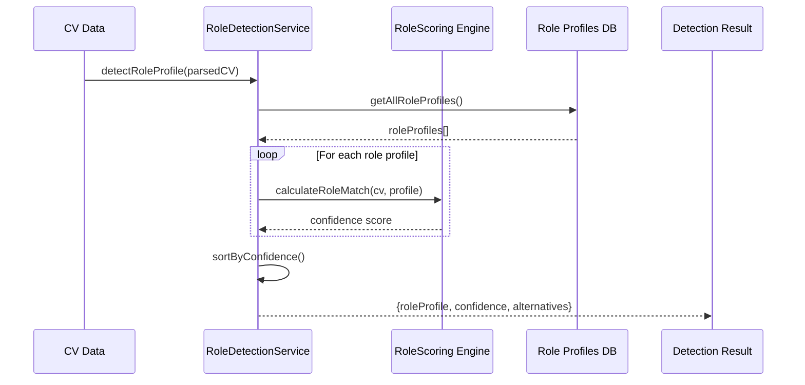
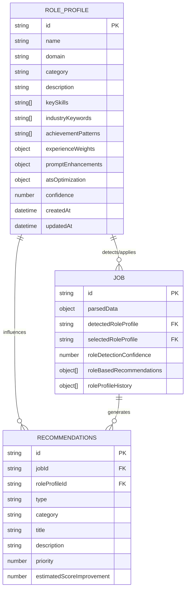
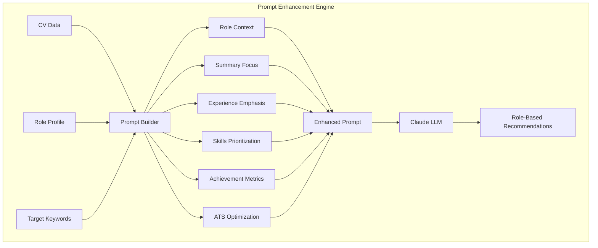
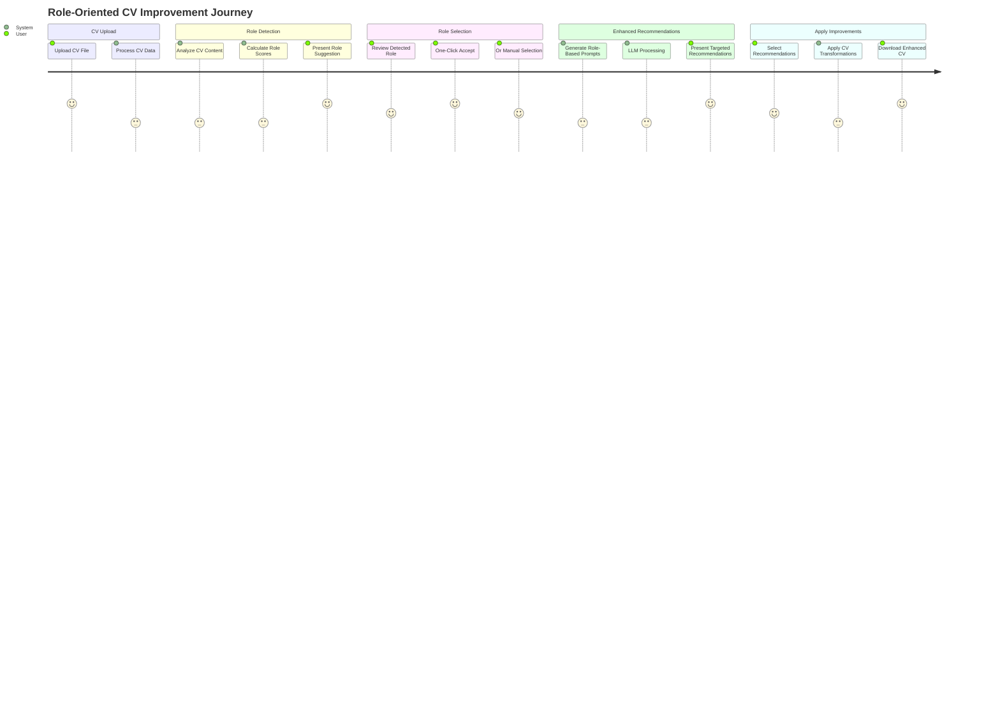
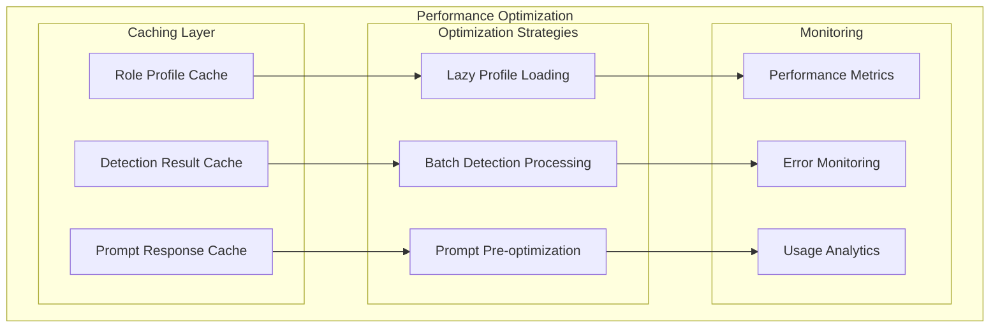

# Role-Oriented CV Processing Architecture

**Author:** Gil Klainert  
**Date:** 2025-01-21  
**Project:** CVPlus  
**Document Type:** Architecture Diagram  
**Related Plan:** [Role-Oriented LLM Prompts Implementation Plan](/docs/plans/2025-01-21-role-oriented-llm-prompts-implementation-plan.md)

## System Architecture Overview

This diagram illustrates the complete architecture for the role-oriented CV processing system, showing how role detection, profile management, and enhanced LLM prompting work together to deliver targeted CV improvements.

## Component Specifications

### Frontend Components

#### Role Selector Component

### Backend Service Architecture

#### Role Detection Service Flow

### Role Profile Data Structure

#### Role Profile Entity Model

### Enhanced LLM Prompting Architecture

#### Role-Based Prompt Generation

### User Experience Flow

#### Complete User Journey

## Performance and Scalability Considerations

### System Performance Architecture

This architecture ensures scalable, efficient processing of role-oriented CV improvements while maintaining high performance and user experience standards.