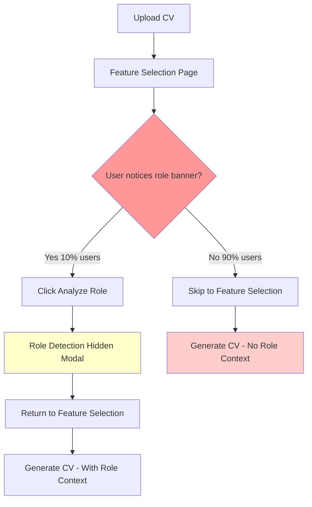
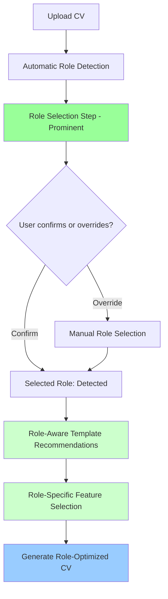
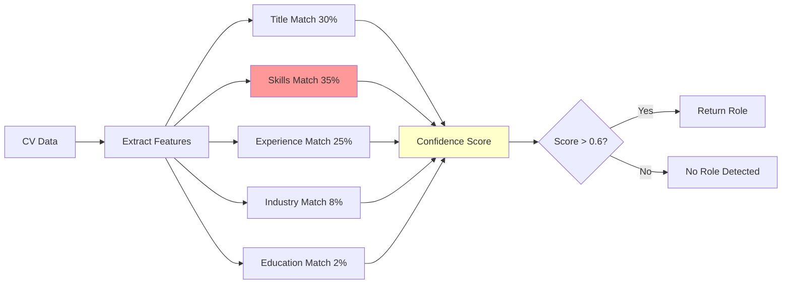
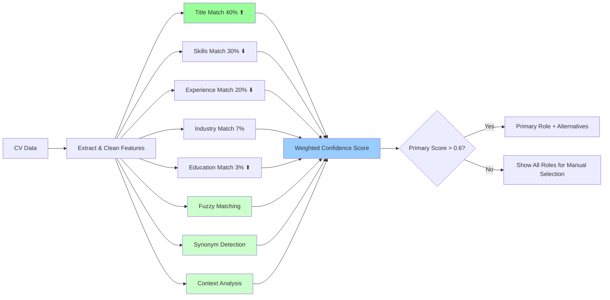
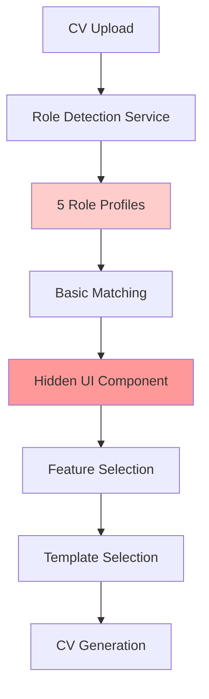
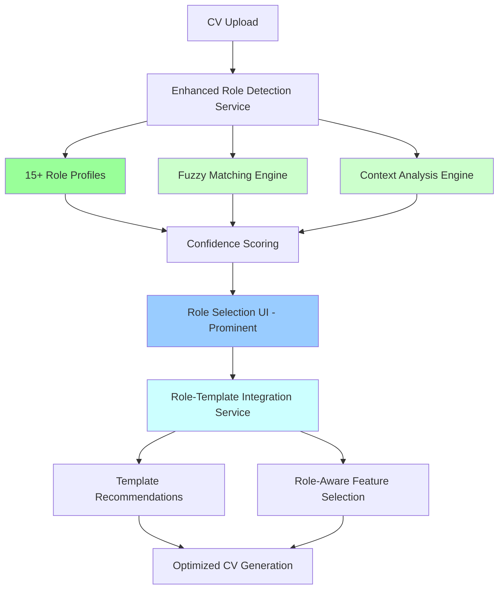
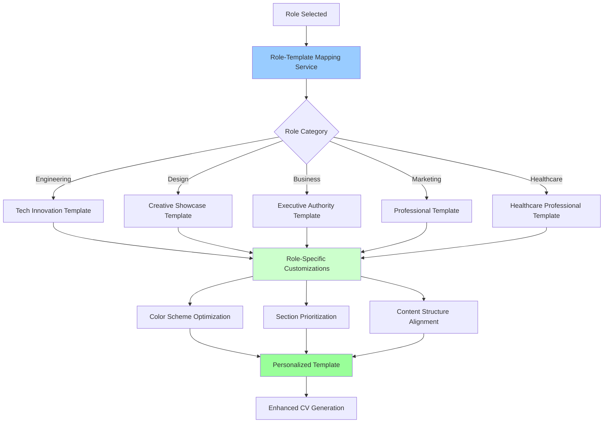
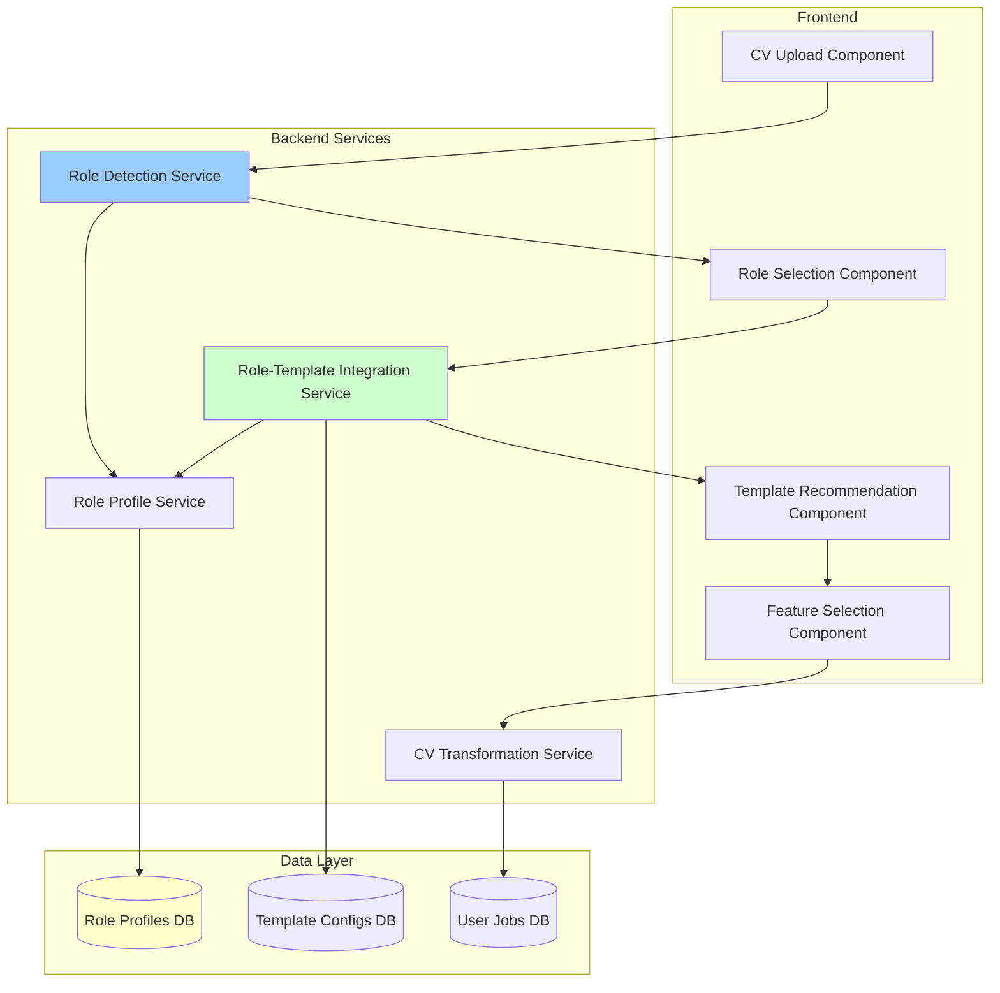
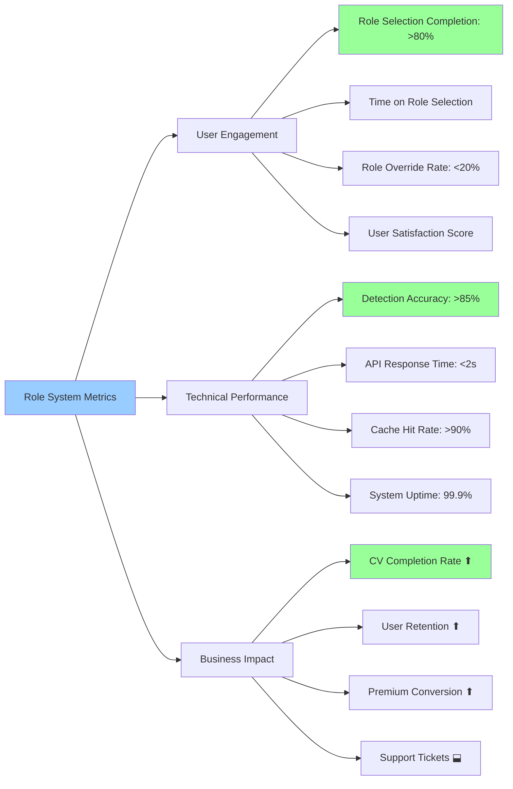

# Role System Enhancement - Mermaid Diagrams

## Current vs Enhanced User Flow

### Current User Flow (Problematic)


### Enhanced User Flow (Improved)


## Role Detection Algorithm Enhancement

### Current Algorithm


### Enhanced Algorithm


## Role Expansion Strategy

### Three-Phase Role Addition
```mermaid
timeline
    title Role Expansion Timeline
    
    section Phase 1: High Impact
        Week 1-2    : Digital Marketing Specialist
                    : UI/UX Designer  
                    : Business Analyst
                    : Project Manager
                    : DevOps Engineer
    
    section Phase 2: Specialized  
        Week 3-4    : Sales Manager
                    : Financial Analyst
                    : Customer Success Manager
                    : QA Engineer
    
    section Phase 3: Complete Coverage
        Week 5-6    : Healthcare Professional
                    : Teacher/Educator
                    : Operations Manager
                    : Product Marketing Manager
```

## System Architecture Enhancement

### Current Architecture (Limited)


### Enhanced Architecture (Integrated)


## Role-Template Integration Flow



## Data Flow Architecture



## Testing Strategy Diagram

```mermaid
flowchart TD
    A[Role System Testing] --> B[Role Detection Testing]
    A --> C[UI/UX Testing]  
    A --> D[Integration Testing]
    A --> E[Performance Testing]
    
    B --> B1[Test Dataset: 50+ CVs per role]
    B --> B2[Accuracy Measurement]
    B --> B3[Edge Case Testing]
    B --> B4[Algorithm A/B Testing]
    
    C --> C1[User Journey Testing]
    C --> C2[Accessibility Testing]
    C --> C3[Mobile Responsiveness]
    C --> C4[Task Completion Rates]
    
    D --> D1[Role-Template Integration]
    D --> D2[Feature Selection Integration]
    D --> D3[End-to-End CV Generation]
    D --> D4[Cross-System Data Flow]
    
    E --> E1[Load Testing - Expanded Dataset]
    E --> E2[API Response Time]
    E --> E3[Frontend Performance]
    E --> E4[Cache Effectiveness]
    
    style A fill:#99ccff
    style B fill:#ccffcc
    style C fill:#ffcccc
    style D fill:#ffffcc
    style E fill:#ccccff
```



## Success Metrics Dashboard

