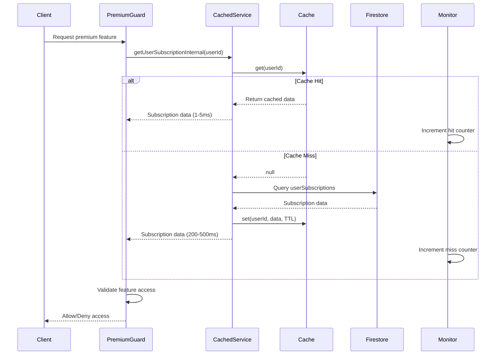
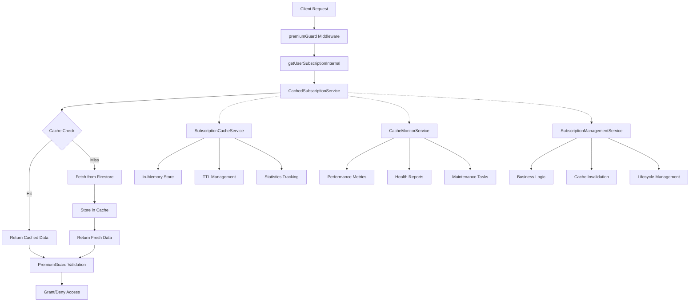
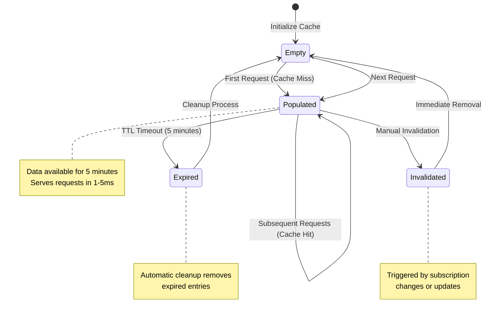
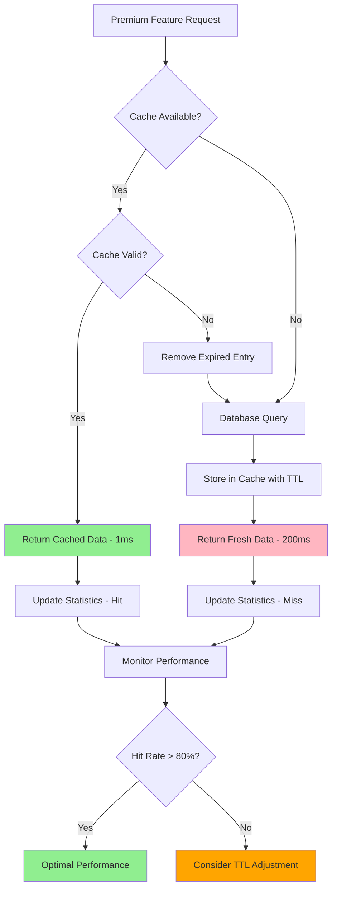
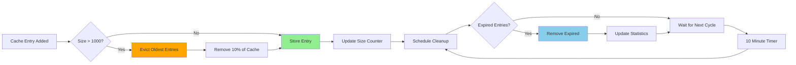

# Subscription Caching Flow Diagram

## Cache Request Flow

```mermaid
sequenceDiagram
    participant Client
    participant PremiumGuard
    participant CachedService
    participant Cache
    participant Firestore
    participant Monitor

    Client->>PremiumGuard: Request premium feature
    PremiumGuard->>CachedService: getUserSubscriptionInternal(userId)
    
    CachedService->>Cache: get(userId)
    
    alt Cache Hit
        Cache-->>CachedService: Return cached data
        CachedService-->>PremiumGuard: Subscription data (1-5ms)
        Monitor->>Monitor: Increment hit counter
    else Cache Miss
        Cache-->>CachedService: null
        CachedService->>Firestore: Query userSubscriptions
        Firestore-->>CachedService: Subscription data
        CachedService->>Cache: set(userId, data, TTL)
        CachedService-->>PremiumGuard: Subscription data (200-500ms)
        Monitor->>Monitor: Increment miss counter
    end
    
    PremiumGuard->>PremiumGuard: Validate feature access
    PremiumGuard-->>Client: Allow/Deny access
```

## Cache Architecture Components

```mermaid
graph TD
    A[Client Request] --> B[premiumGuard Middleware]
    B --> C[getUserSubscriptionInternal]
    C --> D[CachedSubscriptionService]
    
    D --> E{Cache Check}
    E -->|Hit| F[Return Cached Data]
    E -->|Miss| G[Fetch from Firestore]
    
    G --> H[Store in Cache]
    H --> I[Return Fresh Data]
    
    F --> J[PremiumGuard Validation]
    I --> J
    
    J --> K[Grant/Deny Access]
    
    L[SubscriptionCacheService] --> M[In-Memory Store]
    L --> N[TTL Management]
    L --> O[Statistics Tracking]
    
    P[CacheMonitorService] --> Q[Performance Metrics]
    P --> R[Health Reports]
    P --> S[Maintenance Tasks]
    
    T[SubscriptionManagementService] --> U[Business Logic]
    T --> V[Cache Invalidation]
    T --> W[Lifecycle Management]
    
    D -.-> L
    D -.-> P
    D -.-> T
```

## Cache Lifecycle Management

```mermaid
stateDiagram-v2
    [*] --> Empty: Initialize Cache
    
    Empty --> Populated: First Request (Cache Miss)
    Populated --> Populated: Subsequent Requests (Cache Hit)
    
    Populated --> Expired: TTL Timeout (5 minutes)
    Populated --> Invalidated: Manual Invalidation
    
    Expired --> Empty: Cleanup Process
    Invalidated --> Empty: Immediate Removal
    
    Empty --> Populated: Next Request
    
    note right of Populated
        Data available for 5 minutes
        Serves requests in 1-5ms
    end note
    
    note right of Expired
        Automatic cleanup removes
        expired entries
    end note
    
    note right of Invalidated
        Triggered by subscription
        changes or updates
    end note
```

## Performance Optimization Flow

```mermaid
flowchart TD
    A[Premium Feature Request] --> B{Cache Available?}
    
    B -->|Yes| C{Cache Valid?}
    B -->|No| D[Database Query]
    
    C -->|Yes| E[Return Cached Data - 1ms]
    C -->|No| F[Remove Expired Entry]
    
    F --> D[Database Query]
    D --> G[Store in Cache with TTL]
    G --> H[Return Fresh Data - 200ms]
    
    E --> I[Update Statistics - Hit]
    H --> J[Update Statistics - Miss]
    
    I --> K[Monitor Performance]
    J --> K
    
    K --> L{Hit Rate > 80%?}
    L -->|Yes| M[Optimal Performance]
    L -->|No| N[Consider TTL Adjustment]
    
    style E fill:#90EE90
    style H fill:#FFB6C1
    style M fill:#90EE90
    style N fill:#FFA500
```

## Memory Management Strategy

```mermaid
graph LR
    A[Cache Entry Added] --> B{Size > 1000?}
    
    B -->|No| C[Store Entry]
    B -->|Yes| D[Evict Oldest Entries]
    
    D --> E[Remove 10% of Cache]
    E --> C
    
    C --> F[Update Size Counter]
    F --> G[Schedule Cleanup]
    
    G --> H{Expired Entries?}
    H -->|Yes| I[Remove Expired]
    H -->|No| J[Wait for Next Cycle]
    
    I --> K[Update Statistics]
    K --> J
    
    J --> L[10 Minute Timer]
    L --> G
    
    style D fill:#FFA500
    style I fill:#87CEEB
    style C fill:#90EE90
```