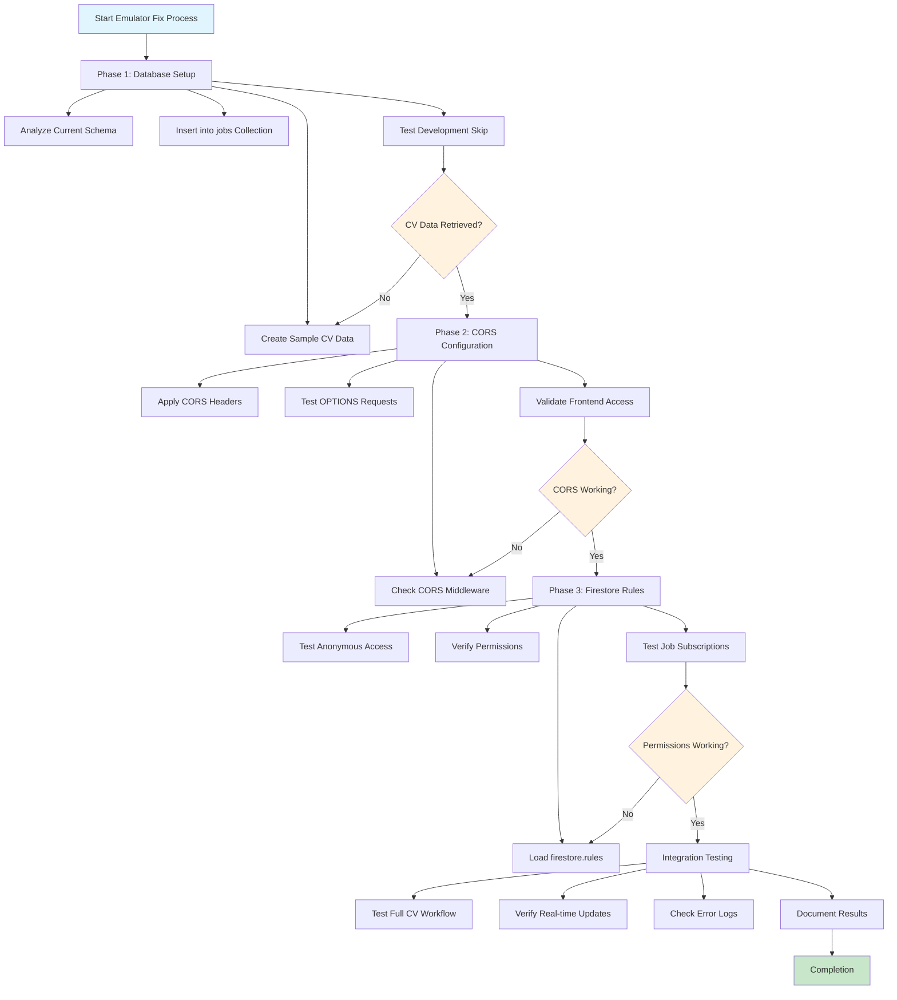
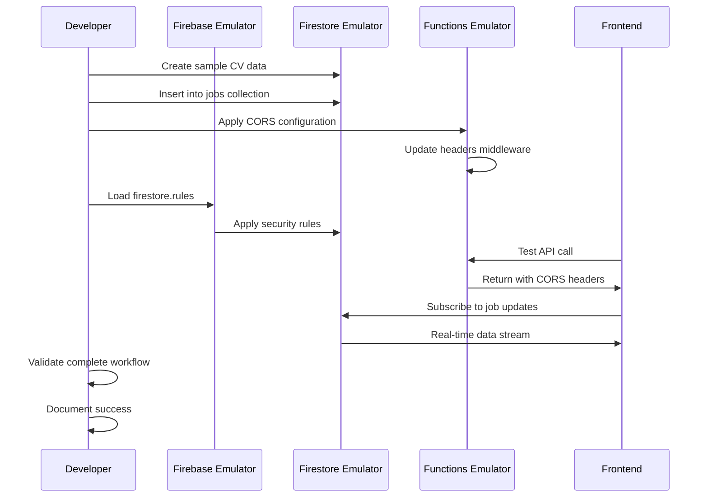

# Firebase Emulator Fixes Workflow Diagram

## Workflow Components

### Phase 1: Database Setup
- **Input**: Empty emulator database
- **Process**: Create and insert sample CV data
- **Output**: jobs collection with test data
- **Validation**: Development skip retrieval works

### Phase 2: CORS Configuration  
- **Input**: Functions without proper CORS
- **Process**: Apply centralized CORS middleware
- **Output**: Functions with Access-Control headers
- **Validation**: Frontend requests succeed

### Phase 3: Firestore Rules
- **Input**: Default/missing security rules
- **Process**: Load and apply firestore.rules
- **Output**: Proper anonymous access permissions
- **Validation**: Job subscriptions work

### Integration Testing
- **Input**: All components configured
- **Process**: End-to-end workflow testing
- **Output**: Fully functional development environment
- **Validation**: Zero errors in console/logs