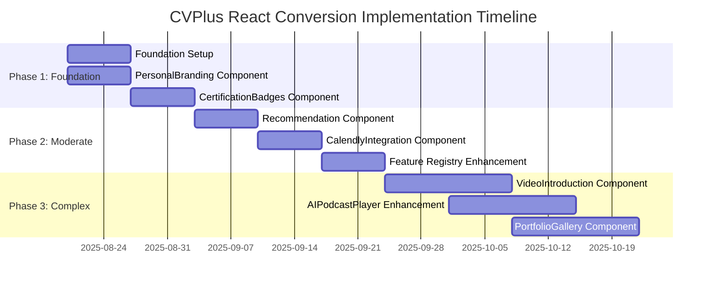
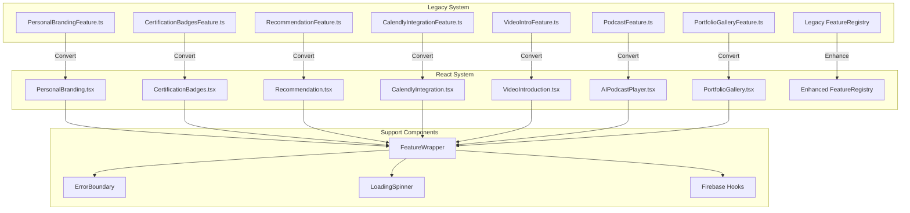
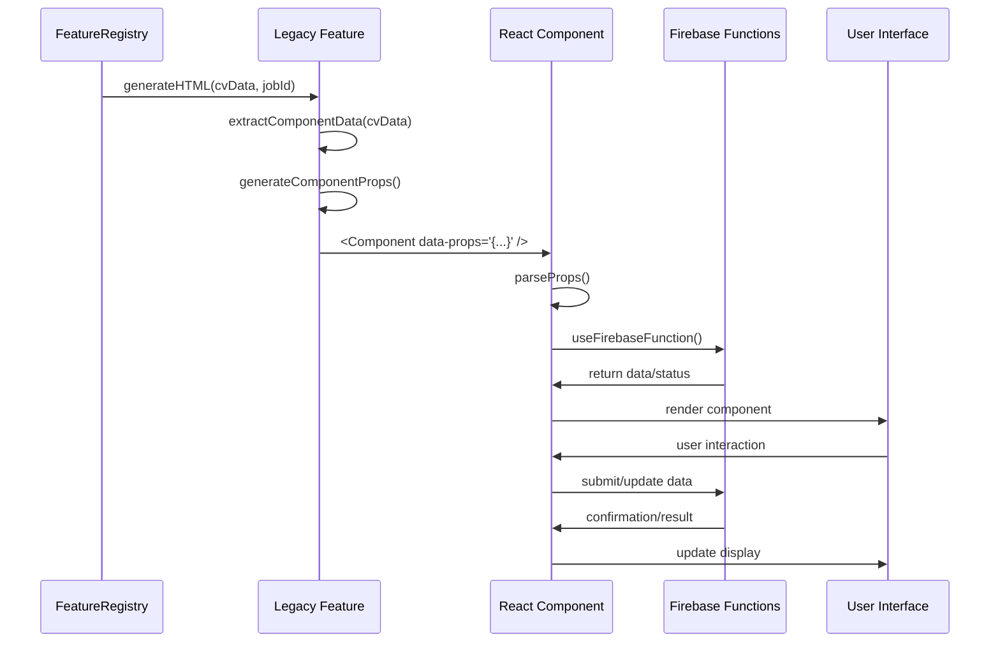
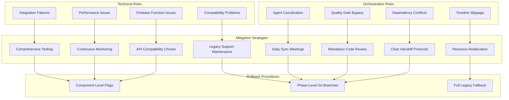
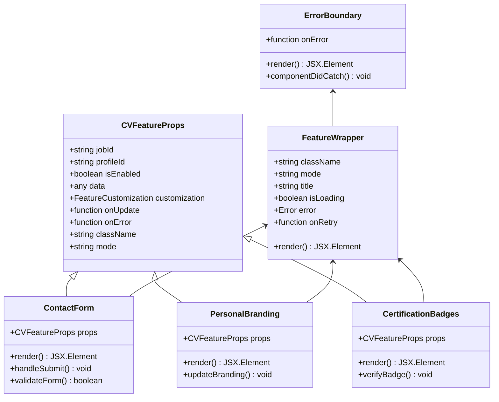

# CVPlus React Conversion Implementation Flow Diagrams

**Author**: Gil Klainert  
**Date**: 2025-08-20  
**Project**: CVPlus - Legacy Feature Migration to React Architecture  
**Plan Reference**: [2025-08-20 CV Features React Conversion Plan v2](/docs/plans/2025-08-20-cv-features-react-conversion-plan-v2.md)

---

## Implementation Phase Flow

---

## Orchestrator Control Flow

```mermaid
flowchart TD
    A[🎛️ Orchestrator Initiates Phase] --> B{Select Specialist Agents}
    B --> C[📋 Assign Subtask to Primary Agent]
    C --> D[🔧 Primary Agent Executes Subtask]
    D --> E[📊 Support Agents Provide Assistance]
    E --> F{Subtask Complete?}
    F -->|No| G[🐛 Debugger Agent Identifies Issues]
    G --> H[🔄 Return to Primary Agent for Fixes]
    H --> D
    F -->|Yes| I[✅ Quality Gate: Code Reviewer]
    I --> J{Quality Gate Passed?}
    J -->|No| K[📝 Code Reviewer Provides Feedback]
    K --> H
    J -->|Yes| L[🧪 Test Writer Creates Test Suite]
    L --> M[⚡ Performance Optimizer Reviews Impact]
    M --> N{All Verifications Complete?}
    N -->|No| O[🔍 Additional Verification Required]
    O --> G
    N -->|Yes| P[✅ Subtask Marked Complete]
    P --> Q{More Subtasks in Phase?}
    Q -->|Yes| R[📋 Assign Next Subtask]
    R --> C
    Q -->|No| S[🎯 Phase Complete - Sync Point]
    S --> T{More Phases?}
    T -->|Yes| U[🔄 Initiate Next Phase]
    U --> A
    T -->|No| V[🎉 Project Complete]
```

---

## Feature Conversion Architecture

---

## Agent Responsibility Matrix

```mermaid
graph LR
    subgraph "Primary Implementation"
        RE[🔧 React Expert]
        FD[🎨 Frontend Developer]
        TP[📝 TypeScript Pro]
        NE[⚙️ NextJS Expert]
    end
    
    subgraph "Support & Integration"
        NO[🔙 NodeJS Expert]
        FDS[🚀 Firebase Deployment]
        AA[🔗 API Architect]
        DSA[🎭 Design System Architect]
    end
    
    subgraph "Quality Assurance"
        CR[✅ Code Reviewer]
        DB[🐛 Debugger]
        TWF[🧪 Test Writer Fixer]
        PO[⚡ Performance Optimizer]
    end
    
    subgraph "Orchestration"
        GE[📚 Git Expert]
        ORC[🎛️ Orchestrator]
    end
    
    RE --> |Primary| Phase1[Phase 1: Simple]
    RE --> |Primary| Phase2[Phase 2: Moderate]
    FD --> |Primary| Phase3[Phase 3: Complex]
    
    Phase1 --> CR
    Phase2 --> CR
    Phase3 --> CR
    
    CR --> |Quality Gate| Approval[✅ Approval]
    
    ORC --> |Coordinates| RE
    ORC --> |Coordinates| FD
    ORC --> |Manages| GE
```

---

## Component Props Flow

---

## Quality Gate Verification Process

```mermaid
flowchart TD
    A[📦 Component Development Complete] --> B[🔍 Initial Self-Check]
    B --> C{TypeScript Errors?}
    C -->|Yes| D[🔧 Fix TypeScript Issues]
    D --> B
    C -->|No| E[📊 Submit for Quality Review]
    E --> F[🐛 Debugger Agent Testing]
    F --> G{Functionality Issues?}
    G -->|Yes| H[📝 Return to Developer]
    H --> D
    G -->|No| I[✅ Code Reviewer Security Check]
    I --> J{Security/Best Practice Issues?}
    J -->|Yes| K[📋 Detailed Feedback]
    K --> H
    J -->|No| L[🧪 Test Writer Coverage Check]
    L --> M{Test Coverage < 90%?}
    M -->|Yes| N[📈 Enhance Test Suite]
    N --> L
    M -->|No| O[⚡ Performance Impact Review]
    O --> P{Performance Issues?}
    P -->|Yes| Q[🎯 Optimize Performance]
    Q --> O
    P -->|No| R[✅ All Quality Gates Passed]
    R --> S[🎉 Component Approved for Integration]
```

---

## Risk Mitigation Strategy

---

## Success Metrics Dashboard

```mermaid
graph TD
    subgraph "Implementation Progress"
        IP1[Features Converted: 1/8 → 8/8]
        IP2[React Components: 1 → 8]
        IP3[Legacy Features: 7 → 0]
    end
    
    subgraph "Quality Metrics"
        QM1[Test Coverage: 90%+]
        QM2[TypeScript Compliance: 100%]
        QM3[Accessibility: WCAG 2.1 AA]
        QM4[Bundle Size: +100KB max]
    end
    
    subgraph "Performance Indicators"
        PI1[Component Error Rate: <0.1%]
        PI2[Loading Performance: Optimized]
        PI3[Responsive Design: 100%]
        PI4[Browser Compatibility: Modern+]
    end
    
    subgraph "Timeline Metrics"
        TM1[Phase 1: Week 2]
        TM2[Phase 2: Week 5] 
        TM3[Phase 3: Week 9]
        TM4[Total Duration: 9 weeks]
    end
    
    IP1 --> Success[🎉 Project Success]
    IP2 --> Success
    IP3 --> Success
    QM1 --> Success
    QM2 --> Success
    QM3 --> Success
    QM4 --> Success
    PI1 --> Success
    PI2 --> Success
    PI3 --> Success
    PI4 --> Success
    TM1 --> Success
    TM2 --> Success
    TM3 --> Success
    TM4 --> Success
```

---

## Component Integration Pattern

This comprehensive set of Mermaid diagrams provides visual representation of the implementation flow, orchestrator control, agent responsibilities, quality gates, risk mitigation, and success metrics for the CVPlus React conversion project.