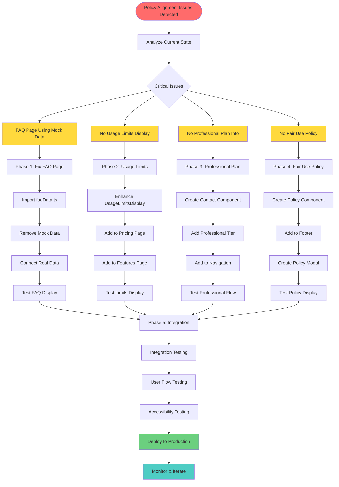
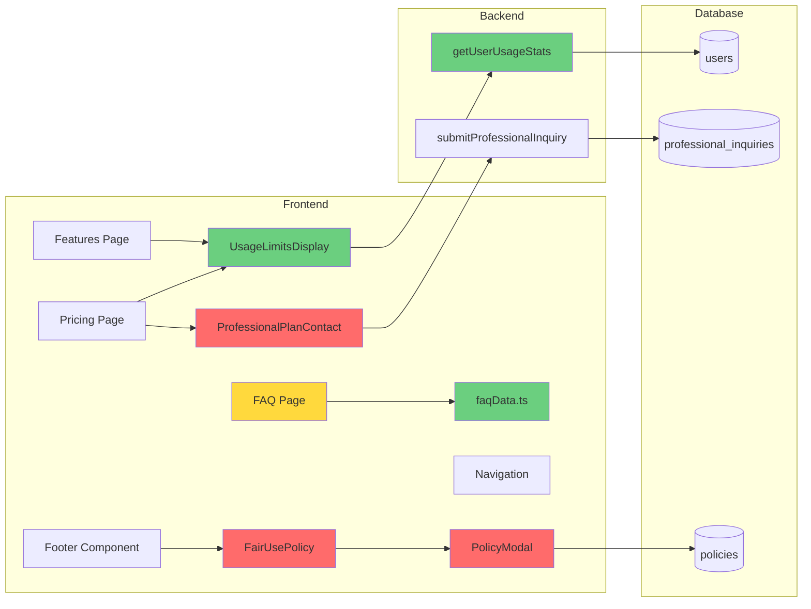
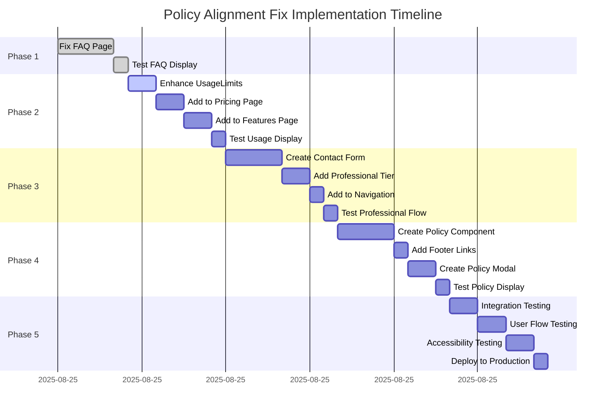
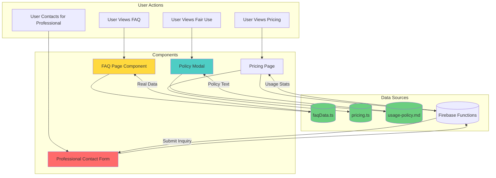

# Policy Alignment Fix Flow Diagram

```mermaid
graph TB
    Start([Policy Alignment Issues Detected]) --> Analysis[Analyze Current State]
    
    Analysis --> Issues{Critical Issues}
    Issues --> FAQ[FAQ Page Using Mock Data]
    Issues --> Limits[No Usage Limits Display]
    Issues --> Prof[No Professional Plan Info]
    Issues --> Fair[No Fair Use Policy]
    
    FAQ --> Phase1[Phase 1: Fix FAQ Page]
    Phase1 --> ImportData[Import faqData.ts]
    ImportData --> RemoveMock[Remove Mock Data]
    RemoveMock --> ConnectReal[Connect Real Data]
    ConnectReal --> TestFAQ[Test FAQ Display]
    
    Limits --> Phase2[Phase 2: Usage Limits]
    Phase2 --> EnhanceComp[Enhance UsageLimitsDisplay]
    EnhanceComp --> AddPricing[Add to Pricing Page]
    AddPricing --> AddFeatures[Add to Features Page]
    AddFeatures --> TestLimits[Test Limits Display]
    
    Prof --> Phase3[Phase 3: Professional Plan]
    Phase3 --> CreateContact[Create Contact Component]
    CreateContact --> AddTier[Add Professional Tier]
    AddTier --> AddNav[Add to Navigation]
    AddNav --> TestProf[Test Professional Flow]
    
    Fair --> Phase4[Phase 4: Fair Use Policy]
    Phase4 --> CreatePolicy[Create Policy Component]
    CreatePolicy --> AddFooter[Add to Footer]
    AddFooter --> CreateModal[Create Policy Modal]
    CreateModal --> TestPolicy[Test Policy Display]
    
    TestFAQ --> Phase5[Phase 5: Integration]
    TestLimits --> Phase5
    TestProf --> Phase5
    TestPolicy --> Phase5
    
    Phase5 --> IntTest[Integration Testing]
    IntTest --> UserTest[User Flow Testing]
    UserTest --> AccessTest[Accessibility Testing]
    AccessTest --> Deploy[Deploy to Production]
    
    Deploy --> Monitor[Monitor & Iterate]
    
    style Start fill:#ff6b6b
    style FAQ fill:#ffd93d
    style Limits fill:#ffd93d
    style Prof fill:#ffd93d
    style Fair fill:#ffd93d
    style Deploy fill:#6bcf7f
    style Monitor fill:#4ecdc4
```

## Component Dependency Diagram

```mermaid
graph LR
    subgraph Frontend
        FAQ[FAQ Page]
        FaqData[faqData.ts]
        Pricing[Pricing Page]
        Features[Features Page]
        Footer[Footer Component]
        Nav[Navigation]
        
        UsageLimits[UsageLimitsDisplay]
        ProfContact[ProfessionalPlanContact]
        PolicyComp[FairUsePolicy]
        PolicyModal[PolicyModal]
    end
    
    subgraph Backend
        GetUsage[getUserUsageStats]
        SubmitInq[submitProfessionalInquiry]
    end
    
    subgraph Database
        Users[(users)]
        Inquiries[(professional_inquiries)]
        Policies[(policies)]
    end
    
    FAQ --> FaqData
    Pricing --> UsageLimits
    Features --> UsageLimits
    UsageLimits --> GetUsage
    
    Pricing --> ProfContact
    ProfContact --> SubmitInq
    SubmitInq --> Inquiries
    
    Footer --> PolicyComp
    PolicyComp --> PolicyModal
    PolicyModal --> Policies
    
    GetUsage --> Users
    
    style FaqData fill:#6bcf7f
    style UsageLimits fill:#6bcf7f
    style GetUsage fill:#6bcf7f
    style FAQ fill:#ffd93d
    style ProfContact fill:#ff6b6b
    style PolicyComp fill:#ff6b6b
    style PolicyModal fill:#ff6b6b
```

## Implementation Timeline

```mermaid
gantt
    title Policy Alignment Fix Implementation Timeline
    dateFormat  YYYY-MM-DD
    section Phase 1
    Fix FAQ Page           :done, faq1, 2025-08-25, 2h
    Test FAQ Display       :done, faq2, after faq1, 30m
    
    section Phase 2
    Enhance UsageLimits    :active, ul1, after faq2, 1h
    Add to Pricing Page    :ul2, after ul1, 1h
    Add to Features Page   :ul3, after ul2, 1h
    Test Usage Display     :ul4, after ul3, 30m
    
    section Phase 3
    Create Contact Form    :prof1, after ul4, 2h
    Add Professional Tier  :prof2, after prof1, 1h
    Add to Navigation      :prof3, after prof2, 30m
    Test Professional Flow :prof4, after prof3, 30m
    
    section Phase 4
    Create Policy Component :pol1, after prof4, 2h
    Add Footer Links       :pol2, after pol1, 30m
    Create Policy Modal    :pol3, after pol2, 1h
    Test Policy Display    :pol4, after pol3, 30m
    
    section Phase 5
    Integration Testing    :test1, after pol4, 1h
    User Flow Testing      :test2, after test1, 1h
    Accessibility Testing  :test3, after test2, 1h
    Deploy to Production   :deploy, after test3, 30m
```

## Data Flow Diagram

```mermaid
flowchart TD
    subgraph User Actions
        ViewFAQ[User Views FAQ]
        ViewPricing[User Views Pricing]
        ContactProf[User Contacts for Professional]
        ViewPolicy[User Views Fair Use]
    end
    
    subgraph Components
        FAQPage[FAQ Page Component]
        PricingPage[Pricing Page]
        ContactForm[Professional Contact Form]
        PolicyModal[Policy Modal]
    end
    
    subgraph Data Sources
        FAQData[(faqData.ts)]
        PricingConfig[(pricing.ts)]
        PolicyDocs[(usage-policy.md)]
        Firebase[(Firebase Functions)]
    end
    
    ViewFAQ --> FAQPage
    FAQPage --> FAQData
    FAQData --> |Real Data| FAQPage
    
    ViewPricing --> PricingPage
    PricingPage --> PricingConfig
    PricingPage --> Firebase
    Firebase --> |Usage Stats| PricingPage
    
    ContactProf --> ContactForm
    ContactForm --> Firebase
    Firebase --> |Submit Inquiry| ContactForm
    
    ViewPolicy --> PolicyModal
    PolicyModal --> PolicyDocs
    PolicyDocs --> |Policy Text| PolicyModal
    
    style FAQData fill:#6bcf7f
    style PricingConfig fill:#6bcf7f
    style PolicyDocs fill:#6bcf7f
    style FAQPage fill:#ffd93d
    style ContactForm fill:#ff6b6b
    style PolicyModal fill:#4ecdc4
```