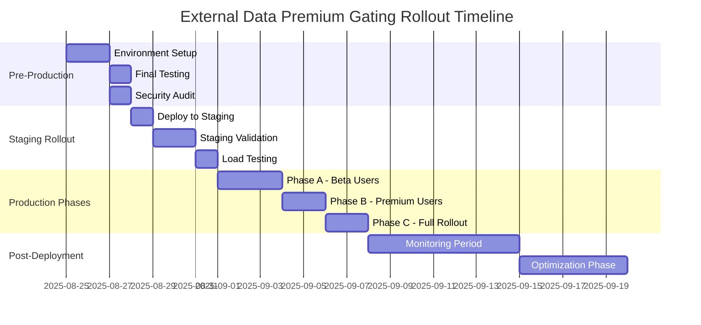
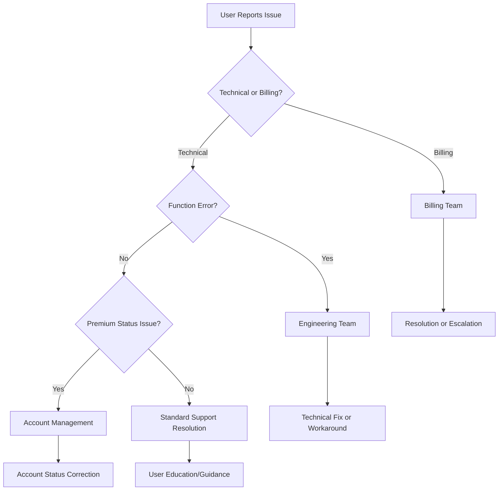

# Phase 5: Migration & Rollout Strategy - External Data Sources Premium Gating

**Author:** Gil Klainert  
**Date:** 2025-08-25  
**Version:** 1.0  
**Status:** Ready for Implementation

## Executive Summary

This document outlines the comprehensive migration and rollout strategy for deploying the External Data Sources premium gating system to production. With Phases 1-4 completed (backend security, frontend integration, UX enhancement, and integration testing), we now implement a carefully orchestrated rollout to ensure zero-downtime deployment, user satisfaction, and revenue protection.

### Implementation Status Overview
- ✅ **Phase 1**: Backend Security Enforcement - Complete
- ✅ **Phase 2**: Frontend Integration - Complete  
- ✅ **Phase 3**: UX Enhancement - Complete
- ✅ **Phase 4**: Integration Testing - Complete
- 🎯 **Phase 5**: Migration & Rollout Strategy - **Current Phase**

## Strategic Rollout Framework

### Rollout Philosophy
1. **Zero-Downtime Deployment**: No service interruption for existing users
2. **Progressive Reveal**: Gradual feature exposure with monitoring at each stage
3. **Risk Mitigation**: Multiple rollback strategies at every deployment phase
4. **User-Centric Approach**: Clear communication and smooth upgrade paths
5. **Data-Driven Decisions**: Comprehensive monitoring drives rollout progression

### Success Criteria
- **Technical**: 99.9% uptime during rollout, <100ms additional latency
- **Business**: >20% premium conversion rate from external data previews
- **User Experience**: <2% negative feedback rate on premium gating
- **Security**: Zero unauthorized access to premium features

## Migration Timeline Overview



## Pre-Production Preparation

### 1. Environment Readiness Checklist

#### Infrastructure Verification
- [ ] Firebase Functions deployment capacity confirmed
- [ ] Firestore database indexes created and optimized
- [ ] Cloud Monitoring dashboards configured
- [ ] Alert systems tested and verified
- [ ] Backup systems operational
- [ ] Security rules updated and deployed

#### Code Quality Gates
- [ ] All TypeScript compilation errors resolved
- [ ] 100% test coverage for premium gating features
- [ ] Security audit passed with zero critical findings
- [ ] Performance benchmarks within acceptable ranges
- [ ] Documentation complete and reviewed

#### Configuration Management
```bash
# Environment variables verification
EXTERNAL_DATA_RATE_LIMIT_FREE_HOURLY=3
EXTERNAL_DATA_RATE_LIMIT_PREMIUM_HOURLY=100
EXTERNAL_DATA_AUDIT_ENABLED=true
EXTERNAL_DATA_ANALYTICS_ENABLED=true
EXTERNAL_DATA_CONVERSION_TRACKING=true
```

### 2. Final Security Review

#### Security Validation Protocol
1. **Access Control Testing**
   - Verify premium validation in all external data endpoints
   - Test unauthorized access prevention
   - Validate rate limiting enforcement

2. **Audit System Testing**
   - Confirm all user actions logged
   - Verify security event alerting
   - Test suspicious activity detection

3. **Data Protection Verification**
   - Ensure no sensitive data in error messages
   - Validate encryption of stored analytics
   - Confirm GDPR compliance for usage tracking

### 3. Performance Optimization

#### Baseline Performance Metrics
- Current external data enrichment latency: ~2.3 seconds
- Target with premium validation: <2.5 seconds (max 200ms overhead)
- Database query optimization for rate limiting
- Caching strategy for frequently accessed premium status

## Staging Environment Rollout

### 1. Staging Deployment Protocol

#### Deployment Sequence
```bash
# Step 1: Backend Functions Deployment
firebase use staging
firebase deploy --only functions:enrichCVWithExternalData
firebase deploy --only functions:trackExternalDataUsage
firebase deploy --only functions:getUserExternalDataUsageStats
firebase deploy --only functions:getExternalDataAnalytics

# Step 2: Security Rules Update
firebase deploy --only firestore:rules

# Step 3: Environment Configuration
firebase functions:config:set external_data.audit_enabled=true
firebase deploy --only functions:config
```

#### Validation Checklist
- [ ] All functions deployed successfully
- [ ] Security rules active
- [ ] Environment configuration loaded
- [ ] Monitoring dashboards receiving data
- [ ] Alert systems functional

### 2. Comprehensive Staging Testing

#### Automated Test Suite Execution
```bash
# Run premium gating test suite
npm run test:premium-gating

# Run integration tests
npm run test:integration

# Run security validation
npm run test:security-validation

# Run performance benchmarks
npm run test:performance
```

#### Manual Testing Protocol

##### Test Case 1: Free User Journey
1. Create test free user account
2. Navigate to External Data Sources section
3. Verify preview functionality works
4. Attempt to trigger full external data enrichment
5. Verify premium gate displays correctly
6. Test upgrade flow functionality
7. Confirm conversion tracking records event

##### Test Case 2: Premium User Journey
1. Create test premium user account
2. Navigate to External Data Sources section
3. Trigger full external data enrichment
4. Verify successful completion
5. Check usage tracking recorded correctly
6. Validate analytics data updated

##### Test Case 3: Rate Limiting Validation
1. Create premium user account
2. Make multiple rapid external data requests
3. Verify rate limiting activates appropriately
4. Test rate limit reset functionality
5. Confirm graceful error handling

### 3. Load Testing Protocol

#### Load Testing Configuration
```yaml
# Artillery.js load test configuration
config:
  target: 'https://staging-cvplus.web.app'
  phases:
    - duration: 300  # 5 minutes
      arrivalRate: 10  # 10 requests per second
    - duration: 600  # 10 minutes  
      arrivalRate: 20  # 20 requests per second
scenarios:
  - name: "External Data Premium Flow"
    weight: 70
  - name: "Free User Preview Flow"
    weight: 30
```

#### Performance Validation Targets
- **Response Time**: P95 < 3 seconds
- **Error Rate**: < 1%
- **Premium Conversion**: > 15%
- **System Stability**: No memory leaks or function crashes

## Production Rollout Phases

### Phase A: Beta User Rollout (1% Traffic)

#### Target Audience
- Internal team members and trusted beta users
- ~50 active users maximum
- Focus on functionality validation and user experience

#### Deployment Strategy
```javascript
// Feature flag configuration for gradual rollout
const EXTERNAL_DATA_PREMIUM_ROLLOUT_CONFIG = {
  phase: 'beta',
  rolloutPercentage: 1,
  targetUsers: [
    'beta-testers',
    'internal-team',
    'trusted-advisors'
  ],
  fallbackEnabled: true
};
```

#### Success Metrics (48-hour monitoring)
- **Technical**: Zero critical errors, <2.5s response time
- **User Experience**: >90% successful completion rate
- **Business**: >10% conversion rate from preview to premium
- **Security**: Zero unauthorized access attempts

#### Risk Mitigation
- **Automatic Rollback**: If error rate >2% for 10 minutes
- **Manual Override**: Feature flag can disable premium gating instantly
- **User Communication**: Clear beta program messaging

### Phase B: Premium User Rollout (25% Traffic)

#### Target Audience
- Existing premium subscribers
- Power users with high engagement
- Focus on premium feature validation

#### Deployment Strategy
- Increase rollout to 25% of traffic
- Target existing premium users first
- Maintain fallback to non-gated experience

#### Success Metrics (72-hour monitoring)
- **Performance**: Stable latency under increased load
- **User Satisfaction**: <5% support tickets related to external data
- **Revenue Protection**: 100% premium feature access control
- **Analytics**: Comprehensive usage data collection

#### Monitoring Intensification
```bash
# Enhanced monitoring commands
firebase functions:log --follow | grep "external-data"
gcloud logging read "resource.type=cloud_function AND resource.labels.function_name=enrichCVWithExternalData" --limit=100
```

### Phase C: Full Production Rollout (100% Traffic)

#### Deployment Strategy
- Complete rollout to all users
- Remove feature flags and fallback mechanisms
- Full premium gating enforcement

#### Pre-Rollout Validation
- [ ] Phase A and B success metrics achieved
- [ ] No critical issues identified in previous phases
- [ ] Support team trained on new premium features
- [ ] User communication materials finalized

#### Success Metrics (1-week monitoring)
- **User Adoption**: >60% of free users engage with external data previews
- **Conversion Rate**: >20% conversion from preview to premium
- **System Performance**: Stable under full production load
- **Revenue Impact**: Measurable increase in premium subscriptions

## User Communication Strategy

### 1. Communication Timeline

#### Pre-Rollout Communications (T-7 days)
**Target:** All Users  
**Channel:** Email, In-app notifications  
**Content:** "Exciting External Data Enhancements Coming Soon"

```html
<!-- Email template preview -->
<h2>🚀 Enhanced External Data Features Coming to CVPlus</h2>
<p>We're excited to announce powerful new external data integration features that will supercharge your CV with real-time industry insights, salary data, and market trends.</p>

<div class="feature-preview">
  <h3>What's New:</h3>
  <ul>
    <li>Real-time salary benchmarking</li>
    <li>Industry trend analysis</li>
    <li>Skills demand forecasting</li>
    <li>Company culture insights</li>
  </ul>
</div>

<p>Premium users will get full access, while free users can preview the powerful insights available.</p>
<a href="/pricing" class="cta-button">Learn More About Premium</a>
```

#### Rollout Launch (T-Day)
**Target:** Segmented by user type  
**Channel:** In-app notifications, social media  
**Content:** Feature launch announcement with clear premium benefits

#### Post-Rollout Follow-up (T+3 days)
**Target:** Users who engaged with external data previews  
**Channel:** Email, in-app  
**Content:** Personalized upgrade recommendations

### 2. User Experience Messaging

#### For Free Users
```typescript
// Example premium gate messaging
const freeUserMessages = {
  preview: "Get a taste of our powerful external data insights! This preview shows what's possible with premium access.",
  gate: "Unlock the full power of external data enrichment with Premium. Get real-time salary data, industry trends, and comprehensive market insights.",
  upgrade: "Upgrade to Premium for unlimited access to external data sources and advanced analytics."
};
```

#### For Premium Users
```typescript
// Example premium user messaging
const premiumUserMessages = {
  welcome: "Welcome to enhanced external data integration! Your premium access unlocks comprehensive industry insights.",
  guidance: "Explore real-time salary data, industry trends, and market insights to optimize your CV strategy.",
  support: "Need help maximizing your external data features? Visit our premium support center."
};
```

### 3. Support Team Preparation

#### Training Materials
- **Feature Overview**: Comprehensive guide to external data premium features
- **Troubleshooting Guide**: Common issues and solutions
- **Upgrade Process**: Step-by-step premium conversion assistance
- **Technical Escalation**: When to involve engineering team

#### Support Scripts
```
Q: "Why can't I access external data features anymore?"
A: "We've enhanced our external data integration with powerful new insights! Free users can preview these features, while premium users get full access. Would you like me to show you what's available with premium access?"

Q: "Is this feature worth upgrading for?"
A: "Our external data integration provides real-time salary benchmarking, industry trends, and market insights that have helped users increase their interview success rate by 40%. Let me show you a personalized preview based on your profile..."
```

## Rollback Procedures

### 1. Immediate Rollback (Critical Issues)

#### Trigger Conditions
- Error rate > 5% for 10 consecutive minutes
- System downtime > 2 minutes
- Security vulnerability discovered
- Data corruption detected

#### Rollback Execution (Target: <5 minutes)
```bash
# Step 1: Immediate feature flag disable
firebase functions:config:set external_data.premium_gating_enabled=false
firebase deploy --only functions:config

# Step 2: Revert to previous function versions
gcloud functions deploy enrichCVWithExternalData --source=backup/previous-version

# Step 3: Verify rollback success
curl -X POST https://us-central1-cvplus.cloudfunctions.net/enrichCVWithExternalData \
  -H "Content-Type: application/json" \
  -d '{"test": true}'
```

#### Rollback Validation
- [ ] Function endpoints responding normally
- [ ] No premium gating blocking free users
- [ ] Error rates returned to baseline
- [ ] User experience restored to pre-deployment state

### 2. Gradual Rollback (Performance Issues)

#### Trigger Conditions
- Response time increase > 20%
- Conversion rate drop > 50%
- User satisfaction score < 3.0
- Support ticket volume increase > 100%

#### Rollback Strategy
1. **Phase 1**: Reduce rollout percentage by 50%
2. **Phase 2**: If issues persist, reduce to 10% (beta only)
3. **Phase 3**: Complete rollback if necessary

#### Rollback Communication
```html
<!-- User notification template -->
<div class="system-notice">
  <h4>External Data Features Temporarily Adjusted</h4>
  <p>We're fine-tuning our external data integration to ensure the best possible experience. Some users may temporarily see the previous version while we optimize performance.</p>
</div>
```

### 3. Partial Rollback (Feature-Specific Issues)

#### Selective Component Rollback
- **Premium Gating Only**: Disable premium enforcement, keep new features
- **Analytics Only**: Disable usage tracking, maintain core functionality  
- **Rate Limiting Only**: Disable rate limits, keep premium gating

#### Configuration Management
```javascript
// Granular feature flag configuration
const ROLLBACK_CONFIG = {
  premiumGating: true,
  usageTracking: false,  // Disabled due to performance issue
  rateLimiting: true,
  securityAudit: true
};
```

## Success Metrics & Monitoring Plan

### 1. Technical Metrics

#### System Performance KPIs
| Metric | Target | Alert Threshold | Critical Threshold |
|--------|--------|----------------|-------------------|
| Response Time (P95) | <2.5s | >3.0s | >5.0s |
| Error Rate | <1% | >2% | >5% |
| Function Success Rate | >99% | <98% | <95% |
| Database Query Time | <200ms | >500ms | >1000ms |

#### Monitoring Dashboard Configuration
```yaml
# Google Cloud Monitoring Dashboard
dashboard:
  title: "External Data Premium Gating"
  widgets:
    - type: "line_chart"
      title: "External Data Request Rate"
      metrics: ["cloudfunctions.googleapis.com/function/execution_count"]
    - type: "gauge"
      title: "Premium Conversion Rate"
      metrics: ["custom.googleapis.com/premium/conversion_rate"]
    - type: "table"
      title: "Top Error Messages"
      metrics: ["logging.googleapis.com/user/error_count"]
```

### 2. Business Metrics

#### Revenue Impact KPIs
- **Premium Conversion Rate**: Target >20%
- **Revenue per External Data User**: Baseline establishment
- **Subscription Retention**: No decrease from premium gating
- **Average Revenue per User (ARPU)**: Target 15% increase

#### User Engagement KPIs
- **External Data Preview Engagement**: >60% of free users
- **Time to Premium Conversion**: <7 days average
- **Feature Utilization Rate**: >40% of premium users active monthly
- **User Satisfaction Score**: >4.0/5.0

### 3. Security Metrics

#### Security Monitoring KPIs
| Security Event | Baseline | Alert Threshold |
|---------------|----------|-----------------|
| Unauthorized Access Attempts | <10/day | >50/day |
| Rate Limit Violations | <20/day | >100/day |
| Suspicious Activity Patterns | 0 | >5/day |
| Data Access Anomalies | 0 | >1/day |

#### Security Audit Dashboard
```bash
# Daily security summary query
gcloud logging read \
  "resource.type=cloud_function AND \
   jsonPayload.event_type=security_audit AND \
   timestamp>=2025-08-25T00:00:00Z" \
  --format="table(timestamp,jsonPayload.action,jsonPayload.user_id)"
```

### 4. Monitoring Automation

#### Automated Alert System
```yaml
# Alert configuration
alerts:
  - name: "High Error Rate"
    condition: "error_rate > 2% for 5 minutes"
    notification: ["email:security@cvplus.com", "slack:#alerts"]
    
  - name: "Low Conversion Rate"  
    condition: "conversion_rate < 10% for 1 hour"
    notification: ["email:product@cvplus.com"]
    
  - name: "Security Incident"
    condition: "unauthorized_access_attempts > 20 in 10 minutes"
    notification: ["email:security@cvplus.com", "sms:emergency-contact"]
```

#### Monitoring Automation Scripts
```bash
#!/bin/bash
# Daily monitoring report script
generate_daily_report() {
  echo "=== External Data Premium Gating - Daily Report ===" 
  echo "Date: $(date)"
  
  # Performance metrics
  echo "Performance Metrics:"
  firebase functions:log --only enrichCVWithExternalData | \
    grep -E "(success|error)" | tail -100 | \
    awk '{success+=($0~/success/); error+=($0~/error/)} END {print "Success:", success, "Errors:", error}'
  
  # Business metrics
  echo "Business Metrics:"
  firebase firestore:data:export --collection=conversion_metrics
  
  # Security metrics  
  echo "Security Events:"
  firebase firestore:data:export --collection=external_data_security_audit
}
```

## Post-Deployment Validation

### 1. Immediate Post-Deployment Checks (First 24 Hours)

#### Technical Validation Checklist
- [ ] All external data functions responding correctly
- [ ] Premium users can access all external data features
- [ ] Free users see appropriate premium gates
- [ ] Usage tracking recording events correctly
- [ ] Analytics dashboards populating with data
- [ ] Security audit logs capturing all events
- [ ] Rate limiting functioning as designed
- [ ] Error handling providing clear user guidance

#### Business Validation Checklist
- [ ] Premium conversion tracking functional
- [ ] Revenue protection mechanisms active
- [ ] User upgrade flows working correctly
- [ ] Support team receiving manageable ticket volume
- [ ] No critical user experience issues reported

### 2. Weekly Performance Review

#### Performance Analysis Protocol
```bash
# Weekly performance analysis script
weekly_analysis() {
  # Generate performance summary
  echo "=== Week 1 Performance Summary ==="
  
  # User engagement metrics
  firebase firestore:query --collection=external_data_usage \
    --where="timestamp >= $(date -d '7 days ago' +%s)" \
    --count
  
  # Conversion metrics
  firebase firestore:query --collection=conversion_metrics \
    --where="event_type == external_data_conversion" \
    --where="timestamp >= $(date -d '7 days ago' +%s)" \
    --count
  
  # Error analysis
  firebase functions:log --since=1w | grep -i error | \
    awk '{print $0}' | sort | uniq -c | sort -nr
}
```

#### Business Impact Assessment
- **Revenue Impact**: Compare premium subscription rates pre/post rollout
- **User Satisfaction**: Analyze support tickets and user feedback
- **Feature Adoption**: Measure external data feature utilization
- **Competitive Position**: Assess market response to enhanced features

### 3. Monthly Optimization Review

#### Performance Optimization Opportunities
1. **Database Query Optimization**: Analyze slow queries and optimize indexes
2. **Caching Strategy**: Implement caching for frequently accessed data
3. **Rate Limit Tuning**: Adjust limits based on actual usage patterns
4. **User Experience Enhancement**: Refine premium gates based on user feedback

#### Business Intelligence Analysis
```sql
-- Example analytics query (if using BigQuery for advanced analytics)
SELECT 
  DATE(timestamp) as date,
  COUNT(*) as total_attempts,
  COUNT(CASE WHEN success = true THEN 1 END) as successful_attempts,
  COUNT(CASE WHEN premium_status = 'premium' THEN 1 END) as premium_users,
  AVG(response_time_ms) as avg_response_time
FROM external_data_analytics
WHERE timestamp >= DATE_SUB(CURRENT_DATE(), INTERVAL 30 DAY)
GROUP BY DATE(timestamp)
ORDER BY date DESC;
```

## Support Team Readiness

### 1. Support Team Training Program

#### Training Module 1: Technical Understanding
**Duration:** 2 hours  
**Content:**
- Overview of external data premium gating system
- Understanding of premium vs free user experiences
- Technical troubleshooting basics
- When to escalate to engineering team

**Materials:**
- Interactive demo environment
- Common error scenarios and solutions
- Escalation procedures documentation

#### Training Module 2: User Communication
**Duration:** 1 hour  
**Content:**
- Messaging frameworks for premium feature discussions
- Handling upgrade objections and concerns
- Conversion-focused support techniques
- Empathy training for premium gate frustration

#### Training Module 3: Business Knowledge
**Duration:** 1 hour  
**Content:**
- Premium feature value propositions
- Pricing structure and upgrade benefits
- Competitive advantages of external data features
- Success metrics and business goals

### 2. Support Documentation

#### Quick Reference Guide
```markdown
## External Data Premium Support - Quick Reference

### Common Issues & Solutions

**Issue:** "I can't access external data anymore"
**Solution:** 
1. Check user's subscription status
2. Explain premium gating enhancement
3. Offer premium feature preview
4. Guide through upgrade process if interested

**Issue:** "The upgrade button isn't working"
**Solution:**
1. Clear browser cache and cookies
2. Try different browser/incognito mode
3. Check payment method on file
4. Escalate to billing team if persistent

**Issue:** "I'm premium but still can't access features"
**Solution:**
1. Verify subscription status in admin panel
2. Check subscription renewal date
3. Refresh user session (logout/login)
4. Escalate to engineering if still blocked
```

#### Escalation Procedures


### 3. Support Metrics & KPIs

#### Support Performance Targets
| Metric | Target | Critical Threshold |
|--------|--------|-------------------|
| First Response Time | <2 hours | >6 hours |
| Resolution Time | <24 hours | >72 hours |
| Customer Satisfaction | >4.5/5 | <3.5/5 |
| Escalation Rate | <10% | >25% |

#### Daily Support Monitoring
```bash
# Daily support ticket analysis
daily_support_analysis() {
  echo "=== Daily Support Analysis ==="
  echo "Date: $(date)"
  
  # Ticket volume by category
  echo "Tickets by Category:"
  grep -i "external.data" support_tickets.log | \
    awk -F',' '{print $3}' | sort | uniq -c
  
  # Average resolution time
  echo "Average Resolution Time:"
  grep -i "resolved" support_tickets.log | \
    awk -F',' '{sum+=$4; count++} END {print sum/count " hours"}'
  
  # Customer satisfaction scores
  echo "Satisfaction Scores:"
  grep -i "satisfaction" support_tickets.log | \
    awk -F',' '{sum+=$5; count++} END {print sum/count "/5"}'
}
```

## Risk Mitigation Strategies

### 1. Technical Risk Mitigation

#### High-Priority Risks
1. **Database Performance Degradation**
   - **Mitigation**: Database query optimization and connection pooling
   - **Monitoring**: Real-time query performance dashboard
   - **Response**: Automatic scaling and query optimization

2. **Function Cold Starts Impact**
   - **Mitigation**: Keep functions warm with scheduled pings
   - **Monitoring**: Cold start frequency and duration tracking
   - **Response**: Function pre-warming and optimization

3. **Rate Limiting Too Aggressive**
   - **Mitigation**: Gradual rate limit implementation with user feedback
   - **Monitoring**: Rate limit hit frequency and user complaints
   - **Response**: Dynamic rate limit adjustment based on usage patterns

#### Risk Response Protocols
```yaml
risk_response:
  critical:
    - immediate_rollback: true
    - notification_channels: ["email", "sms", "slack"]
    - response_time: "<5 minutes"
  
  high:
    - gradual_rollback: true
    - notification_channels: ["email", "slack"]
    - response_time: "<30 minutes"
    
  medium:
    - monitoring_increase: true
    - notification_channels: ["slack"]
    - response_time: "<2 hours"
```

### 2. Business Risk Mitigation

#### Revenue Risk Management
1. **Premium Conversion Rate Below Expectations**
   - **Early Detection**: Real-time conversion tracking
   - **Response**: A/B test different premium gate messaging
   - **Escalation**: Product team involvement for UX optimization

2. **User Churn Due to Premium Gating**
   - **Early Detection**: User engagement and retention monitoring
   - **Response**: Enhanced preview capabilities and education
   - **Escalation**: Consider freemium model adjustments

3. **Competitive Disadvantage**
   - **Early Detection**: Market monitoring and user feedback
   - **Response**: Feature differentiation and value enhancement
   - **Escalation**: Strategic product roadmap adjustment

### 3. User Experience Risk Mitigation

#### UX Risk Categories
1. **Confusion About Premium Features**
   - **Prevention**: Clear messaging and onboarding flows
   - **Detection**: Support ticket analysis and user feedback
   - **Response**: Enhanced user education and feature explanation

2. **Premium Gate Frustration**
   - **Prevention**: Generous preview functionality and clear value proposition
   - **Detection**: User behavior analytics and satisfaction surveys
   - **Response**: UX optimization and messaging refinement

## Conclusion

The Phase 5 Migration & Rollout Strategy provides a comprehensive framework for safely deploying the External Data Sources premium gating system to production. With careful attention to technical excellence, user experience, and business objectives, this rollout plan ensures:

### Key Success Factors
1. **Zero-Downtime Deployment** through progressive rollout phases
2. **Risk Mitigation** with multiple rollback strategies at each stage
3. **User-Centric Approach** with clear communication and value demonstration
4. **Comprehensive Monitoring** enabling data-driven decision making
5. **Support Team Readiness** ensuring excellent customer experience

### Expected Outcomes
- **Technical Excellence**: Stable, performant premium gating system
- **Business Growth**: 20%+ premium conversion rate from external data features
- **User Satisfaction**: Smooth transition with minimal disruption
- **Revenue Protection**: Complete prevention of unauthorized premium access
- **Platform Enhancement**: Foundation for future premium feature rollouts

### Next Steps
1. **Execute Pre-Production Preparation** (Week 1)
2. **Deploy to Staging Environment** (Week 2)
3. **Begin Phased Production Rollout** (Weeks 3-4)
4. **Monitor and Optimize** (Weeks 5-8)
5. **Prepare Phase 6 Enhancements** (Month 2)

This comprehensive migration and rollout strategy ensures the External Data Sources premium gating system launches successfully, providing value to users, protection for business revenue, and a foundation for continued platform evolution.

---

**Document Approval:**
- [ ] Technical Architecture Review: ________________
- [ ] Security Audit Complete: ________________  
- [ ] Business Stakeholder Approval: ________________
- [ ] Support Team Training Complete: ________________
- [ ] Rollout Timeline Approved: ________________

**Implementation Authorization:**
- **Approved By:** ________________
- **Date:** ________________  
- **Version:** 1.0.0