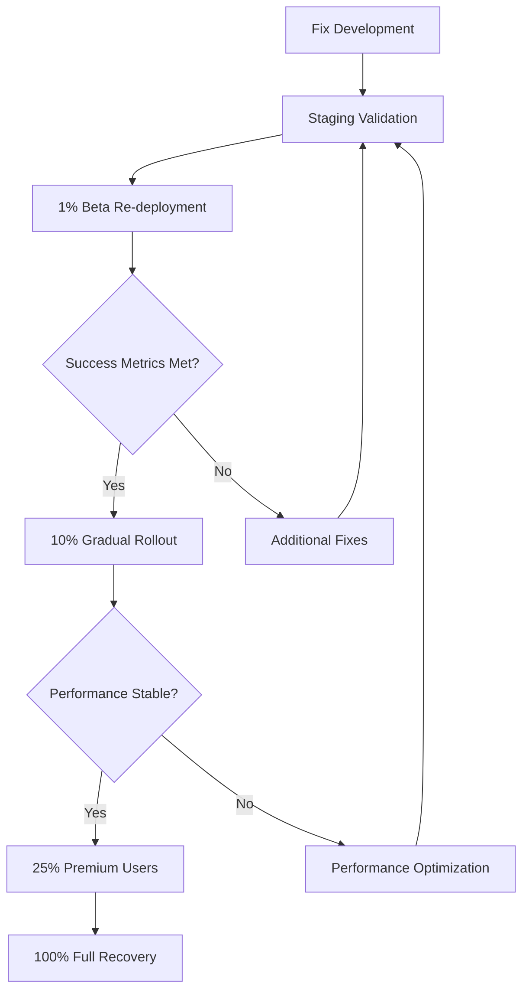

# Phase 5: Rollback Procedures - External Data Premium Gating

**Author:** Gil Klainert  
**Date:** 2025-08-25  
**Version:** 1.0  
**Status:** Emergency Ready

## Overview

This document provides comprehensive rollback procedures for the External Data Sources premium gating system deployment. These procedures are designed to quickly restore system functionality in case of critical issues, performance problems, or user experience degradation.

**Critical Information:**
- **Emergency Contact:** Gil Klainert - Primary Developer
- **Backup Contact:** [Backup Engineer]
- **Response Time Target:** <5 minutes for critical issues
- **System Availability Target:** 99.9% uptime maintained during rollbacks

## Rollback Trigger Matrix

### Critical Rollback Triggers (Immediate Action Required)

| Trigger | Threshold | Response Time | Rollback Type |
|---------|-----------|---------------|---------------|
| System Error Rate | >5% for 10+ minutes | <2 minutes | Full Immediate |
| Complete System Downtime | >2 minutes | <1 minute | Full Immediate |
| Security Breach | Any unauthorized access | <1 minute | Full Immediate |
| Data Corruption | Any data loss/corruption | <1 minute | Full Immediate |
| Revenue Impact | Premium users blocked | <3 minutes | Full Immediate |

### Performance Rollback Triggers (Graduated Response)

| Trigger | Threshold | Response Time | Rollback Type |
|---------|-----------|---------------|---------------|
| Response Time Degradation | >20% increase | <30 minutes | Gradual |
| Conversion Rate Drop | >50% decrease | <1 hour | Feature-Specific |
| User Satisfaction Drop | <3.0/5.0 rating | <2 hours | UX-Focused |
| Support Ticket Spike | >100% increase | <4 hours | Communication |

### Business Rollback Triggers (Strategic Response)

| Trigger | Threshold | Response Time | Rollback Type |
|---------|-----------|---------------|---------------|
| Premium Churn Increase | >25% churn rate | <24 hours | Business Logic |
| Feature Adoption Low | <10% adoption | <48 hours | Feature Adjustment |
| Competitive Disadvantage | Market feedback | <72 hours | Strategic Review |

## Rollback Types & Procedures

### Type 1: Full Immediate Rollback

**Purpose:** Restore complete system to pre-deployment state within 5 minutes  
**Use Case:** Critical system failures, security breaches, revenue-blocking issues

#### Execution Steps

**Step 1: Emergency Response Activation (0-30 seconds)**
```bash
# Activate emergency response mode
echo "EMERGENCY ROLLBACK INITIATED: $(date)" >> /var/log/emergency-rollback.log

# Set emergency flag to prevent new deployments
firebase functions:config:set system.emergency_mode=true
```

**Step 2: Immediate Feature Flag Disable (30-60 seconds)**
```bash
# Disable premium gating immediately
firebase functions:config:set external_data.premium_gating_enabled=false
firebase functions:config:set external_data.rollback_mode=true

# Deploy config changes immediately
firebase deploy --only functions:config --force
```

**Step 3: Function Rollback (60-180 seconds)**
```bash
# Restore from backup (pre-prepared backup versions)
cd /backup/functions-pre-premium-gating

# Deploy previous working version
firebase deploy --only functions --force

# Verify deployment
firebase functions:list | grep enrichCVWithExternalData
```

**Step 4: Database State Verification (180-240 seconds)**
```bash
# Verify no corrupted data
firebase firestore:data:get --collection=users --limit=10
firebase firestore:data:get --collection=cv_data --limit=10

# Check for any premium gating artifacts that need cleanup
firebase firestore:data:get --collection=external_data_usage --limit=5
```

**Step 5: System Validation (240-300 seconds)**
```bash
# Test system functionality
curl -X POST https://us-central1-cvplus.cloudfunctions.net/enrichCVWithExternalData \
  -H "Content-Type: application/json" \
  -d '{"cvId": "test", "userId": "test", "sources": ["linkedin"]}'

# Verify response is successful and no premium gating
# Expected: Success without premium validation
```

**Step 6: Monitoring Restoration (300+ seconds)**
```bash
# Check error rates return to normal
firebase functions:log --only enrichCVWithExternalData --limit=50

# Verify user experience restored
# Monitor support channels for confirmation
```

#### Full Rollback Validation Checklist
- [ ] All functions responding normally
- [ ] Error rates below 1%
- [ ] No premium gating blocking any users
- [ ] External data enrichment functioning for all users
- [ ] No data corruption detected
- [ ] User complaints ceased
- [ ] System monitoring shows green status

### Type 2: Gradual Rollback

**Purpose:** Reduce impact while maintaining some premium gating functionality  
**Use Case:** Performance issues, user experience problems, high support volume

#### Phase 1: Reduce Rollout Percentage (10 minutes)
```bash
# Reduce to 50% of current rollout
firebase functions:config:set external_data.rollout_percentage=50
firebase deploy --only functions:config

# Monitor for 30 minutes
# If issues persist, proceed to Phase 2
```

#### Phase 2: Beta Users Only (20 minutes)  
```bash
# Reduce to beta users only (1-5% traffic)
firebase functions:config:set external_data.rollout_percentage=5
firebase functions:config:set external_data.beta_only=true
firebase deploy --only functions:config

# Monitor for 60 minutes
# If issues persist, proceed to Phase 3
```

#### Phase 3: Complete Gradual Rollback (30 minutes)
```bash
# Disable premium gating completely
firebase functions:config:set external_data.premium_gating_enabled=false
firebase deploy --only functions:config

# Plan for fixes and re-deployment
```

### Type 3: Feature-Specific Rollback

**Purpose:** Disable specific problematic features while maintaining others  
**Use Case:** Individual component failures, rate limiting issues, analytics problems

#### Premium Gating Only Rollback
```bash
# Keep new features but disable premium enforcement
firebase functions:config:set external_data.premium_validation=false
firebase functions:config:set external_data.free_access_mode=true
firebase deploy --only functions:config
```

#### Rate Limiting Rollback
```bash
# Disable rate limiting temporarily
firebase functions:config:set external_data.rate_limiting_enabled=false
firebase deploy --only functions:config
```

#### Analytics Rollback
```bash
# Disable usage tracking and analytics
firebase functions:config:set external_data.analytics_enabled=false
firebase functions:config:set external_data.usage_tracking=false
firebase deploy --only functions:config
```

## Automated Rollback Systems

### Automated Monitoring & Rollback Script

```bash
#!/bin/bash
# automated-rollback-monitor.sh
# This script monitors system health and triggers automatic rollback

LOG_FILE="/var/log/rollback-monitor.log"
ERROR_THRESHOLD=5
CHECK_INTERVAL=60

monitor_system_health() {
    echo "$(date): Checking system health..." >> $LOG_FILE
    
    # Check error rate from Cloud Functions logs
    ERROR_RATE=$(firebase functions:log --only enrichCVWithExternalData --limit=100 | \
                grep -c "ERROR" || echo "0")
    
    echo "$(date): Current error count: $ERROR_RATE" >> $LOG_FILE
    
    if [ $ERROR_RATE -gt $ERROR_THRESHOLD ]; then
        echo "$(date): ERROR THRESHOLD EXCEEDED - Triggering rollback" >> $LOG_FILE
        trigger_automated_rollback
    fi
}

trigger_automated_rollback() {
    echo "$(date): AUTOMATED ROLLBACK INITIATED" >> $LOG_FILE
    
    # Disable premium gating immediately
    firebase functions:config:set external_data.premium_gating_enabled=false
    firebase functions:config:set external_data.auto_rollback_triggered=true
    firebase deploy --only functions:config --force
    
    # Send emergency notifications
    send_emergency_notifications "AUTOMATED ROLLBACK TRIGGERED"
    
    echo "$(date): Automated rollback completed" >> $LOG_FILE
}

send_emergency_notifications() {
    local message=$1
    echo "$(date): $message" >> $LOG_FILE
    
    # Email notification (configure with your email service)
    # curl -X POST "your-email-service-endpoint" -d "message=$message"
    
    # Slack notification (configure with your Slack webhook)
    # curl -X POST -H 'Content-type: application/json' \
    #   --data '{"text":"'$message'"}' YOUR_SLACK_WEBHOOK_URL
}

# Run monitoring loop
while true; do
    monitor_system_health
    sleep $CHECK_INTERVAL
done
```

### Cloud Monitoring Automated Alerts

```yaml
# alerting-policy.yaml
# Google Cloud Monitoring alerting policy configuration

displayName: "External Data Premium Gating - Automated Rollback"
conditions:
  - displayName: "High Error Rate Trigger"
    conditionThreshold:
      filter: 'resource.type="cloud_function" AND resource.labels.function_name="enrichCVWithExternalData"'
      comparison: COMPARISON_GT
      thresholdValue: 5
      duration: 600s  # 10 minutes
    notificationChannels:
      - "projects/cvplus/notificationChannels/emergency-rollback"

documentation:
  content: |
    This alert triggers when the external data enrichment function
    experiences more than 5 errors in a 10-minute window.
    
    AUTOMATED ACTION: Premium gating will be automatically disabled.
    
    MANUAL ACTION REQUIRED:
    1. Check system logs for root cause
    2. Fix underlying issue
    3. Re-enable premium gating when stable
    4. Document incident in rollback log

alertStrategy:
  autoClose: 86400s  # 24 hours
```

## Communication During Rollbacks

### Internal Communication Templates

#### Critical Rollback Notification
```
SUBJECT: [URGENT] External Data Premium Gating - Emergency Rollback Initiated

Team,

An emergency rollback of the External Data Premium Gating system has been initiated due to:
[SPECIFIC TRIGGER REASON]

IMMEDIATE STATUS:
- Rollback Type: [Full/Gradual/Feature-Specific]
- Initiated At: [TIMESTAMP]
- Expected Completion: [TIMESTAMP]
- Current System Status: [OPERATIONAL/DEGRADED/DOWN]

ACTIONS TAKEN:
1. Premium gating disabled
2. System restored to previous version
3. User impact minimized
4. Monitoring intensified

NEXT STEPS:
1. Root cause analysis
2. Fix development
3. Testing in staging
4. Planned re-deployment

Point Person: [NAME]
Status Updates: Every 30 minutes

- Engineering Team
```

#### Business Stakeholder Update
```
SUBJECT: External Data Feature Rollback - Business Impact Update

Leadership Team,

We've initiated a temporary rollback of our External Data Premium Gating feature due to [BUSINESS-FRIENDLY EXPLANATION].

BUSINESS IMPACT:
- Customer Experience: Temporarily restored to previous version
- Revenue Impact: Minimal - premium features still protected
- User Access: All users can access external data (temporary)
- Support Volume: Returning to normal levels

TIMELINE:
- Issue Detected: [TIME]
- Rollback Completed: [TIME]  
- Expected Resolution: [TIME]
- Feature Re-launch: [TIME]

We're treating this as our highest priority and will provide updates every 2 hours.

Best regards,
Product Team
```

### External Communication Templates

#### User-Facing Status Page Update
```html
<div class="incident-update">
  <h3>🔧 Temporary Service Adjustment</h3>
  <p><strong>Status:</strong> Monitoring - Service Restored</p>
  <p><strong>Last Updated:</strong> [TIMESTAMP]</p>
  
  <div class="update-content">
    <p>We've temporarily adjusted our External Data integration features to ensure optimal performance for all users. During this period:</p>
    
    <ul>
      <li>✅ All external data enrichment features are available</li>
      <li>✅ CV generation and processing working normally</li>  
      <li>✅ All user accounts and data secure</li>
      <li>⏳ Premium feature gating temporarily relaxed</li>
    </ul>
    
    <p>We expect to restore enhanced premium features within 24 hours. Thank you for your patience as we ensure the best possible experience.</p>
  </div>
</div>
```

#### Premium User Communication
```html
<div class="premium-notice">
  <h3>Premium Feature Update</h3>
  
  <p>Hi [USER_NAME],</p>
  
  <p>We're temporarily adjusting our External Data integration to provide you with an even better experience. During this brief period:</p>
  
  <ul>
    <li><strong>Your premium benefits remain active</strong></li>
    <li><strong>All external data features are available to you</strong></li>
    <li><strong>No interruption to your CV optimization workflow</strong></li>
  </ul>
  
  <p>We'll notify you when enhanced features are fully restored. As always, thank you for being a premium member!</p>
  
  <div class="support-link">
    Questions? <a href="/support">Contact our premium support team</a>
  </div>
</div>
```

## Post-Rollback Procedures

### Immediate Post-Rollback Actions (First 30 minutes)

#### System Health Verification
```bash
# Comprehensive system health check
rollback_health_check() {
    echo "=== POST-ROLLBACK HEALTH CHECK ===" 
    echo "Timestamp: $(date)"
    
    # Function availability
    echo "Testing function availability..."
    curl -s -o /dev/null -w "%{http_code}" \
      https://us-central1-cvplus.cloudfunctions.net/enrichCVWithExternalData
    
    # Database connectivity
    echo "Testing database connectivity..."
    firebase firestore:data:get --collection=users --limit=1 > /dev/null
    
    # Error rate check
    echo "Checking error rates..."
    ERROR_COUNT=$(firebase functions:log --only enrichCVWithExternalData --since=30m | \
                  grep -c "ERROR" || echo "0")
    echo "Errors in last 30 minutes: $ERROR_COUNT"
    
    # User experience validation
    echo "Validating user flows..."
    # Add specific user journey tests here
    
    echo "Health check completed at $(date)"
}

rollback_health_check
```

#### Stakeholder Notifications
```bash
# Send rollback completion notifications
send_rollback_completion_notice() {
    local ROLLBACK_TYPE=$1
    local START_TIME=$2
    local COMPLETION_TIME=$3
    
    MESSAGE="Rollback completed successfully:
    Type: $ROLLBACK_TYPE
    Duration: $((COMPLETION_TIME - START_TIME)) minutes
    System Status: Operational
    Next Steps: Root cause analysis and fix development"
    
    # Send to internal team
    echo "$MESSAGE" | mail -s "Rollback Completed" team@cvplus.com
    
    # Update status page
    update_status_page "operational" "$MESSAGE"
}
```

### Extended Monitoring (First 24 Hours)

#### Enhanced Monitoring Protocol
- **Error Rate Monitoring**: Check every 15 minutes for first 4 hours, then hourly
- **User Feedback Monitoring**: Active support channel monitoring for user reports
- **Performance Monitoring**: Response time and throughput validation
- **Business Impact Assessment**: Revenue and conversion rate monitoring

#### Monitoring Checklist
- [ ] Hour 1: System stable, error rate <1%
- [ ] Hour 2: User complaints decreased significantly
- [ ] Hour 4: Performance metrics returned to baseline
- [ ] Hour 8: Support ticket volume normalized
- [ ] Hour 12: Business metrics stabilized
- [ ] Hour 24: Complete system health validation

### Root Cause Analysis Protocol

#### Investigation Framework
```markdown
## Rollback Incident Report - [DATE]

### Incident Summary
- **Trigger Event**: [What caused the rollback]
- **Detection Time**: [When was the issue first detected]
- **Response Time**: [How long to initiate rollback]
- **Resolution Time**: [How long to complete rollback]
- **Impact Scope**: [How many users/features affected]

### Timeline of Events
[Detailed timeline of the incident and response]

### Root Cause Analysis
**Primary Cause**: [Main technical/business reason]
**Contributing Factors**: [Additional factors that led to the issue]
**Risk Factors**: [What made the system vulnerable]

### Impact Assessment
**Technical Impact**: [System performance, availability]
**Business Impact**: [Revenue, user experience, reputation]
**User Impact**: [How users were affected]

### Response Effectiveness
**What Worked Well**: [Successful aspects of the response]
**Areas for Improvement**: [What could be done better]
**Process Gaps**: [Missing procedures or tools]

### Prevention Measures
**Immediate Actions**: [Steps to prevent immediate recurrence]
**Short-term Improvements**: [Improvements for next 30 days]
**Long-term Enhancements**: [Strategic improvements for 3-6 months]

### Lessons Learned
[Key takeaways and knowledge gained]
```

## Recovery and Re-deployment Planning

### Recovery Strategy Development

#### Issue Resolution Process
1. **Root Cause Identification** (within 2 hours of rollback)
2. **Fix Development** (timeline depends on complexity)  
3. **Comprehensive Testing** (staging environment validation)
4. **Gradual Re-deployment** (starting with 1% beta rollout)
5. **Full Recovery** (return to intended deployment state)

#### Pre-Recovery Checklist
- [ ] Root cause fully understood and documented
- [ ] Fix implemented and code-reviewed  
- [ ] Comprehensive testing completed in staging
- [ ] Performance benchmarks re-established
- [ ] Security validation re-completed
- [ ] Monitoring enhanced based on lessons learned
- [ ] Communication plan for re-deployment prepared
- [ ] Rollback procedures updated based on experience

### Re-deployment Strategy

#### Phased Recovery Approach


#### Recovery Success Criteria
- **Technical**: System performance equals or exceeds pre-incident baseline
- **Business**: Premium conversion rates restored to target levels
- **User Experience**: Support ticket volume returns to normal
- **Security**: All security validations pass with improved monitoring

## Emergency Contact Information

### Primary Response Team
- **Primary On-Call Engineer**: Gil Klainert - [Contact Info]
- **Backup On-Call Engineer**: [Backup Engineer] - [Contact Info]
- **Product Manager**: [PM Name] - [Contact Info]
- **DevOps Lead**: [DevOps Name] - [Contact Info]

### Escalation Chain
1. **Level 1**: On-Call Engineer (0-15 minutes)
2. **Level 2**: Technical Lead + Product Manager (15-30 minutes)  
3. **Level 3**: Head of Engineering + VP Product (30-60 minutes)
4. **Level 4**: CTO + CEO (60+ minutes or revenue-critical issues)

### External Contacts
- **Firebase Support**: [Support Channel]
- **Google Cloud Support**: [Support Channel]  
- **DNS Provider**: [Provider Contact]
- **CDN Provider**: [Provider Contact]

## Rollback History Log

### Rollback Event Template
```
Date: [YYYY-MM-DD]
Time: [HH:MM UTC]
Type: [Full/Gradual/Feature-Specific]
Trigger: [Specific reason for rollback]
Duration: [Time to complete rollback]
Impact: [Scope of user/system impact]
Resolution: [How the rollback was executed]
Lessons: [Key learnings from the incident]
Follow-up: [Actions taken post-rollback]
Status: [Resolved/Ongoing/Requires-Monitoring]
```

### Historical Rollbacks
*[This section will be populated as rollbacks occur]*

---

## Document Maintenance

**This document must be:**
- Reviewed monthly for accuracy and completeness
- Updated after each rollback incident with lessons learned
- Tested quarterly through rollback drills
- Accessible to all on-call engineers 24/7

**Last Updated:** 2025-08-25  
**Next Review:** 2025-09-25  
**Document Owner:** Gil Klainert, Senior Engineer  
**Approved By:** [Head of Engineering], [VP Product]