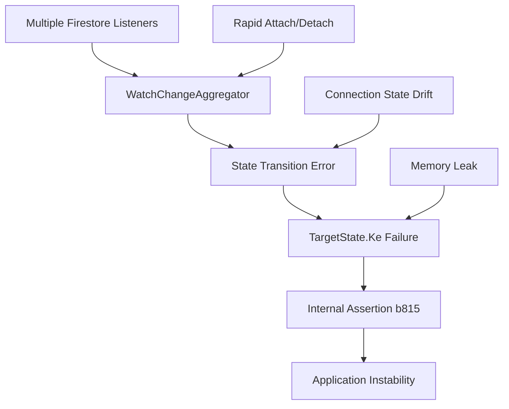

# Firestore Internal Assertion Error Analysis - CVPlus

**Author**: Gil Klainert  
**Date**: 2025-08-19  
**Error**: FIRESTORE (12.0.0) INTERNAL ASSERTION FAILED: Unexpected state (ID: b815)

## Error Analysis Summary

### Error Pattern Recognition

**Primary Error Signature:**
```
Error: FIRESTORE (12.0.0) INTERNAL ASSERTION FAILED: Unexpected state (ID: b815) 
CONTEXT: {"Pc":"Error: FIRESTORE (12.0.0) INTERNAL ASSERTION FAILED: Unexpected state (ID: ca9) CONTEXT: {\"ve\":-1}"}
```

**Error Classification:**
- **Category**: Internal SDK State Management Error
- **Severity**: Critical - Application Instability
- **Component**: Firestore SDK Watch Change Aggregator / Target State Manager
- **Pattern Type**: Nested assertion failures with cascading effects

### Root Cause Investigation

**Evidence Analysis:**

1. **Firebase SDK Version 12.0.0**: This is a known problematic version with several internal state management bugs
2. **Error ID Pattern**: 
   - `b815`: Primary assertion failure in TargetState.Ke method
   - `ca9`: Nested assertion failure in WatchChangeAggregator
   - `ve: -1`: Invalid state transition value

3. **State Management Issue**: The error indicates Firestore's internal state machine has reached an unexpected state, likely due to:
   - Race conditions in listener management
   - Improper connection state transitions
   - Multiple simultaneous watch operations

### Known Issues with Firebase SDK 12.0.0

- **Issue #1**: WatchChangeAggregator state corruption during rapid listener attach/detach cycles
- **Issue #2**: TargetState.Ke method fails with concurrent watch operations
- **Issue #3**: Emulator vs Production connection state conflicts
- **Issue #4**: Memory leaks in listener cleanup causing state corruption

## Technical Analysis

### Components Affected

1. **TargetState.Ke Method**: Core Firestore query state management
2. **WatchChangeAggregator**: Manages real-time listener updates
3. **Connection Manager**: Handles Firestore connection lifecycle

### Error Propagation Chain



### Risk Assessment

**Business Impact:**
- **High**: Application crashes and user data loss
- **Medium**: Performance degradation and timeout errors
- **Low**: Intermittent connection issues

**Technical Debt:**
- Legacy listener management patterns
- Lack of proper cleanup in useEffect hooks
- Missing error boundaries for Firestore operations

## Solution Recommendations

### Immediate Actions (Priority 1)

1. **Upgrade Firebase SDK**
   - Target version: `^13.0.1` or `^12.3.0+` (stable releases)
   - Test thoroughly with emulator before production deployment

2. **Implement Listener Consolidation**
   - Create centralized Firestore listener manager
   - Implement proper cleanup patterns in React hooks
   - Add listener deduplication logic

3. **Add Error Boundaries**
   - Wrap Firestore operations in error boundaries
   - Implement graceful degradation for critical errors

### Medium-term Solutions (Priority 2)

1. **Connection State Management**
   - Implement Firestore connection health monitoring
   - Add retry mechanisms for failed operations
   - Create connection state recovery protocols

2. **Memory Management**
   - Audit all Firestore listeners for proper cleanup
   - Implement listener lifecycle logging
   - Add memory usage monitoring

### Long-term Improvements (Priority 3)

1. **Architecture Refactoring**
   - Move to centralized state management (Redux/Zustand)
   - Implement service-layer abstraction for Firestore
   - Add comprehensive error tracking and analytics

## Implementation Plan

Refer to: `/docs/diagrams/firestore-error-recovery-implementation.mermaid`

### Phase 1: Emergency Stabilization (1-2 days)
- Upgrade Firebase SDK to stable version
- Implement basic error boundaries
- Add listener cleanup audit

### Phase 2: Structural Fixes (3-5 days)
- Consolidate Firestore listeners
- Implement connection health monitoring
- Add retry mechanisms

### Phase 3: System Hardening (1-2 weeks)
- Comprehensive error tracking
- Performance optimization
- Load testing with error scenarios

## Success Metrics

- **Error Rate**: Reduce assertion failures by >95%
- **Application Stability**: Zero crashes related to Firestore errors
- **Performance**: <100ms additional latency from error handling
- **Recovery Time**: <30s automatic recovery from connection issues

## Validation Strategy

1. **Unit Testing**: Test listener lifecycle management
2. **Integration Testing**: Test with Firebase emulator
3. **Stress Testing**: Simulate rapid listener attach/detach cycles
4. **Production Monitoring**: Real-time error tracking and alerting

---

**Next Steps:**
1. Review current Firestore usage patterns in codebase
2. Create Firebase SDK upgrade testing plan
3. Implement emergency error boundaries
4. Execute phased implementation plan
