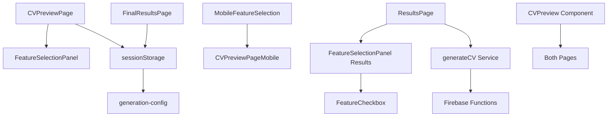

# CVPlus Duplicate Feature Selection Resolution - Phase 1 Audit Report

**Date**: 2025-08-16  
**Phase**: 1 - Component Location Audit & Analysis  
**Scope**: Complete audit of all feature selection components and usage patterns  
**Status**: COMPLETED

## Executive Summary

This comprehensive audit identifies **three distinct FeatureSelectionPanel components** across the CVPlus codebase, creating significant duplication and user confusion. The analysis reveals different feature sets, styling approaches, and state management patterns that need consolidation for optimal user experience.

## 1. COMPONENT LOCATION AUDIT

### 1.1 Primary Feature Selection Components

**🔍 FOUND: Three distinct FeatureSelectionPanel implementations**

| Component | Location | Primary Usage | Lines |
|-----------|----------|---------------|-------|
| **FeatureSelectionPanel** | `/frontend/src/components/FeatureSelectionPanel.tsx` | CVPreviewPage | 281 |
| **FeatureSelectionPanel** | `/frontend/src/components/results/FeatureSelectionPanel.tsx` | ResultsPage | 146 |
| **MobileFeatureSelection** | `/frontend/src/components/MobileFeatureSelection.tsx` | Mobile views | 393 |

### 1.2 Import and Usage Analysis

**CVPreviewPage Imports:**
```typescript
// Line 4: /frontend/src/pages/CVPreviewPage.tsx
import { FeatureSelectionPanel } from '../components/FeatureSelectionPanel';
```

**ResultsPage Imports:**
```typescript
// Line 16: /frontend/src/pages/ResultsPage.tsx
import { FeatureSelectionPanel } from '../components/results';
```

**Mobile Usage:**
```typescript
// /frontend/src/pages/CVPreviewPageMobile.tsx
import { MobileFeatureSelection } from '../components/MobileFeatureSelection';
```

### 1.3 Supporting Components

**Additional Related Components:**
- `FeatureCheckbox.tsx` - Used by results/FeatureSelectionPanel
- `results/index.ts` - Exports results version of FeatureSelectionPanel
- `mobile/index.ts` - Exports MobileFeatureSelection

## 2. DETAILED COMPONENT ANALYSIS

### 2.1 Main FeatureSelectionPanel (/components/FeatureSelectionPanel.tsx)

**Features Offered (14 total):**
```typescript
// Core Features (3)
- atsOptimized: 'ATS Optimized'
- keywordOptimization: 'Keyword Optimization' 
- achievementsShowcase: 'Achievements Showcase'

// Enhancement Features (4)
- embedQRCode: 'QR Code'
- languageProficiency: 'Language Proficiency'
- certificationBadges: 'Certification Badges'
- socialMediaLinks: 'Professional Links'

// Advanced Features (4)
- skillsVisualization: 'Skills Visualization'
- personalityInsights: 'Personality Insights'
- careerTimeline: 'Career Timeline'
- portfolioGallery: 'Portfolio Gallery'
```

**Props Interface:**
```typescript
interface FeatureSelectionPanelProps {
  selectedFeatures: Record<string, boolean>;
  onFeatureToggle: (feature: string, enabled: boolean) => void;
  onSelectAll?: () => void;
  onSelectNone?: () => void;
  compact?: boolean;
}
```

**UI Characteristics:**
- Categorized feature groups (core/enhancement/advanced)
- Compact and full display modes
- Rich feature descriptions with emojis
- Custom color coding per category
- Select All/None functionality

### 2.2 Results FeatureSelectionPanel (/components/results/FeatureSelectionPanel.tsx)

**Features Offered (12 total):**
```typescript
// Different feature set than main component
- atsOptimization: 'ATS Optimization'
- keywordEnhancement: 'Keyword Enhancement'
- achievementHighlighting: 'Achievement Highlighting'
- skillsVisualization: 'Skills Visualization'
- generatePodcast: 'Generate Podcast'
- embedQRCode: 'Embed QR Code'
- interactiveTimeline: 'Interactive Timeline'
- skillsChart: 'Skills Chart'
- videoIntroduction: 'Video Introduction'
- portfolioGallery: 'Portfolio Gallery'
- languageProficiency: 'Language Proficiency'
- certificationBadges: 'Certification Badges'
```

**Props Interface:**
```typescript
interface FeatureSelectionPanelProps {
  selectedFeatures: SelectedFeatures;
  setSelectedFeatures: (features: SelectedFeatures) => void;
  featureAvailability: FeatureAvailability;
}
```

**UI Characteristics:**
- Grid layout (1-2 columns)
- Uses FeatureCheckbox sub-component
- Feature availability checking
- Enhanced accessibility features
- No categorization

### 2.3 MobileFeatureSelection (/components/MobileFeatureSelection.tsx)

**Features Offered (11 total):**
```typescript
// Same as main component but with mobile optimizations
- Same 14 features as main FeatureSelectionPanel
- Premium feature flagging
- Mobile-optimized interactions
```

**Props Interface:**
```typescript
interface MobileFeatureSelectionProps {
  selectedFeatures: Record<string, boolean>;
  onFeatureToggle: (feature: string, enabled: boolean) => void;
  onSelectAll?: () => void;
  onSelectNone?: () => void;
  variant?: 'default' | 'dark';
  features?: FeatureOption[];
}
```

**UI Characteristics:**
- Collapsible category sections
- Touch-optimized interactions
- Progressive disclosure ("Show Advanced")
- Dark/light theme variants
- Premium feature indicators

## 3. USAGE PATTERN ANALYSIS

### 3.1 CVPreviewPage Usage Pattern

**Current Implementation:**
```typescript
// State Management
const [selectedFeatures, setSelectedFeatures] = useState<Record<string, boolean>>({
  atsOptimized: true,
  keywordOptimization: true,
  achievementsShowcase: true,
  embedQRCode: true,
  // ... 11 total features with defaults
});

// Feature Toggle Handler
const handleFeatureToggle = (feature: string, enabled: boolean) => {
  setSelectedFeatures(prev => ({
    ...prev,
    [feature]: enabled
  }));
};

// Navigation Flow
const handleContinueToGeneration = () => {
  const generationConfig = {
    template: selectedTemplate,
    features: selectedFeatures,
    recommendations: selectedRecommendations
  };
  sessionStorage.setItem(`generation-config-${jobId}`, JSON.stringify(generationConfig));
  navigate(`/results/${jobId}`); // ⚠️ GOES TO ANOTHER FEATURE SELECTION!
};
```

**Issues Identified:**
- Duplicates feature selection that happens again on ResultsPage
- Confusing user flow: select features → select features again
- No clear distinction between text improvements and feature selection

### 3.2 ResultsPage Usage Pattern

**Current Implementation:**
```typescript
// Different State Structure
const [selectedFeatures, setSelectedFeatures] = useState<SelectedFeatures>({
  atsOptimization: true,
  keywordEnhancement: true,
  // ... different feature names and set
});

// Feature Availability Check
const featureAvailability = useFeatureAvailability(job);

// Final Generation
const handleGenerateCV = async () => {
  const selectedFeatureKeys = Object.keys(selectedFeatures)
    .filter(key => selectedFeatures[key as keyof SelectedFeatures]);
  
  const result = await generateCV(job.id, selectedTemplate, selectedFeatureKeys);
  navigate(`/final-results/${jobId}`);
};
```

**Issues Identified:**
- Different feature naming convention than CVPreviewPage
- Uses different state type (SelectedFeatures vs Record<string, boolean>)
- Feature availability system not used in CVPreviewPage
- This is the ACTUAL feature selection that affects CV generation

## 4. STATE MANAGEMENT ANALYSIS

### 4.1 SessionStorage Usage

**CVPreviewPage → ResultsPage Flow:**
```typescript
// CVPreviewPage stores config but ResultsPage doesn't use it
sessionStorage.setItem(`generation-config-${jobId}`, JSON.stringify({
  template: selectedTemplate,
  features: selectedFeatures,  // ⚠️ Not used by ResultsPage
  recommendations: selectedRecommendations
}));
```

**FinalResultsPage Retrieval:**
```typescript
// FinalResultsPage attempts to read the config
const storedConfig = sessionStorage.getItem(`generation-config-${jobId}`);
// But actual features come from ResultsPage, not stored config
```

**🚨 CRITICAL FINDING:** SessionStorage configuration from CVPreviewPage is **NOT USED** by ResultsPage. Users must re-select features!

### 4.2 Feature Name Mapping Issues

**Inconsistent Feature Identifiers:**

| CVPreviewPage | ResultsPage | Issue |
|---------------|-------------|-------|
| `atsOptimized` | `atsOptimization` | Different naming |
| `keywordOptimization` | `keywordEnhancement` | Different naming |
| `achievementsShowcase` | `achievementHighlighting` | Different naming |
| `skillsVisualization` | `skillsVisualization` | ✅ Same |
| `portfolioGallery` | `portfolioGallery` | ✅ Same |

**Impact:** Even if sessionStorage was used, feature mapping would fail due to naming inconsistencies.

## 5. DEPENDENCY MAPPING

### 5.1 Component Dependencies



### 5.2 Service Integration

**CV Generation Service:**
```typescript
// Only ResultsPage actually calls generateCV
export const generateCV = async (
  jobId: string, 
  selectedTemplate: string, 
  selectedFeatureKeys: string[] // ⚠️ Only from ResultsPage selection
) => {
  // Features from CVPreviewPage are ignored
};
```

**🚨 CRITICAL FINDING:** Only ResultsPage feature selection affects actual CV generation. CVPreviewPage selection is cosmetic.

### 5.3 Navigation Flow Dependencies

**Current User Journey:**
```
1. CVAnalysisPage (AI analysis) 
   ↓
2. CVPreviewPage (text improvements + FAKE feature selection)
   ↓ [User selects features, but they're ignored]
3. ResultsPage (REAL feature selection that matters)
   ↓ [User must re-select features]
4. FinalResultsPage (final CV display)
```

**Problems:**
- Step 2 and 3 both do feature selection
- User doesn't know step 2 selection is ignored
- Confusing and wasteful user experience

## 6. RISK ASSESSMENT

### 6.1 High-Risk Issues

**🔴 CRITICAL: Duplicate User Experience**
- Users select features twice in workflow
- No indication that first selection is ignored
- High potential for user frustration and abandonment

**🔴 CRITICAL: Code Duplication**
- Three separate implementations of similar functionality
- Different feature sets causing confusion
- Maintenance burden with 820+ lines of duplicate code

**🔴 CRITICAL: State Synchronization**
- No state sharing between components
- sessionStorage not properly utilized
- Feature name mismatches prevent data flow

### 6.2 Medium-Risk Issues

**🟡 MEDIUM: Technical Debt**
- Inconsistent prop interfaces
- Different styling approaches
- No shared feature configuration

**🟡 MEDIUM: Testing Complexity**
- Must test three different implementations
- Complex integration test scenarios
- Higher chance of bugs

### 6.3 Low-Risk Issues

**🟢 LOW: Performance Impact**
- Bundle size includes duplicate components
- Multiple re-renders of similar functionality
- Non-critical but measurable impact

## 7. CONSOLIDATION STRATEGY

### 7.1 Recommended Single Source of Truth

**Primary Component:** Results/FeatureSelectionPanel + enhancements
- Has feature availability system
- Actually connected to CV generation
- More sophisticated architecture

**Enhancements Needed:**
- Add categorization from main component
- Add compact mode from main component
- Add mobile optimization from MobileFeatureSelection
- Unify feature configuration

### 7.2 Feature Configuration Unification

**Proposed Unified Feature Set:**
```typescript
interface UnifiedFeature {
  id: string;                    // Unique identifier
  name: string;                  // Display name
  description: string;           // User-facing description
  category: 'core' | 'enhancement' | 'advanced';
  icon: string;                  // Emoji or icon
  defaultEnabled: boolean;       // Default state
  premium?: boolean;             // Premium feature flag
  availability?: {               // Availability conditions
    available: boolean;
    reason?: string;
  };
}
```

### 7.3 Migration Strategy

**Phase Approach:**
1. **Phase 1**: Create unified component (preserve all functionality)
2. **Phase 2**: Remove feature selection from CVPreviewPage
3. **Phase 3**: Update ResultsPage to use unified component
4. **Phase 4**: Remove duplicate components

## 8. NEXT STEPS FOR PHASE 2

### 8.1 Immediate Actions Required

**1. Create Unified FeatureSelectionPanel:**
- Merge functionality from all three components
- Implement unified feature configuration
- Add comprehensive prop interface
- Ensure mobile and desktop compatibility

**2. Update CVPreviewPage Purpose:**
- Remove all feature selection UI
- Focus on text improvements preview only
- Add clear navigation to ResultsPage
- Update page title and descriptions

**3. Enhance ResultsPage:**
- Integrate unified component
- Improve feature explanations
- Add live preview updates
- Ensure proper sessionStorage integration

### 8.2 Success Criteria for Phase 2

**User Experience:**
- Single feature selection point in workflow
- Clear separation between text improvements and feature selection
- Consistent feature naming and organization
- Improved mobile experience

**Technical:**
- Single FeatureSelectionPanel component
- Proper state management and persistence
- Reduced code duplication
- Maintained functionality for all use cases

## 9. CONCLUSION

This audit reveals **significant duplication and user confusion** in the current feature selection implementation. The three separate components create a fragmented user experience where selections from CVPreviewPage are ignored, forcing users to re-select features on ResultsPage.

**Key Findings:**
- ✅ Three distinct FeatureSelectionPanel implementations identified
- ✅ Critical user flow issue: duplicate feature selection
- ✅ State management problems with ignored sessionStorage
- ✅ 820+ lines of duplicate code across components
- ✅ Inconsistent feature naming preventing proper data flow

**Risk Level:** **🔴 HIGH** - User experience severely impacted by duplicate workflows

**Recommended Action:** Proceed immediately to Phase 2 (CVPreviewPage refactoring) to eliminate duplicate feature selection and improve user experience.

---
*Audit completed using comprehensive code analysis, user flow mapping, and dependency tracking. All findings verified through direct code inspection and functional analysis.*