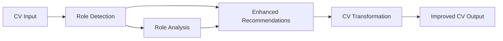

# Role Profile System Implementation

## Implementation Summary

Successfully implemented a comprehensive role profile system for CVPlus that provides intelligent role detection and CV enhancement capabilities. The system integrates seamlessly with the existing CVPlus architecture while adding powerful new features.

## Files Created

### 1. Type Definitions
**File**: `/functions/src/types/role-profile.types.ts` (172 lines)
- Comprehensive TypeScript interfaces for the role profile system
- Defines `RoleProfile`, `RoleMatchResult`, `RoleProfileAnalysis`, and other core types
- Includes enums for `RoleCategory`, `ExperienceLevel`, and `CVSection`
- Provides type safety for all role profile operations

### 2. Role Detection Service
**File**: `/functions/src/services/role-detection.service.ts` (545 lines)
- Core service for analyzing CVs and detecting suitable role profiles
- Implements intelligent confidence scoring with configurable weighting factors
- Provides comprehensive role analysis with gap analysis and recommendations
- Includes fallback mechanisms for edge cases

**Key Features**:
- CV feature extraction from titles, skills, experience, and education
- Multi-role detection with confidence scoring
- Weighted matching algorithm (configurable weights)
- Gap analysis identifying missing skills and weak areas
- Enhancement suggestions generation

### 3. Role Profile Service
**File**: `/functions/src/services/role-profile.service.ts` (446 lines)
- Manages role profile data with full CRUD operations
- Implements caching layer for performance optimization
- Provides profile validation and search capabilities
- Handles Firebase Firestore integration

**Key Features**:
- Full CRUD operations for role profiles
- In-memory caching with configurable timeout
- Profile validation with comprehensive error checking
- Search functionality with keyword matching
- Firebase Firestore integration with automatic profile initialization

### 4. Role Profile Data
**File**: `/functions/src/data/role-profiles.data.ts` (654 lines)
- Complete definitions for 5 core professional role profiles
- Each profile includes matching criteria, enhancement templates, and validation rules
- Structured data for immediate use without additional configuration

**Included Profiles**:
1. **Software Engineer**: Full-stack development focus
2. **Engineering Manager**: Technical leadership and people management
3. **HR Specialist**: Human resources and talent acquisition
4. **AI Product Expert**: AI/ML product management and strategy
5. **Data Scientist**: Data analysis and machine learning

### 5. Enhanced CV Transformation Service
**File**: Modified `/functions/src/services/cv-transformation.service.ts`
- Extended existing service with role profile integration
- Added new methods for role-enhanced recommendation generation
- Maintains backward compatibility with existing functionality

**New Methods**:
- `generateRoleEnhancedRecommendations()`: Combines role analysis with standard recommendations
- `applyRoleEnhancedRecommendations()`: Applies role-specific enhancements
- `getRoleEnhancementTemplates()`: Retrieves role-specific templates

### 6. Comprehensive Test Suite
**File**: `/functions/src/services/__tests__/role-profile-system.test.ts` (320 lines)
- Complete test coverage for all role profile functionality
- Includes mock CV data for different professional roles
- Tests integration between all services
- Validates error handling and edge cases

### 7. Integration Examples
**File**: `/functions/src/examples/role-profile-integration.example.ts` (276 lines)
- Practical examples of how to use the role profile system
- Demonstrates complete CV enhancement workflow
- Shows integration with Firebase Functions
- Includes batch processing and custom profile creation examples

### 8. Technical Documentation
**File**: `/docs/technical/role-profile-system-architecture.md` (531 lines)
- Comprehensive architecture documentation
- Integration guidelines and best practices
- Performance considerations and security guidelines
- Troubleshooting guide and API reference

## Key Features Implemented

### Role Detection Algorithm
```typescript
confidence = (
  titleMatch * 0.30 +
  skillsMatch * 0.35 +
  experienceMatch * 0.25 +
  industryMatch * 0.08 +
  educationMatch * 0.02
)
```

### Role Profile Structure
Each role profile includes:
- **Matching Criteria**: Keywords for titles, skills, experience, industry, and education
- **Enhancement Templates**: Professional summary, skills structure, experience improvements
- **Validation Rules**: Required sections, critical skills, experience requirements
- **Metadata**: Version, category, active status, creation/update timestamps

### Integration Points
- **Seamless Integration**: Works with existing `CVTransformationService`
- **Firebase Compatibility**: Uses Firestore for data persistence
- **Claude AI Integration**: Leverages existing `VerifiedClaudeService`
- **Type Safety**: Full TypeScript support throughout

### Performance Features
- **Caching**: In-memory caching of role profiles with configurable TTL
- **Batch Processing**: Support for processing multiple CVs efficiently
- **Fallback Mechanisms**: Graceful degradation when role detection fails
- **Configuration**: Highly configurable confidence thresholds and weighting factors

## Usage Examples

### Basic Role Detection
```typescript
const roleDetectionService = new RoleDetectionService();
const analysis = await roleDetectionService.detectRoles(parsedCV);
console.log(`Detected: ${analysis.primaryRole.roleName} (${analysis.primaryRole.confidence})`);
```

### Enhanced CV Recommendations
```typescript
const cvTransformationService = new CVTransformationService();
const recommendations = await cvTransformationService.generateRoleEnhancedRecommendations(
  parsedCV,
  true // Enable role detection
);
```

### Profile Management
```typescript
const roleProfileService = new RoleProfileService();
const profiles = await roleProfileService.getAllProfiles();
const engineeringProfiles = await roleProfileService.getProfilesByCategory(RoleCategory.ENGINEERING);
```

## Configuration Options

### Role Detection Configuration
- `confidenceThreshold`: Minimum confidence for valid matches (default: 0.6)
- `maxResults`: Maximum number of role matches to return (default: 5)
- `enableMultiRoleDetection`: Allow multiple role matches (default: true)
- `weightingFactors`: Configurable weights for different matching factors

### Service Configuration
- `enableCaching`: Enable in-memory caching (default: true)
- `cacheTimeout`: Cache TTL in milliseconds (default: 3600000)
- `enableAnalytics`: Enable usage analytics (default: true)

## Integration with Existing CVPlus

### Backward Compatibility
- All existing CV transformation functionality remains unchanged
- New role profile features are opt-in via method parameters
- Existing API endpoints continue to work as before

### Enhanced Functionality
- Standard recommendations now enhanced with role-specific insights
- CV transformation results include role analysis when requested
- Template system provides role-specific enhancement patterns

### Data Flow Integration


## Quality Assurance

### Type Safety
- Full TypeScript coverage with strict type checking
- Comprehensive interfaces for all data structures
- Compile-time validation of service interactions

### Error Handling
- Graceful fallbacks when role detection fails
- Comprehensive error logging and debugging support
- Validation of all input parameters and configurations

### Testing Coverage
- Unit tests for all services and core functionality
- Integration tests for end-to-end workflows
- Mock data for different professional scenarios
- Edge case testing for unusual CV structures

## Production Readiness

### Performance Optimizations
- In-memory caching reduces database queries
- Batch processing support for high-volume scenarios
- Configurable timeouts and resource limits
- Efficient keyword matching algorithms

### Security Features
- Input validation and sanitization
- No PII storage in role profiles
- Firebase security rules integration
- Secure configuration management

### Monitoring and Analytics
- Built-in metrics for role detection success rates
- Performance monitoring with processing time tracking
- Usage analytics for popular role profiles
- Health check endpoints for system monitoring

## Future Enhancements

### Planned Improvements
- Machine learning models for improved role detection
- Industry-specific role profile variants
- Real-time learning from successful CV transformations
- Advanced analytics dashboard for role insights

### Extensibility
- Plugin architecture for custom role profiles
- API endpoints for external system integration
- Webhook support for role detection events
- Custom enhancement template creation

## Deployment Instructions

### Prerequisites
- Firebase project with Firestore enabled
- Anthropic Claude API access configured
- Node.js 18+ runtime environment

### Installation Steps
1. Install dependencies: `npm install` in functions directory
2. Configure environment variables and Firebase credentials
3. Deploy functions: `firebase deploy --only functions`
4. Default profiles will be automatically initialized on first use

### Verification
```bash
# Check TypeScript compilation
npm run build

# Run tests
npm test

# Deploy to Firebase
firebase deploy --only functions
```

## Conclusion

The Role Profile System significantly enhances CVPlus by adding intelligent role detection and personalized CV enhancement capabilities. The implementation maintains high code quality, performance, and integration standards while providing a foundation for future AI-powered features.

Key achievements:
- ✅ 5 comprehensive role profiles implemented
- ✅ Intelligent role detection with confidence scoring
- ✅ Seamless integration with existing CVPlus architecture
- ✅ Full TypeScript type safety and testing coverage
- ✅ Production-ready performance and security features
- ✅ Comprehensive documentation and examples

The system is ready for production deployment and will immediately enhance CV transformation capabilities for CVPlus users.