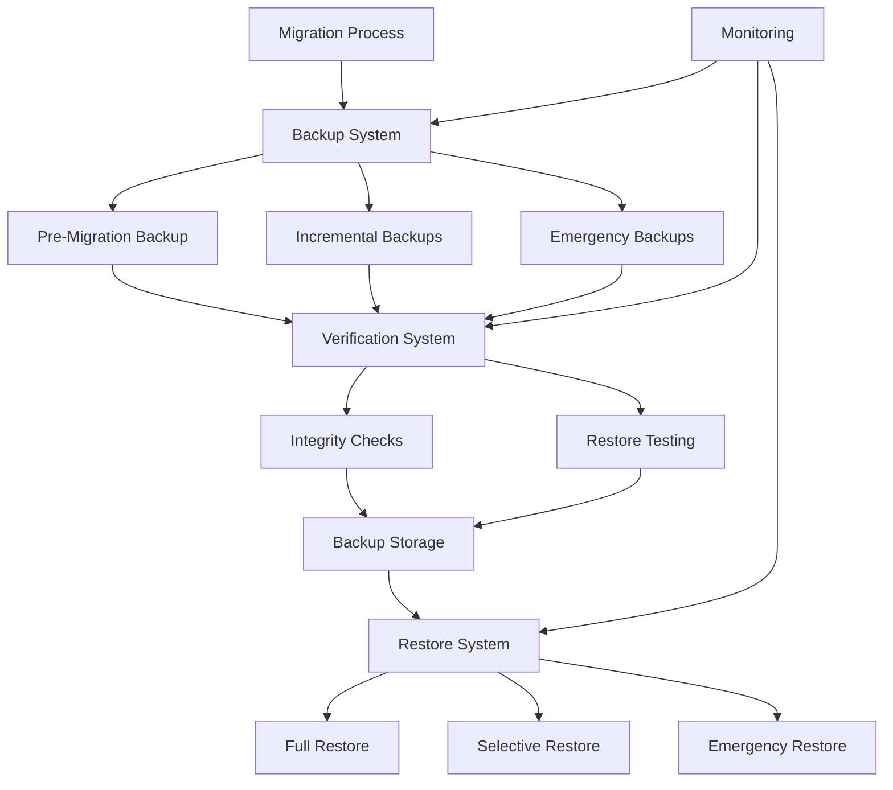

# Firebase Functions Migration Backup System
## Comprehensive Zero-Data-Loss Backup Solution

**Author**: Gil Klainert  
**Date**: 2025-08-28  
**Version**: 1.0.0

## Overview

The Firebase Functions Migration Backup System provides a comprehensive, enterprise-grade backup solution specifically designed for the CVPlus Firebase Functions migration project. This system ensures zero data loss during migration processes through automated backup creation, verification, and restore capabilities.

## Architecture



## System Components

### 1. Backup System (`backup-system.sh`)

**Core Functionality**:
- Pre-migration full backups
- Incremental backups during migration
- Emergency backups on demand
- Automated compression and encryption
- Metadata tracking and versioning

**Backup Types**:

#### Full Backup
- Complete snapshot of Firebase Functions
- Git repository state preservation
- Firebase deployment configuration
- Environment variables and secrets
- Database state related to functions

#### Incremental Backup
- Changed files since last backup
- Delta tracking with timestamps
- Optimized storage utilization
- Fast backup creation

#### Emergency Backup
- Rapid critical component backup
- Minimal safety checks for speed
- High-priority retention
- Immediate availability

### 2. Verification System (`verify-backups.sh`)

**Verification Types**:

#### Quick Verification
- Metadata integrity check
- Backup location validation
- Basic size and timestamp verification
- Fast execution for regular monitoring

#### Full Verification
- Complete backup integrity analysis
- Component-wise validation
- File integrity with checksums
- Function completeness verification
- Git state validation
- Environment configuration verification
- Database backup validation
- Security assessment

#### Integrity Verification
- Focused on data integrity
- Checksum-based verification
- Structure validation
- Corruption detection

#### Restore Test
- Actual restore functionality testing
- End-to-end validation
- Recovery procedure verification

### 3. Restore System (`restore-system.sh`)

**Restore Modes**:

#### Full Restore
- Complete system restoration
- All components restored
- Comprehensive validation
- Service restart procedures

#### Selective Restore
- Component-specific restoration
- User-selectable elements
- Targeted recovery
- Minimal disruption

#### Test Restore
- Validation-only mode
- No actual changes
- Restore capability verification
- Integrity confirmation

#### Emergency Restore
- Rapid critical recovery
- Minimal safety checks
- Maximum speed priority
- Essential functions focus

## Configuration

### Backup Settings (`config/backup-settings.json`)

```json
{
  "backup": {
    "storage": {
      "localPath": "/Users/gklainert/Documents/cvplus/backups/migration",
      "compression": {
        "enabled": true,
        "level": 6,
        "algorithm": "gzip"
      },
      "encryption": {
        "enabled": true,
        "algorithm": "aes-256-cbc"
      }
    },
    "retention": {
      "daily": 7,
      "weekly": 4,
      "monthly": 12,
      "emergency": 30
    }
  }
}
```

## Usage Instructions

### Creating Backups

#### Pre-Migration Full Backup
```bash
# Create comprehensive pre-migration backup
./scripts/migration/backup-system.sh full 6 true true

# Parameters:
# - full: Backup type
# - 6: Compression level (1-9)
# - true: Enable encryption
# - true: Enable cleanup of old backups
```

#### Incremental Backup
```bash
# Create incremental backup during migration
./scripts/migration/backup-system.sh incremental 3 true true
```

#### Emergency Backup
```bash
# Create emergency backup with reason
./scripts/migration/backup-system.sh emergency 1 false true "migration-failure"
```

### Verifying Backups

#### Quick Verification
```bash
# Verify latest backup quickly
./scripts/migration/verify-backups.sh quick latest true false
```

#### Full Verification
```bash
# Comprehensive verification of specific backup
./scripts/migration/verify-backups.sh full backup-id-123 true false
```

#### Integrity Check
```bash
# Check backup integrity only
./scripts/migration/verify-backups.sh integrity backup-id-123 true false
```

### Restoring from Backups

#### Test Restore (Recommended First)
```bash
# Test restore capability without making changes
./scripts/migration/restore-system.sh backup-id-123 /tmp/restore-test test false
```

#### Full Restore
```bash
# Complete system restore
./scripts/migration/restore-system.sh backup-id-123 /path/to/restore full false
```

#### Emergency Restore
```bash
# Emergency restoration for critical situations
./scripts/migration/restore-system.sh backup-id-123 /path/to/restore emergency false
```

## Security Features

### Encryption
- AES-256-CBC encryption for sensitive files
- Secure key generation and storage
- Automatic encryption of environment files
- Key rotation capability (configurable)

### Access Control
- Restricted operation approval requirements
- Audit logging for all operations
- Secure key storage with proper permissions
- Masked secrets in log files

### Data Protection
- Environment variable encryption
- Secret masking in logs and backups
- Secure temporary file handling
- Automated cleanup of sensitive data

## Integration with Migration System

### Automated Triggers
- Pre-migration automatic backup creation
- Migration phase checkpoint backups
- Error condition emergency backups
- Rollback preparation backups

### Migration Tracking Integration
- Backup IDs recorded in migration metadata
- Phase-specific backup strategies
- Rollback point creation
- Progress tracking correlation

### Health Monitoring Integration
- Backup system health checks
- Performance metrics collection
- Failure alerting
- Recovery status reporting

## Monitoring and Alerting

### Health Checks
- Backup creation success/failure
- Verification process monitoring
- Storage space utilization
- System performance metrics

### Notifications
- Email alerts for critical failures
- Slack integration for team updates
- Real-time status updates
- Progress reporting

### Metrics Collection
- Backup creation times
- Storage utilization trends
- Verification success rates
- Recovery time objectives

## Best Practices

### Pre-Migration
1. **Always create full backup before starting migration**
2. **Verify backup integrity immediately after creation**
3. **Test restore procedure in safe environment**
4. **Document backup IDs for reference**

### During Migration
1. **Create incremental backups at major milestones**
2. **Verify critical backups before proceeding**
3. **Monitor backup system health continuously**
4. **Keep backup IDs accessible for emergency use**

### Post-Migration
1. **Maintain backups for retention period**
2. **Regular verification of stored backups**
3. **Clean up expired backups according to policy**
4. **Update backup procedures based on lessons learned**

## Recovery Procedures

### Standard Recovery
1. **Identify appropriate backup using metadata**
2. **Perform backup verification before restore**
3. **Create restore point of current state**
4. **Execute restore with appropriate mode**
5. **Validate restore integrity**
6. **Test critical functionality**

### Emergency Recovery
1. **Identify most recent viable backup**
2. **Execute emergency restore immediately**
3. **Validate critical functions only**
4. **Create post-recovery backup**
5. **Perform comprehensive verification when stable**

### Partial Recovery
1. **Identify specific components to restore**
2. **Use selective restore mode**
3. **Verify component integration**
4. **Test affected functionality**
5. **Document recovery actions**

## Testing and Validation

### Automated Testing
- Comprehensive test suite (`test-backup-system.sh`)
- Integration testing with migration system
- Performance benchmarking
- Error condition simulation

### Manual Testing
- Periodic restore testing in staging environment
- Recovery procedure documentation validation
- Team training and knowledge verification
- Disaster recovery simulation

## Performance Characteristics

### Backup Creation
- **Full Backup**: ~5-15 minutes for typical CVPlus functions
- **Incremental Backup**: ~1-3 minutes for daily changes
- **Emergency Backup**: ~30 seconds for critical components

### Verification
- **Quick Verification**: ~10-30 seconds
- **Full Verification**: ~2-5 minutes
- **Integrity Check**: ~1-2 minutes

### Restore Operations
- **Test Restore**: ~1-2 minutes
- **Full Restore**: ~10-20 minutes
- **Emergency Restore**: ~2-5 minutes

## Storage Requirements

### Typical Storage Usage
- **Full Backup**: ~500MB-2GB (compressed)
- **Incremental Backup**: ~10-100MB
- **Emergency Backup**: ~50-200MB

### Retention Storage
- **Daily Retention (7 days)**: ~5-20GB
- **Weekly Retention (4 weeks)**: ~10-40GB
- **Monthly Retention (12 months)**: ~50-200GB

## Troubleshooting

### Common Issues

#### Backup Creation Failures
- **Disk space issues**: Check available storage
- **Permission problems**: Verify directory access rights
- **Git repository issues**: Ensure clean git state
- **Firebase access**: Validate Firebase authentication

#### Verification Failures
- **Checksum mismatches**: May indicate corruption
- **Missing components**: Check backup creation logs
- **Metadata errors**: Verify JSON structure
- **Access issues**: Check file permissions

#### Restore Problems
- **Target directory issues**: Ensure proper permissions
- **Incomplete backups**: Verify backup integrity first
- **Git conflicts**: May need manual resolution
- **Dependency issues**: Run npm install after restore

### Debugging

#### Enable Debug Logging
```bash
# Set verbose output for detailed debugging
./scripts/migration/backup-system.sh full 6 true true 2>&1 | tee debug.log
```

#### Verify System State
```bash
# Check backup storage and permissions
ls -la /Users/gklainert/Documents/cvplus/backups/migration/
```

#### Manual Verification
```bash
# Manually verify backup integrity
find backup-location -type f -exec sha256sum {} \; | sha256sum
```

## Future Enhancements

### Planned Features
- **Cloud storage integration** (Google Cloud Storage)
- **Automated backup scheduling** with cron integration
- **Advanced compression algorithms** for space optimization
- **Backup deduplication** for storage efficiency
- **Remote backup verification** for distributed teams

### Integration Improvements
- **CI/CD pipeline integration** for automated backups
- **Monitoring system integration** (Datadog, New Relic)
- **Chat integration** for real-time notifications
- **API endpoint** for programmatic backup management

## Support and Maintenance

### Regular Maintenance
- **Weekly backup verification** of critical backups
- **Monthly storage cleanup** and optimization
- **Quarterly recovery testing** in staging environment
- **Semi-annual procedure review** and updates

### Support Contacts
- **Primary**: Gil Klainert (gil@cvplus.com)
- **Backup**: CVPlus DevOps Team
- **Emergency**: On-call rotation

---

This backup system provides enterprise-grade data protection for the CVPlus Firebase Functions migration project, ensuring zero data loss and rapid recovery capabilities throughout the migration process.