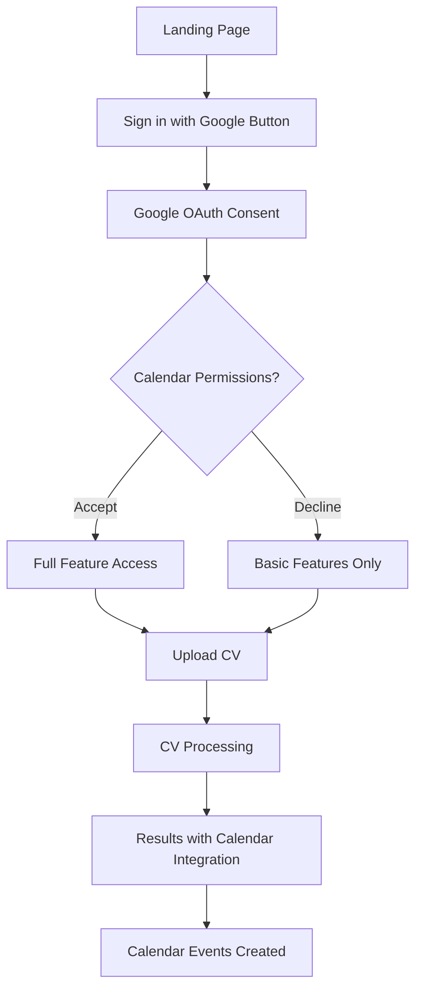
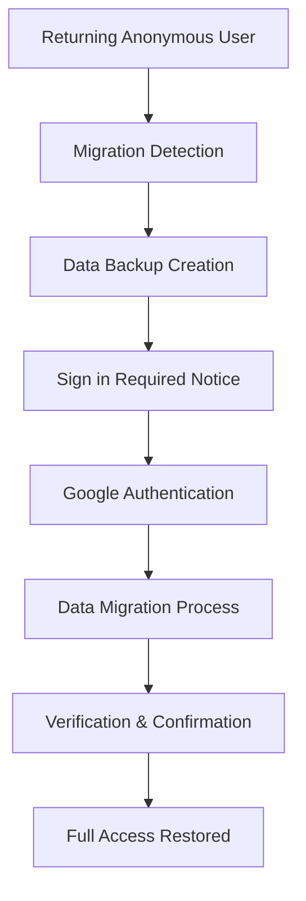

# CVPlus Google-Only Authentication Migration Plan

**Author**: Gil Klainert  
**Date**: August 19, 2025  
**Status**: Planning Phase  
**Priority**: High  

## Executive Summary

This document outlines a comprehensive plan for migrating CVPlus from its current anonymous authentication system to a Google-only authentication model with integrated calendar permissions. This migration will enable seamless calendar integration while maintaining user experience quality and ensuring data security.

## Current State Analysis

### Current Authentication System
- **Primary Method**: Firebase Anonymous Authentication (`signInAnonymously`)
- **Secondary Methods**: Google OAuth, Email/Password (limited usage)
- **User Flow**: Users can access system without any authentication requirements
- **Calendar Integration**: Existing Google Calendar API integration with separate OAuth flow

### Current Calendar Integration
- **Service**: `CalendarIntegrationService` with Google Calendar API
- **OAuth Scopes**: `https://www.googleapis.com/auth/calendar`
- **Features**: Career milestone events, meeting scheduling, anniversary reminders
- **Authorization**: Separate OAuth flow after CV generation

### Identified Issues with Current System
1. **Fragmented User Experience**: Separate auth flows for main app and calendar features
2. **Limited Personalization**: Anonymous users cannot save preferences or access history
3. **Data Persistence**: Anonymous sessions are ephemeral and lost on browser changes
4. **Security Limitations**: Cannot implement proper user-specific data protection
5. **Calendar Integration Friction**: Users must authenticate twice (anonymously + Google)

## Migration Objectives

### Primary Goals
1. **Unified Authentication**: Single Google OAuth flow for entire application
2. **Calendar Integration**: Built-in calendar permissions from initial authentication
3. **User Experience**: Seamless transition with minimal disruption
4. **Data Migration**: Preserve existing anonymous user data where possible
5. **Security Enhancement**: Implement proper user-specific data protection

### Success Metrics
- **Authentication Success Rate**: >95% of users successfully authenticate via Google
- **Calendar Integration Adoption**: >80% of users grant calendar permissions
- **User Retention**: <5% drop in user engagement post-migration
- **Performance**: Authentication flow completes in <3 seconds
- **Support Tickets**: <2% increase in authentication-related support requests

## Technical Requirements

### Required Google OAuth Scopes
```typescript
const REQUIRED_SCOPES = [
  'https://www.googleapis.com/auth/userinfo.email',    // Basic profile
  'https://www.googleapis.com/auth/userinfo.profile',  // Display name, photo
  'https://www.googleapis.com/auth/calendar',          // Calendar read/write
  'https://www.googleapis.com/auth/calendar.events'    // Event management
];
```

### Firebase Configuration Updates
```typescript
// Updated GoogleAuthProvider configuration
const provider = new GoogleAuthProvider();
provider.addScope('https://www.googleapis.com/auth/calendar');
provider.addScope('https://www.googleapis.com/auth/calendar.events');
provider.setCustomParameters({
  'prompt': 'consent',  // Force consent screen for calendar permissions
  'access_type': 'offline'  // Enable refresh tokens
});
```

### Database Schema Changes
```typescript
// Enhanced user document structure
interface UserProfile {
  uid: string;
  email: string;
  displayName: string;
  photoURL?: string;
  createdAt: Timestamp;
  lastLoginAt: Timestamp;
  
  // Calendar integration
  googleTokens: {
    accessToken: string;
    refreshToken: string;
    expiresAt: Timestamp;
  };
  
  // User preferences
  preferences: {
    calendarEnabled: boolean;
    reminderSettings: CalendarReminderSettings;
    privacySettings: PrivacySettings;
  };
  
  // Migration tracking
  migrationData?: {
    migratedFrom: 'anonymous';
    originalJobIds: string[];
    migrationDate: Timestamp;
  };
}
```

## Migration Strategy

### Phase 1: Preparation and Infrastructure (Week 1-2)
**Duration**: 2 weeks  
**Parallel Development**: Yes

#### Backend Infrastructure Updates
1. **Authentication Service Refactoring**
   - Remove anonymous authentication methods
   - Enhance Google OAuth configuration with calendar scopes
   - Implement token refresh mechanism
   - Add user profile management endpoints

2. **Database Schema Migration**
   - Create new user profiles collection
   - Add migration tracking fields
   - Implement data mapping utilities
   - Set up anonymous user data preservation

3. **Calendar Service Integration**
   - Merge calendar authentication with main auth flow
   - Update calendar service to use stored tokens
   - Implement token validation and refresh
   - Add calendar permission status tracking

#### Frontend Infrastructure Updates
1. **Authentication Context Enhancement**
   - Remove `signInAnonymous` method
   - Update `signInWithGoogle` to request calendar scopes
   - Add calendar permission status management
   - Implement authentication guards

2. **User Interface Updates**
   - Design new authentication onboarding flow
   - Create calendar permission explanation screens
   - Update AuthGuard component behavior
   - Implement user profile management UI

### Phase 2: Migration Tools and Data Preservation (Week 3)
**Duration**: 1 week  
**Focus**: Data preservation and migration utilities

#### Anonymous User Data Migration
1. **Data Identification and Mapping**
   ```typescript
   interface AnonymousUserData {
     sessionId: string;
     jobIds: string[];
     cvData: ParsedCV[];
     preferences: UserPreferences;
     activityLog: UserActivity[];
   }
   ```

2. **Migration Service Implementation**
   ```typescript
   class UserMigrationService {
     async migrateAnonymousUser(
       anonymousUid: string, 
       googleUser: User
     ): Promise<MigrationResult> {
       // Identify anonymous user data
       // Map to new user profile
       // Preserve CV generation history
       // Transfer preference settings
     }
   }
   ```

3. **Data Export/Import Tools**
   - Anonymous session data export utility
   - Google user profile creation with preserved data
   - CV history migration with ownership transfer
   - Calendar events migration

### Phase 3: Authentication Flow Implementation (Week 4)
**Duration**: 1 week  
**Focus**: Core authentication flow replacement

#### New User Authentication Flow
1. **Landing Page Integration**
   - Add "Sign in with Google" as primary CTA
   - Remove anonymous access options
   - Implement progressive disclosure for calendar permissions
   - Add benefits explanation for calendar integration

2. **OAuth Flow Enhancement**
   - Implement consent screen optimization
   - Add permission explanation dialogs
   - Handle partial permission grants gracefully
   - Implement retry mechanisms for failed authentications

3. **Session Management**
   - Implement persistent user sessions
   - Add automatic token refresh
   - Handle offline scenarios gracefully
   - Implement secure session storage

#### Calendar Integration Enhancement
1. **Unified Permission Model**
   - Single consent for both app access and calendar
   - Granular permission management
   - Permission status dashboard
   - Re-authentication flows for expired permissions

2. **Enhanced Calendar Features**
   - Automatic calendar sync post-authentication
   - Real-time calendar event creation
   - Calendar preference management
   - Calendar sharing controls

### Phase 4: User Experience Optimization (Week 5)
**Duration**: 1 week  
**Focus**: User experience and onboarding

#### Onboarding Flow Design
1. **Welcome and Benefits Explanation**
   ```typescript
   const onboardingSteps = [
     {
       title: "Welcome to CVPlus",
       description: "Transform your CV with AI-powered enhancements",
       action: "Continue"
     },
     {
       title: "Calendar Integration Benefits",
       description: "Sync career milestones and get smart reminders",
       features: [
         "Automatic career milestone tracking",
         "Interview availability management", 
         "Professional development reminders"
       ],
       action: "Enable Calendar Features"
     },
     {
       title: "Privacy and Data Control",
       description: "Your data, your control",
       privacyFeatures: [
         "Granular calendar permissions",
         "Data export options",
         "Easy account deletion"
       ],
       action: "Sign in with Google"
     }
   ];
   ```

2. **Progressive Permission Requests**
   - Initial authentication without calendar
   - Calendar permission request when needed
   - Clear benefit communication
   - Graceful degradation for permission denials

#### User Interface Enhancements
1. **Authentication Status Indicators**
   - Clear authentication state display
   - Calendar permission status
   - Token expiration warnings
   - Re-authentication prompts

2. **User Profile Management**
   - Profile information display
   - Calendar preferences
   - Privacy settings
   - Account deletion options

### Phase 5: Testing and Quality Assurance (Week 6)
**Duration**: 1 week  
**Focus**: Comprehensive testing and validation

#### Testing Strategy Implementation
1. **Unit Testing**
   - Authentication service tests
   - Calendar integration tests
   - Migration utility tests
   - User interface component tests

2. **Integration Testing**
   - End-to-end authentication flows
   - Calendar permission scenarios
   - Migration process validation
   - Error handling verification

3. **User Acceptance Testing**
   - New user onboarding flows
   - Existing user migration scenarios
   - Calendar integration workflows
   - Performance benchmarking

### Phase 6: Deployment and Migration (Week 7)
**Duration**: 1 week  
**Focus**: Production deployment and user migration

#### Deployment Strategy
1. **Staged Rollout**
   - Internal team testing (Day 1-2)
   - Beta user group (Day 3-4)
   - 25% traffic rollout (Day 5)
   - 100% traffic rollout (Day 6-7)

2. **Migration Monitoring**
   - Authentication success rates
   - Calendar permission grants
   - User experience metrics
   - Error rate monitoring

## Security Considerations

### Authentication Security
1. **OAuth Security Best Practices**
   - Use PKCE (Proof Key for Code Exchange) for OAuth flows
   - Implement state parameter validation
   - Use secure redirect URIs with HTTPS
   - Validate JWT tokens on backend

2. **Token Management**
   - Secure storage of refresh tokens
   - Regular token rotation
   - Token revocation capabilities
   - Scope validation and enforcement

3. **User Data Protection**
   - Encrypt sensitive user data at rest
   - Implement proper access controls
   - Regular security audits
   - GDPR compliance for EU users

### Calendar Integration Security
1. **Permission Scope Limitation**
   - Request minimal required permissions
   - Clear permission explanations
   - User control over calendar access
   - Regular permission audits

2. **Data Privacy**
   - Limited calendar data access
   - Secure calendar event storage
   - User consent for calendar operations
   - Calendar data deletion capabilities

## User Experience Flow

### New User Journey


### Existing User Migration


## Implementation Timeline

| Week | Phase | Key Deliverables | Dependencies |
|------|-------|------------------|--------------|
| 1-2 | Infrastructure | Auth service, DB schema, Calendar integration | None |
| 3 | Migration Tools | Data migration utilities, Export/import | Phase 1 |
| 4 | Auth Flow | New authentication implementation | Phase 1, 2 |
| 5 | UX Optimization | Onboarding, UI enhancements | Phase 1, 4 |
| 6 | Testing | QA, Performance testing, UAT | All previous |
| 7 | Deployment | Production rollout, Migration | All previous |

## Risk Mitigation

### High-Risk Areas
1. **User Resistance to Authentication**
   - **Mitigation**: Clear benefit communication, progressive disclosure
   - **Fallback**: Temporary guest mode for evaluation

2. **Calendar Permission Rejection**
   - **Mitigation**: Optional calendar features, clear benefits
   - **Fallback**: Manual calendar export options

3. **Migration Data Loss**
   - **Mitigation**: Comprehensive data backup, rollback procedures
   - **Fallback**: Data recovery tools, customer support

4. **Performance Impact**
   - **Mitigation**: Async authentication, optimized token handling
   - **Fallback**: Performance monitoring, optimization patches

### Contingency Plans
1. **Authentication Failure Rollback**
   - Temporary anonymous mode restoration
   - User notification and support
   - Issue identification and resolution

2. **Calendar Integration Issues**
   - Graceful degradation to manual export
   - Alternative calendar platforms
   - Clear error messaging

## Success Monitoring

### Key Performance Indicators
1. **Authentication Metrics**
   - Google sign-in success rate
   - Authentication completion time
   - User authentication retention

2. **Calendar Integration Metrics**
   - Calendar permission grant rate
   - Calendar event creation success
   - Calendar feature usage rates

3. **User Experience Metrics**
   - Onboarding completion rate
   - Feature adoption rates
   - User satisfaction scores

4. **Technical Metrics**
   - API response times
   - Error rates
   - System availability

### Monitoring Dashboard
```typescript
interface MigrationMetrics {
  authentication: {
    successRate: number;
    avgCompletionTime: number;
    failureReasons: string[];
  };
  calendar: {
    permissionGrantRate: number;
    eventCreationRate: number;
    integrationErrors: number;
  };
  userExperience: {
    onboardingCompletion: number;
    featureAdoption: number;
    supportTickets: number;
  };
}
```

## Post-Migration Support

### User Support Strategy
1. **Documentation Updates**
   - New user guides
   - Calendar integration tutorials
   - Troubleshooting guides
   - FAQ updates

2. **Customer Support Training**
   - Authentication issue resolution
   - Calendar permission problems
   - Data migration support
   - Privacy and security questions

3. **Community Support**
   - User forum updates
   - Video tutorials
   - Best practice guides
   - Success stories

## Conclusion

This migration plan provides a comprehensive approach to transitioning CVPlus from anonymous authentication to Google-only authentication with integrated calendar permissions. The phased approach ensures minimal user disruption while maximizing the benefits of unified authentication and calendar integration.

The success of this migration will be measured through user adoption rates, calendar integration usage, and overall user satisfaction. With proper implementation of the outlined strategy, CVPlus will provide a more secure, personalized, and feature-rich experience for all users.

---

**Next Steps**: 
1. Stakeholder review and approval
2. Technical team assignment
3. Timeline confirmation
4. Development environment setup
5. Phase 1 implementation start

**Dependencies**: 
- Google Cloud Console project configuration
- Firebase project updates
- SSL certificate for OAuth redirect URIs
- Development team availability

**Related Documents**:
- [Google OAuth Migration Architecture Diagram](../diagrams/google-oauth-migration-architecture.mermaid)
- [User Experience Flow Diagram](../diagrams/google-auth-user-experience-flow.mermaid)
- [Calendar Integration Security Flow](../diagrams/calendar-integration-security-flow.mermaid)