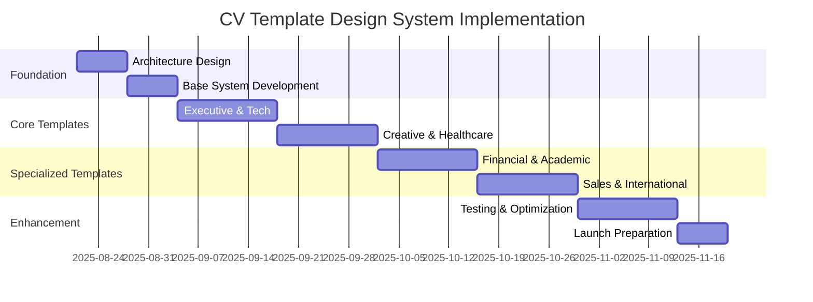

# CVPlus Visual CV Template Design System - Comprehensive Plan

**Author**: Gil Klainert  
**Date**: 2025-08-21  
**Status**: Implementation Ready  
**Link**: [CV Template Design Architecture Diagram](/docs/diagrams/cv-template-design-system-architecture.mermaid)

## 🎯 Executive Summary

CVPlus currently has a basic template system with limited visual differentiation (Modern, Classic, Creative using emojis as previews). This plan outlines the creation of a comprehensive visual CV template design system featuring 8 unique, professionally-designed templates that truly implement different styles, layouts, and organizational patterns suitable for various industries and career levels.

## 📊 Current State Analysis

### Existing Template System Limitations
- **Basic Implementation**: Templates defined only by IDs ('modern', 'classic', 'creative')
- **No Visual Differentiation**: Templates use emoji previews instead of actual designs
- **Limited Styling**: Single base style in `templateStyles.ts` for all templates
- **Static Layout**: All templates follow the same section order and structure
- **No Industry Specialization**: No templates tailored for specific professional contexts

### Current Template Architecture
```typescript
// Current simple template array
const templates = [
  { id: 'modern', name: 'Modern Professional', preview: '🎨' },
  { id: 'classic', name: 'Classic Executive', preview: '📄' },
  { id: 'creative', name: 'Creative Designer', preview: '🎭' }
];
```

## 🎨 New Template Design System Vision

### Core Design Philosophy
**"Professional Differentiation Through Visual Excellence"**

Each template will be a complete visual system featuring:
- **Unique Layout Architecture**: Different section organizations and content flows
- **Distinctive Visual Identity**: Separate color schemes, typography, and styling
- **Industry-Specific Optimizations**: Tailored for different professional contexts
- **Responsive Design**: Mobile-first approach with desktop enhancements
- **ATS Compatibility**: All templates maintain ATS-friendly fallbacks

## 📋 Template Portfolio Specifications

### Template 1: Executive Authority
**Target**: C-Suite, Senior Leadership, Board Positions
**Visual Identity**:
- **Colors**: Deep navy (#1e3a8a) + Gold accents (#d97706)
- **Typography**: Montserrat (headers) + Open Sans (body)
- **Layout**: Asymmetric header with executive summary prominence
- **Key Features**: Leadership achievements focus, board positions highlight, strategic impact metrics

**Unique Characteristics**:
- Large professional header with achievement callouts
- Executive summary as prominent first section
- Board/advisory positions dedicated section
- Strategic metrics and business impact visualization
- Conservative color palette with premium gold accents

### Template 2: Tech Innovation
**Target**: Software Engineers, Developers, Data Scientists, Tech Leads
**Visual Identity**:
- **Colors**: Deep blue (#1e40af) + Cyan accents (#0891b2)
- **Typography**: JetBrains Mono (code elements) + Inter (body)
- **Layout**: Skills-first with technical competencies dashboard
- **Key Features**: GitHub integration, project showcases, technical certification badges

**Unique Characteristics**:
- Technical skills matrix with proficiency indicators
- Project portfolio cards with GitHub links
- Code contribution visualizations
- Technology stack icons and progress bars
- Clean, minimal design with high contrast

### Template 3: Creative Showcase
**Target**: Designers, Artists, Creative Directors, Marketing Professionals
**Visual Identity**:
- **Colors**: Deep burgundy (#7f1d1d) + Vibrant teal (#0d9488)
- **Typography**: Playfair Display (headers) + Source Sans Pro (body)
- **Layout**: Portfolio-integrated with visual project highlights
- **Key Features**: Creative work samples, brand project showcases, design thinking process

**Unique Characteristics**:
- Integrated portfolio gallery with project thumbnails
- Creative process journey visualization
- Brand campaign highlights with metrics
- Award and recognition showcase section
- Bold color combinations with creative flair

### Template 4: Healthcare Professional
**Target**: Medical Professionals, Healthcare Administrators, Clinical Researchers
**Visual Identity**:
- **Colors**: Medical blue (#1e40af) + Green accents (#059669)
- **Typography**: Source Sans Pro (clean, readable)
- **Layout**: Credentials-focused with patient care emphasis
- **Key Features**: Medical certifications, patient outcomes, research publications

**Unique Characteristics**:
- Medical credentials and certifications prominence
- Patient care outcomes and quality metrics
- Research publications and clinical trials section
- Professional affiliations and board certifications
- Trust-building design with medical industry standards

### Template 5: Financial Expert
**Target**: Financial Advisors, Accountants, Investment Professionals, Banking
**Visual Identity**:
- **Colors**: Forest green (#14532d) + Gold accents (#d97706)
- **Typography**: Georgia (traditional) + Lato (modern clarity)
- **Layout**: Achievement-focused with financial performance metrics
- **Key Features**: Investment performance, client portfolio growth, regulatory compliance

**Unique Characteristics**:
- Financial performance charts and metrics
- Client success stories with growth percentages
- Regulatory certifications and compliance highlights
- Investment philosophy and approach section
- Conservative design with wealth-building color psychology

### Template 6: Academic Scholar
**Target**: Professors, Researchers, PhD Candidates, Academic Administrators
**Visual Identity**:
- **Colors**: Oxford blue (#1e3a8a) + Scholarly grey (#374151)
- **Typography**: Crimson Text (academic) + Source Sans Pro (readability)
- **Layout**: Research-focused with publication prominence
- **Key Features**: Research publications, grants awarded, academic presentations

**Unique Characteristics**:
- Research publication timeline with impact factors
- Grant funding secured with amounts and agencies
- Conference presentations and academic speaking
- Peer review activities and editorial board positions
- Traditional academic formatting with modern visual elements

### Template 7: Sales Performance
**Target**: Sales Professionals, Account Managers, Business Development, Real Estate
**Visual Identity**:
- **Colors**: Success green (#059669) + Performance orange (#ea580c)
- **Typography**: Roboto (strong, confident) + Open Sans (approachable)
- **Layout**: Results-focused with performance metrics dashboard
- **Key Features**: Sales achievements, quota performance, client relationship metrics

**Unique Characteristics**:
- Sales performance dashboard with quota achievements
- Client relationship building and retention metrics
- Revenue generation and growth percentages
- Territory management and market expansion
- High-energy design with achievement-focused layout

### Template 8: International Professional
**Target**: Global professionals, Consultants, International business, Diplomats
**Visual Identity**:
- **Colors**: International blue (#1e40af) + Cultural grey (#6b7280)
- **Typography**: Inter (universal readability) + cultural adaptability
- **Layout**: Multi-cultural adaptable with language flexibility
- **Key Features**: Global experience, cross-cultural competencies, language skills

**Unique Characteristics**:
- World map visualization of global experience
- Language proficiency indicators with cultural context
- International project highlights across regions
- Cross-cultural collaboration achievements
- Adaptable design for different cultural preferences

## 🏗️ Technical Implementation Architecture

### Template Structure Enhancement
```typescript
interface CVTemplate {
  id: string;
  name: string;
  category: 'executive' | 'technical' | 'creative' | 'healthcare' | 'financial' | 'academic' | 'sales' | 'international';
  description: string;
  targetRoles: string[];
  
  // Visual Identity
  colorScheme: {
    primary: string;
    secondary: string;
    accent: string;
    neutral: string;
    background: string;
  };
  
  typography: {
    primaryFont: string;
    secondaryFont: string;
    accentFont?: string;
    sizes: TypographyScale;
  };
  
  // Layout Configuration  
  layout: {
    type: 'traditional' | 'modern' | 'creative' | 'technical' | 'executive';
    sectionOrder: string[];
    headerStyle: 'minimal' | 'prominent' | 'branded' | 'executive';
    columnStructure: 'single' | 'dual' | 'asymmetric';
  };
  
  // Feature Specifications
  features: {
    skillsVisualization: 'list' | 'bars' | 'matrix' | 'icons';
    experienceFormat: 'chronological' | 'functional' | 'hybrid';
    customSections: string[];
    interactiveElements: string[];
  };
  
  // Styling
  styles: {
    cssClasses: string;
    customStyles: string;
    animations: string[];
    responsive: ResponsiveConfig;
  };
}
```

### Enhanced Template Generator
```typescript
export class EnhancedCVTemplateGenerator {
  static generateHTML(
    previewData: CVParsedData,
    template: CVTemplate,
    selectedFeatures: Record<string, boolean>,
    qrCodeSettings: QRCodeSettings,
    collapsedSections: Record<string, boolean>
  ): string {
    return `
      <div class="cv-preview-container ${template.id}-template">
        ${template.styles.customStyles}
        ${this.generateTemplateSpecificHeader(previewData, template)}
        ${this.generateTemplateSpecificSections(previewData, template)}
        ${this.generateTemplateSpecificFooter(previewData, template)}
      </div>
    `;
  }
}
```

## 📱 Responsive Design Strategy

### Mobile-First Implementation
Each template will feature:
- **Breakpoint System**: 320px, 768px, 1024px, 1280px
- **Adaptive Layouts**: Single-column mobile, multi-column desktop
- **Touch Optimization**: 44px minimum touch targets
- **Progressive Enhancement**: Core content first, visual enhancements added

### Template-Specific Responsive Behaviors
- **Executive**: Maintains formal hierarchy across all screens
- **Tech**: Code blocks remain readable on mobile
- **Creative**: Portfolio thumbnails optimize for touch interaction
- **Healthcare**: Critical credentials always visible
- **Financial**: Performance charts adapt to screen size
- **Academic**: Publication lists remain scannable
- **Sales**: Performance metrics stay prominent
- **International**: Map visualizations scale appropriately

## 🎨 Visual Design Specifications

### Color Psychology Application
Each template's color scheme is strategically chosen:
- **Executive**: Navy + Gold = Authority + Success
- **Tech**: Blue + Cyan = Trust + Innovation  
- **Creative**: Burgundy + Teal = Passion + Creativity
- **Healthcare**: Blue + Green = Trust + Health
- **Financial**: Green + Gold = Growth + Wealth
- **Academic**: Oxford Blue + Grey = Knowledge + Neutrality
- **Sales**: Green + Orange = Success + Energy
- **International**: Blue + Grey = Global + Professional

### Typography Hierarchies
Template-specific typography systems:
- **Display**: 32-48px (Hero elements, names)
- **H1**: 28-36px (Section headers)
- **H2**: 24-28px (Subsection headers) 
- **H3**: 20-24px (Job titles, education)
- **Body**: 16-18px (Main content)
- **Small**: 14-16px (Dates, locations)
- **Caption**: 12-14px (Helper text)

### Interactive Element Integration
- **Hover Effects**: Template-specific animations and transitions
- **Click Interactions**: Section expansion, skill details, project previews
- **Visual Feedback**: Loading states, form validation, success indicators
- **Micro-animations**: Subtle motion design for engagement

## ⚙️ ATS Compatibility Strategy

### Dual-Format Approach
Each template will generate two versions:
1. **Visual Version**: Full design with all interactive elements
2. **ATS Version**: Clean, parseable format for automated screening

### ATS-Safe Elements by Template
- **Standardized Headings**: "Work Experience," "Education," "Skills"
- **Simple Formatting**: Basic bold, italics, bullet points only
- **Conservative Layout**: Single-column, linear information flow
- **Keyword Optimization**: Industry-specific terminology integration
- **Machine-Readable Structure**: Logical section ordering and hierarchy

## 🔧 Implementation Phases

### Phase 1: Foundation (Week 1-2)
- **Enhanced template architecture**: Extend current template system
- **Base template class**: Create EnhancedCVTemplate interface and generator
- **Color system integration**: Implement template-specific color schemes
- **Typography system**: Set up template-specific font combinations

### Phase 2: Core Templates (Week 3-6)
- **Executive Authority**: Complete implementation with executive-focused features
- **Tech Innovation**: Technical skills visualization and project integration
- **Creative Showcase**: Portfolio integration and visual elements
- **Healthcare Professional**: Credentials and patient outcomes focus

### Phase 3: Specialized Templates (Week 7-10)
- **Financial Expert**: Performance metrics and regulatory compliance
- **Academic Scholar**: Research publications and grants integration
- **Sales Performance**: Achievement dashboards and quota visualizations
- **International Professional**: Global experience and cultural adaptation

### Phase 4: Enhancement & Testing (Week 11-12)
- **Responsive optimization**: Mobile and tablet layout refinement
- **ATS compatibility testing**: Automated parsing verification
- **Performance optimization**: Loading speed and rendering efficiency
- **User experience testing**: Template selection and customization flows

## 📊 Success Metrics

### Design Quality Metrics
- **Visual Differentiation**: 100% unique layouts across all 8 templates
- **Industry Relevance**: Template usage alignment with target industries
- **Professional Appeal**: User satisfaction scores above 4.5/5
- **Mobile Optimization**: Perfect rendering across all device sizes

### Technical Performance Metrics
- **Loading Speed**: Sub-2-second template preview generation
- **ATS Compatibility**: 95%+ successful parsing across major ATS systems
- **Cross-Browser Support**: Consistent rendering in Chrome, Safari, Firefox, Edge
- **Accessibility Compliance**: WCAG 2.1 AA standards across all templates

### User Adoption Metrics
- **Template Selection Distribution**: Balanced usage across professional categories
- **Customization Engagement**: High usage of template-specific features
- **User Retention**: Increased platform usage with enhanced templates
- **Professional Outcomes**: Improved interview callback rates

## 🎯 Business Impact

### Competitive Differentiation
- **Market Leadership**: Most comprehensive CV template system in the industry
- **Professional Credibility**: Enterprise-quality design options
- **User Retention**: Significant value-add encouraging platform loyalty
- **Premium Positioning**: Justifies premium pricing with superior design quality

### Revenue Opportunities
- **Template Monetization**: Premium templates as paid features
- **Industry Packages**: Specialized template bundles for different sectors
- **Customization Services**: Professional template customization offerings
- **White-Label Solutions**: Template system licensing to other platforms

## 🔄 Future Evolution

### Advanced Features (Post-Launch)
- **AI-Powered Template Selection**: Automatic template recommendation based on career data
- **Dynamic Content Optimization**: Template sections that adapt to user's experience level
- **Interactive Preview System**: Live template customization with real-time preview
- **Template Marketplace**: User-submitted template designs and community voting

### Emerging Technology Integration
- **AR/VR Resume Previews**: Immersive template visualization
- **Voice-Activated Customization**: Hands-free template selection and modification
- **Blockchain Verification**: Cryptographic validation of achievements and credentials
- **AI-Generated Visuals**: Custom graphics and charts generated per individual CV

## 📈 Implementation Timeline



## 💡 Innovation Opportunities

### Industry-First Features
- **Career Progression Visualization**: Templates that show career growth over time
- **Achievement Impact Metrics**: Quantified success indicators with visual representations
- **Cultural Adaptation Engine**: Templates that adjust for different geographic markets
- **Real-Time Market Alignment**: Templates that adapt to current job market trends

### User Experience Innovations
- **Template Try-Before-You-Buy**: Risk-free template testing with user's actual data
- **Professional Brand Consistency**: Templates that align with user's LinkedIn and online presence
- **Interview Preparation Integration**: Templates optimized for video interviewing backgrounds
- **Networking Event Optimization**: Templates designed for networking event compatibility

---

## 📞 Next Steps

1. **Immediate Action**: Begin Phase 1 foundation development with enhanced template architecture
2. **Design Validation**: Create mockups for Executive and Tech templates for stakeholder review
3. **Technical Setup**: Establish new template generation system and color/typography frameworks
4. **User Research**: Conduct interviews with target professionals from each template category

This comprehensive CV template design system will transform CVPlus from a basic CV enhancement platform into the industry's premier professional presentation solution, providing users with visually distinctive, industry-optimized, and technically sophisticated CV templates that significantly improve their career prospects.