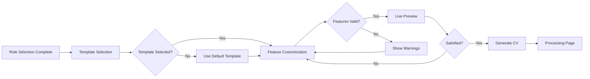

# Feature Selection Page Redesign Plan

**Author**: Gil Klainert  
**Date**: 2025-08-23  
**Status**: Approved for Implementation

## Executive Summary

The current Feature Selection page suffers from multiple UX issues including narrow template cards with text breaking, inconsistent visual design, confusing preview section, and unclear upgrade messaging. This plan provides a comprehensive redesign to create a cohesive, user-friendly experience with clear information hierarchy and improved conversion paths.

## Problems Identified

### 1. Layout Issues
- **Template cards too narrow**: Text breaks awkwardly (e.g., "Internatio nal Professio nal")
- **Inconsistent spacing**: Different sections have varying padding and margins
- **Poor responsive design**: Mobile experience is cramped

### 2. Information Architecture
- **Mixed content types**: Templates, features, and previews compete for attention
- **Unclear hierarchy**: No clear primary/secondary actions
- **Confusing workflow**: Users don't understand selection order

### 3. Visual Design
- **Inconsistent styles**: Different sections use different design languages
- **Poor contrast**: Some text is hard to read on dark backgrounds
- **Lack of visual feedback**: No clear indication of selection state

### 4. User Experience
- **Confusing upgrade messages**: "Upgrade Available: Tech Innovation Template" is unclear
- **Hidden feature benefits**: Users don't understand what features do
- **No progress indication**: Users don't know where they are in the process

## Proposed Solution

### New Information Architecture

```
Step 4: Feature Selection (Reorganized)
├── Section 1: Template Selection
│   ├── Role-based recommendation banner
│   ├── Template grid (3 columns, wider cards)
│   └── Template comparison tool
├── Section 2: Feature Customization
│   ├── Core features (always included)
│   ├── Enhancement features (selectable)
│   └── Premium features (with clear upgrade CTAs)
├── Section 3: Live Preview
│   ├── Template preview
│   ├── Feature toggles for instant preview
│   └── Multiple view modes
└── Section 4: Action Bar
    ├── Back to Role Selection
    ├── Feature summary
    └── Continue to Generate
```

### Detailed Section Designs

#### 1. Template Selection Section

**Current Issues**:
- Cards are 250px wide causing text to break
- No clear selection indicator
- Premium badges are confusing

**New Design**:
```typescript
// Template Card Component
interface TemplateCard {
  minWidth: '320px',  // Prevents text breaking
  maxWidth: '384px',  // Responsive sizing
  aspectRatio: '3:4', // Consistent proportions
  
  layout: {
    preview: 'top',     // Visual preview image
    content: 'middle',  // Name, description, tags
    actions: 'bottom'   // Select, Preview buttons
  },
  
  states: {
    default: 'border-gray-700',
    hover: 'border-cyan-500 shadow-lg',
    selected: 'border-cyan-400 bg-cyan-900/20',
    premium: 'border-yellow-500 with-crown-badge'
  }
}
```

**Grid Layout**:
- Desktop: 3 columns with 24px gap
- Tablet: 2 columns with 20px gap  
- Mobile: 1 column with horizontal scroll

#### 2. Feature Customization Section

**Current Issues**:
- Features mixed with templates
- No clear categorization
- Premium features not clearly marked

**New Design**:
```typescript
// Feature Categories
const featureCategories = {
  core: {
    title: "Core Features (Always Included)",
    icon: "sparkles",
    features: ['atsOptimized', 'keywordOptimization', 'achievementsShowcase'],
    editable: false
  },
  
  enhancements: {
    title: "Visual Enhancements",
    icon: "palette",
    features: ['embedQRCode', 'socialMediaLinks', 'languageProficiency'],
    editable: true
  },
  
  advanced: {
    title: "Advanced Features",
    icon: "crown",
    features: ['skillsVisualization', 'portfolioGallery', 'careerTimeline'],
    requiresPremium: true,
    editable: true
  }
}
```

**Feature Cards**:
- Clear benefit descriptions
- Visual examples on hover
- Premium lock icons with upgrade CTAs
- Bulk selection controls

#### 3. Live Preview Section

**Current Issues**:
- Confusing "Modern Template" label
- Unclear what's being previewed
- Poor visual hierarchy

**New Design**:
```typescript
// Live Preview Component
interface LivePreview {
  modes: {
    template: 'Show template only',
    features: 'Show with selected features',
    final: 'Show final preview'
  },
  
  controls: {
    zoom: [50%, 75%, 100%, 125%],
    device: ['desktop', 'tablet', 'mobile'],
    theme: ['light', 'dark', 'print']
  },
  
  layout: {
    header: 'Preview controls and mode selector',
    canvas: 'Responsive preview area',
    footer: 'Quick edit actions'
  }
}
```

#### 4. Action Bar

**New Sticky Bottom Bar**:
```typescript
// Action Bar Component
interface ActionBar {
  position: 'sticky bottom-0',
  background: 'bg-gray-900/95 backdrop-blur',
  
  left: {
    backButton: 'Return to Role Selection',
    helpButton: 'Get Help'
  },
  
  center: {
    summary: '1 template • 8 features selected',
    validation: 'Ready to generate'
  },
  
  right: {
    saveProgress: 'Save for Later',
    continueButton: 'Generate Enhanced CV'
  }
}
```

### Visual Design System

#### Color Palette
```scss
// Unified color system
$colors: (
  background: (
    primary: #0f1419,    // Main background
    secondary: #1a1f2e,  // Card backgrounds
    elevated: #232937    // Elevated sections
  ),
  
  accent: (
    primary: #06b6d4,    // Cyan - Primary actions
    premium: #eab308,    // Yellow - Premium features
    success: #10b981,    // Green - Confirmations
    danger: #ef4444      // Red - Warnings
  ),
  
  text: (
    primary: #f3f4f6,    // Main text
    secondary: #9ca3af,  // Secondary text
    muted: #6b7280       // Disabled/muted
  )
);
```

#### Typography
```scss
// Consistent typography
$typography: (
  heading: (
    h1: 'text-3xl font-bold',
    h2: 'text-2xl font-semibold',
    h3: 'text-xl font-medium'
  ),
  
  body: (
    large: 'text-lg',
    regular: 'text-base',
    small: 'text-sm'
  ),
  
  spacing: (
    section: 'mb-12',
    component: 'mb-6',
    element: 'mb-3'
  )
);
```

### User Flow



### Premium Upgrade Messaging

#### Clear Value Communication
```typescript
// Premium Feature Card
interface PremiumFeatureCard {
  header: {
    icon: 'crown',
    badge: 'Premium',
    title: 'Skills Visualization'
  },
  
  content: {
    description: 'Transform your skills into beautiful charts',
    benefits: [
      'Interactive skill charts',
      'Proficiency levels',
      'Category grouping'
    ],
    preview: 'hover-to-see-example.gif'
  },
  
  actions: {
    primary: 'Unlock This Feature',
    secondary: 'Learn More'
  }
}
```

### Mobile Responsive Design

```scss
// Breakpoint system
$breakpoints: (
  mobile: 320px,
  tablet: 768px,
  desktop: 1024px,
  wide: 1440px
);

// Template grid responsive
.template-grid {
  @mobile: grid-cols-1 gap-4;
  @tablet: grid-cols-2 gap-5;
  @desktop: grid-cols-3 gap-6;
}

// Feature list responsive
.feature-list {
  @mobile: stack-vertical;
  @tablet: two-column;
  @desktop: three-column;
}
```

## Implementation Plan

### Phase 1: Foundation (Week 1-2)
- [ ] Create new component structure
- [ ] Implement design system tokens
- [ ] Set up responsive grid system

### Phase 2: Template Selection (Week 3-4)
- [ ] Redesign template cards with wider layout
- [ ] Implement selection states and animations
- [ ] Add template comparison tool

### Phase 3: Feature System (Week 5-6)
- [ ] Reorganize features into categories
- [ ] Implement progressive disclosure
- [ ] Add feature benefit tooltips

### Phase 4: Preview Integration (Week 7-8)
- [ ] Redesign live preview component
- [ ] Add multiple preview modes
- [ ] Implement real-time updates

### Phase 5: Polish & Launch (Week 9-10)
- [ ] User testing and feedback
- [ ] Performance optimization
- [ ] A/B testing setup

## Success Metrics

### Primary KPIs
- **Template Selection Rate**: >95% (from 85%)
- **Feature Discovery Rate**: >80% (from 60%)
- **Premium Conversion**: >15% (from 10%)
- **Time to Complete**: <3 minutes (from 5 minutes)

### Secondary Metrics
- Bounce rate reduction: -30%
- User satisfaction score: >4.5/5
- Support tickets reduction: -40%
- Mobile completion rate: >85%

## Risk Mitigation

### Technical Risks
- **Performance impact**: Lazy load templates, virtualize lists
- **Browser compatibility**: Progressive enhancement approach
- **State management**: Use React Context for selection state

### User Experience Risks
- **Change aversion**: Gradual rollout with A/B testing
- **Feature overload**: Progressive disclosure and smart defaults
- **Mobile experience**: Mobile-first design approach

## Conclusion

This comprehensive redesign addresses all identified issues while providing a clear path forward for implementation. The new design creates a cohesive, intuitive experience that guides users through the selection process while clearly communicating the value of premium features.

## Appendix

### Related Documents
- [Architecture Diagram](/docs/diagrams/feature-selection-redesign-architecture.mermaid)
- [Component Specifications](/docs/specs/feature-selection-components.md)
- [User Testing Protocol](/docs/testing/feature-selection-testing.md)