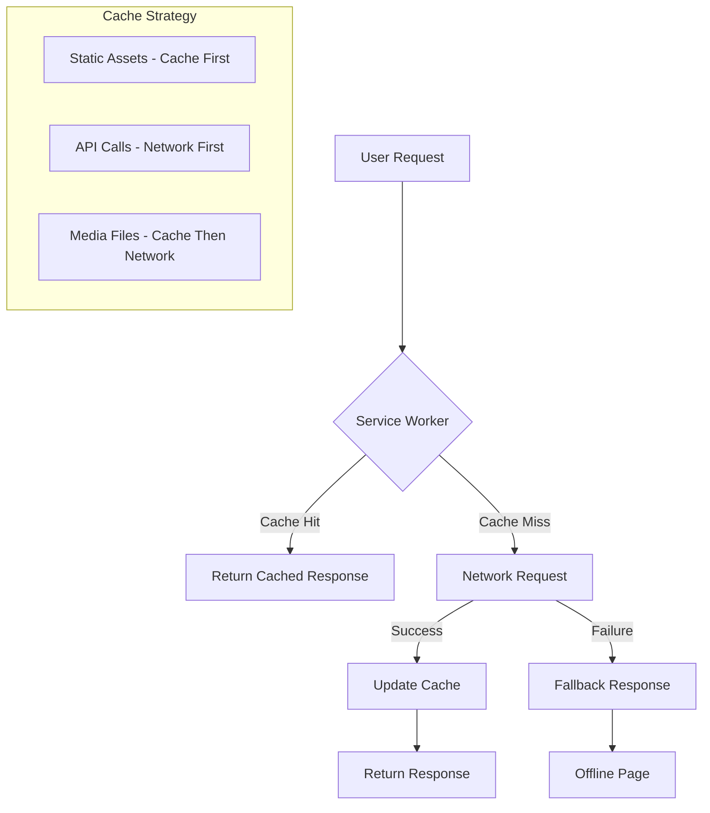
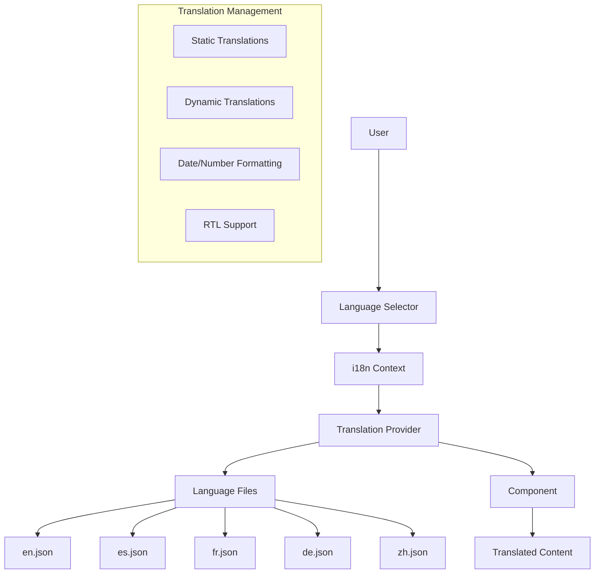

# Offline Support & Internationalization Implementation Plan

**Plan Created**: 2025-08-25  
**Author**: Gil Klainert  
**Architecture Type**: Progressive Web App (PWA) & Multi-Language Support  
**Estimated Timeline**: 8-10 weeks  
**Priority**: High  

## Executive Summary

This plan outlines the implementation of two critical features for CVPlus: **Offline Support** through Progressive Web App (PWA) capabilities with service workers, and **Internationalization (i18n)** for multi-language support. These features will significantly enhance user experience, expand market reach, and improve application resilience.

## 1. OFFLINE SUPPORT IMPLEMENTATION

### 1.1 Architecture Overview



### 1.2 Service Worker Strategy

#### Cache Strategies by Resource Type

```typescript
// Service Worker Cache Configuration
interface CacheStrategy {
  static: 'cache-first';        // JS, CSS, fonts
  api: 'network-first';          // Firebase functions
  media: 'cache-then-network';   // Images, PDFs
  dynamic: 'stale-while-revalidate'; // CV data
}

const cacheConfig = {
  version: 'v1',
  caches: {
    static: 'cvplus-static-v1',
    dynamic: 'cvplus-dynamic-v1',
    media: 'cvplus-media-v1',
    api: 'cvplus-api-v1'
  },
  maxAge: {
    static: 30 * 24 * 60 * 60 * 1000, // 30 days
    dynamic: 24 * 60 * 60 * 1000,     // 1 day
    media: 7 * 24 * 60 * 60 * 1000,   // 7 days
    api: 10 * 60 * 1000                // 10 minutes
  }
};
```

### 1.3 Implementation Components

#### 1.3.1 Service Worker Registration

```typescript
// frontend/src/serviceWorkerRegistration.ts
export async function register() {
  if ('serviceWorker' in navigator) {
    try {
      const registration = await navigator.serviceWorker.register(
        '/service-worker.js',
        { scope: '/' }
      );
      
      // Handle updates
      registration.addEventListener('updatefound', () => {
        const newWorker = registration.installing;
        newWorker?.addEventListener('statechange', () => {
          if (newWorker.state === 'installed' && navigator.serviceWorker.controller) {
            // New content available
            showUpdateNotification();
          }
        });
      });
      
      return registration;
    } catch (error) {
      console.error('Service Worker registration failed:', error);
    }
  }
}
```

#### 1.3.2 Workbox Configuration

```javascript
// frontend/public/service-worker.js
import { precacheAndRoute } from 'workbox-precaching';
import { registerRoute } from 'workbox-routing';
import { StaleWhileRevalidate, CacheFirst, NetworkFirst } from 'workbox-strategies';
import { ExpirationPlugin } from 'workbox-expiration';
import { CacheableResponsePlugin } from 'workbox-cacheable-response';

// Precache static assets
precacheAndRoute(self.__WB_MANIFEST);

// Cache API responses
registerRoute(
  ({ url }) => url.pathname.startsWith('/api/'),
  new NetworkFirst({
    cacheName: 'api-cache',
    plugins: [
      new ExpirationPlugin({
        maxEntries: 50,
        maxAgeSeconds: 10 * 60, // 10 minutes
      }),
      new CacheableResponsePlugin({
        statuses: [0, 200],
      }),
    ],
  })
);

// Cache CV documents
registerRoute(
  ({ request }) => request.destination === 'document',
  new StaleWhileRevalidate({
    cacheName: 'cv-cache',
    plugins: [
      new ExpirationPlugin({
        maxEntries: 20,
        maxAgeSeconds: 24 * 60 * 60, // 24 hours
      }),
    ],
  })
);

// Cache images and media
registerRoute(
  ({ request }) => request.destination === 'image',
  new CacheFirst({
    cacheName: 'media-cache',
    plugins: [
      new ExpirationPlugin({
        maxEntries: 100,
        maxAgeSeconds: 7 * 24 * 60 * 60, // 7 days
      }),
    ],
  })
);
```

#### 1.3.3 Offline Fallback Pages

```typescript
// frontend/src/pages/OfflinePage.tsx
export const OfflinePage: React.FC = () => {
  const [cachedCVs, setCachedCVs] = useState<CachedCV[]>([]);
  
  useEffect(() => {
    loadCachedData();
  }, []);
  
  const loadCachedData = async () => {
    const cache = await caches.open('cvplus-dynamic-v1');
    const requests = await cache.keys();
    const cvData = await Promise.all(
      requests
        .filter(req => req.url.includes('/jobs/'))
        .map(async req => {
          const response = await cache.match(req);
          return response?.json();
        })
    );
    setCachedCVs(cvData.filter(Boolean));
  };
  
  return (
    <div className="offline-container">
      <h1>You're Offline</h1>
      <p>Don't worry! You can still access your cached CVs:</p>
      <div className="cached-cvs-grid">
        {cachedCVs.map(cv => (
          <CachedCVCard key={cv.id} cv={cv} />
        ))}
      </div>
      <button onClick={() => window.location.reload()}>
        Try Again
      </button>
    </div>
  );
};
```

### 1.4 Background Sync for Offline Actions

```typescript
// frontend/src/utils/backgroundSync.ts
class BackgroundSyncManager {
  private syncQueue: SyncTask[] = [];
  
  async registerSync(task: SyncTask) {
    this.syncQueue.push(task);
    
    if ('serviceWorker' in navigator && 'SyncManager' in window) {
      const registration = await navigator.serviceWorker.ready;
      await registration.sync.register('cvplus-sync');
    } else {
      // Fallback for browsers without background sync
      this.attemptSync();
    }
  }
  
  async attemptSync() {
    if (!navigator.onLine) return;
    
    for (const task of this.syncQueue) {
      try {
        await this.executeTask(task);
        this.removeTask(task.id);
      } catch (error) {
        console.error('Sync failed for task:', task.id);
      }
    }
  }
  
  private async executeTask(task: SyncTask) {
    switch (task.type) {
      case 'SAVE_CV':
        return await cvService.save(task.data);
      case 'UPDATE_PROFILE':
        return await profileService.update(task.data);
      case 'GENERATE_FEATURE':
        return await featureService.generate(task.data);
    }
  }
}
```

### 1.5 IndexedDB for Local Storage

```typescript
// frontend/src/utils/indexedDB.ts
class CVPlusDB {
  private db: IDBDatabase | null = null;
  private readonly DB_NAME = 'CVPlusOffline';
  private readonly VERSION = 1;
  
  async init() {
    return new Promise<void>((resolve, reject) => {
      const request = indexedDB.open(this.DB_NAME, this.VERSION);
      
      request.onerror = () => reject(request.error);
      request.onsuccess = () => {
        this.db = request.result;
        resolve();
      };
      
      request.onupgradeneeded = (event) => {
        const db = (event.target as IDBOpenDBRequest).result;
        
        // Create object stores
        if (!db.objectStoreNames.contains('cvs')) {
          const cvStore = db.createObjectStore('cvs', { keyPath: 'id' });
          cvStore.createIndex('userId', 'userId', { unique: false });
          cvStore.createIndex('updatedAt', 'updatedAt', { unique: false });
        }
        
        if (!db.objectStoreNames.contains('features')) {
          const featureStore = db.createObjectStore('features', { keyPath: 'id' });
          featureStore.createIndex('cvId', 'cvId', { unique: false });
        }
        
        if (!db.objectStoreNames.contains('media')) {
          const mediaStore = db.createObjectStore('media', { keyPath: 'id' });
          mediaStore.createIndex('type', 'type', { unique: false });
        }
      };
    });
  }
  
  async saveCV(cv: CVData) {
    const transaction = this.db!.transaction(['cvs'], 'readwrite');
    const store = transaction.objectStore('cvs');
    await store.put(cv);
  }
  
  async getCVs(userId: string): Promise<CVData[]> {
    const transaction = this.db!.transaction(['cvs'], 'readonly');
    const store = transaction.objectStore('cvs');
    const index = store.index('userId');
    return new Promise((resolve, reject) => {
      const request = index.getAll(userId);
      request.onsuccess = () => resolve(request.result);
      request.onerror = () => reject(request.error);
    });
  }
}
```

### 1.6 PWA Manifest Configuration

```json
// frontend/public/manifest.json
{
  "name": "CVPlus - Transform Your CV",
  "short_name": "CVPlus",
  "description": "AI-powered CV transformation platform",
  "start_url": "/",
  "display": "standalone",
  "theme_color": "#22d3ee",
  "background_color": "#111827",
  "orientation": "portrait-primary",
  "icons": [
    {
      "src": "/icons/icon-72x72.png",
      "sizes": "72x72",
      "type": "image/png",
      "purpose": "any maskable"
    },
    {
      "src": "/icons/icon-96x96.png",
      "sizes": "96x96",
      "type": "image/png"
    },
    {
      "src": "/icons/icon-128x128.png",
      "sizes": "128x128",
      "type": "image/png"
    },
    {
      "src": "/icons/icon-144x144.png",
      "sizes": "144x144",
      "type": "image/png"
    },
    {
      "src": "/icons/icon-152x152.png",
      "sizes": "152x152",
      "type": "image/png"
    },
    {
      "src": "/icons/icon-192x192.png",
      "sizes": "192x192",
      "type": "image/png"
    },
    {
      "src": "/icons/icon-384x384.png",
      "sizes": "384x384",
      "type": "image/png"
    },
    {
      "src": "/icons/icon-512x512.png",
      "sizes": "512x512",
      "type": "image/png"
    }
  ],
  "categories": ["productivity", "business", "education"],
  "shortcuts": [
    {
      "name": "Upload CV",
      "short_name": "Upload",
      "description": "Upload a new CV for transformation",
      "url": "/upload",
      "icons": [{ "src": "/icons/upload.png", "sizes": "96x96" }]
    },
    {
      "name": "My CVs",
      "short_name": "My CVs",
      "description": "View your transformed CVs",
      "url": "/dashboard",
      "icons": [{ "src": "/icons/folder.png", "sizes": "96x96" }]
    }
  ]
}
```

## 2. INTERNATIONALIZATION (i18n) IMPLEMENTATION

### 2.1 Architecture Overview



### 2.2 i18n Library Selection

**Recommended**: `react-i18next` with `i18next`

**Reasons**:
- Mature and battle-tested
- Excellent React integration
- Lazy loading of translations
- Pluralization support
- Date/number formatting
- Namespace support
- TypeScript support

### 2.3 Implementation Components

#### 2.3.1 i18n Configuration

```typescript
// frontend/src/i18n/config.ts
import i18n from 'i18next';
import { initReactI18next } from 'react-i18next';
import LanguageDetector from 'i18next-browser-languagedetector';
import Backend from 'i18next-http-backend';

export const supportedLanguages = {
  en: { name: 'English', flag: '🇺🇸', dir: 'ltr' },
  es: { name: 'Español', flag: '🇪🇸', dir: 'ltr' },
  fr: { name: 'Français', flag: '🇫🇷', dir: 'ltr' },
  de: { name: 'Deutsch', flag: '🇩🇪', dir: 'ltr' },
  zh: { name: '中文', flag: '🇨🇳', dir: 'ltr' },
  ar: { name: 'العربية', flag: '🇸🇦', dir: 'rtl' },
  pt: { name: 'Português', flag: '🇧🇷', dir: 'ltr' },
  ja: { name: '日本語', flag: '🇯🇵', dir: 'ltr' }
};

i18n
  .use(Backend)
  .use(LanguageDetector)
  .use(initReactI18next)
  .init({
    fallbackLng: 'en',
    debug: process.env.NODE_ENV === 'development',
    
    interpolation: {
      escapeValue: false, // React already escapes values
    },
    
    backend: {
      loadPath: '/locales/{{lng}}/{{ns}}.json',
    },
    
    ns: ['common', 'cv', 'features', 'premium', 'errors'],
    defaultNS: 'common',
    
    detection: {
      order: ['localStorage', 'cookie', 'navigator', 'htmlTag'],
      caches: ['localStorage', 'cookie'],
    },
    
    react: {
      useSuspense: true,
    },
  });

export default i18n;
```

#### 2.3.2 Translation File Structure

```json
// frontend/public/locales/en/common.json
{
  "navigation": {
    "home": "Home",
    "upload": "Upload CV",
    "analysis": "Analysis",
    "features": "Features",
    "results": "Results",
    "signIn": "Sign In",
    "signOut": "Sign Out",
    "dashboard": "Dashboard"
  },
  "hero": {
    "title": "Transform Your CV",
    "subtitle": "From Paper to Powerful",
    "description": "Turn your traditional CV into an interactive, AI-powered professional profile",
    "cta": {
      "start": "Get Started",
      "learnMore": "Learn More",
      "demo": "View Demo"
    }
  },
  "upload": {
    "title": "Upload Your CV",
    "drag": "Drag and drop your CV here",
    "or": "or",
    "browse": "Browse Files",
    "formats": "Supported formats: PDF, DOCX, TXT",
    "maxSize": "Maximum file size: 10MB",
    "processing": "Processing your CV...",
    "success": "CV uploaded successfully!",
    "error": "Failed to upload CV. Please try again."
  }
}
```

```json
// frontend/public/locales/es/common.json
{
  "navigation": {
    "home": "Inicio",
    "upload": "Subir CV",
    "analysis": "Análisis",
    "features": "Características",
    "results": "Resultados",
    "signIn": "Iniciar Sesión",
    "signOut": "Cerrar Sesión",
    "dashboard": "Panel"
  },
  "hero": {
    "title": "Transforma Tu CV",
    "subtitle": "De Papel a Poderoso",
    "description": "Convierte tu CV tradicional en un perfil profesional interactivo impulsado por IA",
    "cta": {
      "start": "Comenzar",
      "learnMore": "Saber Más",
      "demo": "Ver Demo"
    }
  }
}
```

#### 2.3.3 Translation Hook

```typescript
// frontend/src/hooks/useTranslation.ts
import { useTranslation as useI18nTranslation } from 'react-i18next';
import { useCallback } from 'react';

export function useTranslation(namespace?: string) {
  const { t, i18n } = useI18nTranslation(namespace);
  
  const changeLanguage = useCallback(async (lang: string) => {
    await i18n.changeLanguage(lang);
    // Update HTML dir attribute for RTL languages
    document.documentElement.dir = supportedLanguages[lang].dir;
    // Store preference
    localStorage.setItem('preferred-language', lang);
  }, [i18n]);
  
  const formatDate = useCallback((date: Date | string) => {
    return new Intl.DateTimeFormat(i18n.language).format(
      typeof date === 'string' ? new Date(date) : date
    );
  }, [i18n.language]);
  
  const formatNumber = useCallback((num: number, options?: Intl.NumberFormatOptions) => {
    return new Intl.NumberFormat(i18n.language, options).format(num);
  }, [i18n.language]);
  
  const formatCurrency = useCallback((amount: number, currency = 'USD') => {
    return new Intl.NumberFormat(i18n.language, {
      style: 'currency',
      currency,
    }).format(amount);
  }, [i18n.language]);
  
  return {
    t,
    i18n,
    changeLanguage,
    formatDate,
    formatNumber,
    formatCurrency,
    currentLanguage: i18n.language,
    languages: supportedLanguages,
  };
}
```

#### 2.3.4 Language Selector Component

```typescript
// frontend/src/components/LanguageSelector.tsx
import { Fragment } from 'react';
import { Listbox, Transition } from '@headlessui/react';
import { CheckIcon, ChevronUpDownIcon } from '@heroicons/react/20/solid';
import { useTranslation } from '../hooks/useTranslation';

export function LanguageSelector() {
  const { currentLanguage, languages, changeLanguage } = useTranslation();
  
  return (
    <Listbox value={currentLanguage} onChange={changeLanguage}>
      <div className="relative">
        <Listbox.Button className="relative w-full cursor-pointer rounded-lg bg-white/10 py-2 pl-3 pr-10 text-left shadow-md focus:outline-none focus-visible:border-primary focus-visible:ring-2 focus-visible:ring-white focus-visible:ring-opacity-75 focus-visible:ring-offset-2 focus-visible:ring-offset-cyan-300 sm:text-sm">
          <span className="block truncate">
            {languages[currentLanguage].flag} {languages[currentLanguage].name}
          </span>
          <span className="pointer-events-none absolute inset-y-0 right-0 flex items-center pr-2">
            <ChevronUpDownIcon className="h-5 w-5 text-gray-400" aria-hidden="true" />
          </span>
        </Listbox.Button>
        <Transition
          as={Fragment}
          leave="transition ease-in duration-100"
          leaveFrom="opacity-100"
          leaveTo="opacity-0"
        >
          <Listbox.Options className="absolute mt-1 max-h-60 w-full overflow-auto rounded-md bg-gray-800 py-1 text-base shadow-lg ring-1 ring-black ring-opacity-5 focus:outline-none sm:text-sm z-50">
            {Object.entries(languages).map(([code, lang]) => (
              <Listbox.Option
                key={code}
                className={({ active }) =>
                  `relative cursor-pointer select-none py-2 pl-10 pr-4 ${
                    active ? 'bg-cyan-900 text-cyan-100' : 'text-gray-200'
                  }`
                }
                value={code}
              >
                {({ selected }) => (
                  <>
                    <span className={`block truncate ${selected ? 'font-medium' : 'font-normal'}`}>
                      {lang.flag} {lang.name}
                    </span>
                    {selected ? (
                      <span className="absolute inset-y-0 left-0 flex items-center pl-3 text-cyan-400">
                        <CheckIcon className="h-5 w-5" aria-hidden="true" />
                      </span>
                    ) : null}
                  </>
                )}
              </Listbox.Option>
            ))}
          </Listbox.Options>
        </Transition>
      </div>
    </Listbox>
  );
}
```

#### 2.3.5 Component Translation Example

```typescript
// frontend/src/components/HeroSection.tsx
import { useTranslation } from '../hooks/useTranslation';

export function HeroSection() {
  const { t } = useTranslation('common');
  
  return (
    <section className="hero-section">
      <h1 className="text-5xl font-bold">
        {t('hero.title')}
      </h1>
      <h2 className="text-3xl text-cyan-400">
        {t('hero.subtitle')}
      </h2>
      <p className="text-xl text-gray-300">
        {t('hero.description')}
      </p>
      <div className="flex gap-4">
        <button className="btn-primary">
          {t('hero.cta.start')}
        </button>
        <button className="btn-secondary">
          {t('hero.cta.learnMore')}
        </button>
      </div>
    </section>
  );
}
```

### 2.4 Dynamic Content Translation

#### 2.4.1 API Response Translation

```typescript
// frontend/src/services/translationService.ts
class TranslationService {
  private cache = new Map<string, string>();
  
  async translateContent(
    content: string,
    targetLang: string,
    sourceLang = 'en'
  ): Promise<string> {
    const cacheKey = `${content}-${sourceLang}-${targetLang}`;
    
    if (this.cache.has(cacheKey)) {
      return this.cache.get(cacheKey)!;
    }
    
    try {
      const response = await fetch('/api/translate', {
        method: 'POST',
        headers: { 'Content-Type': 'application/json' },
        body: JSON.stringify({
          text: content,
          source: sourceLang,
          target: targetLang,
        }),
      });
      
      const { translatedText } = await response.json();
      this.cache.set(cacheKey, translatedText);
      return translatedText;
    } catch (error) {
      console.error('Translation failed:', error);
      return content; // Fallback to original
    }
  }
  
  async translateCV(cv: CVData, targetLang: string): Promise<CVData> {
    // Translate dynamic CV content
    const translatedCV = { ...cv };
    
    if (cv.summary) {
      translatedCV.summary = await this.translateContent(cv.summary, targetLang);
    }
    
    if (cv.experience) {
      translatedCV.experience = await Promise.all(
        cv.experience.map(async exp => ({
          ...exp,
          description: await this.translateContent(exp.description, targetLang),
        }))
      );
    }
    
    return translatedCV;
  }
}
```

#### 2.4.2 Firebase Function for Translation

```typescript
// functions/src/functions/translate.ts
import * as functions from 'firebase-functions';
import { Translate } from '@google-cloud/translate/build/src/v2';

const translate = new Translate();

export const translateText = functions.https.onCall(async (data, context) => {
  const { text, source, target } = data;
  
  if (!context.auth) {
    throw new functions.https.HttpsError('unauthenticated', 'User must be authenticated');
  }
  
  try {
    const [translation] = await translate.translate(text, {
      from: source,
      to: target,
    });
    
    return { translatedText: translation };
  } catch (error) {
    console.error('Translation error:', error);
    throw new functions.https.HttpsError('internal', 'Translation failed');
  }
});
```

### 2.5 RTL (Right-to-Left) Support

```typescript
// frontend/src/utils/rtl.ts
export function setupRTL(language: string) {
  const isRTL = ['ar', 'he', 'fa', 'ur'].includes(language);
  
  // Update HTML dir attribute
  document.documentElement.dir = isRTL ? 'rtl' : 'ltr';
  
  // Update Tailwind classes
  if (isRTL) {
    document.documentElement.classList.add('rtl');
  } else {
    document.documentElement.classList.remove('rtl');
  }
}

// Tailwind RTL utilities
// frontend/tailwind.config.js
module.exports = {
  content: ['./src/**/*.{js,jsx,ts,tsx}'],
  plugins: [
    require('tailwindcss-rtl'),
  ],
  theme: {
    extend: {
      // RTL-aware spacing utilities
    },
  },
};
```

## 3. IMPLEMENTATION TIMELINE

### Phase 1: Offline Support Foundation (Weeks 1-3)

**Week 1: Service Worker Setup**
- [ ] Install and configure Workbox
- [ ] Create service worker registration
- [ ] Implement basic caching strategies
- [ ] Add offline detection

**Week 2: Cache Management**
- [ ] Implement cache versioning
- [ ] Add cache expiration policies
- [ ] Create cache update strategies
- [ ] Implement cache cleanup

**Week 3: Offline Pages & Fallbacks**
- [ ] Create offline page component
- [ ] Implement offline CV viewer
- [ ] Add offline status indicators
- [ ] Create fallback responses

### Phase 2: Advanced Offline Features (Weeks 4-5)

**Week 4: Background Sync**
- [ ] Implement sync queue
- [ ] Add retry logic
- [ ] Create sync status UI
- [ ] Handle sync conflicts

**Week 5: IndexedDB Integration**
- [ ] Setup IndexedDB schema
- [ ] Implement data persistence
- [ ] Add data migration
- [ ] Create backup/restore

### Phase 3: i18n Foundation (Weeks 6-7)

**Week 6: i18n Setup**
- [ ] Install react-i18next
- [ ] Configure language detection
- [ ] Create translation structure
- [ ] Add language selector

**Week 7: Static Translations**
- [ ] Translate navigation
- [ ] Translate common UI elements
- [ ] Translate error messages
- [ ] Translate form labels

### Phase 4: Advanced i18n Features (Weeks 8-9)

**Week 8: Dynamic Content Translation**
- [ ] Implement translation service
- [ ] Add Google Translate API
- [ ] Create translation cache
- [ ] Handle translation errors

**Week 9: Localization Features**
- [ ] Add date formatting
- [ ] Add number formatting
- [ ] Add currency formatting
- [ ] Implement RTL support

### Phase 5: Testing & Optimization (Week 10)

**Week 10: Testing & Polish**
- [ ] Test offline scenarios
- [ ] Test all languages
- [ ] Optimize bundle sizes
- [ ] Performance testing
- [ ] User acceptance testing

## 4. TECHNICAL REQUIREMENTS

### 4.1 Dependencies

**Offline Support**:
```json
{
  "workbox-webpack-plugin": "^7.0.0",
  "workbox-precaching": "^7.0.0",
  "workbox-routing": "^7.0.0",
  "workbox-strategies": "^7.0.0",
  "workbox-expiration": "^7.0.0",
  "idb": "^8.0.0"
}
```

**Internationalization**:
```json
{
  "i18next": "^23.0.0",
  "react-i18next": "^13.0.0",
  "i18next-browser-languagedetector": "^7.0.0",
  "i18next-http-backend": "^2.0.0",
  "@google-cloud/translate": "^4.0.0",
  "tailwindcss-rtl": "^0.9.0"
}
```

### 4.2 Browser Support

**Required Features**:
- Service Worker API
- Cache API
- IndexedDB
- Background Sync API (optional)
- Intl API

**Minimum Browser Versions**:
- Chrome 40+
- Firefox 44+
- Safari 11.3+
- Edge 17+

### 4.3 Performance Targets

**Offline Support**:
- Initial cache size: <50MB
- Cache response time: <100ms
- Sync queue limit: 100 tasks
- IndexedDB size: <500MB

**Internationalization**:
- Translation load time: <500ms
- Language switch time: <200ms
- Translation cache hit rate: >80%
- Bundle size increase: <100KB per language

## 5. TESTING STRATEGY

### 5.1 Offline Testing Scenarios

```typescript
// frontend/src/__tests__/offline.test.ts
describe('Offline Support', () => {
  it('should display cached CVs when offline', async () => {
    // Simulate offline
    await page.setOfflineMode(true);
    
    // Navigate to dashboard
    await page.goto('/dashboard');
    
    // Check for cached CVs
    const cvCards = await page.$$('.cached-cv-card');
    expect(cvCards.length).toBeGreaterThan(0);
  });
  
  it('should queue actions for sync when offline', async () => {
    await page.setOfflineMode(true);
    
    // Perform action
    await page.click('#save-cv-button');
    
    // Check sync queue
    const queue = await page.evaluate(() => 
      localStorage.getItem('sync-queue')
    );
    expect(JSON.parse(queue)).toHaveLength(1);
  });
});
```

### 5.2 i18n Testing

```typescript
// frontend/src/__tests__/i18n.test.ts
describe('Internationalization', () => {
  it('should change language', async () => {
    const { getByText, getByRole } = render(<App />);
    
    // Change to Spanish
    const languageSelector = getByRole('combobox');
    fireEvent.click(languageSelector);
    fireEvent.click(getByText('Español'));
    
    // Check translation
    expect(getByText('Transforma Tu CV')).toBeInTheDocument();
  });
  
  it('should format dates according to locale', () => {
    const { formatDate } = renderHook(() => useTranslation()).result.current;
    
    const date = new Date('2025-08-25');
    expect(formatDate(date)).toBe('8/25/2025'); // en-US format
  });
});
```

## 6. DEPLOYMENT CONSIDERATIONS

### 6.1 Service Worker Deployment

```yaml
# .github/workflows/deploy.yml
- name: Build with Service Worker
  run: |
    npm run build
    npx workbox generateSW workbox-config.js
    
- name: Deploy to Firebase
  run: |
    firebase deploy --only hosting
    
- name: Clear CDN Cache
  run: |
    # Clear CDN cache to ensure service worker updates
    curl -X POST "https://api.cloudflare.com/client/v4/zones/$ZONE_ID/purge_cache" \
      -H "Authorization: Bearer $CF_API_TOKEN" \
      -H "Content-Type: application/json" \
      --data '{"purge_everything":true}'
```

### 6.2 Translation Management

**Continuous Translation Workflow**:
1. Extract new strings from code
2. Send to translation service
3. Review translations
4. Merge back to codebase
5. Deploy updated translations

## 7. MONITORING & ANALYTICS

### 7.1 Offline Metrics

```typescript
// Track offline usage
analytics.track('offline_session', {
  duration: sessionDuration,
  cached_items: cacheCount,
  sync_queue_size: syncQueueSize,
  data_usage: dataUsage,
});
```

### 7.2 i18n Metrics

```typescript
// Track language usage
analytics.track('language_changed', {
  from: previousLanguage,
  to: newLanguage,
  user_id: userId,
  timestamp: Date.now(),
});
```

## 8. RISKS & MITIGATION

### 8.1 Offline Support Risks

| Risk | Impact | Mitigation |
|------|--------|------------|
| Large cache size | High | Implement cache limits and cleanup |
| Sync conflicts | Medium | Add conflict resolution UI |
| Stale data | Medium | Implement cache expiration |
| Browser incompatibility | Low | Provide graceful degradation |

### 8.2 i18n Risks

| Risk | Impact | Mitigation |
|------|--------|------------|
| Translation quality | High | Use professional translation services |
| Bundle size increase | Medium | Lazy load translations |
| RTL layout issues | Medium | Thorough RTL testing |
| Missing translations | Low | Fallback to English |

## 9. SUCCESS CRITERIA

### 9.1 Offline Support Success Metrics

- ✅ 100% core features available offline
- ✅ <100ms cache response time
- ✅ 95% sync success rate
- ✅ <50MB average cache size
- ✅ Zero data loss during offline periods

### 9.2 i18n Success Metrics

- ✅ 8+ languages supported
- ✅ 100% UI elements translated
- ✅ <500ms language switch time
- ✅ 95% translation accuracy
- ✅ Full RTL support for Arabic

## 10. FUTURE ENHANCEMENTS

### 10.1 Offline Enhancements
- Peer-to-peer sync
- Offline collaboration
- Advanced conflict resolution
- Predictive caching
- Background file processing

### 10.2 i18n Enhancements
- Voice interface localization
- Regional dialect support
- AI-powered translation improvements
- Cultural customization
- Accessibility translations

## CONCLUSION

This comprehensive implementation plan provides a clear roadmap for adding robust offline support and internationalization to CVPlus. The phased approach ensures manageable implementation while maintaining application stability. With these features, CVPlus will provide a resilient, globally accessible platform that works seamlessly across different languages and network conditions.

**Estimated Total Effort**: 400-500 development hours  
**Recommended Team Size**: 2-3 developers  
**Priority**: High - Essential for market expansion and user experience  

---

*Plan Created: 2025-08-25*  
*Next Review: After Phase 1 completion*  
*Contact: Gil Klainert*