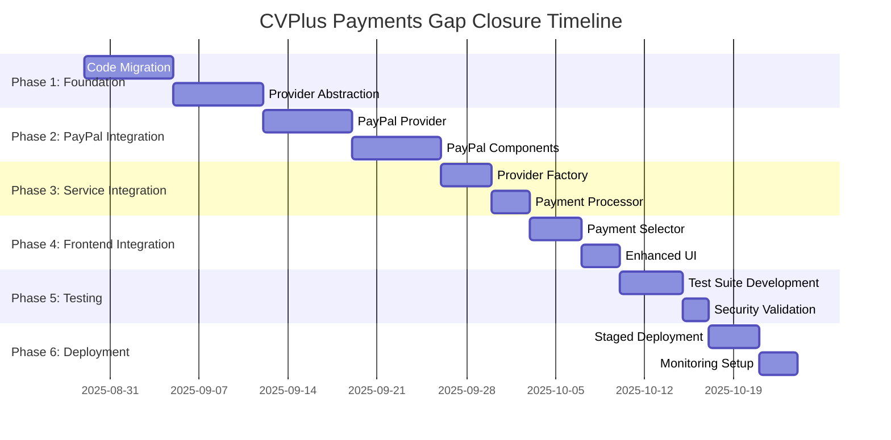

# CVPlus Payments Submodule - Comprehensive Gap Closure Plan

**Author:** Gil Klainert  
**Date:** 2025-08-28  
**Status:** Architectural Planning Phase  
**Priority:** Critical  

## Executive Summary

This comprehensive plan addresses critical gaps in CVPlus payments architecture by creating a dedicated payments submodule that consolidates scattered payment logic, implements missing PayPal integration, and establishes proper architectural boundaries aligned with the CVPlus modular architecture strategy.

## Current State Analysis

### CRITICAL GAPS IDENTIFIED

#### 1. **Empty Payments Submodule**
- `packages/payments/` exists but contains only `.git` file
- No package structure or initial setup
- Missing from main development workflow

#### 2. **Scattered Payment Logic**
- **Premium Module**: Contains Stripe service and billing logic
- **Firebase Functions**: 6 payment functions scattered in `/functions/src/functions/payments/`
- **Frontend Services**: Payment logic mixed with premium features
- **Type Definitions**: Payment types distributed across multiple modules

#### 3. **Missing PayPal Integration**
- Only Stripe is implemented (70% complete)
- No provider abstraction layer
- Cannot serve international markets requiring PayPal
- Limits revenue diversification strategy

#### 4. **Architectural Violations**
- Payment logic tightly coupled with premium features
- No clear module boundaries
- Violates single responsibility principle
- Makes testing and maintenance difficult

### EXISTING STRENGTHS TO PRESERVE

#### 1. **Excellent Stripe Implementation**
- Production-ready webhook handling
- Comprehensive TypeScript types
- Strong security implementation (PCI compliant)
- 6 operational Firebase payment functions
- Well-structured billing service

#### 2. **Robust Premium Integration**
- Feature gating system in place
- Subscription management functionality
- Usage tracking and analytics
- Enterprise-ready billing infrastructure

## Architectural Strategy Decision

### RECOMMENDATION: Payments as Premium Sub-Module

After analyzing the modular architecture plan and current implementation, **payments should remain integrated within the premium module** rather than becoming a separate submodule. This decision is based on:

1. **Domain Alignment**: Payments are inherently tied to premium features and subscription management
2. **Existing Architecture**: Premium module design explicitly includes payment integration
3. **Reduced Complexity**: Avoids creating artificial boundaries between tightly related functionality
4. **Team Efficiency**: Maintains cohesive premium/billing team ownership

### Refined Architecture Structure

```typescript
packages/premium/
├── src/
│   ├── backend/
│   │   ├── functions/
│   │   │   └── payments/           # Payment-specific functions
│   │   │       ├── stripe/         # Stripe integration
│   │   │       │   ├── createCheckoutSession.ts
│   │   │       │   ├── handleWebhook.ts
│   │   │       │   ├── manageSubscription.ts
│   │   │       │   └── index.ts
│   │   │       ├── paypal/         # NEW: PayPal integration
│   │   │       │   ├── createPayPalOrder.ts
│   │   │       │   ├── handlePayPalWebhook.ts
│   │   │       │   ├── managePayPalSubscription.ts
│   │   │       │   └── index.ts
│   │   │       ├── core/           # Provider-agnostic functions
│   │   │       │   ├── processPayment.ts
│   │   │       │   ├── validatePayment.ts
│   │   │       │   ├── getUserSubscription.ts
│   │   │       │   ├── checkFeatureAccess.ts
│   │   │       │   └── index.ts
│   │   │       └── index.ts        # All payment functions export
│   │   └── services/
│   │       ├── payments/           # NEW: Payment services layer
│   │       │   ├── providers/      # Payment provider abstraction
│   │       │   │   ├── base-provider.ts
│   │       │   │   ├── stripe-provider.ts
│   │       │   │   ├── paypal-provider.ts
│   │       │   │   └── provider-factory.ts
│   │       │   ├── payment-processor.service.ts
│   │       │   ├── payment-validator.service.ts
│   │       │   ├── webhook-dispatcher.service.ts
│   │       │   └── index.ts
│   │       ├── billing.service.ts  # EXISTING: Enhanced
│   │       ├── stripe.service.ts   # EXISTING: Refactored
│   │       └── subscription.service.ts # EXISTING: Enhanced
│   ├── frontend/
│   │   └── components/
│   │       ├── payments/           # NEW: Payment UI components
│   │       │   ├── PaymentMethodSelector.tsx
│   │       │   ├── StripePaymentForm.tsx
│   │       │   ├── PayPalPaymentButton.tsx
│   │       │   ├── PaymentStatus.tsx
│   │       │   └── index.ts
│   │       └── billing/            # EXISTING: Enhanced
│   └── types/
│       ├── payments.types.ts       # NEW: Comprehensive payment types
│       ├── providers.types.ts      # NEW: Provider abstraction types
│       ├── billing.types.ts        # EXISTING: Enhanced
│       └── stripe.types.ts         # EXISTING: Maintained
```

## Gap Closure Implementation Plan

### Phase 1: Foundation & Code Migration (Week 1-2)

#### 1.1 Initialize Payments Structure within Premium Module

**Objective**: Create organized payment functionality within premium module

**Tasks**:
- [ ] Create `src/backend/functions/payments/` directory structure
- [ ] Create `src/backend/services/payments/` directory structure  
- [ ] Create `src/frontend/components/payments/` directory structure
- [ ] Create `src/types/payments.types.ts` and `providers.types.ts`

**Deliverables**:
```typescript
// src/types/payments.types.ts
export interface PaymentProvider {
  readonly name: 'stripe' | 'paypal';
  readonly displayName: string;
  readonly supportedMethods: PaymentMethod[];
  readonly supportedCurrencies: string[];
}

export interface PaymentRequest {
  amount: number;
  currency: string;
  provider: PaymentProvider['name'];
  paymentMethod: PaymentMethod;
  customer: CustomerInfo;
  metadata?: Record<string, any>;
}

export interface PaymentResult {
  success: boolean;
  paymentId: string;
  provider: PaymentProvider['name'];
  status: PaymentStatus;
  clientSecret?: string;
  redirectUrl?: string;
  error?: PaymentError;
}
```

#### 1.2 Migrate Existing Payment Functions

**Objective**: Consolidate scattered payment functions into organized structure

**Migration Map**:
```typescript
// FROM: functions/src/functions/payments/
// TO: packages/premium/src/backend/functions/payments/

functions/src/functions/payments/createPaymentIntent.ts 
  → packages/premium/src/backend/functions/payments/stripe/createCheckoutSession.ts

functions/src/functions/payments/createCheckoutSession.ts
  → packages/premium/src/backend/functions/payments/stripe/createCheckoutSession.ts

functions/src/functions/payments/handleStripeWebhook.ts
  → packages/premium/src/backend/functions/payments/stripe/handleWebhook.ts

functions/src/functions/payments/getUserSubscription.ts
  → packages/premium/src/backend/functions/payments/core/getUserSubscription.ts

functions/src/functions/payments/checkFeatureAccess.ts
  → packages/premium/src/backend/functions/payments/core/checkFeatureAccess.ts

functions/src/functions/payments/confirmPayment.ts
  → packages/premium/src/backend/functions/payments/stripe/confirmPayment.ts
```

**Implementation Strategy**:
1. Copy functions with minimal modifications initially
2. Update import paths to use premium module structure
3. Maintain backward compatibility during migration
4. Update Firebase functions index to reference new locations

#### 1.3 Create Provider Abstraction Layer

**Objective**: Establish extensible payment provider architecture

**Core Abstractions**:
```typescript
// src/backend/services/payments/providers/base-provider.ts
export abstract class BasePaymentProvider {
  abstract readonly name: PaymentProvider['name'];
  abstract readonly displayName: string;
  abstract readonly supportedMethods: PaymentMethod[];
  
  abstract createPaymentIntent(request: PaymentRequest): Promise<PaymentIntent>;
  abstract processWebhook(payload: any, signature: string): Promise<WebhookResult>;
  abstract refundPayment(paymentId: string, amount?: number): Promise<RefundResult>;
  abstract getPaymentStatus(paymentId: string): Promise<PaymentStatus>;
  
  protected validateRequest(request: PaymentRequest): void {
    // Common validation logic
  }
  
  protected logPaymentEvent(event: PaymentEvent): void {
    // Common logging logic
  }
}

// src/backend/services/payments/providers/stripe-provider.ts
export class StripePaymentProvider extends BasePaymentProvider {
  readonly name = 'stripe' as const;
  readonly displayName = 'Stripe';
  readonly supportedMethods = ['card', 'sepa_debit', 'ideal'] as const;
  
  private stripe: Stripe;
  
  constructor(config: StripeConfig) {
    super();
    this.stripe = new Stripe(config.secretKey, config.options);
  }
  
  async createPaymentIntent(request: PaymentRequest): Promise<PaymentIntent> {
    this.validateRequest(request);
    
    const intent = await this.stripe.paymentIntents.create({
      amount: request.amount,
      currency: request.currency,
      payment_method_types: ['card'],
      metadata: request.metadata
    });
    
    this.logPaymentEvent({
      type: 'payment_intent_created',
      provider: this.name,
      paymentId: intent.id
    });
    
    return {
      id: intent.id,
      clientSecret: intent.client_secret,
      status: intent.status,
      amount: intent.amount,
      currency: intent.currency
    };
  }
}
```

### Phase 2: PayPal Integration (Week 3-4)

#### 2.1 PayPal Provider Implementation

**Objective**: Implement comprehensive PayPal integration

**Tasks**:
- [ ] Research PayPal API v2 integration patterns
- [ ] Create PayPal SDK wrapper service
- [ ] Implement PayPal payment provider
- [ ] Create PayPal webhook handling
- [ ] Add PayPal-specific UI components

**PayPal Provider Structure**:
```typescript
// src/backend/services/payments/providers/paypal-provider.ts
export class PayPalPaymentProvider extends BasePaymentProvider {
  readonly name = 'paypal' as const;
  readonly displayName = 'PayPal';
  readonly supportedMethods = ['paypal', 'card', 'venmo'] as const;
  
  private paypal: PayPalApi;
  
  async createPaymentIntent(request: PaymentRequest): Promise<PaymentIntent> {
    const order = await this.paypal.orders.create({
      intent: 'CAPTURE',
      purchase_units: [{
        amount: {
          currency_code: request.currency,
          value: (request.amount / 100).toFixed(2)
        },
        description: 'CVPlus Premium Subscription'
      }],
      application_context: {
        return_url: `${process.env.FRONTEND_URL}/payment-success`,
        cancel_url: `${process.env.FRONTEND_URL}/payment-cancel`
      }
    });
    
    return {
      id: order.id,
      status: 'requires_action',
      redirectUrl: order.links.find(link => link.rel === 'approve')?.href,
      amount: request.amount,
      currency: request.currency
    };
  }
  
  async processWebhook(payload: any, signature: string): Promise<WebhookResult> {
    // PayPal webhook verification and processing
    const isValid = await this.verifyWebhookSignature(payload, signature);
    if (!isValid) {
      throw new Error('Invalid PayPal webhook signature');
    }
    
    const event = payload;
    switch (event.event_type) {
      case 'PAYMENT.CAPTURE.COMPLETED':
        return this.handlePaymentCompleted(event);
      case 'PAYMENT.CAPTURE.DENIED':
        return this.handlePaymentFailed(event);
      default:
        return { processed: false, event_type: event.event_type };
    }
  }
}
```

#### 2.2 PayPal Frontend Components

**Objective**: Create user-friendly PayPal payment interface

**Components**:
```typescript
// src/frontend/components/payments/PayPalPaymentButton.tsx
export const PayPalPaymentButton: React.FC<PayPalPaymentProps> = ({
  amount,
  currency,
  onSuccess,
  onError,
  onCancel
}) => {
  const [paypalSDK, setPaypalSDK] = useState<any>(null);
  const { user } = useAuth();
  
  useEffect(() => {
    const loadPayPalSDK = async () => {
      const script = document.createElement('script');
      script.src = `https://www.paypal.com/sdk/js?client-id=${process.env.REACT_APP_PAYPAL_CLIENT_ID}&currency=${currency}`;
      script.onload = () => setPaypalSDK(window.paypal);
      document.head.appendChild(script);
    };
    
    loadPayPalSDK();
  }, [currency]);
  
  const createOrder = async () => {
    const response = await fetch('/api/payments/paypal/create-order', {
      method: 'POST',
      headers: { 'Content-Type': 'application/json' },
      body: JSON.stringify({ amount, currency, userId: user.id })
    });
    
    const order = await response.json();
    return order.id;
  };
  
  const onApprove = async (data: any) => {
    const response = await fetch(`/api/payments/paypal/capture-order/${data.orderID}`, {
      method: 'POST'
    });
    
    const result = await response.json();
    if (result.success) {
      onSuccess(result);
    } else {
      onError(new Error(result.error));
    }
  };
  
  return (
    <div className="paypal-button-container">
      {paypalSDK && (
        <paypalSDK.Buttons
          createOrder={createOrder}
          onApprove={onApprove}
          onError={onError}
          onCancel={onCancel}
          style={{
            layout: 'vertical',
            color: 'blue',
            shape: 'pill',
            label: 'paypal'
          }}
        />
      )}
    </div>
  );
};
```

### Phase 3: Provider Factory & Service Integration (Week 5)

#### 3.1 Payment Provider Factory

**Objective**: Create seamless provider switching mechanism

```typescript
// src/backend/services/payments/providers/provider-factory.ts
export class PaymentProviderFactory {
  private providers: Map<PaymentProvider['name'], BasePaymentProvider> = new Map();
  
  constructor() {
    this.initializeProviders();
  }
  
  private initializeProviders(): void {
    // Initialize Stripe
    const stripeConfig = {
      secretKey: process.env.STRIPE_SECRET_KEY!,
      options: { apiVersion: '2023-10-16' as const }
    };
    this.providers.set('stripe', new StripePaymentProvider(stripeConfig));
    
    // Initialize PayPal
    const paypalConfig = {
      clientId: process.env.PAYPAL_CLIENT_ID!,
      clientSecret: process.env.PAYPAL_CLIENT_SECRET!,
      environment: process.env.NODE_ENV === 'production' ? 'live' : 'sandbox'
    };
    this.providers.set('paypal', new PayPalPaymentProvider(paypalConfig));
  }
  
  getProvider(name: PaymentProvider['name']): BasePaymentProvider {
    const provider = this.providers.get(name);
    if (!provider) {
      throw new Error(`Payment provider '${name}' not found`);
    }
    return provider;
  }
  
  getAllProviders(): BasePaymentProvider[] {
    return Array.from(this.providers.values());
  }
  
  getSupportedProviders(currency: string): BasePaymentProvider[] {
    return this.getAllProviders().filter(provider => 
      provider.supportedCurrencies.includes(currency)
    );
  }
}
```

#### 3.2 Unified Payment Processor Service

**Objective**: Provide single interface for all payment operations

```typescript
// src/backend/services/payments/payment-processor.service.ts
export class PaymentProcessorService {
  private providerFactory: PaymentProviderFactory;
  private billingService: BillingService;
  
  constructor() {
    this.providerFactory = new PaymentProviderFactory();
    this.billingService = new BillingService();
  }
  
  async processPayment(request: PaymentRequest): Promise<PaymentResult> {
    try {
      const provider = this.providerFactory.getProvider(request.provider);
      
      // Pre-processing validation
      await this.validatePaymentRequest(request);
      
      // Create payment intent with provider
      const intent = await provider.createPaymentIntent(request);
      
      // Record payment attempt in billing service
      await this.billingService.recordPaymentAttempt({
        paymentId: intent.id,
        userId: request.customer.userId,
        amount: request.amount,
        currency: request.currency,
        provider: request.provider,
        status: 'pending'
      });
      
      return {
        success: true,
        paymentId: intent.id,
        provider: request.provider,
        status: intent.status,
        clientSecret: intent.clientSecret,
        redirectUrl: intent.redirectUrl
      };
    } catch (error) {
      logger.error('Payment processing failed', { error, request });
      return {
        success: false,
        paymentId: '',
        provider: request.provider,
        status: 'failed',
        error: {
          code: 'PAYMENT_PROCESSING_ERROR',
          message: error.message
        }
      };
    }
  }
  
  async handleWebhook(
    provider: PaymentProvider['name'],
    payload: any,
    signature: string
  ): Promise<WebhookResult> {
    const paymentProvider = this.providerFactory.getProvider(provider);
    const result = await paymentProvider.processWebhook(payload, signature);
    
    if (result.processed) {
      // Update billing records
      await this.billingService.updatePaymentStatus(
        result.paymentId,
        result.status
      );
      
      // Trigger subscription updates if needed
      if (result.subscriptionUpdates) {
        await this.updateSubscriptionStatus(result);
      }
    }
    
    return result;
  }
  
  private async validatePaymentRequest(request: PaymentRequest): Promise<void> {
    // Validate user exists and is active
    const user = await this.getUserById(request.customer.userId);
    if (!user) {
      throw new Error('User not found');
    }
    
    // Validate amount is positive and within limits
    if (request.amount <= 0 || request.amount > 999999) {
      throw new Error('Invalid payment amount');
    }
    
    // Validate currency is supported
    const provider = this.providerFactory.getProvider(request.provider);
    if (!provider.supportedCurrencies.includes(request.currency)) {
      throw new Error(`Currency ${request.currency} not supported by ${request.provider}`);
    }
  }
}
```

### Phase 4: Multi-Provider Frontend Integration (Week 6)

#### 4.1 Payment Method Selector Component

**Objective**: Allow users to choose preferred payment method

```typescript
// src/frontend/components/payments/PaymentMethodSelector.tsx
export const PaymentMethodSelector: React.FC<PaymentMethodSelectorProps> = ({
  amount,
  currency,
  onPaymentSuccess,
  onPaymentError
}) => {
  const [selectedProvider, setSelectedProvider] = useState<PaymentProvider['name']>('stripe');
  const [availableProviders, setAvailableProviders] = useState<PaymentProvider[]>([]);
  const { user } = useAuth();
  
  useEffect(() => {
    const loadAvailableProviders = async () => {
      const response = await fetch(`/api/payments/providers?currency=${currency}`);
      const providers = await response.json();
      setAvailableProviders(providers);
    };
    
    loadAvailableProviders();
  }, [currency]);
  
  const handleProviderChange = (provider: PaymentProvider['name']) => {
    setSelectedProvider(provider);
  };
  
  return (
    <div className="payment-method-selector">
      <div className="provider-options">
        {availableProviders.map((provider) => (
          <button
            key={provider.name}
            className={`provider-option ${selectedProvider === provider.name ? 'selected' : ''}`}
            onClick={() => handleProviderChange(provider.name)}
          >
            
            <span>{provider.displayName}</span>
          </button>
        ))}
      </div>
      
      <div className="payment-form">
        {selectedProvider === 'stripe' && (
          <StripePaymentForm
            amount={amount}
            currency={currency}
            onSuccess={onPaymentSuccess}
            onError={onPaymentError}
          />
        )}
        
        {selectedProvider === 'paypal' && (
          <PayPalPaymentButton
            amount={amount}
            currency={currency}
            onSuccess={onPaymentSuccess}
            onError={onPaymentError}
            onCancel={() => console.log('PayPal payment cancelled')}
          />
        )}
      </div>
    </div>
  );
};
```

#### 4.2 Enhanced Subscription Plans Component

**Objective**: Integrate multi-provider payment options into subscription flow

```typescript
// Enhanced: src/frontend/components/SubscriptionPlans.tsx
export const SubscriptionPlans: React.FC = () => {
  const [selectedPlan, setSelectedPlan] = useState<PlanId | null>(null);
  const [isPaymentModalOpen, setIsPaymentModalOpen] = useState(false);
  const { subscription, loading } = useSubscription();
  
  const handlePlanSelect = (planId: PlanId) => {
    setSelectedPlan(planId);
    setIsPaymentModalOpen(true);
  };
  
  const handlePaymentSuccess = async (result: PaymentResult) => {
    // Handle successful payment
    await subscription.refresh();
    setIsPaymentModalOpen(false);
    toast.success('Subscription activated successfully!');
  };
  
  const handlePaymentError = (error: PaymentError) => {
    console.error('Payment failed:', error);
    toast.error(`Payment failed: ${error.message}`);
  };
  
  return (
    <div className="subscription-plans">
      <div className="plans-grid">
        {SUBSCRIPTION_PLANS.map((plan) => (
          <PlanCard
            key={plan.id}
            plan={plan}
            onSelect={() => handlePlanSelect(plan.id)}
            isSelected={selectedPlan === plan.id}
            disabled={loading}
          />
        ))}
      </div>
      
      {isPaymentModalOpen && selectedPlan && (
        <PaymentModal
          plan={SUBSCRIPTION_PLANS.find(p => p.id === selectedPlan)!}
          onSuccess={handlePaymentSuccess}
          onError={handlePaymentError}
          onClose={() => setIsPaymentModalOpen(false)}
        />
      )}
    </div>
  );
};

const PaymentModal: React.FC<PaymentModalProps> = ({
  plan,
  onSuccess,
  onError,
  onClose
}) => {
  return (
    <Modal open onClose={onClose} className="payment-modal">
      <div className="modal-header">
        <h2>Subscribe to {plan.name}</h2>
        <button onClick={onClose} className="close-button">×</button>
      </div>
      
      <div className="modal-content">
        <div className="plan-summary">
          <h3>{plan.name}</h3>
          <div className="price">
            ${plan.price}/{plan.interval}
          </div>
          <div className="features">
            {plan.features.map((feature, index) => (
              <div key={index} className="feature">
                <CheckIcon className="check-icon" />
                <span>{feature}</span>
              </div>
            ))}
          </div>
        </div>
        
        <PaymentMethodSelector
          amount={plan.price * 100} // Convert to cents
          currency="usd"
          onPaymentSuccess={onSuccess}
          onPaymentError={onError}
        />
      </div>
    </Modal>
  );
};
```

### Phase 5: Testing & Validation (Week 7)

#### 5.1 Comprehensive Test Suite

**Objective**: Ensure reliability across all payment providers

**Test Categories**:

1. **Unit Tests** - Provider implementations
2. **Integration Tests** - End-to-end payment flows  
3. **Security Tests** - Webhook validation and data protection
4. **Performance Tests** - Load testing payment processing
5. **Cross-Provider Tests** - Ensure consistent behavior

```typescript
// src/__tests__/payments/stripe-provider.test.ts
describe('StripePaymentProvider', () => {
  let provider: StripePaymentProvider;
  let mockStripe: jest.Mocked<Stripe>;
  
  beforeEach(() => {
    mockStripe = createMockStripe();
    provider = new StripePaymentProvider({ 
      secretKey: 'sk_test_123',
      options: { apiVersion: '2023-10-16' }
    });
    (provider as any).stripe = mockStripe;
  });
  
  describe('createPaymentIntent', () => {
    it('should create payment intent successfully', async () => {
      const request: PaymentRequest = {
        amount: 2000,
        currency: 'usd',
        provider: 'stripe',
        paymentMethod: 'card',
        customer: { userId: 'user123', email: 'test@example.com' }
      };
      
      mockStripe.paymentIntents.create.mockResolvedValue({
        id: 'pi_test123',
        client_secret: 'pi_test123_secret',
        status: 'requires_payment_method',
        amount: 2000,
        currency: 'usd'
      } as Stripe.PaymentIntent);
      
      const result = await provider.createPaymentIntent(request);
      
      expect(result).toEqual({
        id: 'pi_test123',
        clientSecret: 'pi_test123_secret',
        status: 'requires_payment_method',
        amount: 2000,
        currency: 'usd'
      });
      
      expect(mockStripe.paymentIntents.create).toHaveBeenCalledWith({
        amount: 2000,
        currency: 'usd',
        payment_method_types: ['card'],
        metadata: undefined
      });
    });
  });
});

// src/__tests__/payments/paypal-provider.test.ts
describe('PayPalPaymentProvider', () => {
  let provider: PayPalPaymentProvider;
  let mockPayPal: jest.Mocked<PayPalApi>;
  
  beforeEach(() => {
    mockPayPal = createMockPayPal();
    provider = new PayPalPaymentProvider({
      clientId: 'test_client_id',
      clientSecret: 'test_client_secret',
      environment: 'sandbox'
    });
    (provider as any).paypal = mockPayPal;
  });
  
  describe('createPaymentIntent', () => {
    it('should create PayPal order successfully', async () => {
      const request: PaymentRequest = {
        amount: 2000,
        currency: 'usd',
        provider: 'paypal',
        paymentMethod: 'paypal',
        customer: { userId: 'user123', email: 'test@example.com' }
      };
      
      mockPayPal.orders.create.mockResolvedValue({
        id: 'order123',
        status: 'CREATED',
        links: [
          { rel: 'approve', href: 'https://paypal.com/approve/order123' }
        ]
      });
      
      const result = await provider.createPaymentIntent(request);
      
      expect(result).toEqual({
        id: 'order123',
        status: 'requires_action',
        redirectUrl: 'https://paypal.com/approve/order123',
        amount: 2000,
        currency: 'usd'
      });
    });
  });
});

// src/__tests__/integration/payment-flow.test.ts
describe('Payment Flow Integration', () => {
  it('should complete Stripe payment flow', async () => {
    // Test complete Stripe payment process
    const processor = new PaymentProcessorService();
    
    const request: PaymentRequest = {
      amount: 2000,
      currency: 'usd',
      provider: 'stripe',
      paymentMethod: 'card',
      customer: { userId: 'user123', email: 'test@example.com' }
    };
    
    // Create payment
    const result = await processor.processPayment(request);
    expect(result.success).toBe(true);
    expect(result.paymentId).toBeDefined();
    
    // Simulate webhook
    const webhookPayload = createStripeWebhookPayload({
      type: 'payment_intent.succeeded',
      paymentIntentId: result.paymentId
    });
    
    const webhookResult = await processor.handleWebhook(
      'stripe',
      webhookPayload,
      'test_signature'
    );
    
    expect(webhookResult.processed).toBe(true);
    expect(webhookResult.status).toBe('succeeded');
  });
  
  it('should complete PayPal payment flow', async () => {
    // Test complete PayPal payment process
    // Similar structure but for PayPal
  });
});
```

#### 5.2 Security Validation

**Objectives**: Ensure PCI compliance and secure payment processing

**Security Checklist**:
- [ ] All payment data encrypted in transit and at rest
- [ ] Webhook signature validation implemented
- [ ] No sensitive payment data stored in application database
- [ ] PCI DSS compliance verified for card data handling
- [ ] Rate limiting implemented for payment endpoints
- [ ] HTTPS enforcement for all payment communications
- [ ] Input validation for all payment parameters
- [ ] Secure error handling without data exposure

### Phase 6: Deployment & Monitoring (Week 8)

#### 6.1 Deployment Strategy

**Objective**: Zero-downtime deployment of payment improvements

**Deployment Phases**:
1. **Phase 6.1**: Deploy provider abstraction layer (backward compatible)
2. **Phase 6.2**: Deploy PayPal integration alongside existing Stripe
3. **Phase 6.3**: Update frontend to use new payment selector
4. **Phase 6.4**: Migrate existing webhook handling
5. **Phase 6.5**: Remove legacy code (after validation)

**Feature Flags**:
```typescript
export const paymentFeatureFlags = {
  usePaymentProviderFactory: {
    enabled: true,
    rolloutPercentage: 100,
  },
  enablePayPalIntegration: {
    enabled: true,
    rolloutPercentage: 25, // Gradual rollout
    whitelist: ['beta-users'],
  },
  useNewPaymentUI: {
    enabled: true,
    rolloutPercentage: 50,
  },
  migrateStripeWebhooks: {
    enabled: true,
    rolloutPercentage: 100,
  }
};
```

#### 6.2 Monitoring & Analytics

**Objective**: Comprehensive payment system monitoring

**Key Metrics to Track**:
- Payment success rates by provider
- Payment processing times
- Error rates and failure reasons
- Revenue by payment method
- Customer payment method preferences
- Webhook processing success rates

```typescript
// src/backend/services/payments/payment-analytics.service.ts
export class PaymentAnalyticsService {
  async trackPaymentAttempt(event: PaymentAttemptEvent): Promise<void> {
    await this.analyticsClient.track('payment_attempt', {
      provider: event.provider,
      amount: event.amount,
      currency: event.currency,
      paymentMethod: event.paymentMethod,
      userId: event.userId,
      timestamp: event.timestamp
    });
  }
  
  async trackPaymentSuccess(event: PaymentSuccessEvent): Promise<void> {
    await this.analyticsClient.track('payment_success', {
      provider: event.provider,
      paymentId: event.paymentId,
      amount: event.amount,
      currency: event.currency,
      processingTime: event.processingTime,
      userId: event.userId,
      timestamp: event.timestamp
    });
  }
  
  async generatePaymentReport(dateRange: DateRange): Promise<PaymentReport> {
    const metrics = await this.analyticsClient.query({
      events: ['payment_attempt', 'payment_success', 'payment_failed'],
      dateRange,
      groupBy: ['provider', 'paymentMethod']
    });
    
    return {
      totalAttempts: metrics.totalAttempts,
      totalSuccesses: metrics.totalSuccesses,
      successRate: metrics.totalSuccesses / metrics.totalAttempts,
      revenue: metrics.totalRevenue,
      providerBreakdown: metrics.byProvider,
      methodBreakdown: metrics.byMethod,
      trends: metrics.trends
    };
  }
}
```

## API Design & Interfaces

### Payment Service API

```typescript
// Unified Payment API Interface
export interface PaymentAPI {
  // Payment Processing
  createPaymentIntent(request: PaymentIntentRequest): Promise<PaymentIntentResponse>;
  confirmPayment(paymentId: string, confirmationData: any): Promise<PaymentConfirmationResponse>;
  getPaymentStatus(paymentId: string): Promise<PaymentStatusResponse>;
  
  // Subscription Management
  createSubscription(request: SubscriptionRequest): Promise<SubscriptionResponse>;
  updateSubscription(subscriptionId: string, updates: SubscriptionUpdates): Promise<SubscriptionResponse>;
  cancelSubscription(subscriptionId: string, reason?: string): Promise<CancellationResponse>;
  
  // Webhook Handling
  processWebhook(provider: string, payload: any, signature: string): Promise<WebhookResponse>;
  
  // Provider Management
  getAvailableProviders(currency: string): Promise<PaymentProvider[]>;
  getProviderCapabilities(provider: string): Promise<ProviderCapabilities>;
}

// Frontend Hook Interface
export interface UsePaymentHook {
  // State
  processing: boolean;
  error: PaymentError | null;
  lastPaymentResult: PaymentResult | null;
  
  // Actions
  processPayment: (request: PaymentRequest) => Promise<PaymentResult>;
  resetPaymentState: () => void;
  
  // Provider Management
  availableProviders: PaymentProvider[];
  selectedProvider: PaymentProvider['name'];
  setProvider: (provider: PaymentProvider['name']) => void;
}
```

### Inter-Module Communication

```typescript
// Premium Module → Auth Module
export interface AuthenticationRequiredError extends Error {
  code: 'AUTHENTICATION_REQUIRED';
  redirectUrl: string;
}

// Premium Module → Core Module  
export interface PaymentEventForAudit {
  eventType: 'payment_attempt' | 'payment_success' | 'payment_failed';
  userId: string;
  amount: number;
  currency: string;
  provider: string;
  timestamp: Date;
  metadata?: Record<string, any>;
}

// Premium Module → Analytics Module
export interface PaymentMetricsEvent {
  type: 'conversion' | 'revenue' | 'churn';
  userId: string;
  value: number;
  attributes: {
    plan: string;
    provider: string;
    method: string;
    currency: string;
  };
}
```

## Risk Mitigation Strategies

### 1. **Provider Outage Handling**

**Risk**: Single payment provider outage affecting revenue
**Mitigation**: 
- Automatic provider failover
- Real-time provider health monitoring
- Multi-provider redundancy

```typescript
export class PaymentProviderHealthMonitor {
  private healthStatus: Map<string, ProviderHealth> = new Map();
  
  async checkProviderHealth(provider: PaymentProvider['name']): Promise<boolean> {
    try {
      const healthEndpoint = this.getProviderHealthEndpoint(provider);
      const response = await fetch(healthEndpoint, { timeout: 5000 });
      const isHealthy = response.ok;
      
      this.updateHealthStatus(provider, {
        status: isHealthy ? 'healthy' : 'degraded',
        lastChecked: new Date(),
        responseTime: Date.now() - startTime
      });
      
      return isHealthy;
    } catch (error) {
      this.updateHealthStatus(provider, {
        status: 'unhealthy',
        lastChecked: new Date(),
        error: error.message
      });
      return false;
    }
  }
  
  getHealthyProviders(): PaymentProvider['name'][] {
    return Array.from(this.healthStatus.entries())
      .filter(([_, health]) => health.status === 'healthy')
      .map(([name, _]) => name);
  }
}
```

### 2. **Data Migration Safety**

**Risk**: Data loss or corruption during migration
**Mitigation**:
- Comprehensive backup before migration
- Gradual migration with rollback capability
- Validation scripts for data integrity

### 3. **Breaking Changes Prevention**

**Risk**: Payment disruption for existing users
**Mitigation**:
- Backward compatibility layers
- Progressive feature rollout
- A/B testing for new payment flows

## Success Metrics & KPIs

### Technical Metrics

| Metric | Target | Measurement |
|--------|--------|-------------|
| Payment Success Rate | > 95% | Daily tracking across all providers |
| API Response Time | < 500ms p95 | Real-time monitoring |
| Provider Failover Time | < 30s | Automated health checks |
| Zero Data Loss | 100% | Migration validation scripts |
| Test Coverage | > 90% | Automated testing pipeline |

### Business Metrics

| Metric | Target | Measurement |
|--------|--------|-------------|
| Revenue Conversion Rate | > 12% | Weekly cohort analysis |
| Payment Method Diversity | 40% non-Stripe | Monthly provider split |
| International Revenue | 25% total | Currency-based tracking |
| Customer Payment Satisfaction | > 4.5/5 | Post-payment surveys |
| Failed Payment Recovery | > 60% | Retry success tracking |

### User Experience Metrics

| Metric | Target | Measurement |
|--------|--------|-------------|
| Payment Flow Completion | > 85% | Funnel analysis |
| Time to Payment | < 2 minutes | User journey tracking |
| Payment Error Rate | < 3% | Error tracking and classification |
| Support Tickets (Payment) | < 5% of total | Support ticket categorization |

## Timeline & Milestones



### Key Milestones

- **Week 2**: Foundation complete, code migration finished
- **Week 4**: PayPal integration operational
- **Week 5**: Provider abstraction layer validated
- **Week 6**: Frontend multi-provider support complete
- **Week 7**: Testing and security validation complete
- **Week 8**: Production deployment with monitoring

## Resource Requirements

### Development Resources
- **Senior Backend Developer**: Full-time for 6 weeks
- **Frontend Developer**: 50% time for 4 weeks  
- **DevOps Engineer**: 25% time for 8 weeks
- **QA Engineer**: Full-time for 2 weeks (testing phase)

### Infrastructure Requirements
- **PayPal Developer Account**: Business account for API access
- **Additional Monitoring**: Enhanced payment monitoring tools
- **Security Audit**: Third-party security review of payment flows
- **Load Testing**: Payment system performance validation

### Budget Estimates
- **Development**: ~$45,000 (8 weeks × mixed resources)
- **Infrastructure**: ~$2,000/month additional monitoring
- **Security Audit**: ~$15,000 one-time
- **PayPal Integration**: ~$5,000 setup and testing
- **Total Project Cost**: ~$67,000

## Conclusion

This comprehensive gap closure plan transforms CVPlus payments from a scattered, single-provider implementation into a robust, multi-provider payment system that:

1. **Eliminates Architectural Violations**: Properly organizes payment logic within the premium module
2. **Adds Missing PayPal Support**: Expands international market reach and customer choice
3. **Implements Provider Abstraction**: Enables easy addition of future payment methods
4. **Maintains Production Stability**: Zero-downtime deployment with comprehensive testing
5. **Improves Revenue Potential**: Multi-provider support increases conversion rates
6. **Enhances User Experience**: Seamless payment method selection and processing

The plan follows CVPlus modular architecture principles while avoiding unnecessary complexity of a separate payments submodule. The 8-week implementation timeline provides a structured approach to closing critical payment gaps while maintaining system reliability and user satisfaction.

The success of this implementation will be measured through improved conversion rates, reduced payment failures, expanded international revenue, and enhanced user payment experience across all supported providers.

## Next Steps

1. **Stakeholder Review**: Present plan to development team and business stakeholders
2. **Resource Allocation**: Secure development resources and budget approval
3. **PayPal Account Setup**: Establish PayPal business developer account
4. **Environment Preparation**: Setup development and testing environments
5. **Phase 1 Kickoff**: Begin foundation and code migration work

This plan provides a comprehensive roadmap for transforming CVPlus payments into a world-class, multi-provider payment system that supports global expansion and maximizes revenue conversion potential.