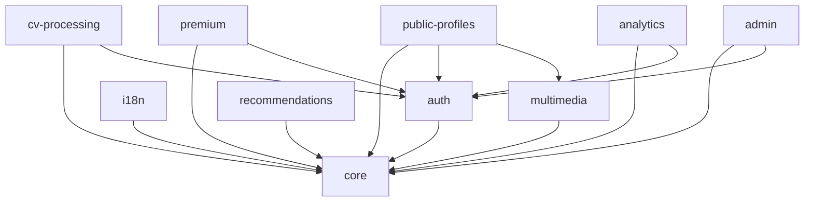

# Git Submodules with Inter-Dependencies: Architectural Solution

**Author**: Gil Klainert  
**Date**: 2025-08-29  
**Type**: Critical Architecture Decision  
**Impact**: Entire CVPlus Ecosystem

## Executive Summary

This document provides a comprehensive solution for managing Git submodules with complex inter-dependencies while maintaining autonomous operation. The architecture enables independent development, testing, and deployment of each submodule while efficiently handling shared code and dependency chains.

## Current Architecture Analysis

### Existing Structure
```
CVPlus (Parent Repository)
├── packages/
│   ├── core/           (git submodule → cvplus-core.git)
│   ├── auth/           (git submodule → cvplus-auth.git)
│   ├── i18n/           (git submodule → cvplus-i18n.git)
│   ├── cv-processing/  (git submodule → cvplus-cv-processing.git)
│   ├── multimedia/     (git submodule → cvplus-multimedia.git)
│   ├── premium/        (git submodule → cvplus-premium.git)
│   ├── recommendations/(git submodule → cvplus-recommendations.git)
│   ├── public-profiles/(git submodule → cvplus-public-profiles.git)
│   ├── analytics/      (git submodule → cvplus-analytics.git)
│   └── admin/          (git submodule → cvplus-admin.git)
```

### Dependency Chain Identified


### Critical Issues
1. **Circular Dependency Risk**: Potential for circular dependencies between modules
2. **Version Mismatch**: Different submodules may depend on different versions
3. **Build Order Complexity**: Dependencies must be built in correct sequence
4. **Development Workflow**: Changes in core require updates across all dependent modules
5. **CI/CD Challenges**: Deployment must handle dependency chain correctly

## Proposed Solution: Hybrid Monorepo with Git Submodules

### Architecture Strategy

#### 1. **npm Workspaces with Git Submodules**
Use npm workspaces at the parent level to manage local development while maintaining Git submodules for repository independence.

```json
// Parent package.json
{
  "name": "cvplus",
  "private": true,
  "workspaces": [
    "packages/*",
    "frontend",
    "functions"
  ],
  "scripts": {
    "bootstrap": "npm install && npm run build:core && npm run build:all",
    "build:core": "npm run build --workspace=@cvplus/core",
    "build:auth": "npm run build --workspace=@cvplus/auth",
    "build:all": "npm run build --workspaces --if-present",
    "test:all": "npm run test --workspaces --if-present",
    "version:sync": "node scripts/sync-versions.js"
  }
}
```

#### 2. **Dependency Resolution Strategy**

##### Local Development (file: protocol)
```json
// packages/cv-processing/package.json
{
  "name": "@cvplus/cv-processing",
  "dependencies": {
    "@cvplus/core": "file:../core",
    "@cvplus/auth": "file:../auth"
  }
}
```

##### Production/CI (npm registry)
```json
// packages/cv-processing/package.json (CI/Production)
{
  "name": "@cvplus/cv-processing",
  "dependencies": {
    "@cvplus/core": "^1.0.0",
    "@cvplus/auth": "^1.0.0"
  }
}
```

#### 3. **Build Order Management**

Create a dependency graph resolver:

```javascript
// scripts/build-order.js
const buildOrder = {
  tier1: ['core'],                           // No dependencies
  tier2: ['auth', 'i18n'],                  // Depends on core
  tier3: ['cv-processing', 'multimedia',     // Depends on core + auth
          'premium', 'recommendations'],
  tier4: ['public-profiles', 'analytics',    // Complex dependencies
          'admin']
};

module.exports = { buildOrder };
```

#### 4. **Version Management Strategy**

##### Synchronized Versioning
```javascript
// scripts/sync-versions.js
const fs = require('fs');
const path = require('path');

const CORE_VERSION = '1.0.0';
const packages = ['core', 'auth', 'i18n', 'cv-processing', /* ... */];

function syncVersions() {
  packages.forEach(pkg => {
    const pkgPath = path.join('packages', pkg, 'package.json');
    const pkgJson = JSON.parse(fs.readFileSync(pkgPath, 'utf8'));
    
    // Update internal dependencies to use consistent versions
    if (pkgJson.dependencies) {
      Object.keys(pkgJson.dependencies).forEach(dep => {
        if (dep.startsWith('@cvplus/')) {
          pkgJson.dependencies[dep] = `^${CORE_VERSION}`;
        }
      });
    }
    
    fs.writeFileSync(pkgPath, JSON.stringify(pkgJson, null, 2));
  });
}
```

### Implementation Architecture

#### Phase 1: Foundation Setup
```bash
# 1. Initialize npm workspaces in parent
npm init -w packages/core
npm init -w packages/auth
# ... for all packages

# 2. Create build orchestrator
cat > scripts/build-orchestrator.js << 'EOF'
const { buildOrder } = require('./build-order');

async function buildAll() {
  for (const tier of Object.values(buildOrder)) {
    await Promise.all(
      tier.map(pkg => 
        exec(`npm run build --workspace=@cvplus/${pkg}`)
      )
    );
  }
}
EOF

# 3. Setup dependency resolver
cat > scripts/resolve-dependencies.js << 'EOF'
function resolveDependencies(environment) {
  if (environment === 'development') {
    // Use file: protocol for local development
    return 'file:../';
  } else {
    // Use npm registry for production
    return '^1.0.0';
  }
}
EOF
```

#### Phase 2: Submodule Configuration

Each submodule gets dual package.json support:

```javascript
// packages/cv-processing/scripts/prepare-publish.js
const fs = require('fs');
const pkg = require('../package.json');

// Convert file: dependencies to version dependencies
Object.keys(pkg.dependencies).forEach(dep => {
  if (dep.startsWith('@cvplus/') && pkg.dependencies[dep].startsWith('file:')) {
    pkg.dependencies[dep] = '^1.0.0'; // Use actual version
  }
});

fs.writeFileSync('package.json', JSON.stringify(pkg, null, 2));
```

#### Phase 3: CI/CD Pipeline

```yaml
# .github/workflows/build-deploy.yml
name: Build and Deploy

jobs:
  determine-build-order:
    runs-on: ubuntu-latest
    outputs:
      matrix: ${{ steps.set-matrix.outputs.matrix }}
    steps:
      - uses: actions/checkout@v3
        with:
          submodules: recursive
      - id: set-matrix
        run: |
          echo "matrix=$(node scripts/get-build-tiers.js)" >> $GITHUB_OUTPUT

  build-tier:
    needs: determine-build-order
    strategy:
      matrix: ${{ fromJson(needs.determine-build-order.outputs.matrix) }}
    steps:
      - name: Build packages in tier
        run: |
          for package in ${{ matrix.packages }}; do
            npm run build --workspace=@cvplus/${package}
          done
```

### Dependency Management Best Practices

#### 1. **Strict Dependency Rules**
```typescript
// packages/core/src/index.ts
// RULE: Core has NO internal dependencies
export * from './types';
export * from './utils';
export * from './constants';

// packages/auth/src/index.ts
// RULE: Auth can only depend on core
import { BaseTypes } from '@cvplus/core';
export * from './auth-types';

// packages/cv-processing/src/index.ts
// RULE: CV Processing can depend on core and auth
import { BaseTypes } from '@cvplus/core';
import { AuthTypes } from '@cvplus/auth';
```

#### 2. **Interface Segregation**
```typescript
// packages/core/src/contracts/index.ts
// Define interfaces that other packages can implement
export interface IAuthenticationService {
  authenticate(token: string): Promise<User>;
}

export interface IProcessingService {
  process(data: any): Promise<ProcessedData>;
}
```

#### 3. **Dependency Injection Pattern**
```typescript
// packages/cv-processing/src/services/processor.ts
export class CVProcessor {
  constructor(
    private authService: IAuthenticationService,
    private coreUtils: ICoreUtilities
  ) {}
  
  async processCv(data: any) {
    const user = await this.authService.authenticate(data.token);
    return this.coreUtils.transform(data);
  }
}
```

### Development Workflow

#### Local Development Setup
```bash
# 1. Clone parent repository with submodules
git clone --recursive git@github.com:gilco1973/CVPLUS.git
cd CVPLUS

# 2. Initialize npm workspaces
npm install

# 3. Build core dependencies first
npm run build:core

# 4. Build remaining packages
npm run build:all

# 5. Start development
npm run dev
```

#### Making Changes to Core
```bash
# 1. Make changes in core
cd packages/core
git checkout -b feature/new-core-feature
# ... make changes ...

# 2. Build and test locally
npm run build
npm test

# 3. Test dependent packages
cd ../..
npm run test:all

# 4. Commit in submodule
cd packages/core
git add .
git commit -m "feat: Add new core feature"
git push origin feature/new-core-feature

# 5. Update parent repository
cd ../..
git add packages/core
git commit -m "chore: Update core submodule reference"
```

### Monorepo Tools Comparison

| Tool | Pros | Cons | Recommendation |
|------|------|------|----------------|
| **npm Workspaces** | Native npm support, Simple setup, No extra tools | Limited features, Basic linking only | ✅ **Recommended** - Simplest for our needs |
| **Lerna** | Mature, Version management, Publishing tools | Maintenance mode, Complex for simple needs | ❌ Overkill for our architecture |
| **Nx** | Powerful, Great caching, Advanced tooling | Heavy, Learning curve, Too complex | ❌ Too complex for current needs |
| **Rush** | Enterprise-grade, Excellent for large teams | Complex setup, Microsoft-centric | ❌ Unnecessary complexity |
| **pnpm Workspaces** | Fast, Efficient disk usage, Good workspace support | Different package manager, Migration effort | 🤔 Consider for future |

### Autonomous Operation Strategy

#### 1. **Self-Contained Builds**
Each submodule can build independently:

```json
// packages/cv-processing/package.json
{
  "scripts": {
    "build:standalone": "npm ci && npm run build",
    "test:standalone": "npm ci && npm test",
    "deploy:standalone": "npm run build:standalone && npm publish"
  }
}
```

#### 2. **Fallback Mechanisms**
```javascript
// packages/cv-processing/src/utils/dependency-loader.ts
export async function loadDependency(name: string) {
  try {
    // Try to load from workspace
    return await import(name);
  } catch {
    // Fallback to npm registry version
    console.warn(`Loading ${name} from npm registry`);
    return await import(`${name}/dist`);
  }
}
```

#### 3. **Environment-Aware Configuration**
```typescript
// packages/cv-processing/src/config/environment.ts
export const config = {
  isDevelopment: process.env.NODE_ENV === 'development',
  useLocalDependencies: process.env.USE_LOCAL_DEPS === 'true',
  dependencyPath: process.env.DEP_PATH || 'file:../'
};
```

### Version Management Protocol

#### Semantic Versioning Rules
- **Major**: Breaking changes in public API
- **Minor**: New features, backward compatible
- **Patch**: Bug fixes, backward compatible

#### Version Sync Strategy
```bash
# scripts/version-sync.sh
#!/bin/bash

# 1. Update all package versions
npm version patch --workspaces

# 2. Update inter-dependencies
node scripts/sync-internal-deps.js

# 3. Commit changes
git add -A
git commit -m "chore: Sync package versions"

# 4. Tag release
git tag -a v$(node -p "require('./package.json').version") -m "Release"
```

### CI/CD Implementation

#### GitHub Actions Workflow
```yaml
name: Submodule CI/CD

on:
  push:
    branches: [main]
  pull_request:

jobs:
  detect-changes:
    runs-on: ubuntu-latest
    outputs:
      packages: ${{ steps.filter.outputs.changes }}
    steps:
      - uses: dorny/paths-filter@v2
        id: filter
        with:
          filters: |
            core: 'packages/core/**'
            auth: 'packages/auth/**'
            cv-processing: 'packages/cv-processing/**'

  build-changed:
    needs: detect-changes
    if: ${{ needs.detect-changes.outputs.packages != '[]' }}
    strategy:
      matrix:
        package: ${{ fromJson(needs.detect-changes.outputs.packages) }}
    steps:
      - name: Checkout with submodules
        uses: actions/checkout@v3
        with:
          submodules: recursive
          
      - name: Setup Node.js
        uses: actions/setup-node@v3
        with:
          node-version: '20'
          cache: 'npm'
          
      - name: Install dependencies
        run: npm ci
        
      - name: Build dependencies first
        run: |
          # Build in dependency order
          if [[ "${{ matrix.package }}" != "core" ]]; then
            npm run build:core
          fi
          if [[ "${{ matrix.package }}" == "cv-processing" ]]; then
            npm run build:auth
          fi
          
      - name: Build package
        run: npm run build --workspace=@cvplus/${{ matrix.package }}
        
      - name: Test package
        run: npm test --workspace=@cvplus/${{ matrix.package }}
```

### Deployment Strategy

#### 1. **Independent Deployment**
Each submodule can deploy independently to npm:

```bash
# packages/cv-processing/scripts/deploy.sh
#!/bin/bash

# 1. Prepare for publishing
node scripts/prepare-publish.js

# 2. Publish to npm
npm publish --access public

# 3. Restore local development dependencies
git checkout package.json
```

#### 2. **Coordinated Deployment**
Parent orchestrates full deployment:

```javascript
// scripts/deploy-all.js
const { buildOrder } = require('./build-order');

async function deployAll() {
  for (const tier of Object.values(buildOrder)) {
    // Deploy each tier sequentially
    for (const pkg of tier) {
      await deployPackage(pkg);
    }
  }
}

async function deployPackage(name) {
  const pkgPath = `packages/${name}`;
  
  // 1. Run tests
  await exec(`npm test --workspace=@cvplus/${name}`);
  
  // 2. Build
  await exec(`npm run build --workspace=@cvplus/${name}`);
  
  // 3. Publish
  await exec(`npm publish ${pkgPath} --access public`);
}
```

### Troubleshooting Guide

#### Common Issues and Solutions

1. **Circular Dependency Detection**
```javascript
// scripts/detect-circular.js
const madge = require('madge');

madge('packages/').then((res) => {
  const circular = res.circular();
  if (circular.length > 0) {
    console.error('Circular dependencies found:', circular);
    process.exit(1);
  }
});
```

2. **Version Mismatch Resolution**
```bash
# Fix version mismatches
npm run version:sync
npm install
npm run build:all
```

3. **Build Order Issues**
```bash
# Clean and rebuild in correct order
npm run clean
npm run bootstrap
```

4. **Submodule Update Issues**
```bash
# Update all submodules
git submodule update --init --recursive
git submodule foreach git pull origin main
```

### Best Practices Summary

1. **Always use npm workspaces** for local development
2. **Maintain strict dependency hierarchy** (no circular dependencies)
3. **Version all packages together** for simplicity
4. **Build in dependency order** (core → auth → others)
5. **Test changes across all dependent packages**
6. **Use CI/CD to enforce build order and tests**
7. **Document dependency relationships clearly**
8. **Provide standalone build scripts** for autonomous operation
9. **Use dependency injection** to avoid tight coupling
10. **Implement proper error handling** for missing dependencies

### Migration Plan

#### Phase 1: Setup Infrastructure (Week 1)
- [ ] Configure npm workspaces in parent repository
- [ ] Create build order scripts
- [ ] Setup version synchronization
- [ ] Implement dependency resolver

#### Phase 2: Update Submodules (Week 2)
- [ ] Update package.json files with dual dependency support
- [ ] Add standalone build scripts
- [ ] Implement prepare-publish scripts
- [ ] Add environment configuration

#### Phase 3: CI/CD Integration (Week 3)
- [ ] Setup GitHub Actions workflows
- [ ] Configure build matrix
- [ ] Implement deployment automation
- [ ] Add circular dependency checks

#### Phase 4: Testing & Validation (Week 4)
- [ ] Test local development workflow
- [ ] Validate CI/CD pipeline
- [ ] Test independent deployments
- [ ] Document procedures

### Conclusion

This architecture provides:
- **Autonomous operation** for each submodule
- **Efficient dependency management** through npm workspaces
- **Clear build order** enforcement
- **Flexible deployment** options
- **Robust CI/CD** integration
- **Scalable** for future growth

The hybrid approach using Git submodules with npm workspaces gives us the best of both worlds: repository independence with efficient local development.

---

**Next Steps**:
1. Review and approve this architecture
2. Begin Phase 1 implementation
3. Create detailed implementation tasks for each submodule specialist
4. Setup monitoring and metrics for the new architecture